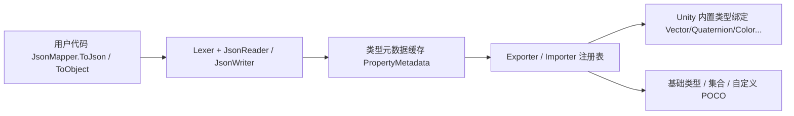

# 概述

GameFrameX.LitJSON 是面向 Unity 的 JSON 序列化库,基于 [LitJSON](https://github.com/LitJSON/litjson) 二次封装并集成到 GameFrameX 生态,提供了对 Unity 内置类型、`float`、特性驱动的字段控制以及 IL2CPP 代码裁剪保护的原生支持,命名空间为 `GameFrameX.LitJSON.Runtime`。

## 快速开始

### 1. 安装

在 Unity 工程的 `Packages/manifest.json` 中通过 scoped registry 引入包:

```json
{
  "scopedRegistries": [
    {
      "name": "GameFrameX",
      "url": "https://gameframex.upm.alianblank.uk",
      "scopes": ["com.gameframex"]
    }
  ],
  "dependencies": {
    "com.gameframex.unity.litjson": "1.1.3"
  }
}
```

其他安装方式(Git URL、手动克隆)见 [README.md](https://github.com/GameFrameX/com.gameframex.unity.litjson/blob/main/README.md#L60-L96)。

### 2. 序列化与反序列化

```csharp
using GameFrameX.LitJSON.Runtime;

class PlayerData
{
    public int Id { get; set; }
    public string Name { get; set; }
    public float Hp { get; set; }
}

// 序列化(默认输出格式化 JSON)
var player = new PlayerData { Id = 42, Name = "Blank", Hp = 100.5f };
string json = JsonMapper.ToJson(player);
// {"Id":42,"Name":"Blank","Hp":100.5}(传入 false 得到紧凑输出)

// 反序列化
PlayerData restored = JsonMapper.ToObject<PlayerData>(json);
```

Source: [README.md](https://github.com/GameFrameX/com.gameframex.unity.litjson/blob/main/README.md#L100-L128)

### 3. 控制字段输出

通过 `[JsonIgnore]` 跳过成员,使用 `[JsonProperty("name")]` 自定义 JSON 键名:

```csharp
class Account
{
    [JsonProperty("user_name")]
    public string UserName { get; set; }

    [JsonIgnore]
    public string Password { get; set; }
}
```

Source: [README.md](https://github.com/GameFrameX/com.gameframex.unity.litjson/blob/main/README.md#L131-L143)

## 工作原理速览



入口类型 [JsonMapper](https://github.com/GameFrameX/com.gameframex.unity.litjson/blob/main/Runtime/JsonMapper.cs) 负责调度读写器、类型缓存与自定义转换器注册表;反射读取的属性/字段由 [PropertyMetadata](https://github.com/GameFrameX/com.gameframex.unity.litjson/blob/main/Runtime/JsonMapper.cs#L31-L56) 缓存;Unity 内置值类型转换统一在 [UnityTypeBindings.cs](https://github.com/GameFrameX/com.gameframex.unity.litjson/blob/main/Runtime/UnityTypeBindings.cs) 中注册;IL2CPP 裁剪保护由 [link.xml](https://github.com/GameFrameX/com.gameframex.unity.litjson/blob/main/link.xml) 与运行时反射触发的 [LitJsonCroppingHelper](https://github.com/GameFrameX/com.gameframex.unity.litjson/blob/main/Runtime/LitJsonCroppingHelper.cs) 共同承担。

## 接下来

- 如何把 Unity 类型(如 `Vector3`、`Color`)写入 JSON,见《如何序列化 Unity 内置类型》
- 字段需要跳过或重命名时,见《如何控制字段输出》
- 打包后反序列化报 `MissingMethodException`,见《IL2CPP 裁剪导致反序列化失败怎么办》
- 完整 API 速查见《API 参考》
- 升级注意事项见 [CHANGELOG.md](https://github.com/GameFrameX/com.gameframex.unity.litjson/blob/main/CHANGELOG.md)