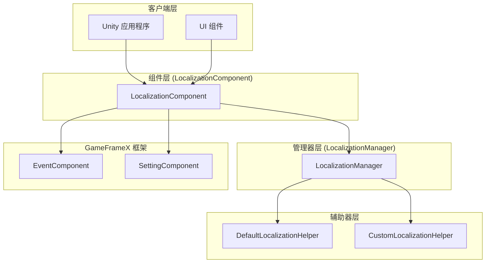
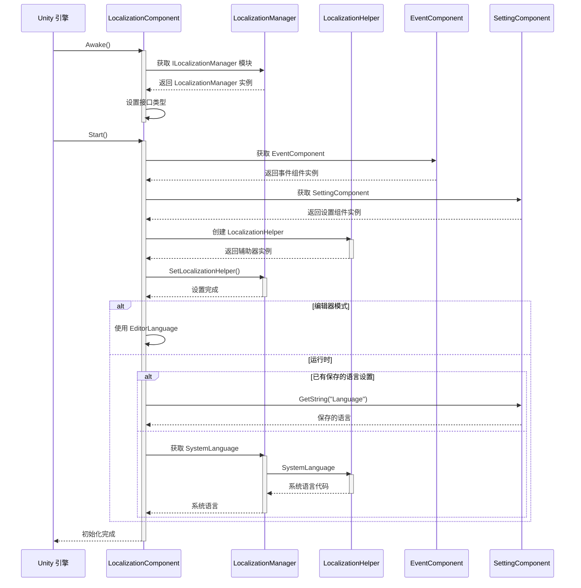
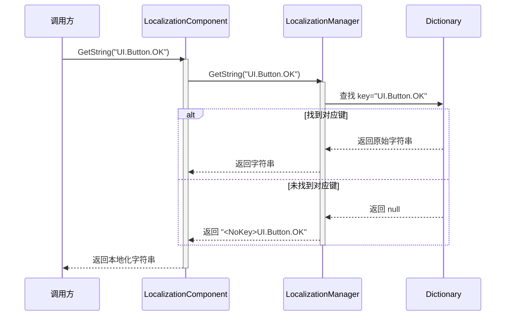
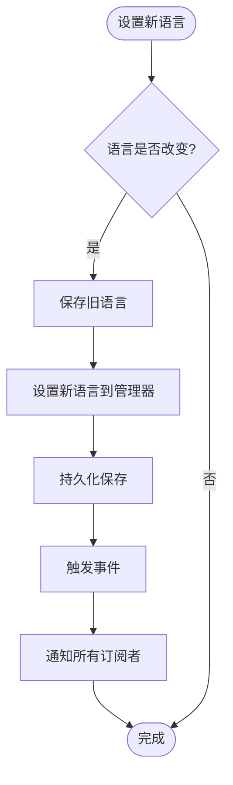
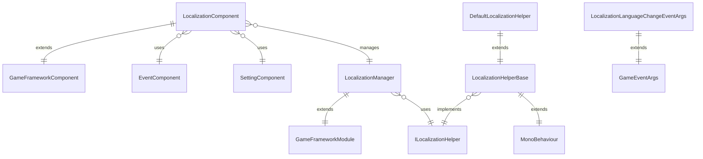

# 概述

GameFrameX Localization 是 GameFrameX 游戏框架的核心组件之一，提供完整的 Unity 本地化解决方案。该组件支持多语言动态切换、字符串格式化、系统语言检测以及完整的字典管理功能，使开发者能够轻松实现游戏的国际化需求。

## 概述

GameFrameX Localization 组件是 Unity 游戏框架中专门负责处理多语言本地化的模块。它采用组件-管理器-辅助器三层架构设计，通过接口分离和依赖注入等设计模式，提供了一个灵活、可扩展的本地化解决方案。

本组件的主要职责包括：管理多语言字典数据、提供本地化字符串获取接口、处理运行时语言切换、检测系统语言环境，以及通过事件系统通知语言变化。开发者可以通过简单的 API 调用实现复杂的国际化功能，无需关心底层实现细节。

该组件是 GameFrameX 框架的核心模块之一，与 Event（事件系统）、Setting（设置管理）、Asset（资源管理）等模块紧密协作，共同构建完整的游戏开发基础设施。

## 系统架构

GameFrameX Localization 采用清晰的三层架构设计，各层职责明确，层与层之间通过接口进行通信，实现了高内聚、低耦合的设计目标。



### 核心组件说明

**LocalizationComponent** 是 Unity 层面的组件，继承自 GameFrameworkComponent，作为对外提供服务的入口点。它实现了 Awake 和 Start 生命周期方法，在初始化时创建本地化辅助器并注册到管理器中。组件提供了丰富的 GetString 重载方法，支持 0 到 16 个参数的字符串格式化需求。

**LocalizationManager** 是核心的业务逻辑管理器，继承自 GameFrameworkModule 并实现 ILocalizationManager 接口。它维护一个 Dictionary<string, string> 类型的字典数据结构，负责字符串的存储、查询和格式化操作。管理器不直接与 Unity 交互，而是通过 ILocalizationHelper 接口获取系统语言信息。

**ILocalizationHelper** 接口定义了本地化辅助器的规范，目前只包含一个 SystemLanguage 属性，用于获取当前系统的语言代码。这种设计允许开发者通过实现自定义的辅助器来控制语言检测逻辑，例如从服务器获取语言设置或根据用户配置决定初始语言。

**LocalizationHelperBase** 是辅助器的抽象基类，继承自 MonoBehaviour 并实现 ILocalizationHelper 接口。这使得辅助器可以挂载到 Unity 游戏对象上，便于在编辑器中配置和管理。

**DefaultLocalizationHelper** 是默认的辅助器实现，通过 .NET 的 CultureInfo.CurrentCulture.Name 获取系统语言，并将连字符替换为下划线以符合 RFC 5646 标准（如 zh-CN 转换为 zh_CN）。

## 核心流程

本地化组件的初始化和字符串获取流程体现了框架的核心设计理念。以下流程图展示了从组件启动到获取本地化字符串的完整过程。



### 字符串获取流程

当应用程序需要获取本地化字符串时，会调用 LocalizationComponent 的 GetString 方法。该方法将请求转发给 LocalizationManager，后者从字典中查找对应的字符串，并根据需要执行格式化操作。



### 语言切换流程

语言切换是本地化系统的核心功能之一。当应用程序需要更改当前语言时，需要通过 LocalizationComponent 的 Language 属性进行设置。



语言切换时会触发 LocalizationLanguageChangeEventArgs 事件，应用程序可以通过订阅此事件来响应语言变化，例如刷新 UI 显示或更新游戏内容。

## 依赖关系

GameFrameX Localization 组件依赖 GameFrameX 框架的其他核心模块，这些依赖关系确保了本地化功能能够正常运行并与其他系统协调工作。



### 依赖模块说明

| 依赖模块 | 说明 | 用途 |
|---------|------|------|
| GameFrameX.Runtime | 核心运行时模块 | 提供基础框架功能，包括模块系统、对象池、日志等 |
| GameFrameX.Event.Runtime | 事件系统模块 | 实现语言切换事件的发布和订阅机制 |
| GameFrameX.Setting.Runtime | 设置管理模块 | 持久化保存用户的语言设置 |

## 主要特性

GameFrameX Localization 提供了丰富的功能特性，满足各种游戏开发中的本地化需求。

**多语言支持**：组件不限制语言数量，开发者可以添加任意数量的语言变体。每种语言通过唯一的语言代码标识，如 zh_CN（简体中文）、en_US（美式英语）、ja_JP（日语）等。

**动态语言切换**：支持在游戏运行时无缝切换语言，切换过程会自动触发事件通知，应用程序可以实时响应语言变化，无需重启应用。

**参数化字符串**：提供强大的字符串格式化功能，支持最多 16 个格式化参数。开发者可以在字典中定义包含占位符的模板字符串，如 "玩家等级：{0}，经验值：{1}"，运行时动态替换参数值。

**系统语言检测**：默认情况下组件会自动检测操作系统语言并采用相应语言，可以通过自定义辅助器实现自定义的语言检测逻辑。

**字典管理**：提供完整的字典 CRUD 操作，包括检查键是否存在、获取原始值、添加新字典项、移除字典项、清空所有字典等功能。

**编辑器支持**：提供编辑器模式，可以在 Unity 编辑器中预览不同语言的显示效果，方便开发和调试。

## 快速使用

在 Unity 项目中使用 GameFrameX Localization 非常简单。以下是基本的使用流程。

首先，需要在场景中的 GameFrameX 管理器上添加 LocalizationComponent 组件。组件会自动初始化并加载本地化功能。

```csharp
// 获取本地化组件
var localization = GameEntry.GetComponent<LocalizationComponent>();

// 设置语言
localization.Language = "zh_CN"; // 简体中文
localization.Language = "en_US"; // 英文

// 获取本地化字符串
string text = localization.GetString("UI.Button.OK");

// 带参数的本地化字符串
string message = localization.GetString("UI.Message.Welcome", playerName);
string info = localization.GetString("UI.Info.Score", score, level);
```
> Source: [LocalizationComponent.cs](https://github.com/GameFrameX/com.gameframex.unity.localization/blob/main/Runtime/Localization/LocalizationComponent.cs#L246-L262)

### 字典管理

应用程序可以在运行时动态管理字典数据，实现热更新语言资源的功能。

```csharp
// 检查字典是否存在
bool exists = localization.HasRawString("UI.Button.Cancel");

// 获取原始字符串
string rawText = localization.GetRawString("UI.Button.Cancel");

// 添加字典项
localization.AddRawString("UI.Button.NewButton", "新按钮");

// 移除字典项
bool removed = localization.RemoveRawString("UI.Button.Cancel");

// 清空所有字典
localization.RemoveAllRawStrings();
```
> Source: [LocalizationComponent.cs](https://github.com/GameFrameX/com.gameframex.unity.localization/blob/main/Runtime/Localization/LocalizationComponent.cs#L717-L758)

### 事件监听

通过订阅语言变化事件，应用程序可以在语言切换时执行自定义逻辑，如刷新 UI 显示。

```csharp
// 订阅语言变化事件
GameEntry.GetComponent<EventComponent>().Subscribe(
    LocalizationLanguageChangeEventArgs.EventId, 
    OnLanguageChanged);

private void OnLanguageChanged(object sender, GameEventArgs e)
{
    var args = (LocalizationLanguageChangeEventArgs)e;
    Debug.Log($"语言从 {args.OldLanguage} 切换到 {args.Language}");
    
    // 更新UI显示
    RefreshUI();
}
```
> Source: [LocalizationLanguageChangeEventArgs.cs](https://github.com/GameFrameX/com.gameframex.unity.localization/blob/main/Runtime/EventArgs/LocalizationLanguageChangeEventArgs.cs#L52-L58)

## 语言代码规范

GameFrameX Localization 遵循 RFC 5646 语言标签标准，使用下划线分隔的语言代码格式。以下是常用的语言代码示例：

| 语言代码 | 说明 |
|---------|------|
| zh_CN | 简体中文（中国） |
| zh_TW | 繁体中文（台湾） |
| en_US | 美式英语（美国） |
| en_GB | 英式英语（英国） |
| ja_JP | 日语（日本） |
| ko_KR | 韩语（韩国） |
| fr_FR | 法语（法国） |
| de_DE | 德语（德国） |
| es_ES | 西班牙语（西班牙） |
| ru_RU | 俄语（俄罗斯） |

开发者在定义语言代码时应注意：语言代码区分大小写，建议使用标准的命名规范；每个语言代码由语言和可选的地区两部分组成，使用下划线分隔而非连字符。

## 相关链接

- [安装指南](./02.installation)
- [快速开始](./03.getting-started)
- [核心功能 - 获取本地化字符串](./04.core-features/01.get-string)
- [核心功能 - 字典管理](./04.core-features/02.dictionary-management)
- [核心功能 - 语言切换与事件](./04.core-features/03.language-switching)
- [API 参考](./05.api-reference)
- [配置](./06.configuration)
- [最佳实践](./07.best-practices)
- [GitHub 仓库](https://github.com/GameFrameX/com.gameframex.unity.localization.git)
- [官方文档](https://gameframex.doc.alianblank.com/)
