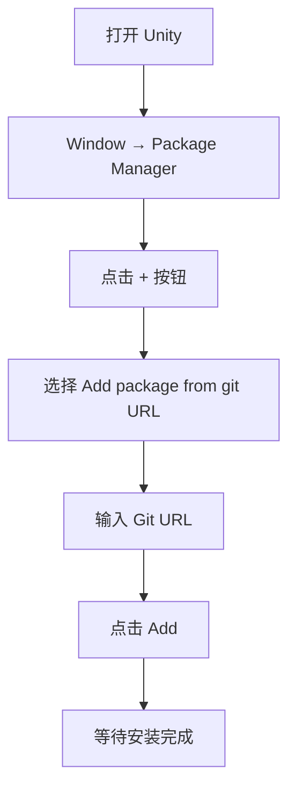
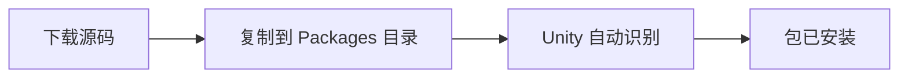
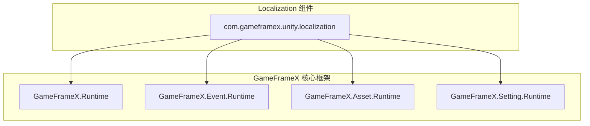

# 安装

本文档介绍如何将 GameFrameX Localization 本地化组件安装到您的 Unity 项目中。

## 概述

GameFrameX Localization 是 GameFrameX 游戏框架的本地化功能组件，提供完整的多语言本地化解决方案。该组件支持动态语言切换、字符串格式化、系统语言检测等功能，可帮助开发者快速实现游戏的国际化。

**版本要求：**
- Unity 2019.4 或更高版本

**包信息：**
- 包名：`com.gameframex.unity.localization`
- 显示名称：GameFrameX Localization
- 当前版本：2.2.1

## 安装方式

### 方式一：通过 Unity Package Manager 安装（推荐）

这是最推荐的安装方式，可以方便地获取最新版本并管理依赖。

**操作步骤：**

1. 打开 Unity 编辑器
2. 进入菜单 **Window → Package Manager**
3. 点击左上角的 **+** 按钮
4. 选择 **Add package from git URL...**
5. 在输入框中输入以下 Git URL：

```
https://github.com/GameFrameX/com.gameframex.unity.localization.git
```

6. 点击 **Add** 按钮等待安装完成



### 方式二：通过 manifest.json 安装

直接编辑项目的 `Packages/manifest.json` 文件来添加依赖。

**操作步骤：**

1. 找到项目根目录下的 `Packages` 文件夹
2. 使用文本编辑器打开 `manifest.json` 文件
3. 在 `dependencies` 节点中添加以下内容：

```json
{
  "dependencies": {
    "com.gameframex.unity.localization": "https://github.com/GameFrameX/com.gameframex.unity.localization.git"
  }
}
```

4. 保存文件并返回 Unity
5. Unity 会自动解析并安装依赖包

> 注意：此方式在每次打开项目时都会尝试从 Git 拉取最新版本。如需锁定版本，请使用下面的格式指定版本号：
> ```json
> "com.gameframex.unity.localization": "2.2.1"
> ```

### 方式三：本地源码安装

如果您需要自定义修改源码或处于离线环境，可以使用本地安装方式。

**操作步骤：**

1. 从 GitHub 仓库克隆或下载源码：
   ```bash
   https://github.com/GameFrameX/com.gameframex.unity.localization.git
   ```
2. 将整个仓库文件夹复制到您 Unity 项目的 `Packages` 目录下
3. Unity 会自动识别并加载该包
4. 如需更新，直接替换文件夹内容即可



## 依赖项说明

GameFrameX Localization 组件依赖以下 GameFrameX 核心模块：

| 依赖包 | 版本 | 说明 |
|--------|------|------|
| com.gameframex.unity | 1.1.1 | 核心运行时模块 |
| com.gameframex.unity.asset | 1.0.6 | 资源管理模块 |
| com.gameframex.unity.event | 1.0.0 | 事件系统模块 |

**自动依赖解析：**

当使用 Package Manager 或 manifest.json 安装时，Unity 会自动解析并下载所有依赖项。

如果使用本地安装方式，请确保以下模块也已安装：

| 模块 | Assembly 定义 | 说明 |
|------|---------------|------|
| GameFrameX.Runtime | GameFrameX.Runtime | 核心框架 |
| GameFrameX.Event.Runtime | GameFrameX.Event.Runtime | 事件系统 |
| GameFrameX.Asset.Runtime | GameFrameX.Asset.Runtime | 资源管理 |
| GameFrameX.Setting.Runtime | GameFrameX.Setting.Runtime | 设置管理 |



## 验证安装

安装完成后，请按以下步骤验证：

### 1. 检查 Package Manager

在 Package Manager 窗口中确认 `GameFrameX Localization` 已出现在列表中，并且状态显示为正常。

### 2. 检查程序集

在项目目录中应存在以下程序集定义文件：

- `Packages/com.gameframex.unity.localization/Runtime/GameFrameX.Localization.Runtime.asmdef`
- `Packages/com.gameframex.unity.localization/Editor/GameFrameX.Localization.Editor.asmdef`

### 3. 创建测试场景

1. 在 Unity 场景中创建一个空 GameObject
2. 添加 **LocalizationComponent** 组件（菜单路径：**Component → GameFrameX → Localization**）
3. 检查组件 Inspector 面板是否正常显示配置选项

> Source: [LocalizationComponent.cs](https://github.com/GameFrameX/com.gameframex.unity.localization/blob/main/Runtime/Localization/LocalizationComponent.cs#L44-L47)

### 4. 运行基础代码测试

```csharp
using GameFrameX.Runtime;

// 获取本地化组件
var localization = GameEntry.GetComponent<LocalizationComponent>();

// 获取系统语言
Debug.Log($"系统语言: {localization.SystemLanguage}");

// 获取一个本地化字符串测试
string text = localization.GetString("Test.Key");
Debug.Log($"测试结果: {text}");
```

## 组件配置

在场景中添加 LocalizationComponent 后，可在 Inspector 面板中配置以下选项：

| 配置项 | 类型 | 默认值 | 说明 |
|--------|------|--------|------|
| Editor Language | string | zh_CN | 编辑器模式下使用的语言 |
| Default Language | string | zh_CN | 默认语言（加载失败时的备用语言） |
| Enable Load Dictionary Update Event | bool | false | 是否启用字典加载更新事件 |
| Is Enable Editor Mode | bool | false | 是否启用编辑器模式 |
| Localization Helper Type Name | string | DefaultLocalizationHelper | 本地化辅助器类型名称 |
| Custom Localization Helper | LocalizationHelperBase | null | 自定义本地化辅助器实例 |

> 注意：Editor Language 仅在 Unity 编辑器中生效，不会影响打包后的游戏。

## 常见问题

### Q1: 安装后出现编译错误

**原因：** 缺少依赖项

**解决方案：** 确保所有 GameFrameX 依赖项已正确安装。请尝试重新打开 Package Manager 并检查依赖项状态。

### Q2: 无法找到 LocalizationComponent

**原因：** 程序集未正确加载

**解决方案：**
1. 检查 Assembly Definition 文件是否存在
2. 尝试重新导入所有资源：**Assets → Reimport All**
3. 检查 Console 窗口中的错误信息

### Q3: 版本不兼容

**原因：** Unity 版本过低或依赖包版本冲突

**解决方案：**
1. 确认 Unity 版本不低于 2019.4
2. 检查是否有其他包声明了不同版本的 GameFrameX 依赖

## 相关链接

- [快速开始](./03.getting-started) - 开始使用本地化功能
- [核心功能](./04.core-features/01.get-string) - 了解核心功能
- [API 参考](./05.api-reference) - 完整的 API 文档
- [GitHub 仓库](https://github.com/GameFrameX/com.gameframex.unity.localization.git) - 获取源码和最新版本
- [官方文档](https://gameframex.doc.alianblank.com/) - GameFrameX 完整文档
