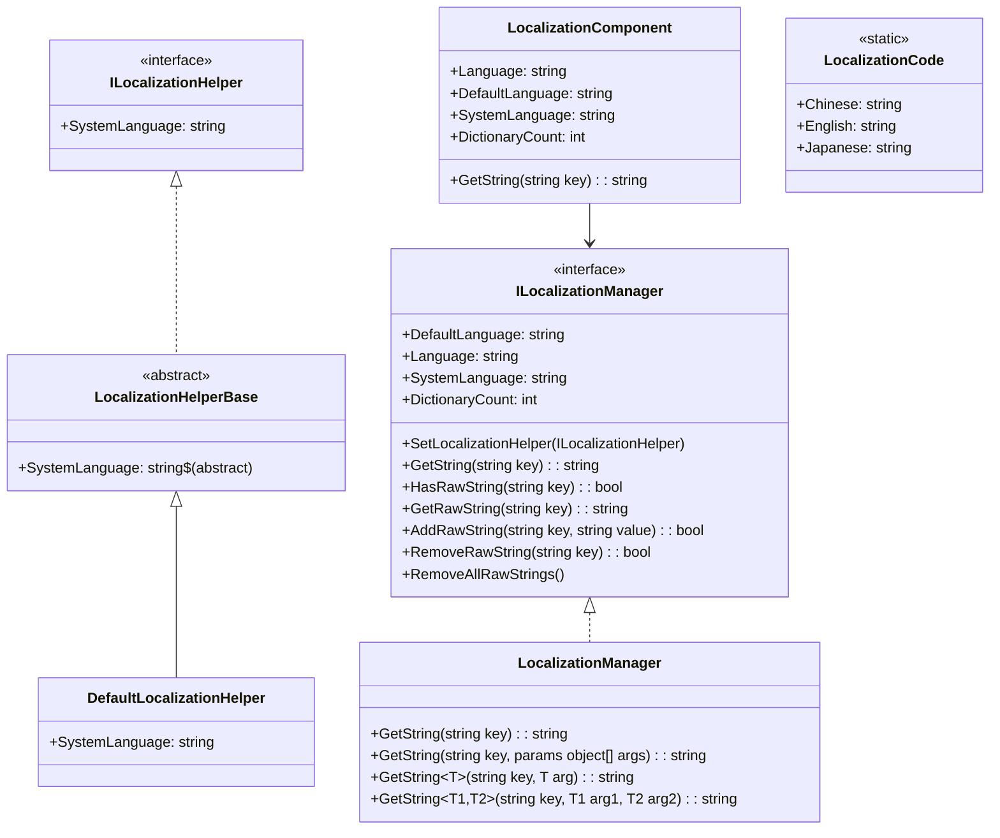
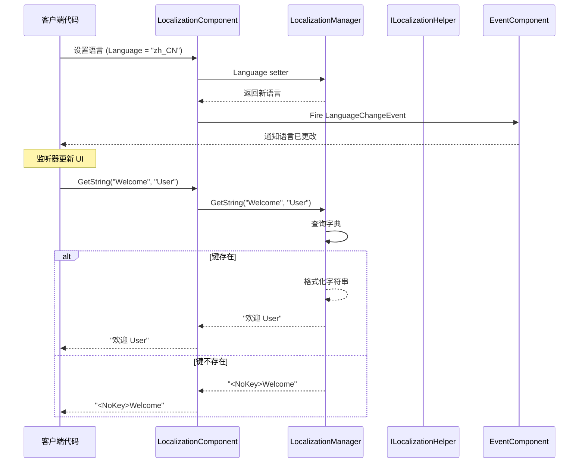

# API 参考

本文档详细介绍 GameFrameX Localization 模块提供的所有公共 API 接口、类和方法。

## 概述

GameFrameX Localization 模块提供了一套完整的本地化解决方案，包括：
- 多语言字符串管理
- 运行时语言切换
- 参数化字符串格式化
- 系统语言自动检测
- 事件驱动架构

## 核心架构



## ILocalizationManager 接口

`ILocalizationManager` 是本地化系统的核心接口，定义了管理本地化字符串的所有必需操作。

> Source: [ILocalizationManager.cs](https://github.com/GameFrameX/com.gameframex.unity.localization/blob/main/Runtime/Localization/Localization/ILocalizationManager.cs#L34-L529)

### 属性

| 属性 | 类型 | 描述 |
|------|------|------|
| `DefaultLanguage` | `string` | 获取或设置默认本地化语言。当加载本地化失败时使用此语言。 |
| `Language` | `string` | 获取或设置当前本地化语言。 |
| `SystemLanguage` | `string` | 获取系统语言。 |
| `DictionaryCount` | `int` | 获取当前加载的字典数量。 |

### 方法

#### `SetLocalizationHelper`

```csharp
void SetLocalizationHelper(ILocalizationHelper localizationHelper)
```

设置本地化辅助器，用于获取系统语言信息。

**参数：**
- `localizationHelper` (ILocalizationHelper): 本地化辅助器实例。

> Source: [ILocalizationManager.cs](https://github.com/GameFrameX/com.gameframex.unity.localization/blob/main/Runtime/Localization/Localization/ILocalizationManager.cs#L71)

---

#### `GetString(string key): string`

根据字典主键获取字典内容字符串。

```csharp
string GetString(string key)
```

**参数：**
- `key` (string): 字典主键。

**返回：** 字典内容字符串，如果键不存在返回 `<NoKey>{key}` 格式的错误信息。

> Source: [LocalizationManager.cs](https://github.com/GameFrameX/com.gameframex.unity.localization/blob/main/Runtime/Localization/Localization/LocalizationManager.cs#L168-L177)

---

#### `GetString(string key, params object[] args): string`

根据字典主键获取字典内容字符串，并使用参数列表格式化。

```csharp
string GetString(string key, params object[] args)
```

**参数：**
- `key` (string): 字典主键。
- `args` (params object[]): 格式化参数列表。

**返回：** 格式化后的字典内容字符串。

> Source: [LocalizationManager.cs](https://github.com/GameFrameX/com.gameframex.unity.localization/blob/main/Runtime/Localization/Localization/LocalizationManager.cs#L186-L195)

---

#### 泛型 GetString 方法

系统提供了 17 个泛型重载方法，支持 0 到 16 个类型安全参数：

| 方法签名 | 描述 |
|----------|------|
| `GetString<T>(string key, T arg)` | 单参数格式化 |
| `GetString<T1, T2>(string key, T1 arg1, T2 arg2)` | 双参数格式化 |
| `GetString<T1, T2, T3>(string key, T1 arg1, T2 arg2, T3 arg3)` | 三参数格式化 |
| ... | ... |
| `GetString<T1, ..., T16>(string key, T1 arg1, ..., T16 arg16)` | 十六参数格式化 |

```csharp
// 示例：使用泛型 GetString 进行类型安全的格式化
string message = localizationManager.GetString("Welcome", "John", 25);
// 字典内容："欢迎 {0}，您今年 {1} 岁了"
// 结果："欢迎 John，您今年 25 岁了"
```

> Source: [LocalizationManager.cs](https://github.com/GameFrameX/com.gameframex.unity.localization/blob/main/Runtime/Localization/Localization/LocalizationManager.cs#L205-L855)

---

#### `HasRawString(string key): bool`

检查指定键的字典是否存在。

```csharp
bool HasRawString(string key)
```

**参数：**
- `key` (string): 字典主键。

**返回：** 是否存在该字典。

> Source: [LocalizationManager.cs](https://github.com/GameFrameX/com.gameframex.unity.localization/blob/main/Runtime/Localization/Localization/LocalizationManager.cs#L862-L870)

---

#### `GetRawString(string key): string`

获取字典原始值（不经过格式化处理）。

```csharp
string GetRawString(string key)
```

**参数：**
- `key` (string): 字典主键。

**返回：** 字典原始值，如果键不存在返回空字符串。

> Source: [LocalizationManager.cs](https://github.com/GameFrameX/com.gameframex.unity.localization/blob/main/Runtime/Localization/Localization/LocalizationManager.cs#L878-L891)

---

#### `AddRawString(string key, string value): bool`

添加新的字典条目。

```csharp
bool AddRawString(string key, string value)
```

**参数：**
- `key` (string): 字典主键。
- `value` (string): 字典内容。

**返回：** 是否添加成功。如果键已存在则返回 false。

> Source: [LocalizationManager.cs](https://github.com/GameFrameX/com.gameframex.unity.localization/blob/main/Runtime/Localization/Localization/LocalizationManager.cs#L899-L913)

---

#### `RemoveRawString(string key): bool`

移除指定的字典条目。

```csharp
bool RemoveRawString(string key)
```

**参数：**
- `key` (string): 字典主键。

**返回：** 是否移除成功。

> Source: [LocalizationManager.cs](https://github.com/GameFrameX/com.gameframex.unity.localization/blob/main/Runtime/Localization/Localization/LocalizationManager.cs#L920-L928)

---

#### `RemoveAllRawStrings()`

清空所有字典。

```csharp
void RemoveAllRawStrings()
```

> Source: [LocalizationManager.cs](https://github.com/GameFrameX/com.gameframex.unity.localization/blob/main/Runtime/Localization/Localization/LocalizationManager.cs#L933-L936)

---

## ILocalizationHelper 接口

`ILocalizationHelper` 接口用于抽象系统语言检测逻辑，允许开发者实现自定义的语言检测方式。

> Source: [ILocalizationHelper.cs](https://github.com/GameFrameX/com.gameframex.unity.localization/blob/main/Runtime/Localization/Localization/ILocalizationHelper.cs#L34-L47)

### 属性

| 属性 | 类型 | 描述 |
|------|------|------|
| `SystemLanguage` | `string` | 获取系统语言。 |

```csharp
public interface ILocalizationHelper
{
    string SystemLanguage { get; }
}
```

---

## LocalizationHelperBase 抽象类

`LocalizationHelperBase` 是本地化辅助器的抽象基类，继承自 `MonoBehaviour` 并实现 `ILocalizationHelper` 接口。

> Source: [LocalizationHelperBase.cs](https://github.com/GameFrameX/com.gameframex.unity.localization/blob/main/Runtime/Localization/LocalizationHelperBase.cs#L35-L48)

```csharp
public abstract class LocalizationHelperBase : MonoBehaviour, ILocalizationHelper
{
    public abstract string SystemLanguage { get; }
}
```

---

## DefaultLocalizationHelper 类

`DefaultLocalizationHelper` 是默认的本地化辅助器实现，使用 .NET 的 `CultureInfo` 获取系统区域设置。

> Source: [DefaultLocalizationHelper.cs](https://github.com/GameFrameX/com.gameframex.unity.localization/blob/main/Runtime/Localization/DefaultLocalizationHelper.cs#L36-L58)

```csharp
public class DefaultLocalizationHelper : LocalizationHelperBase
{
    readonly string _regionName = CultureInfo.CurrentCulture.Name.Replace("-", "_");

    public override string SystemLanguage
    {
        get { return _regionName; }
    }
}
```

**设计说明：** 默认实现将系统区域信息（如 `zh-CN`）转换为下划线格式（`zh_CN`），与 `LocalizationCode` 中定义的语言代码保持一致。

---

## LocalizationComponent 类

`LocalizationComponent` 是 Unity 组件封装类，继承自 `GameFrameworkComponent`，提供与 Unity 生态系统无缝集成的本地化功能。

> Source: [LocalizationComponent.cs](https://github.com/GameFrameX/com.gameframex.unity.localization/blob/main/Runtime/Localization/LocalizationComponent.cs#L38-L777)

### 属性

| 属性 | 类型 | 描述 |
|------|------|------|
| `EditorLanguage` | `string` | 编辑器语言（仅在编辑器内有效）。 |
| `DefaultLanguage` | `string` | 默认本地化语言。 |
| `Language` | `string` | 当前本地化语言。设置此属性会触发语言切换事件。 |
| `SystemLanguage` | `string` | 获取系统语言。 |
| `DictionaryCount` | `int` | 获取字典数量。 |

### 方法

`LocalizationComponent` 提供了与 `ILocalizationManager` 完全相同的方法签名，包括：

- `GetString(string key)` - 获取本地化字符串
- `GetString(string key, params object[] args)` - 带参数格式化
- `GetString<T>(string key, T arg)` - 泛型单参数
- `GetString<T1, T2>(string key, T1 arg1, T2 arg2)` - 泛型双参数
- ...（共 17 个重载，支持最多 16 个参数）
- `HasRawString(string key)` - 检查键是否存在
- `GetRawString(string key)` - 获取原始值
- `AddRawString(string key, string value)` - 添加字典
- `RemoveRawString(string key)` - 移除字典
- `RemoveAllRawStrings()` - 清空字典

### 使用示例

```csharp
// 获取 LocalizationComponent 实例
var localization = GameEntry.GetComponent<LocalizationComponent>();

// 简单字符串获取
string greeting = localization.GetString("Greeting");

// 带参数的字符串格式化
string message = localization.GetString("PlayerInfo", "张三", 100);
// 字典内容："玩家 {0}，等级 {1}"
// 结果："玩家 张三，等级 100"

// 切换语言
localization.Language = "en_US";

// 检查字典
if (localization.HasRawString("ImportantKey"))
{
    string value = localization.GetRawString("ImportantKey");
}
```

---

## LocalizationCode 静态类

`LocalizationCode` 提供了标准化的语言代码常量，遵循 ISO 639-1 语言代码和 ISO 3166-1 国家/地区代码标准。

> Source: [LocalizationCode.cs](https://github.com/GameFrameX/com.gameframex.unity.localization/blob/main/Runtime/Localization/LocalizationCode.cs#L35-L985)

### 主要语言代码常量

| 常量 | 代码 | 描述 |
|------|------|------|
| `Chinese` / `ChineseSimplified` | `zh_CN` | 中文简体 |
| `ChineseTraditionalTW` | `zh_TW` | 中文繁体（台湾） |
| `ChineseTraditionalHK` | `zh_HK` | 中文繁体（香港） |
| `Japanese` | `ja_JP` | 日语 |
| `Korean` | `ko_KR` | 韩语 |
| `English` | `en_US` | 英语（美国） |
| `EnglishUK` | `en_GB` | 英语（英国） |
| `French` | `fr_FR` | 法语 |
| `German` | `de_DE` | 德语 |
| `Spanish` | `es_ES` | 西班牙语 |
| `Portuguese` | `pt_PT` | 葡萄牙语 |
| `Russian` | `ru_RU` | 俄语 |
| `Arabic` | `ar_SA` | 阿拉伯语 |
| `Hindi` | `hi_IN` | 印地语 |
| `Thai` | `th_TH` | 泰语 |
| `Vietnamese` | `vi_VN` | 越南语 |
| `Indonesian` | `id_ID` | 印尼语 |

**使用示例：**

```csharp
// 使用常量设置语言
LocalizationComponent localization = GameEntry.GetComponent<LocalizationComponent>();
localization.Language = LocalizationCode.Chinese;      // 设为简体中文
localization.Language = LocalizationCode.English;       // 设为英语
localization.Language = LocalizationCode.Japanese;      // 设为日语
```

---

## 事件系统

### LocalizationLanguageChangeEventArgs

当语言发生切换时触发的事件参数。

> Source: [LocalizationLanguageChangeEventArgs.cs](https://github.com/GameFrameX/com.gameframex.unity.localization/blob/main/Runtime/EventArgs/LocalizationLanguageChangeEventArgs.cs#L5-L79)

```csharp
public sealed class LocalizationLanguageChangeEventArgs : GameEventArgs
{
    public static readonly string EventId = typeof(LocalizationLanguageChangeEventArgs).FullName;
    
    /// <summary>
    /// 当前语言
    /// </summary>
    public string Language { get; set; }
    
    /// <summary>
    /// 旧的 language
    /// </summary>
    public string OldLanguage { get; set; }
    
    public static LocalizationLanguageChangeEventArgs Create(string oldLanguage, string language);
    public override void Clear();
    public override string Id { get; }
}
```

### 订阅语言切换事件

```csharp
void OnLanguageChanged(object sender, LocalizationLanguageChangeEventArgs e)
{
    Debug.Log($"语言从 {e.OldLanguage} 切换到 {e.Language}");
}

// 订阅事件
var eventComponent = GameEntry.GetComponent<EventComponent>();
eventComponent.Subscribe(LocalizationLanguageChangeEventArgs.EventId, OnLanguageChanged);

// 取消订阅
eventComponent.Unsubscribe(LocalizationLanguageChangeEventArgs.EventId, OnLanguageChanged);
```

---

## API 使用流程



---

## 错误处理

### 错误返回值

当发生错误时，系统会返回特定格式的错误信息：

| 错误类型 | 返回格式 | 示例 |
|----------|----------|------|
| 键不存在 | `<NoKey>{key}` | `<NoKey>Welcome` |
| 格式化错误 | `<Error>{key},{value},{args},{exception}` | `<Error>PlayerName,玩家{0}...` |

### 异常情况

| 场景 | 行为 |
|------|------|
| 设置 `Language` 为 `zxx`（未知语言） | 抛出 `GameFrameworkException` |
| 设置 `DefaultLanguage` 为 `zxx` | 抛出 `GameFrameworkException` |
| 未设置 `ILocalizationHelper` 时访问 `SystemLanguage` | 抛出 `GameFrameworkException` |

---

## 相关链接

- [概述](./1-overview)
- [安装](./2-installation)
- [快速开始](./3-getting-started)
- [核心功能 - 获取本地化字符串](./4-core-features.get-string)
- [核心功能 - 字典管理](./4-core-features.dictionary-management)
- [核心功能 - 语言切换与事件](./4-core-features.language-switching)
- [配置](./6-configuration)
- [最佳实践](./7-best-practices)
