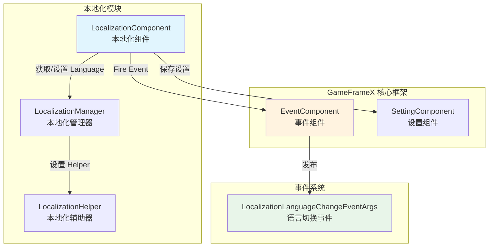
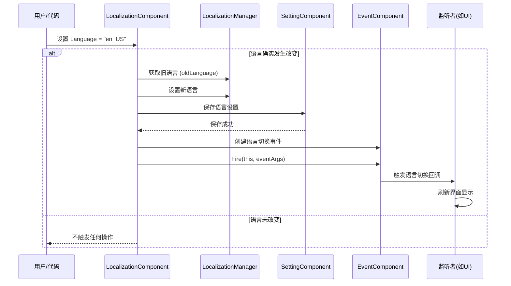

# 语言切换与事件

语言切换与事件是 GameFrameX 本地化系统的核心功能之一，允许开发者在运行时动态切换应用语言，并通过事件机制通知所有监听者语言已变更，从而实现 UI、文字等内容的自动刷新。

## 概述

GameFrameX 本地化系统采用了**事件驱动架构**来实现语言切换功能。当应用程序的语言设置发生改变时，系统会：

1. 更新内部语言状态
2. 将新的语言设置持久化保存
3. 通过事件系统发布语言切换事件
4. 监听者收到事件后执行相应操作（如刷新 UI 显示）

这种设计实现了**松耦合**：语言切换的发起者不需要知道谁会响应语言变化，而响应者也不需要关心语言是如何被切换的。

> **设计意图**：使用事件机制处理语言切换，可以让多个系统（如 UI 系统、音效系统、日期格式系统）独立响应语言变化，而无需在语言切换代码中直接依赖这些系统。这符合**观察者模式**的设计理念，提高了系统的可扩展性和可维护性。

## 架构设计

### 组件关系图



### 语言切换流程



## 语言切换详解

### 设置语言

通过 `LocalizationComponent` 的 `Language` 属性可以设置当前语言：

```csharp
// 获取本地化组件
var localizationComponent = GameEntry.GetComponent<LocalizationComponent>();

// 设置语言为英文
localizationComponent.Language = "en_US";

// 设置语言为中文
localizationComponent.Language = "zh_CN";

// 设置语言为日文
localizationComponent.Language = "ja_JP";
```
> Source: [LocalizationComponent.cs](https://github.com/GameFrameX/com.gameframex.unity.localization/blob/main/Runtime/Localization/LocalizationComponent.cs#L116-L143)

**语言切换的内部实现逻辑：**

```csharp
public string Language
{
    get { /* ... */ }
    set
    {
        if (m_LocalizationManager.Language != value)  // 仅当语言确实改变时才处理
        {
            var oldLanguage = m_LocalizationManager.Language;  // 记录旧语言
            m_LocalizationManager.Language = value;            // 设置新语言
            m_SettingComponent.SetString(...);                 // 持久化保存
            m_SettingComponent.Save();
            
            // 触发语言切换事件
            var eventArgs = LocalizationLanguageChangeEventArgs.Create(oldLanguage, value);
            m_EventComponent.Fire(this, eventArgs);
        }
    }
}
```
> Source: [LocalizationComponent.cs](https://github.com/GameFrameX/com.gameframex.unity.localization/blob/main/Runtime/Localization/LocalizationComponent.cs#L131-L142)

### 获取当前语言

```csharp
var localizationComponent = GameEntry.GetComponent<LocalizationComponent>();

// 获取当前语言
string currentLanguage = localizationComponent.Language;

// 获取系统语言
string systemLanguage = localizationComponent.SystemLanguage;

// 获取默认语言
string defaultLanguage = localizationComponent.DefaultLanguage;
```

### 获取系统语言

系统语言是指设备当前的区域语言设置：

```csharp
var localizationComponent = GameEntry.GetComponent<LocalizationComponent>();
string systemLang = localizationComponent.SystemLanguage;
```

## 事件详解

### 语言切换事件

当语言发生切换时，系统会发布 `LocalizationLanguageChangeEventArgs` 事件。

#### 事件参数结构

```csharp
public sealed class LocalizationLanguageChangeEventArgs : GameEventArgs
{
    /// <summary>
    /// 事件ID
    /// </summary>
    public static readonly string EventId = typeof(LocalizationLanguageChangeEventArgs).FullName;

    /// <summary>
    /// 当前语言
    /// </summary>
    public string Language { get; set; }

    /// <summary>
    /// 旧的语言
    /// </summary>
    public string OldLanguage { get; set; }
}
```
> Source: [LocalizationLanguageChangeEventArgs.cs](https://github.com/GameFrameX/com.gameframex.unity.localization/blob/main/Runtime/EventArgs/LocalizationLanguageChangeEventArgs.cs#L11-L33)

#### 订阅语言切换事件

```csharp
using GameFrameX.Event.Runtime;
using GameFrameX.Localization.Runtime;

public class MyLanguageListener : MonoBehaviour
{
    private EventComponent _eventComponent;

    private void Start()
    {
        _eventComponent = GameEntry.GetComponent<EventComponent>();
        
        // 订阅语言切换事件
        _eventComponent.Subscribe(LocalizationLanguageChangeEventArgs.EventId, OnLanguageChanged);
    }

    private void OnLanguageChanged(object sender, GameEventArgs e)
    {
        var args = e as LocalizationLanguageChangeEventArgs;
        Debug.Log($"语言从 {args.OldLanguage} 切换到 {args.Language}");
        
        // 在这里可以刷新 UI 显示、重新加载本地化字符串等
        RefreshUI();
    }

    private void OnDestroy()
    {
        // 记得取消订阅，避免内存泄漏
        if (_eventComponent != null)
        {
            _eventComponent.Unsubscribe(LocalizationLanguageChangeEventArgs.EventId, OnLanguageChanged);
        }
    }

    private void RefreshUI()
    {
        // 实现 UI 刷新逻辑
    }
}
```
> Source: [LocalizationLanguageChangeEventArgs.cs](https://github.com/GameFrameX/com.gameframex.unity.localization/blob/main/Runtime/EventArgs/LocalizationLanguageChangeEventArgs.cs#L52-L58)

### 字典加载事件

除了语言切换事件，系统还提供了字典加载相关的事件（目前代码中为注释状态，但类已定义）：

| 事件 | 描述 |
|------|------|
| `LoadDictionarySuccessEventArgs` | 字典加载成功事件 |
| `LoadDictionaryFailureEventArgs` | 字典加载失败事件 |

```csharp
// 字典加载成功事件参数
public sealed class LoadDictionarySuccessEventArgs : GameEventArgs
{
    /// <summary>
    /// 事件ID
    /// </summary>
    public static readonly string EventId = typeof(LoadDictionarySuccessEventArgs).FullName;

    /// <summary>
    /// 字典资源名称
    /// </summary>
    public string DictionaryAssetName { get; private set; }

    /// <summary>
    /// 加载持续时间
    /// </summary>
    public float Duration { get; private set; }

    /// <summary>
    /// 用户自定义数据
    /// </summary>
    public object UserData { get; private set; }
}
```
> Source: [LoadDictionarySuccessEventArgs.cs](https://github.com/GameFrameX/com.gameframex.unity.localization/blob/main/Runtime/EventArgs/LoadDictionarySuccessEventArgs.cs#L42-L85)

## 最佳实践

### 1. 监听语言切换自动刷新 UI

创建一个通用的语言切换监听器，自动刷新所有需要本地化的 UI 元素：

```csharp
using UnityEngine;
using GameFrameX.Event.Runtime;
using GameFrameX.Localization.Runtime;

public class LanguageChangedListener : MonoBehaviour
{
    private EventComponent _eventComponent;

    private void Awake()
    {
        _eventComponent = GameEntry.GetComponent<EventComponent>();
    }

    private void OnEnable()
    {
        _eventComponent.Subscribe(LocalizationLanguageChangeEventArgs.EventId, OnLanguageChanged);
    }

    private void OnDisable()
    {
        _eventComponent.Unsubscribe(LocalizationLanguageChangeEventArgs.EventId, OnLanguageChanged);
    }

    private void OnLanguageChanged(object sender, GameEventArgs e)
    {
        var args = e as LocalizationLanguageChangeEventArgs;
        Debug.Log($"语言已切换: {args.OldLanguage} → {args.Language}");
        
        // 通知所有需要刷新的组件
        BroadcastMessage("OnLanguageChanged", SendMessageOptions.DontRequireReceiver);
    }
}
```

### 2. 保存用户语言偏好

语言设置会自动保存到本地，但也可以手动控制保存时机：

```csharp
var localizationComponent = GameEntry.GetComponent<LocalizationComponent>();

// 获取用户上次保存的语言
string savedLanguage = localizationComponent.Language;

// 修改语言后会自动保存，但如果需要立即保存可以调用：
// (Set 属性中已经包含了自动保存逻辑)

// 设置默认语言（仅在首次启动时使用）
string defaultLang = localizationComponent.DefaultLanguage;
```

### 3. 切换语言时处理资源

在语言切换时，可能需要重新加载某些语言相关的资源：

```csharp
private void OnLanguageChanged(object sender, GameEventArgs e)
{
    var args = e as LocalizationLanguageChangeEventArgs;
    
    // 清除旧的字典缓存
    var localizationComponent = GameEntry.GetComponent<LocalizationComponent>();
    localizationComponent.RemoveAllRawStrings();
    
    // 重新加载新语言的字典
    // LoadNewLanguageDictionary(args.Language);
    
    // 刷新界面
    RefreshAllLocalizedContent();
}
```

## 常见问题

### Q: 语言切换后 UI 没有自动更新？

**A**: 需要订阅语言切换事件并实现 UI 刷新逻辑。GameFrameX 不会自动刷新 UI，需要开发者监听事件后手动刷新。

### Q: 如何获取系统当前语言？

```csharp
var localizationComponent = GameEntry.GetComponent<LocalizationComponent>();
string systemLang = localizationComponent.SystemLanguage;
```

### Q: 语言切换事件在哪里触发？

**A**: 语言切换事件在 `LocalizationComponent.Language` 属性的 setter 中触发。当且仅当设置的值与当前语言不同时，才会触发事件。

### Q: 如何防止重复触发语言切换事件？

**A**: `LocalizationComponent` 内部已经做了判断，只有当新语言与当前语言不同时才会触发事件：

```csharp
if (m_LocalizationManager.Language != value)
{
    // 只有值不同时才执行
}
```

## 相关链接

- [获取本地化字符串](./01.get-string) - 了解如何获取本地化文本
- [字典管理](./02.dictionary-management) - 了解字典的加载和管理
- [API 参考](../05.api-reference) - 完整的 API 文档
- [配置](../06.configuration) - 本地化系统配置说明
- [最佳实践](../07.best-practices) - 更多使用技巧
