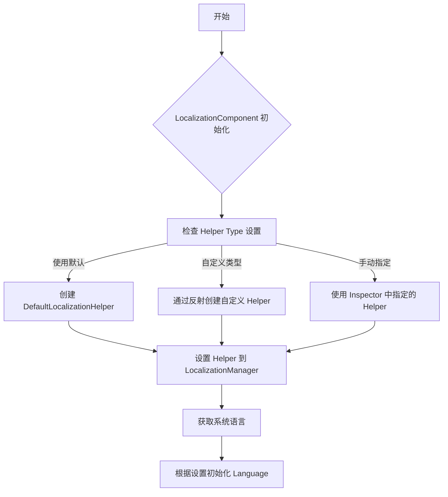
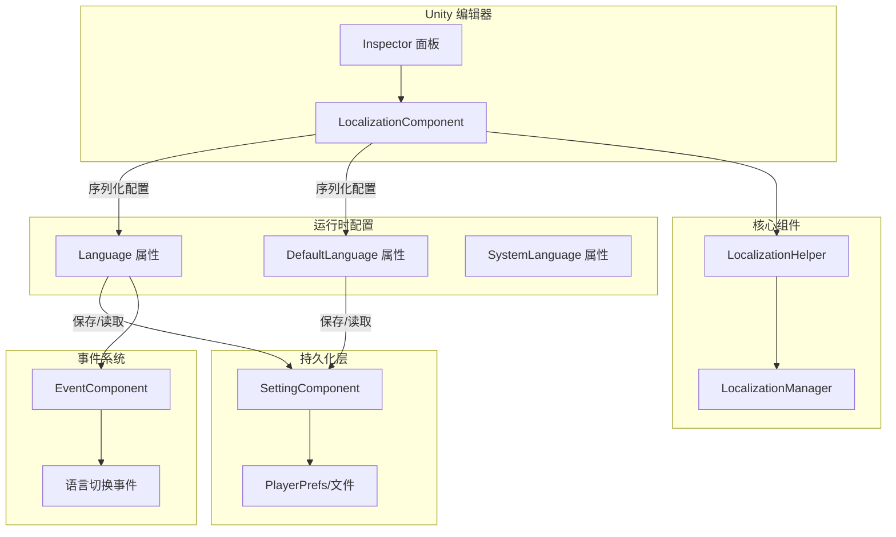

# 配置

本文档详细介绍 GameFrameX Localization 组件的各项配置选项，包括编辑器配置和运行时配置。

## 概述

GameFrameX Localization 组件提供灵活的本地化配置机制，支持通过 Unity 编辑器界面配置和代码运行时配置两种方式。配置系统采用分层设计，允许开发者自定义本地化辅助器、设置默认语言、启用编辑器测试模式等功能。

LocalizationComponent 是 Unity 引擎的核心组件，继承自 GameFrameworkComponent，通过序列化字段提供配置选项。这些配置在组件初始化时生效，控制本地化系统的行为。

> 源码文件：
> - [LocalizationComponent.cs](https://github.com/GameFrameX/com.gameframex.unity.localization/blob/main/Runtime/Localization/LocalizationComponent.cs#L48-L777)
> - [LocalizationManager.cs](https://github.com/GameFrameX/com.gameframex.unity.localization/blob/main/Runtime/Localization/Localization/LocalizationManager.cs#L43-L937)

## 编辑器配置

### 添加本地化组件

在 Unity 编辑器中，通过以下步骤添加本地化组件：

1. 在场景中创建空 GameObject 或选择现有对象
2. 点击菜单 **GameObject → GameFrameX → Localization**
3. 或在 Inspector 面板中点击 **Add Component**，搜索 "Localization"

组件添加后，Inspector 面板将显示配置选项。

### 配置选项说明

```csharp
// LocalizationComponent 核心配置字段
[SerializeField] private string m_EditorLanguage = "zh_CN";           // 编辑器语言
[SerializeField] private string m_DefaultLanguage = "zh_CN";         // 默认语言
[SerializeField] private bool m_IsEnableEditorMode = false;          // 启用编辑器模式
[SerializeField] private string m_LocalizationHelperTypeName;        // 辅助器类型名称
[SerializeField] private LocalizationHelperBase m_CustomLocalizationHelper; // 自定义辅助器实例
```

> Source: [LocalizationComponentInspector.cs](https://github.com/GameFrameX/com.gameframex.unity.localization/blob/main/Editor/Inspector/LocalizationComponentInspector.cs#L42-L46)

下表详细说明各配置项：

| 配置项 | 类型 | 默认值 | 说明 |
|--------|------|--------|------|
| **Default Language** | string | "zh_CN" | 默认语言代码，当加载本地化失败时使用此语言 |
| **Is Enable Editor Mode** | bool | false | 是否启用编辑器模式，启用后使用编辑器语言而非运行时语言 |
| **Editor Language** | string | "zh_CN" | 编辑器模式下使用的语言，仅在编辑器中有效 |
| **Localization Helper** | HelperInfo | DefaultLocalizationHelper | 本地化辅助器类型，可自定义实现 |

### 语言代码参考

语言代码遵循 RFC 5646 标准，格式为 `[语言代码]_[国家/地区代码]`，例如：
- `zh_CN` - 简体中文（中国）
- `zh_TW` - 繁体中文（台湾）
- `en_US` - 英语（美国）
- `ja_JP` - 日语（日本）
- `ko_KR` - 韩语（韩国）

系统预定义了丰富的语言代码常量，可通过 `LocalizationCode` 类直接引用：

```csharp
// 使用预定义的语言代码常量
LocalizationComponent component = gameObject.GetComponent<LocalizationComponent>();
component.DefaultLanguage = LocalizationCode.Chinese;        // zh_CN
component.DefaultLanguage = LocalizationCode.English;         // en_US
component.DefaultLanguage = LocalizationCode.Japanese;        // ja_JP
```

> Source: [LocalizationCode.cs](https://github.com/GameFrameX/com.gameframex.unity.localization/blob/main/Runtime/Localization/LocalizationCode.cs#L45-L986)

## 运行时配置

### 通过代码配置语言

在游戏运行时，可以通过代码动态配置语言设置：

```csharp
using GameFrameX.Localization.Runtime;

// 获取本地化组件
var localizationComponent = GameEntry.GetComponent<LocalizationComponent>();

// 设置当前语言
localizationComponent.Language = "en_US";

// 设置默认语言（当加载失败时使用）
localizationComponent.DefaultLanguage = "zh_CN";

// 获取当前语言
string currentLanguage = localizationComponent.Language;

// 获取系统语言
string systemLanguage = localizationComponent.SystemLanguage;
```

> Source: [LocalizationComponent.cs](https://github.com/GameFrameX/com.gameframex.unity.localization/blob/main/Runtime/Localization/LocalizationComponent.cs#L116-L143)

### 配置持久化机制

Language 和 DefaultLanguage 设置会自动持久化到本地设置系统中。首次运行时，系统语言将作为默认语言：

```csharp
// 初始化流程伪代码
if (Language == UnknownLocalization)
{
    Language = SystemLanguage;  // 使用系统语言
}
DefaultLanguage = m_DefaultLanguage != UnknownLocalization ? m_DefaultLanguage : SystemLanguage;
```

> Source: [LocalizationComponent.cs](https://github.com/GameFrameX/com.gameframex.unity.localization/blob/main/Runtime/Localization/LocalizationComponent.cs#L232-L237)

### 配置属性详解

#### Language 属性

获取或设置当前本地化语言。设置新语言时会触发语言切换事件：

```csharp
public string Language
{
    get
    {
        if (m_LocalizationManager.Language == UnknownLocalization)
        {
            var value = m_SettingComponent.GetString(nameof(LocalizationComponent) + "." + nameof(Language));
            if (value.IsNotNullOrWhiteSpace())
            {
                m_LocalizationManager.Language = value;
            }
        }
        return m_LocalizationManager.Language;
    }
    set
    {
        if (m_LocalizationManager.Language != value)
        {
            var oldLanguage = m_LocalizationManager.Language;
            m_LocalizationManager.Language = value;
            m_SettingComponent.SetString(nameof(LocalizationComponent) + "." + nameof(Language), value);
            m_SettingComponent.Save();
            var localizationLanguageChangeEventArgs = LocalizationLanguageChangeEventArgs.Create(oldLanguage, value);
            m_EventComponent.Fire(this, localizationLanguageChangeEventArgs);
        }
    }
}
```

**设计意图**：Language 属性采用延迟加载机制，从持久化存储中读取上次保存的语言设置。设置新值时自动保存，确保语言偏好跨会话保持。同时触发事件通知其他系统语言已更改。

#### DefaultLanguage 属性

获取或设置默认本地化语言，当加载本地化失败时使用：

```csharp
public string DefaultLanguage
{
    get
    {
        if (m_LocalizationManager.DefaultLanguage == UnknownLocalization)
        {
            var value = m_SettingComponent.GetString(nameof(LocalizationComponent) + "." + nameof(DefaultLanguage));
            if (value.IsNotNullOrWhiteSpace())
            {
                m_LocalizationManager.DefaultLanguage = value;
            }
        }
        return m_LocalizationManager.DefaultLanguage;
    }
    set
    {
        if (m_LocalizationManager.DefaultLanguage != value)
        {
            m_LocalizationManager.DefaultLanguage = value;
            m_SettingComponent.SetString(nameof(LocalizationComponent) + "." + nameof(DefaultLanguage), value);
            m_SettingComponent.Save();
        }
    }
}
```

**设计意图**：DefaultLanguage 作为回退机制，确保在目标语言资源缺失时仍能显示内容，提升用户体验。

#### SystemLanguage 属性

获取设备系统语言：

```csharp
public string SystemLanguage
{
    get { return m_LocalizationManager.SystemLanguage; }
}
```

系统语言由 LocalizationHelper 提供，DefaultLocalizationHelper 通过 CultureInfo 获取：

```csharp
public override string SystemLanguage
{
    get { return _regionName; }  // 如 "zh_CN", "en_US"
}
```

> Source: [DefaultLocalizationHelper.cs](https://github.com/GameFrameX/com.gameframex.unity.localization/blob/main/Runtime/Localization/DefaultLocalizationHelper.cs#L43-L57)

## 自定义本地化辅助器

### 为什么需要自定义辅助器

默认的 LocalizationHelper 通过 `CultureInfo.CurrentCulture.Name` 获取系统语言。在某些场景下，你可能需要自定义逻辑来确定系统语言，例如：
- 从服务器获取语言设置
- 根据玩家账户设置确定语言
- 使用配置文件中的语言设置

### 创建自定义辅助器

1. 继承 LocalizationHelperBase：

```csharp
using GameFrameX.Localization.Runtime;
using UnityEngine;

public class CustomLocalizationHelper : LocalizationHelperBase
{
    // 自定义系统语言获取逻辑
    public override string SystemLanguage
    {
        get
        {
            // 从服务器或配置获取语言
            return PlayerPrefs.GetString("Language", "zh_CN");
        }
    }
}
```

> Source: [LocalizationHelperBase.cs](https://github.com/GameFrameX/com.gameframex.unity.localization/blob/main/Runtime/Localization/LocalizationHelperBase.cs#L41-L48)

2. 在编辑器中配置自定义辅助器：

在 LocalizationComponent 的 Inspector 面板中，设置 Helper Type 为自定义类，或直接将自定义辅助器组件拖入 Custom Localization Helper 字段。

### 辅助器配置流程



> Source: [LocalizationComponent.cs](https://github.com/GameFrameX/com.gameframex.unity.localization/blob/main/Runtime/Localization/LocalizationComponent.cs#L214-L237)

## 配置架构图



## 配置选项汇总表

### LocalizationComponent 配置

| 属性 | 类型 | 默认值 | 运行时可写 | 说明 |
|------|------|--------|------------|------|
| `EditorLanguage` | string | "zh_CN" | 否（仅编辑器） | 编辑器测试用语言 |
| `DefaultLanguage` | string | "zh_CN" | 是 | 加载失败时的回退语言 |
| `IsEnableEditorMode` | bool | false | 否 | 是否在编辑器中使用 EditorLanguage |
| `Language` | string | 系统语言 | 是 | 当前使用的语言 |
| `SystemLanguage` | string | 设备语言 | 只读 | 操作系统语言 |

### LocalizationManager 核心属性

| 属性 | 类型 | 说明 |
|------|------|------|
| `DefaultLanguage` | string | 默认语言 |
| `Language` | string | 当前语言 |
| `SystemLanguage` | string | 系统语言 |
| `DictionaryCount` | int | 当前字典数量 |

### 预定义语言代码（常用）

| 常量 | 值 | 说明 |
|------|-----|------|
| `LocalizationCode.Chinese` | "zh_CN" | 简体中文 |
| `LocalizationCode.ChineseTraditionalTW` | "zh_TW" | 繁体中文（台湾） |
| `LocalizationCode.Japanese` | "ja_JP" | 日语 |
| `LocalizationCode.Korean` | "ko_KR` | 韩语 |
| `LocalizationCode.English` | "en_US" | 英语（美国） |
| `LocalizationCode.EnglishUK` | "en_GB" | 英语（英国） |
| `LocalizationCode.French` | "fr_FR" | 法语 |
| `LocalizationCode.German` | "de_DE" | 德语 |
| `LocalizationCode.Spanish` | "es_ES" | 西班牙语 |
| `LocalizationCode.Russian` | "ru_RU` | 俄语 |

> Source: [LocalizationCode.cs](https://github.com/GameFrameX/com.gameframex.unity.localization/blob/main/Runtime/Localization/LocalizationCode.cs#L46-L148)

## 最佳实践

### 1. 游戏启动时设置语言

建议在游戏启动流程中尽早设置语言，确保所有 UI 文本使用正确的语言：

```csharp
// 在游戏初始化阶段设置语言
var localizationComponent = GameEntry.GetComponent<LocalizationComponent>();

// 方式一：使用保存的语言设置
string savedLanguage = PlayerPrefs.GetString("GameLanguage");
if (!string.IsNullOrEmpty(savedLanguage))
{
    localizationComponent.Language = savedLanguage;
}
else
{
    // 方式二：使用系统语言作为默认
    localizationComponent.Language = localizationComponent.SystemLanguage;
}
```

### 2. 语言切换监听

监听语言切换事件以更新 UI：

```csharp
// 订阅语言切换事件
EventComponent eventComponent = GameEntry.GetComponent<EventComponent>();
eventComponent.Subscribe(LocalizationLanguageChangeEventArgs.EventId, OnLanguageChanged);

private void OnLanguageChanged(object sender, GameEventArgs e)
{
    var args = (LocalizationLanguageChangeEventArgs)e;
    Debug.Log($"语言从 {args.OldLanguage} 切换到 {args.Language}");
    
    // 刷新所有需要本地化的 UI 组件
    // RefreshAllLocalizedUI();
}
```

> Source: [LocalizationLanguageChangeEventArgs.cs](https://github.com/GameFrameX/com.gameframex.unity.localization/blob/main/Runtime/EventArgs/LocalizationLanguageChangeEventArgs.cs#L52-L58)

### 3. 配置检查清单

部署游戏前检查以下配置：

- [ ] DefaultLanguage 设置为项目主要语言
- [ ] 所有支持的语言都有对应的字典资源
- [ ] 自定义 LocalizationHelper 已正确实现
- [ ] 语言切换事件已正确处理
- [ ] 测试了系统语言不在支持列表时的回退行为

## 相关链接

- [获取本地化字符串](./04.core-features/01.get-string) - 了解如何获取本地化文本
- [字典管理](./04.core-features/02.dictionary-management) - 了解字典数据管理
- [语言切换与事件](./04.core-features/03.language-switching) - 了解语言切换机制
- [API 参考](./05.api-reference) - 完整的 API 文档
- [快速开始](./03.getting-started) - 快速上手指南
