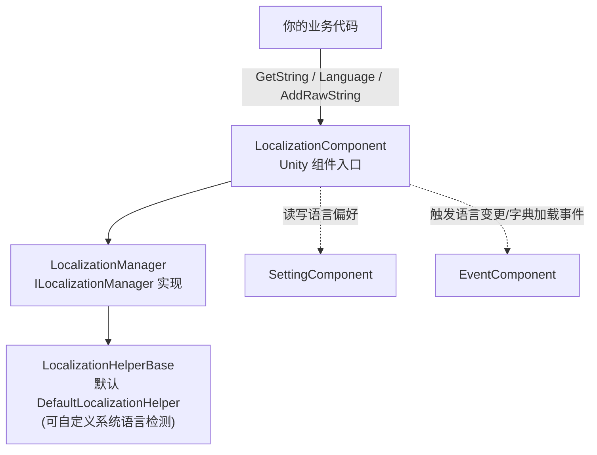

# 本地化包概览：能做什么

Game Frame X Localization(`com.gameframex.unity.localization`)是基于 GameFrameX 框架的 Unity 本地化功能包:它用"字典 key → 翻译文本"的方式管理多语言字符串,支持参数化格式化(最多 16 个类型化参数)、运行时切换语言并广播事件、自动检测系统语言、以及把语言偏好持久化到 Setting 系统。核心入口是 `LocalizationComponent` 组件,装上即可用。

它能为你的游戏提供:

- **基于字典的本地化** — 运行时添加、查询、删除翻译条目(`AddRawString` / `GetString` / `RemoveRawString`)
- **参数化字符串格式化** — 1~16 个类型化参数的泛型 `GetString` 重载,支持 .NET 标准占位符 `{0}`、`{1}`、`{2:P}` 等
- **运行时语言切换** — 设置 `Language` 属性即触发变更事件,UI 可即时刷新
- **系统语言检测与回退** — 通过 `CultureInfo` 检测设备语言,加载失败时回退到默认语言
- **语言偏好持久化** — 语言与默认语言经 `SettingComponent` 自动保存
- **编辑器模式** — 在 Play Mode 中用指定语言覆盖系统语言,方便测试
- **180+ 语言代码常量** — `LocalizationCode` 静态类,如 `ChineseSimplified`(`zh_CN`)、`Japanese`(`ja_JP`)
- **可替换 Helper** — 继承 `LocalizationHelperBase` 即可自定义系统语言检测

## 快速开始

1. 编辑 Unity 项目的 `Packages/manifest.json`,添加 GameFrameX scoped registry 与依赖:

```json
{
  "scopedRegistries": [
    {
      "name": "GameFrameX",
      "url": "https://gameframex.upm.alianblank.uk",
      "scopes": [
        "com.gameframex"
      ]
    }
  ],
  "dependencies": {
    "com.gameframex.unity.localization": "2.3.0"
  }
}
```

Source: [README.zh-CN.md](https://github.com/GameFrameX/com.gameframex.unity.localization/blob/main/README.zh-CN.md#L68-L84)

   也可以直接在 `dependencies` 下写 Git URL(`https://github.com/gameframex/com.gameframex.unity.localization.git`),或把仓库下载后放进 `Packages` 目录。

2. 在场景物体上挂载组件:菜单路径为 `GameFrameX/Localization`(`LocalizationComponent` 带 `[AddComponentMenu("GameFrameX/Localization")]`,并自动依赖 `GameFrameXLocalizationCroppingHelper`)。Inspector 中可配置 Helper、`Default Language`(默认 `zh_CN`)、编辑器模式等;组件序列化默认值见源码:

```csharp
[SerializeField] private string m_EditorLanguage = "zh_CN";

[SerializeField] private string m_DefaultLanguage = "zh_CN";

[SerializeField] private bool m_EnableLoadDictionaryUpdateEvent = false;
[SerializeField] private bool m_IsEnableEditorMode = false;

[SerializeField] private string m_LocalizationHelperTypeName = "GameFrameX.Localization.Runtime.DefaultLocalizationHelper";
```

Source: [LocalizationComponent.cs](https://github.com/GameFrameX/com.gameframex.unity.localization/blob/main/Runtime/Localization/LocalizationComponent.cs#L66-L75)

3. 在代码中获取组件并使用:

```csharp
using GameFrameX.Localization.Runtime;

// 标准方式：通过 GameEntry 获取
var localization = GameEntry.GetComponent<LocalizationComponent>();
```

Source: [README.zh-CN.md](https://github.com/GameFrameX/com.gameframex.unity.localization/blob/main/README.zh-CN.md#L100-L105)

4. 添加翻译条目、切换语言、取字符串,跑通第一个功能:

```csharp
// 添加新条目（key 已存在或为 null/空时返回 false）
bool added = localization.AddRawString("UI.Button.NewButton", "新按钮");

// 设置当前语言（触发变更事件，自动持久化）
localization.Language = "zh_CN";
localization.Language = "en_US";

// 简单键查找；key 不存在时返回 "<NoKey>{key}"
string okText = localization.GetString("UI.Button.OK");
```

Sources: [README.zh-CN.md](https://github.com/GameFrameX/com.gameframex.unity.localization/blob/main/README.zh-CN.md#L110-L116) · [README.zh-CN.md](https://github.com/GameFrameX/com.gameframex.unity.localization/blob/main/README.zh-CN.md#L134-L143) · [README.zh-CN.md](https://github.com/GameFrameX/com.gameframex.unity.localization/blob/main/README.zh-CN.md#L174-L179)

## 工作原理速览



组件职责一目了然:`LocalizationComponent`([LocalizationComponent.cs](https://github.com/GameFrameX/com.gameframex.unity.localization/blob/main/Runtime/Localization/LocalizationComponent.cs#L51-L56))持有 `ILocalizationManager`、`EventComponent`、`SettingComponent` 三个依赖。读取 `Language` 时,若值为 Unknown 会先从 Setting 恢复;写入 `Language` 时,依次持久化并连发三个事件(Before / Change / After):

```csharp
var localizationLanguageChangeBeforeEventArgs = LocalizationLanguageChangeBeforeEventArgs.Create(oldLanguage, value);
m_EventComponent.Fire(this, localizationLanguageChangeBeforeEventArgs);
var localizationLanguageChangeEventArgs = LocalizationLanguageChangeEventArgs.Create(oldLanguage, value);
m_EventComponent.Fire(this, localizationLanguageChangeEventArgs);
var localizationLanguageChangeAfterEventArgs = LocalizationLanguageChangeAfterEventArgs.Create(oldLanguage, value);
m_EventComponent.Fire(this, localizationLanguageChangeAfterEventArgs);
```

Source: [LocalizationComponent.cs](https://github.com/GameFrameX/com.gameframex.unity.localization/blob/main/Runtime/Localization/LocalizationComponent.cs#L155-L169)

## 常用能力速查

| 能力 | 关键 API(`LocalizationComponent`) | 说明 |
|------|----------------------------------|------|
| 当前语言 | `Language` | get 时未设置则回退 Setting→系统语言;set 触发事件并持久化 |
| 默认语言 | `DefaultLanguage` | 加载失败时的回退语言,持久化到 Setting |
| 系统语言 | `SystemLanguage` | 设备检测到的语言代码 |
| 取翻译 | `GetString(key)` / `GetString<T1..T16>(key, ...)` | key 不存在返回 `<NoKey>{key}`;泛型重载避免装箱 |
| 检查/取原文 | `HasRawString(key)` / `GetRawString(key)` | 原始未格式化值,未找到返回 `null` |
| 增删条目 | `AddRawString` / `RemoveRawString` / `RemoveAllRawStrings` | 运行时管理字典 |
| 条目数 | `DictionaryCount` | 已加载条目总数 |
| 语言代码 | `LocalizationCode.ChineseSimplified` 等 | 180+ 常量,格式 `语言_地区` |

参数化示例(字典值使用 `{0}`、`{1}` 等 .NET 占位符;参数不匹配时结果以 `<Error>` 开头):

```csharp
// 泛型重载（推荐——避免值类型的装箱）
string info = localization.GetString<string, int, int>("UI.Info.Score", playerName, score, level);
```

Source: [README.zh-CN.md](https://github.com/GameFrameX/com.gameframex.unity.localization/blob/main/README.zh-CN.md#L156-L167)

## 事件一览

| 事件类 | 触发条件 | 关键字段 |
|--------|----------|----------|
| `LocalizationLanguageChangeEventArgs` | 设置 `Language` 属性时 | `OldLanguage`、`Language` |
| `LoadDictionarySuccessEventArgs` | 字典资源加载完成 | `DictionaryAssetName`、`Duration`、`UserData` |
| `LoadDictionaryFailureEventArgs` | 字典资源加载失败 | `DictionaryAssetName`、`ErrorMessage`、`UserData` |
| `LoadDictionaryUpdateEventArgs` | 字典加载进度更新 | `DictionaryAssetName`、`Progress`、`UserData` |

(另有成对的 `LocalizationLanguageChangeBeforeEventArgs` / `LocalizationLanguageChangeAfterEventArgs`,见 [Runtime/EventArgs](https://github.com/GameFrameX/com.gameframex.unity.localization/blob/main/Runtime/EventArgs/LocalizationLanguageChangeBeforeEventArgs.cs)。所有事件类均使用 GameFrameX 引用池,零分配触发。)

## 接下来

- 安装细节与组件 Inspector 字段说明(`Enable Editor Mode`、`Editor Language` 等):见仓库 [README.zh-CN.md](https://github.com/GameFrameX/com.gameframex.unity.localization/blob/main/README.zh-CN.md)
- 监听语言变更并刷新 UI 的完整示例:[README.zh-CN.md #监听语言变更](https://github.com/GameFrameX/com.gameframex.unity.localization/blob/main/README.zh-CN.md#L198-L244)
- 语言代码常量完整列表:[LocalizationCode.cs](https://github.com/GameFrameX/com.gameframex.unity.localization/blob/main/Runtime/Localization/LocalizationCode.cs)
- 自定义系统语言检测(继承 `LocalizationHelperBase`):[LocalizationHelperBase.cs](https://github.com/GameFrameX/com.gameframex.unity.localization/blob/main/Runtime/Localization/LocalizationHelperBase.cs)
- 管理器接口与实现:[ILocalizationManager.cs](https://github.com/GameFrameX/com.gameframex.unity.localization/blob/main/Runtime/Localization/Localization/ILocalizationManager.cs) · [LocalizationManager.cs](https://github.com/GameFrameX/com.gameframex.unity.localization/blob/main/Runtime/Localization/Localization/LocalizationManager.cs)
- 版本历史:[CHANGELOG.md](https://github.com/GameFrameX/com.gameframex.unity.localization/blob/main/CHANGELOG.md)
