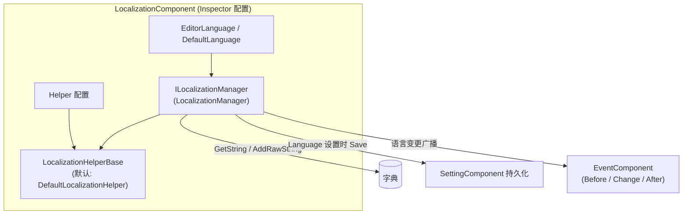

# 安装与首次运行：装包、挂组件、配置 Inspector

本页带你把 GameFrameX Localization 跑起来：安装 UPM 包、在场景中挂载 `LocalizationComponent`、配置 Inspector 中的语言与 Helper 字段，最后用代码验证第一条翻译文本能正常取出。整个过程只需几分钟。

## 快速开始

### 1. 安装包

任选以下一种方式（推荐方式 1，便于统一升级 GameFrameX 系列包）：

- 编辑 Unity 项目的 `Packages/manifest.json`，添加 `scopedRegistries` 并声明依赖：

```json
{
  "scopedRegistries": [
    {
      "name": "GameFrameX",
      "url": "https://gameframex.upm.alianblank.uk",
      "scopes": [
        "com.gameframex"
      ]
    }
  ],
  "dependencies": {
    "com.gameframex.unity.localization": "2.3.0"
  }
}
```

`scopes` 控制哪些包通过此注册表解析，只有以 `com.gameframex` 开头的包才会从这个注册表获取。

Source: [README.zh-CN.md](https://github.com/GameFrameX/com.gameframex.unity.localization/blob/main/README.zh-CN.md#L68-L86)

- 直接在 `manifest.json` 的 `dependencies` 节点下添加 Git 地址：

```json
{
   "com.gameframex.unity.localization": "https://github.com/gameframex/com.gameframex.unity.localization.git"
}
```

Source: [README.zh-CN.md](https://github.com/GameFrameX/com.gameframex.unity.localization/blob/main/README.zh-CN.md#L88-L93)

- 或在 Unity `Package Manager` 中用 `Git URL` 方式添加：`https://github.com/gameframex/com.gameframex.unity.localization.git`。
- 或直接下载仓库放到 Unity 项目的 `Packages` 目录下，Unity 会自动加载识别。

版本要求：Unity 2019.4 及以上（见 [README.zh-CN.md](https://github.com/GameFrameX/com.gameframex.unity.localization/blob/main/README.zh-CN.md#L9)）。组件依赖 GameFrameX 的 Event、Setting 与核心运行时程序集。

### 2. 挂组件

在启动场景的 GameFrameX 组件宿主物体上，通过 `Add Component` 菜单选择 `GameFrameX/Localization` 添加 `LocalizationComponent`：

```csharp
[DisallowMultipleComponent]
[AddComponentMenu("GameFrameX/Localization")]
[HelpURL("https://datatracker.ietf.org/doc/html/rfc5646")]
[Preserve]
[RequireComponent(typeof(GameFrameXLocalizationCroppingHelper))]
public sealed class LocalizationComponent : GameFrameworkComponent
```

Source: [LocalizationComponent.cs](https://github.com/GameFrameX/com.gameframex.unity.localization/blob/main/Runtime/Localization/LocalizationComponent.cs#L46-L51)

要点：

- `[RequireComponent(typeof(GameFrameXLocalizationCroppingHelper))]`：添加本组件时会自动附带裁剪辅助组件，无需手动挂。
- `[DisallowMultipleComponent]`：同一物体只能挂一个，重复添加会被 Unity 阻止。

### 3. 配置 Inspector

组件序列化字段及默认值如下，全部可在 Inspector 中直接修改：

| Inspector 字段 | 默认值 | 说明 |
|------|------|------|
| EditorLanguage | `zh_CN` | 编辑器语言，仅编辑器内有效，方便在 Play 模式测试不同语言 |
| DefaultLanguage | `zh_CN` | 默认本地化语言，加载本地化失败时回退使用 |
| EnableLoadDictionaryUpdateEvent | `false` | 是否启用字典加载进度更新事件 |
| IsEnableEditorMode | `false` | 是否启用编辑器模式 |
| LocalizationHelperTypeName | `GameFrameX.Localization.Runtime.DefaultLocalizationHelper` | 本地化 Helper 类型名 |
| CustomLocalizationHelper | `null` | 自定义 Helper，留空则使用上面的默认 Helper |

字段定义源码：

```csharp
[SerializeField] private string m_EditorLanguage = "zh_CN";
[SerializeField] private string m_DefaultLanguage = "zh_CN";
[SerializeField] private bool m_EnableLoadDictionaryUpdateEvent = false;
[SerializeField] private bool m_IsEnableEditorMode = false;
[SerializeField] private string m_LocalizationHelperTypeName = "GameFrameX.Localization.Runtime.DefaultLocalizationHelper";
[SerializeField] private LocalizationHelperBase m_CustomLocalizationHelper = null;
```

Source: [LocalizationComponent.cs](https://github.com/GameFrameX/com.gameframex.unity.localization/blob/main/Runtime/Localization/LocalizationComponent.cs#L66-L75)

语言代码使用 RFC 5646 风格，如 `zh_CN`、`en_US`、`ja_JP`（组件 `HelpURL` 即指向 RFC 5646 规范）。

### 4. 首次运行验证

进入 Play 模式，先注册一条翻译再用代码取出：

```csharp
using GameFrameX.Localization.Runtime;

// 标准方式：通过 GameEntry 获取
var localization = GameEntry.GetComponent<LocalizationComponent>();

// 运行时添加一条翻译（key 已存在或为 null/空时返回 false）
bool added = localization.AddRawString("UI.Button.NewButton", "新按钮");

// 取出翻译；如果 key 不存在，返回 "<NoKey>{key}"
string text = localization.GetString("UI.Button.NewButton");
```

Sources: [README.zh-CN.md](https://github.com/GameFrameX/com.gameframex.unity.localization/blob/main/README.zh-CN.md#L100-L105) · [README.zh-CN.md](https://github.com/GameFrameX/com.gameframex.unity.localization/blob/main/README.zh-CN.md#L173-L176) · [README.zh-CN.md](https://github.com/GameFrameX/com.gameframex.unity.localization/blob/main/README.zh-CN.md#L134-L137)

看到 `text` 输出"新按钮"即安装成功。注意：若 key 不存在返回的是 `<NoKey>{key}`，格式化参数不匹配时结果以 `<Error>` 开头，这两类前缀都说明字典内容或参数有问题。

## 工作原理速览

组件采用"组件壳 + 管理器 + Helper"的分层结构，Inspector 配置最终传给 `LocalizationManager` 执行，语言切换会自动写入 Setting 并广播事件：



组件在设置 `Language` 时会先写 `SettingComponent` 并 `Save()`，随后依次触发 `LocalizationLanguageChangeBeforeEventArgs`、`LocalizationLanguageChangeEventArgs`、`LocalizationLanguageChangeAfterEventArgs` 三个事件；获取 `Language`/`DefaultLanguage` 时若为未知值则先从 Setting 读取。

Source: [LocalizationComponent.cs](https://github.com/GameFrameX/com.gameframex.unity.localization/blob/main/Runtime/Localization/LocalizationComponent.cs#L140-L171)

## 常见错误

| 现象 | 原因 | 修复 |
|------|------|------|
| 取出的文本是 `<NoKey>{key}` | 字典中没有该 key | 先 `AddRawString` 注册条目，或用 `HasRawString` 先检查 |
| 格式化结果以 `<Error>` 开头 | 占位符与提供的参数不匹配 | 核对字典值里的 `{0}`、`{1}` 与传入参数个数/类型 |
| 组件报缺少依赖 | 未安装 Event/Setting 等依赖包 | 通过 scoped registry 一并安装 `com.gameframex` 系列包 |
| 同一物体挂不上第二个 | `[DisallowMultipleComponent]` | 一个场景宿主只挂一个 `LocalizationComponent` |

错误行为依据见 [README.zh-CN.md](https://github.com/GameFrameX/com.gameframex.unity.localization/blob/main/README.zh-CN.md#L167) 与 [LocalizationComponent.cs](https://github.com/GameFrameX/com.gameframex.unity.localization/blob/main/Runtime/Localization/LocalizationComponent.cs#L46-L51)。

## 接下来

- 运行时语言切换与事件监听示例：见 [README.zh-CN.md](https://github.com/GameFrameX/com.gameframex.unity.localization/blob/main/README.zh-CN.md#L194-L236)
- 参数化格式化（最多 16 个类型化参数的 `GetString` 重载）：见 [README.zh-CN.md](https://github.com/GameFrameX/com.gameframex.unity.localization/blob/main/README.zh-CN.md#L146-L165)
- 语言代码常量 `LocalizationCode`（180+ 语言）：见 [LocalizationCode.cs](https://github.com/GameFrameX/com.gameframex.unity.localization/blob/main/Runtime/Localization/LocalizationCode.cs)
- 自定义 Helper（继承 `LocalizationHelperBase` 覆盖系统语言检测）：见 [LocalizationHelperBase.cs](https://github.com/GameFrameX/com.gameframex.unity.localization/blob/main/Runtime/Localization/LocalizationHelperBase.cs)
- Inspector 定制界面实现：见 [LocalizationComponentInspector.cs](https://github.com/GameFrameX/com.gameframex.unity.localization/blob/main/Editor/Inspector/LocalizationComponentInspector.cs)
- 官方文档：<https://gameframex.doc.alianblank.com/>
