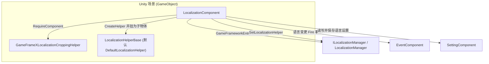

# 工作原理：组件、Manager 与 Helper 的分工

本包按三层组织：`LocalizationComponent` 是挂在 Unity 场景上的 Mono 门面，`ILocalizationManager` / `LocalizationManager` 是框架核心模块（负责字典数据与语言状态），`ILocalizationHelper` / `LocalizationHelperBase` 是可替换的辅助器（负责系统语言等能力）。业务代码只与 `LocalizationComponent` 交互，后两层由它在启动时自动装配。

## 三层分工一览

| 层 | 真实类型 | 文件 | 职责 |
|------|----------|------|------|
| 组件层 | `LocalizationComponent : GameFrameworkComponent` | `Runtime/Localization/LocalizationComponent.cs` | Unity 门面：持有 Inspector 配置项、初始化 Manager/Helper、把 `GetString` / `Language` 等调用转发给 Manager，并把语言设置持久化到 `SettingComponent` |
| 管理器层 | `ILocalizationManager` / `LocalizationManager` | `Runtime/Localization/Localization/` | 框架核心模块：由 `GameFrameworkEntry.GetModule<ILocalizationManager>()` 获取，持有字典数据、当前语言、默认语言与系统语言，定义常量 `UnknownLocalization` |
| 辅助器层 | `ILocalizationHelper` / `LocalizationHelperBase` / `DefaultLocalizationHelper` | `Runtime/Localization/` | 可替换实现：由组件通过 `Helper.CreateHelper` 创建并注入 Manager；接口仅声明 `SystemLanguage` |

三层关系与协作组件（箭头均来自源码中可核实的调用）：



辅助器接口非常精简，只声明了系统语言：

```csharp
public interface ILocalizationHelper
{
    string SystemLanguage { get; }
}
```

Source: [ILocalizationHelper.cs](https://github.com/GameFrameX/com.gameframex.unity.localization/blob/main/Runtime/Localization/Localization/ILocalizationHelper.cs#L40-L47)

## 启动初始化流程

`LocalizationComponent` 通过两个生命周期方法完成装配，顺序如下：

1. **`Awake()` — 获取核心模块**。设置实现类型与接口类型，再从框架入口拿到 `ILocalizationManager`，失败则 `Log.Fatal("Localization manager is invalid.")` 并停止。

```csharp
protected override void Awake()
{
    ImplementationComponentType = Utility.Assembly.GetType(componentType);
    InterfaceComponentType = typeof(ILocalizationManager);
    base.Awake();
    m_LocalizationManager = GameFrameworkEntry.GetModule<ILocalizationManager>();
    if (m_LocalizationManager == null)
    {
        Log.Fatal("Localization manager is invalid.");
        return;
    }
}
```

Source: [LocalizationComponent.cs](https://github.com/GameFrameX/com.gameframex.unity.localization/blob/main/Runtime/Localization/LocalizationComponent.cs#L211-L222)

2. **`Start()` — 校验依赖组件**。依次通过 `GameEntry.GetComponent<T>()` 获取 `BaseComponent`、`EventComponent`、`SettingComponent`，任一缺失即 `Log.Fatal("Base component is invalid." / "Event component is invalid." / "Setting component is invalid.")`。

3. **`Start()` — 创建并注入 Helper**。用 Inspector 上的 `m_LocalizationHelperTypeName`（默认 `"GameFrameX.Localization.Runtime.DefaultLocalizationHelper"`）或 `m_CustomLocalizationHelper` 引用创建辅助器，命名为 `"Localization Helper"`、挂为本组件子物体，然后调用 `SetLocalizationHelper` 注入 Manager。

```csharp
LocalizationHelperBase localizationHelper = Helper.CreateHelper(m_LocalizationHelperTypeName, m_CustomLocalizationHelper);
if (localizationHelper == null)
{
    Log.Fatal("Can not create localization helper.");
    return;
}

localizationHelper.name = "Localization Helper";
Transform localizationHelperTransform = localizationHelper.transform;
localizationHelperTransform.SetParent(this.transform);
localizationHelperTransform.localScale = Vector3.one;
m_LocalizationManager.SetLocalizationHelper(localizationHelper);
```

Source: [LocalizationComponent.cs](https://github.com/GameFrameX/com.gameframex.unity.localization/blob/main/Runtime/Localization/LocalizationComponent.cs#L249-L260)

4. **`Start()` — 初始化语言**。编辑器模式下若勾选 `m_IsEnableEditorMode`，用 `EditorLanguage`（默认 `"zh_CN"`）；运行时若 `Language` 仍为 `UnknownLocalization` 则回退到 `SystemLanguage`；`DefaultLanguage` 兜底逻辑相同。

```csharp
#if UNITY_EDITOR
    if (m_IsEnableEditorMode)
    {
        Language = EditorLanguage != UnknownLocalization ? EditorLanguage : m_LocalizationManager.SystemLanguage;
    }
#else
    if (Language == UnknownLocalization)
    {
        Language = m_LocalizationManager.SystemLanguage;
    }
#endif
    DefaultLanguage = m_DefaultLanguage != UnknownLocalization ? m_DefaultLanguage : m_LocalizationManager.SystemLanguage;
```

Source: [LocalizationComponent.cs](https://github.com/GameFrameX/com.gameframex.unity.localization/blob/main/Runtime/Localization/LocalizationComponent.cs#L261-L272)

### 组件上的序列化配置项

| 配置项 | 默认值 | 作用 |
|--------|--------|------|
| `m_EditorLanguage` | `"zh_CN"` | 编辑器内语言（仅编辑器模式生效） |
| `m_DefaultLanguage` | `"zh_CN"` | 默认本地化语言，加载失败时兜底 |
| `m_EnableLoadDictionaryUpdateEvent` | `false` | 是否开启字典加载进度更新事件 |
| `m_IsEnableEditorMode` | `false` | 是否启用编辑器模式语言 |
| `m_LocalizationHelperTypeName` | `"GameFrameX.Localization.Runtime.DefaultLocalizationHelper"` | 辅助器类型全名 |
| `m_CustomLocalizationHelper` | `null` | 自定义辅助器引用（优先于类型名） |

Source: [LocalizationComponent.cs](https://github.com/GameFrameX/com.gameframex.unity.localization/blob/main/Runtime/Localization/LocalizationComponent.cs#L66-L75)

组件声明本身也体现了对裁剪辅助器的硬依赖：`[RequireComponent(typeof(GameFrameXLocalizationCroppingHelper))]`、`[DisallowMultipleComponent]`、`[AddComponentMenu("GameFrameX/Localization")]`（见 [LocalizationComponent.cs](https://github.com/GameFrameX/com.gameframex.unity.localization/blob/main/Runtime/Localization/LocalizationComponent.cs#L46-L51)）。

## 语言切换的数据流

`Language` 属性的 setter 是组件层协调 Manager、Setting 与 Event 三方的典型示例。当值变化时，它依次做四件事：更新 Manager 的语言并写入 `SettingComponent` 保存持久化；然后按固定顺序广播三个语言变更事件（Before → Change → After）。

```csharp
set
{
    if (m_LocalizationManager.Language != value)
    {
        var oldLanguage = m_LocalizationManager.Language;
        m_LocalizationManager.Language = value;
        m_SettingComponent.SetString(nameof(LocalizationComponent) + "." + nameof(Language), value);
        m_SettingComponent.Save();
        var localizationLanguageChangeBeforeEventArgs = LocalizationLanguageChangeBeforeEventArgs.Create(oldLanguage, value);
        m_EventComponent.Fire(this, localizationLanguageChangeBeforeEventArgs);
        var localizationLanguageChangeEventArgs = LocalizationLanguageChangeEventArgs.Create(oldLanguage, value);
        m_EventComponent.Fire(this, localizationLanguageChangeEventArgs);
        var localizationLanguageChangeAfterEventArgs = LocalizationLanguageChangeAfterEventArgs.Create(oldLanguage, value);
        m_EventComponent.Fire(this, localizationLanguageChangeAfterEventArgs);
    }
}
```

Source: [LocalizationComponent.cs](https://github.com/GameFrameX/com.gameframex.unity.localization/blob/main/Runtime/Localization/LocalizationComponent.cs#L155-L170)

getter 则是懒加载：若 Manager 中语言仍为 `UnknownLocalization`，先从 `SettingComponent` 读取上次保存的值（键名为 `LocalizationComponent.Language`），再回填给 Manager。

三个语言变更事件对应的参数类均位于 `Runtime/EventArgs/`：

| 事件参数类 | 文件 | 触发时机 |
|------------|------|----------|
| `LocalizationLanguageChangeBeforeEventArgs` | `Runtime/EventArgs/LocalizationLanguageChangeBeforeEventArgs.cs` | 语言即将变更（最先） |
| `LocalizationLanguageChangeEventArgs` | `Runtime/EventArgs/LocalizationLanguageChangeEventArgs.cs` | 语言已变更 |
| `LocalizationLanguageChangeAfterEventArgs` | `Runtime/EventArgs/LocalizationLanguageChangeAfterEventArgs.cs` | 变更后收尾（最后） |
| `LoadDictionaryFailureEventArgs` | `Runtime/EventArgs/LoadDictionaryFailureEventArgs.cs` | 字典加载失败 |
| `LoadDictionarySuccessEventArgs` | `Runtime/EventArgs/LoadDictionarySuccessEventArgs.cs` | 字典加载成功 |
| `LoadDictionaryUpdateEventArgs` | `Runtime/EventArgs/LoadDictionaryUpdateEventArgs.cs` | 字典加载进度更新（受 `m_EnableLoadDictionaryUpdateEvent` 控制） |

## 业务调用如何穿透三层

业务代码调用 `LocalizationComponent.GetString(...)`，组件原样转发给 `m_LocalizationManager`，Manager 从字典取值并按参数格式化。组件提供了从 0 到 6 个参数的 `GetString` 重载，全部是纯转发：

```csharp
public string GetString(string key)
{
    return m_LocalizationManager.GetString(key);
}

public string GetString(string key, params object[] args)
{
    return m_LocalizationManager.GetString(key, args);
}
```

Source: [LocalizationComponent.cs](https://github.com/GameFrameX/com.gameframex.unity.localization/blob/main/Runtime/Localization/LocalizationComponent.cs#L284-L303)

因此在运行期，`LocalizationComponent` 只是门面：真正的字典数据、语言状态、加载回调都住在 `LocalizationManager` 中；而 Manager 又把"系统语言是什么"这类平台相关的问题委托给它持有的 `LocalizationHelperBase` 实现。替换 Helper（例如改用自定义的系统语言判定）只需改 Inspector 上的辅助器类型或引用，无需改动组件或业务代码。

## 常见错误

| 症状（Log.Fatal 原文） | 根因 | 修复 |
|------|------|------|
| `Localization manager is invalid.` | `GameFrameworkEntry.GetModule<ILocalizationManager>()` 返回空 | 确认框架核心已初始化、包已正确引入 |
| `Base component is invalid.` | 场景缺少 `BaseComponent` | 在 GameEntry 上补齐 `BaseComponent` |
| `Event component is invalid.` | 场景缺少 `EventComponent` | 添加 `EventComponent`（语言变更事件依赖它） |
| `Setting component is invalid.` | 场景缺少 `SettingComponent` | 添加 `SettingComponent`（语言持久化依赖它） |
| `Can not create localization helper.` | `m_LocalizationHelperTypeName` 类型名错误且未提供 `m_CustomLocalizationHelper` | 核对辅助器类型全名或直接拖入自定义 Helper 引用 |

以上消息原文均出自 `Start()`/`Awake()` 中的校验逻辑（[LocalizationComponent.cs](https://github.com/GameFrameX/com.gameframex.unity.localization/blob/main/Runtime/Localization/LocalizationComponent.cs#L217-L253)）。

## 相关链接

- [LocalizationComponent.cs](https://github.com/GameFrameX/com.gameframex.unity.localization/blob/main/Runtime/Localization/LocalizationComponent.cs) — 组件层门面与初始化流程
- [ILocalizationManager.cs](https://github.com/GameFrameX/com.gameframex.unity.localization/blob/main/Runtime/Localization/Localization/ILocalizationManager.cs) — 管理器接口
- [LocalizationManager.cs](https://github.com/GameFrameX/com.gameframex.unity.localization/blob/main/Runtime/Localization/Localization/LocalizationManager.cs) — 管理器实现
- [ILocalizationHelper.cs](https://github.com/GameFrameX/com.gameframex.unity.localization/blob/main/Runtime/Localization/Localization/ILocalizationHelper.cs) — 辅助器接口
- [LocalizationHelperBase.cs](https://github.com/GameFrameX/com.gameframex.unity.localization/blob/main/Runtime/Localization/LocalizationHelperBase.cs) — 辅助器基类
- [DefaultLocalizationHelper.cs](https://github.com/GameFrameX/com.gameframex.unity.localization/blob/main/Runtime/Localization/DefaultLocalizationHelper.cs) — 默认辅助器
- [LocalizationComponentInspector.cs](https://github.com/GameFrameX/com.gameframex.unity.localization/blob/main/Editor/Inspector/LocalizationComponentInspector.cs) — 编辑器 Inspector
