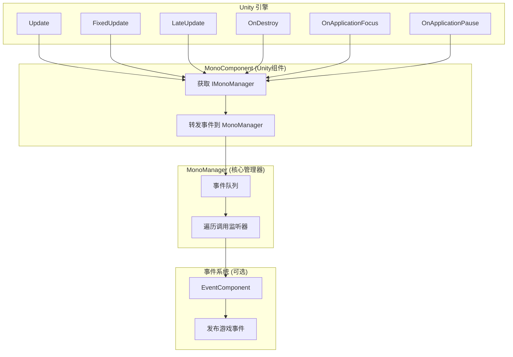
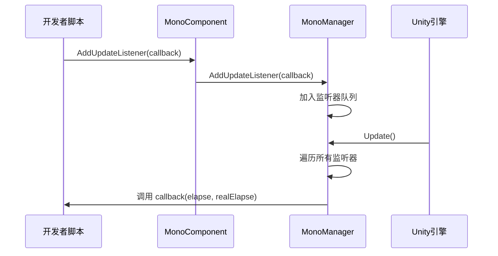

# 基础使用

GameFrameX Mono 生命周期组件的基础使用指南，帮助开发者快速上手并理解框架的核心用法。

## 概述

Mono 生命周期组件是 GameFrameX 框架的核心模块之一，用于统一管理 Unity 中 `MonoBehaviour` 的各种生命周期事件。该组件提供了简洁的监听器模式，使开发者可以方便地订阅和管理 `Update`、`FixedUpdate`、`LateUpdate`、`OnDestroy`、`OnApplicationFocus` 以及 `OnApplicationPause` 等事件，而无需在每个脚本中单独处理这些回调。

> **设计意图**：将分散在各处的生命周期回调逻辑集中到统一的事件管理系统中，避免代码耦合，便于维护和扩展。

## 架构概览



**架构说明**：
- **MonoComponent**：挂载在 GameObject 上的 Unity 组件，负责接收 Unity 生命周期回调并转发给 MonoManager
- **MonoManager**：核心管理器，维护各个事件的监听器列表，在收到回调时依次调用所有监听器
- **EventSystem**：可选模块，当焦点或暂停状态变化时，通过 EventComponent 发布游戏事件供其他模块订阅

## 核心概念

### 监听器模式

框架采用经典的监听器（Observer）模式，开发者可以订阅感兴趣的事件并在事件触发时获得通知。



### 线程安全设计

所有监听器的添加和移除操作都使用 `lock` 保护，确保在多线程环境下的安全性。监听器的调用也在锁内执行，防止在调用过程中监听器被意外修改。

> **性能优化**：MonoManager 使用 `LinkedList<T>` 存储监听器，支持高效的添加、删除和遍历操作。

## 使用方式

### 第一步：添加 MonoComponent

在 Unity 编辑器中，选中需要使用生命周期事件的 GameObject，点击 **Add Component**，搜索 **GameFrameX/Mono** 并添加。

```csharp
// 源码位置：Runtime/Mono/MonoComponent.cs#L42-L44
[DisallowMultipleComponent]
[AddComponentMenu("GameFrameX/Mono")]
public class MonoComponent : GameFrameworkComponent
```

或者通过代码动态添加：

```csharp
var monoComponent = gameObject.AddComponent<GameFrameX.Mono.Runtime.MonoComponent>();
```
> Source: [MonoComponent.cs](https://github.com/GameFrameX/com.gameframex.unity.mono/blob/main/Runtime/Mono/MonoComponent.cs#L42-L44)

### 第二步：订阅生命周期事件

在脚本中获取 `MonoComponent` 实例后，可以调用相应的方法订阅事件。以下是完整的使用示例：

```csharp
using UnityEngine;
using GameFrameX.Mono.Runtime;
using System;

public class Example : MonoBehaviour
{
    private MonoComponent _monoComponent;

    private void Awake()
    {
        // 获取 MonoComponent 实例
        _monoComponent = GetComponent<MonoComponent>();
    }

    private void Start()
    {
        // 订阅 Update 事件
        _monoComponent.AddUpdateListener(OnGameUpdate);
        
        // 订阅 FixedUpdate 事件
        _monoComponent.AddFixedUpdateListener(OnFixedUpdate);
        
        // 订阅 LateUpdate 事件
        _monoComponent.AddLateUpdateListener(OnLateUpdate);
        
        // 订阅 OnDestroy 事件
        _monoComponent.AddDestroyListener(OnGameObjectDestroy);
        
        // 订阅焦点变化事件
        _monoComponent.AddOnApplicationFocusListener(OnApplicationFocus);
        
        // 订阅暂停状态变化事件
        _monoComponent.AddOnApplicationPauseListener(OnApplicationPause);
    }

    private void OnDestroy()
    {
        // 页面销毁时移除监听器，避免内存泄漏
        if (_monoComponent != null)
        {
            _monoComponent.RemoveUpdateListener(OnGameUpdate);
            _monoComponent.RemoveFixedUpdateListener(OnFixedUpdate);
            _monoComponent.RemoveLateUpdateListener(OnLateUpdate);
            _monoComponent.RemoveDestroyListener(OnGameObjectDestroy);
            _monoComponent.RemoveOnApplicationFocusListener(OnApplicationFocus);
            _monoComponent.RemoveOnApplicationPauseListener(OnApplicationPause);
        }
    }

    // Update: 每帧调用，第一个参数是距离上一帧的时间，第二个参数是真实流逝时间
    private void OnGameUpdate(float elapseSeconds, float realElapseSeconds)
    {
        // 编写游戏逻辑
    }

    // FixedUpdate: 固定帧率调用，适合物理相关的逻辑
    private void OnFixedUpdate(float elapseSeconds, float fixedElapseSeconds)
    {
        // 编写物理逻辑
    }

    // LateUpdate: 所有 Update 调用后调用，适合相机跟随等需要在所有移动逻辑执行后的操作
    private void OnLateUpdate(float elapseSeconds, float fixedElapseSeconds)
    {
        // 编写需要在最后执行的逻辑
    }

    // OnDestroy: GameObject 销毁时调用，适合资源清理
    private void OnGameObjectDestroy()
    {
        // 清理资源
    }

    // OnApplicationFocus: 应用程序焦点变化时调用
    private void OnApplicationFocus(bool focusStatus)
    {
        if (focusStatus)
        {
            Debug.Log("应用程序获得焦点");
        }
        else
        {
            Debug.Log("应用程序失去焦点");
        }
    }

    // OnApplicationPause: 应用程序暂停状态变化时调用
    private void OnApplicationPause(bool pauseStatus)
    {
        if (pauseStatus)
        {
            Debug.Log("游戏已暂停");
        }
        else
        {
            Debug.Log("游戏已恢复");
        }
    }
}
```

> Source: [MonoComponent.cs](https://github.com/GameFrameX/com.gameframex.unity.mono/blob/main/Runtime/Mono/MonoComponent.cs#L126-L300)

## 事件类型详解

| 事件类型 | 回调参数 | 调用时机 | 适用场景 |
|---------|---------|---------|---------|
| **Update** | `(float elapseSeconds, float realElapseSeconds)` | 每帧调用，最先执行 | 游戏主循环逻辑、输入检测 |
| **FixedUpdate** | `(float elapseSeconds, float fixedElapseSeconds)` | 固定帧率调用（默认0.02秒） | 物理引擎相关逻辑 |
| **LateUpdate** | `(float elapseSeconds, float fixedElapseSeconds)` | 所有 Update 后调用 | 相机跟随、角色移动后的处理 |
| **OnDestroy** | `()` | GameObject 销毁时调用 | 资源清理、事件注销 |
| **OnApplicationFocus** | `(bool focusStatus)` | 应用获得/失去焦点时调用 | 暂停游戏、记录状态 |
| **OnApplicationPause** | `(bool pauseStatus)` | 应用暂停/恢复时调用 | 保存数据、停止音乐 |

### 参数说明

- **elapseSeconds**：距离上一帧的流逝时间（秒），受时间缩放影响
- **realElapseSeconds**：真实流逝时间（秒），不受时间缩放影响
- **fixedElapseSeconds**：固定更新模式的流逝时间
- **focusStatus**：焦点状态，`true` 表示获得焦点，`false` 表示失去焦点
- **pauseStatus**：暂停状态，`true` 表示暂停，`false` 表示恢复

## 事件系统集成

除了通过监听器回调，`OnApplicationFocus` 和 `OnApplicationPause` 事件还会通过 GameFrameX 的事件系统发布，开发者也可以使用事件系统来订阅这些变化：

```csharp
using GameFrameX.Event.Runtime;
using GameFrameX.Mono.Runtime;

// 订阅焦点变化事件
EventComponent.Subscribe<OnApplicationFocusChangedEventArgs>(OnFocusChanged);

// 订阅暂停变化事件
EventComponent.Subscribe<OnApplicationPauseChangedEventArgs>(OnPauseChanged);

private void OnFocusChanged(OnApplicationFocusChangedEventArgs args)
{
    Debug.Log($"焦点变化: {args.IsFocus}");
}

private void OnPauseChanged(OnApplicationPauseChangedEventArgs args)
{
    Debug.Log($"暂停状态: {args.IsPause}");
}
```

> **注意**：事件系统的发布在 MonoComponent 中实现，详细说明请参阅 [事件系统文档](../5-events.1-event-types)。

## 最佳实践

### 1. 及时移除监听器

在 `OnDestroy` 或组件禁用时移除监听器，避免内存泄漏和空引用异常：

```csharp
private void OnDestroy()
{
    // 检查是否为 null，因为 Unity 可能在组件销毁时先清理引用
    _monoComponent?.RemoveUpdateListener(OnGameUpdate);
}
```

### 2. 不要在监听器中执行耗时操作

生命周期事件每帧都会调用，耗时操作会阻塞游戏主线程，影响性能：

```csharp
// ❌ 不推荐：执行耗时操作
private void OnGameUpdate(float elapse, float realElapse)
{
    LoadLargeResource(); // 这会阻塞主线程
}

// ✅ 推荐：使用协程或异步操作
private void OnGameUpdate(float elapse, float realElapse)
{
    StartCoroutine(LoadResourceAsync());
}
```

### 3. 异常隔离

MonoManager 实现了异常隔离机制，单个监听器的异常不会影响其他监听器的执行：

```csharp
// MonoManager 内部实现（源码片段）
private static void QueueInvoking(LinkedList<Action<float, float>> list, float elapseSeconds, float fixedElapseSeconds)
{
    lock (Lock)
    {
        foreach (var action in list)
        {
            try
            {
                action.Invoke(elapseSeconds, fixedElapseSeconds);
            }
            catch (Exception e)
            {
                Log.Error(e); // 记录异常但继续执行其他监听器
            }
        }
    }
}
```
> Source: [MonoManager.cs](https://github.com/GameFrameX/com.gameframex.unity.mono/blob/main/Runtime/Mono/MonoManager.cs#L364-L380)

### 4. 使用有意义的监听器方法名

为监听器使用描述性的方法名，提高代码可读性：

```csharp
// ✅ 推荐
_monoComponent.AddUpdateListener(UpdatePlayerMovement);
_monoComponent.AddFixedUpdateListener(SyncPhysicsState);

// ❌ 不推荐
_monoComponent.AddUpdateListener(Update);
_monoComponent.AddFixedUpdateListener(Fixed);
```

## 常见问题

### Q1: MonoComponent 需要挂载在哪里？

MonoComponent 需要挂载在需要接收生命周期事件的 GameObject 上。建议挂载在游戏入口的 GameObject 上（如 GameManager），这样可以在一个地方管理所有生命周期事件。

### Q2: 监听器回调中的异常会影响游戏运行吗？

不会。MonoManager 实现了异常隔离，单个监听器的异常会被捕获并记录，不会影响其他监听器的执行。

### Q3: Update、FixedUpdate、LateUpdate 有什么区别？

- **Update**：每帧调用，时间间隔受 `Time.timeScale` 影响
- **FixedUpdate**：固定时间间隔调用（默认 0.02 秒），适合物理计算
- **LateUpdate**：在所有 Update 调用后调用，适合相机跟随等需要等待其他逻辑完成后的操作

### Q4: 如何获取 MonoManager 实例？

通过 GameFrameworkEntry 获取：

```csharp
var monoManager = GameFrameworkEntry.GetModule<IMonoManager>();
```

### Q5: 事件监听器和事件系统有什么区别？

- **监听器**：通过 MonoComponent 添加回调，直接在事件触发时调用，适合一对一的通信
- **事件系统**：通过 EventComponent 发布/订阅事件，支持多订阅者，适合一对多的通信

## 相关链接

- [MonoManager 核心组件详解](../4-core-components.1-monomanager)
- [MonoComponent 组件详解](../4-core-components.2-monocomponent)
- [事件类型详解](../5-events.1-event-types)
- [事件参数详解](../5-events.2-event-args)
- [安装指南](../2-installation.1-installation-methods)
- [插件介绍](../1-overview.1-introduction)
