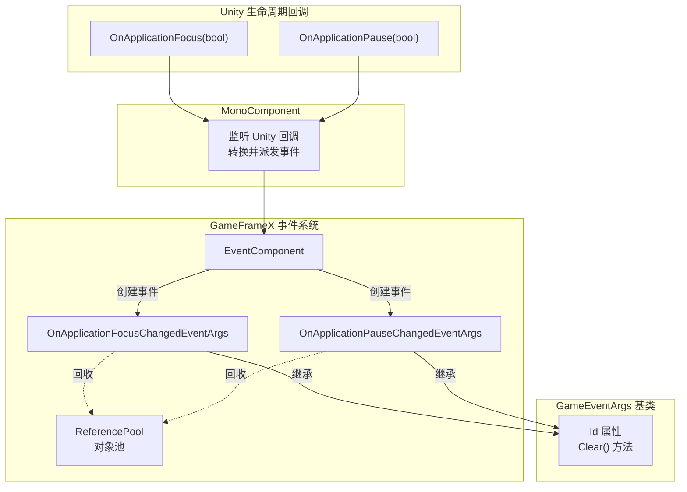
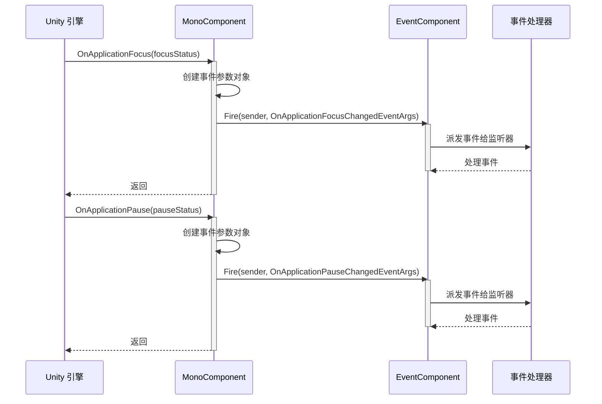

# 事件类型

本文档介绍 GameFrameX Mono 插件中定义的事件类型，用于处理 Unity 应用程序生命周期中的焦点和暂停状态变化。

## 概述

GameFrameX Mono 插件提供了两个核心事件类型，用于监听 Unity 应用程序的生命周期变化。这些事件基于 GameFrameX 事件系统构建，支持对象池回收机制，可以高效地处理应用程序前后台切换和暂停恢复场景。

**事件类型列表:**

| 事件类型 | 用途 | 事件ID |
|---------|------|--------|
| OnApplicationFocusChangedEventArgs | 应用程序前后台切换事件 | 类的完整名称 |
| OnApplicationPauseChangedEventArgs | 应用程序暂停/恢复事件 | 类的完整名称 |

## 架构



**架构说明:**

1. **MonoComponent**: 挂载在场景中的 Unity 组件，监听 Unity 生命周期回调 (`OnApplicationFocus` 和 `OnApplicationPause`)
2. **事件转换**: 将 Unity 的布尔参数转换为强类型的事件参数对象
3. **EventComponent**: GameFrameX 核心的事件组件，负责事件的派发和监听管理
4. **事件参数**: 继承自 `GameEventArgs` 基类，提供统一的接口和对象池支持

## 事件类型详解

### OnApplicationFocusChangedEventArgs

应用程序前后台切换事件，当应用程序获得或失去焦点时触发。

```csharp
public sealed class OnApplicationFocusChangedEventArgs : GameEventArgs
{
    /// <summary>
    /// 应用程序前后台切换事件编号。
    /// </summary>
    public static readonly string EventId = typeof(OnApplicationFocusChangedEventArgs).FullName;

    /// <summary>
    /// 是否是前台。
    /// </summary>
    public bool IsFocus { get; private set; }

    /// <summary>
    /// 创建应用程序前后台切换事件。
    /// </summary>
    public static OnApplicationFocusChangedEventArgs Create(bool isFocus)
    {
        var args = ReferencePool.Acquire<OnApplicationFocusChangedEventArgs>();
        args.IsFocus = isFocus;
        return args;
    }

    /// <summary>
    /// 清理前后台切换事件。
    /// </summary>
    public override void Clear()
    {
        IsFocus = false;
    }
}
```

> Source: [OnApplicationFocusChangedEventArgs.cs](https://github.com/GameFrameX/com.gameframex.unity.mono/blob/main/Runtime/EventArgs/OnApplicationFocusChangedEventArgs.cs#L40-L87)

**属性说明:**

| 属性 | 类型 | 说明 |
|-----|------|------|
| Id | string (override) | 返回事件唯一标识符 |
| IsFocus | bool | true 表示获得焦点（进入前台），false 表示失去焦点（进入后台） |

**使用场景:**
- 玩家切换到其他应用时暂停游戏音乐
- 切换到后台时保存游戏进度
- 检测用户是否正在与游戏交互

### OnApplicationPauseChangedEventArgs

应用程序暂停状态变化事件，当应用程序被暂停或恢复时触发。

```csharp
public sealed class OnApplicationPauseChangedEventArgs : GameEventArgs
{
    /// <summary>
    /// 应用程序是否是暂停状态变化事件编号。
    /// </summary>
    public static readonly string EventId = typeof(OnApplicationPauseChangedEventArgs).FullName;

    /// <summary>
    /// 是否暂停。
    /// </summary>
    public bool IsPause { get; private set; }

    /// <summary>
    /// 创建应用程序是否是暂停状态变化事件。
    /// </summary>
    public static OnApplicationPauseChangedEventArgs Create(bool isPause)
    {
        var args = ReferencePool.Acquire<OnApplicationPauseChangedEventArgs>();
        args.IsPause = isPause;
        return args;
    }

    /// <summary>
    /// 清理应用程序是否是暂停状态变化事件。
    /// </summary>
    public override void Clear()
    {
        IsPause = false;
    }
}
```

> Source: [OnApplicationPauseChangedEventArgs.cs](https://github.com/GameFrameX/com.gameframex.unity.mono/blob/main/Runtime/EventArgs/OnApplicationPauseChangedEventArgs.cs#L40-L88)

**属性说明:**

| 属性 | 类型 | 说明 |
|-----|------|------|
| Id | string (override) | 返回事件唯一标识符 |
| IsPause | bool | true 表示应用程序暂停，false 表示应用程序恢复运行 |

**使用场景:**
- 暂停游戏逻辑
- 显示暂停界面
- 处理 iOS/Android 系统的来电中断

## 事件流程



**流程说明:**

1. Unity 引擎检测到应用程序焦点或暂停状态变化
2. 调用 `MonoComponent` 的 `OnApplicationFocus` 或 `OnApplicationPause` 回调
3. 创建对应的事件参数对象（使用 `Create` 静态方法）
4. 通过 `EventComponent.Fire()` 派发事件
5. 所有订阅该事件类型的处理器被依次调用
6. 事件处理完成后，对象被回收到 `ReferencePool` 供后续使用

## 使用示例

### 订阅应用程序焦点变化事件

```csharp
using GameFrameX.Event.Runtime;
using GameFrameX.Mono.Runtime;

// 在需要监听事件的类中
public class GameManager : MonoBehaviour
{
    private void Start()
    {
        // 订阅应用程序焦点变化事件
        EventComponent.Instance.Subscribe<OnApplicationFocusChangedEventArgs>(OnAppFocusChanged);
    }

    private void OnDestroy()
    {
        // 取消订阅事件（重要：防止内存泄漏）
        EventComponent.Instance.Unsubscribe<OnApplicationFocusChangedEventArgs>(OnAppFocusChanged);
    }

    private void OnAppFocusChanged(object sender, OnApplicationFocusChangedEventArgs e)
    {
        if (e.IsFocus)
        {
            Debug.Log("应用程序进入前台");
            // 恢复游戏
        }
        else
        {
            Debug.Log("应用程序进入后台");
            // 保存游戏进度
        }
    }
}
```

> Source: [MonoComponent.cs](https://github.com/GameFrameX/com.gameframex.unity.mono/blob/main/Runtime/Mono/MonoComponent.cs#L100-L107)

### 订阅应用程序暂停事件

```csharp
using GameFrameX.Event.Runtime;
using GameFrameX.Mono.Runtime;

public class PauseManager : MonoBehaviour
{
    private void Start()
    {
        EventComponent.Instance.Subscribe<OnApplicationPauseChangedEventArgs>(OnAppPauseChanged);
    }

    private void OnDestroy()
    {
        EventComponent.Instance.Unsubscribe<OnApplicationPauseChangedEventArgs>(OnAppPauseChanged);
    }

    private void OnAppPauseChanged(object sender, OnApplicationPauseChangedEventArgs e)
    {
        if (e.IsPause)
        {
            Debug.Log("游戏已暂停");
            Time.timeScale = 0f; // 暂停游戏时间
        }
        else
        {
            Debug.Log("游戏已恢复");
            Time.timeScale = 1f; // 恢复游戏时间
        }
    }
}
```

> Source: [MonoComponent.cs](https://github.com/GameFrameX/com.gameframex.unity.mono/blob/main/Runtime/Mono/MonoComponent.cs#L113-L120)

## 注意事项

1. **必须取消订阅**: 在 `OnDestroy` 或组件销毁时调用 `Unsubscribe` 取消事件订阅，避免内存泄漏
2. **对象池机制**: 事件参数使用 ReferencePool 管理，创建事件时应使用 `Create` 方法而非直接实例化
3. **清理状态**: 使用完事件后，系统会自动调用 `Clear()` 方法重置状态并将对象回收到池中
4. **线程安全**: 事件派发在主线程进行，无需担心线程安全问题

## 相关链接

- [MonoManager](./4-core-components.1-monomanager) - Mono 管理器文档
- [MonoComponent](./4-core-components.2-monocomponent) - Mono 组件文档
- [事件参数](./5-events.2-event-args) - 事件参数详细说明
- [基础使用](./3-getting-started.1-basic-usage) - 插件基础使用指南
