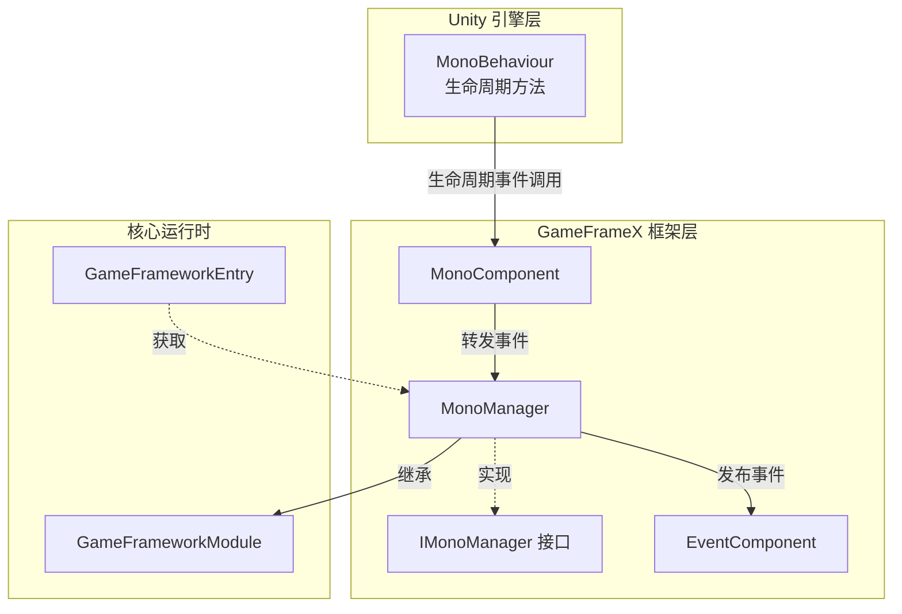
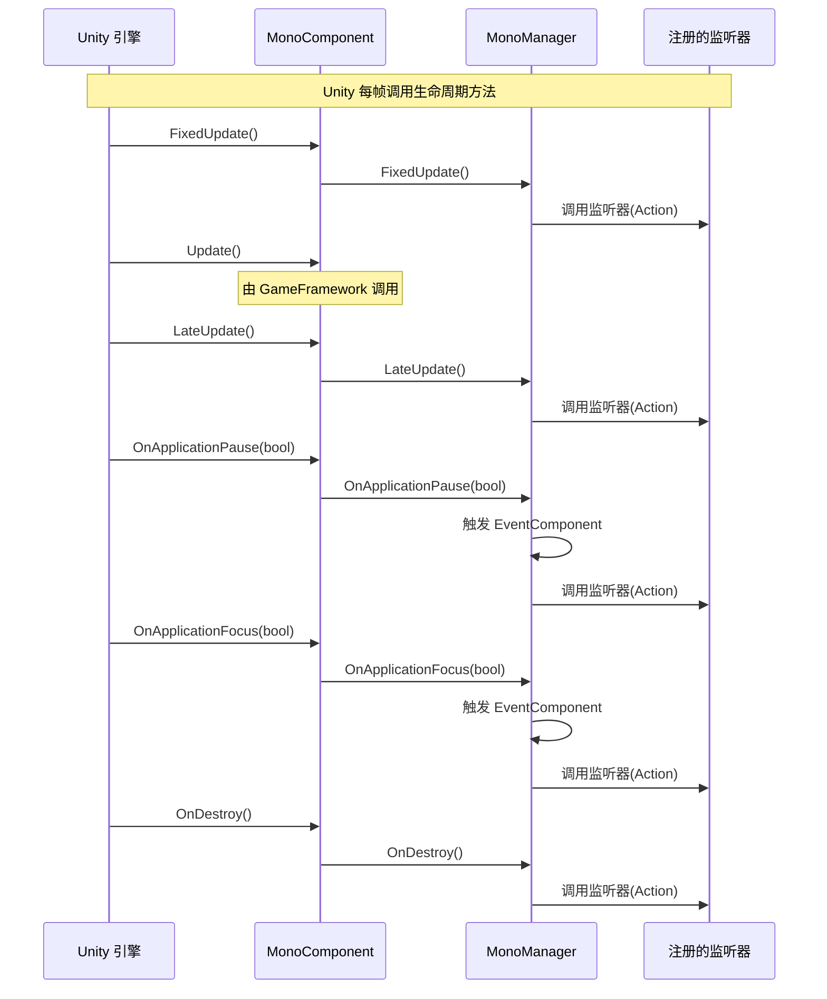
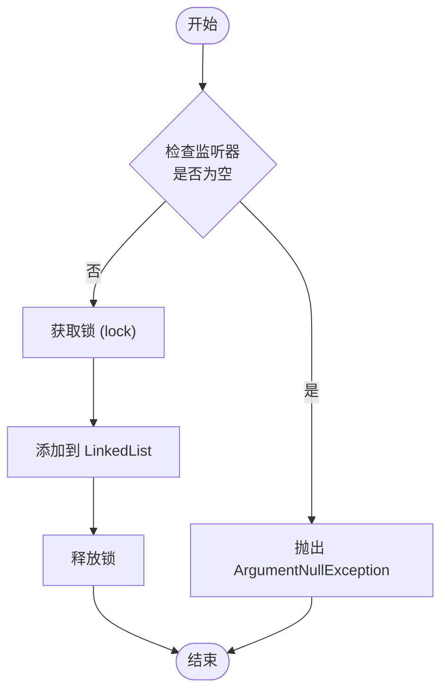

# MonoManager

MonoManager 是 GameFrameX 框架中的核心模块，负责统一管理 Unity MonoBehaviour 的生命周期事件，包括 Update、FixedUpdate、LateUpdate、OnDestroy、OnApplicationPause 和 OnApplicationFocus 等。

## 概述

MonoManager 提供了一种集中管理 Unity 生命周期事件的机制。在传统的 Unity 开发中，开发者通常需要在每个 MonoBehaviour 脚本中分别实现这些生命周期方法，这导致代码分散且难以维护。MonoManager 通过观察者模式（监听器模式），允许开发者在任意位置注册和注销对特定生命周期事件的监听，从而实现代码的解耦。

该模块继承自 `GameFrameworkModule`，是 GameFrameX 框架的核心组件之一。它通过 `MonoComponent` 与 Unity 引擎的 MonoBehaviour 生命周期进行桥接，将 Unity 的生命周期事件统一收集并分发给已注册的监听器。

### 核心功能

- **统一的事件管理**：集中管理所有 MonoBehaviour 生命周期事件
- **线程安全**：使用锁机制确保多线程环境下的安全访问
- **性能优化**：使用 Unity Profiler 进行性能分析
- **事件转发**：支持通过 EventComponent 将应用焦点和暂停事件作为框架事件发布

## 架构



### 组件说明

| 组件 | 角色 | 描述 |
|------|------|------|
| MonoBehaviour | Unity 入口 | Unity 引擎的生命周期回调入口 |
| MonoComponent | 桥接器 | 将 Unity 生命周期事件转发给 MonoManager |
| MonoManager | 核心管理器 | 管理和分发所有生命周期事件监听器 |
| IMonoManager | 接口定义 | 定义 MonoManager 的公开接口 |
| EventComponent | 事件系统 | 将部分事件转换为框架事件发布 |

## 工作流程

### 事件循环流程



### 监听器注册流程



## 使用示例

### 基本使用

通过 `MonoComponent` 添加 Update 监听器：

```csharp
using UnityEngine;
using GameFrameX.Mono.Runtime;

public class ExampleScript : MonoBehaviour
{
    private MonoComponent _monoComponent;

    private void Awake()
    {
        // 获取 MonoComponent 组件（需在场景中已添加）
        _monoComponent = GetComponent<MonoComponent>();
    }

    private void OnEnable()
    {
        // 添加 Update 监听器
        _monoComponent.AddUpdateListener(OnUpdate);
    }

    private void OnDisable()
    {
        // 移除 Update 监听器
        _monoComponent.RemoveUpdateListener(OnUpdate);
    }

    private void OnUpdate(float elapseSeconds, float realElapseSeconds)
    {
        // 在每帧 Update 时执行
        Debug.Log($"Update: {elapseSeconds:F2}s");
    }
}
```
> Source: [MonoComponent.cs](https://github.com/GameFrameX/com.gameframex.unity.mono/blob/main/Runtime/Mono/MonoComponent.cs#L186-L195)

### 使用 FixedUpdate

FixedUpdate 适用于物理相关的更新，每隔固定时间调用：

```csharp
private MonoComponent _monoComponent;

private void OnEnable()
{
    // 添加 FixedUpdate 监听器
    _monoComponent.AddFixedUpdateListener(OnFixedUpdate);
}

private void OnDisable()
{
    // 移除 FixedUpdate 监听器
    _monoComponent.RemoveFixedUpdateListener(OnFixedUpdate);
}

private void OnFixedUpdate(float elapseSeconds, float realElapseSeconds)
{
    // 物理更新逻辑
}
```
> Source: [MonoComponent.cs](https://github.com/GameFrameX/com.gameframex.unity.mono/blob/main/Runtime/Mono/MonoComponent.cs#L156-L164)

### 监听应用暂停事件

```csharp
private MonoComponent _monoComponent;

private void OnEnable()
{
    // 监听应用暂停事件
    _monoComponent.AddOnApplicationPauseListener(OnApplicationPause);
}

private void OnDisable()
{
    // 移除应用暂停监听器
    _monoComponent.RemoveOnApplicationPauseListener(OnApplicationPause);
}

private void OnApplicationPause(bool pauseStatus)
{
    if (pauseStatus)
    {
        Debug.Log("游戏已暂停");
    }
    else
    {
        Debug.Log("游戏已恢复");
    }
}
```
> Source: [MonoComponent.cs](https://github.com/GameFrameX/com.gameframex.unity.mono/blob/main/Runtime/Mono/MonoComponent.cs#L246-L254)

### 监听应用焦点事件

```csharp
private MonoComponent _monoComponent;

private void OnEnable()
{
    // 监听应用焦点变化事件
    _monoComponent.AddOnApplicationFocusListener(OnApplicationFocus);
}

private void OnDisable()
{
    // 移除应用焦点监听器
    _monoComponent.RemoveOnApplicationFocusListener(OnApplicationFocus);
}

private void OnApplicationFocus(bool focusStatus)
{
    Debug.Log(focusStatus ? "应用获得焦点" : "应用失去焦点");
}
```
> Source: [MonoComponent.cs](https://github.com/GameFrameX/com.gameframex.unity.mono/blob/main/Runtime/Mono/MonoComponent.cs#L276-L284)

### 监听销毁事件

```csharp
private MonoComponent _monoComponent;

private void OnEnable()
{
    // 监听对象销毁事件
    _monoComponent.AddDestroyListener(OnDestroyCallback);
}

private void OnDisable()
{
    // 移除销毁监听器
    _monoComponent.RemoveDestroyListener(OnDestroyCallback);
}

private void OnDestroyCallback()
{
    // 对象销毁时的清理逻辑
    Debug.Log("对象即将销毁，执行清理...");
}
```
> Source: [MonoComponent.cs](https://github.com/GameFrameX/com.gameframex.unity.mono/blob/main/Runtime/Mono/MonoComponent.cs#L216-L224)

## API 参考

### IMonoManager 接口

`IMonoManager` 接口定义了 MonoManager 的所有公开方法。

#### Update 监听器

```csharp
void AddUpdateListener(Action<float, float> action)
```
添加一个在 Update 期间调用的监听器。

**参数：**
- `action` (Action<float, float>)：监听器函数。第一个参数是流逝时间，第二个参数是真实流逝时间。

```csharp
void RemoveUpdateListener(Action<float, float> action)
```
从 Update 中移除一个监听器。

**参数：**
- `action` (Action<float, float>)：监听器函数。

#### FixedUpdate 监听器

```csharp
void AddFixedUpdateListener(Action<float, float> action)
```
添加一个在 FixedUpdate 期间调用的监听器。

**参数：**
- `action` (Action<float, float>)：监听器函数。第一个参数是流逝时间，第二个参数是固定流逝时间。

```csharp
void RemoveFixedUpdateListener(Action<float, float> action)
```
从 FixedUpdate 中移除一个监听器。

**参数：**
- `action` (Action<float, float>)：监听器函数。

#### LateUpdate 监听器

```csharp
void AddLateUpdateListener(Action<float, float> action)
```
添加一个在 LateUpdate 期间调用的监听器。

**参数：**
- `action` (Action<float, float>)：监听器函数。第一个参数是流逝时间，第二个参数是固定流逝时间。

```csharp
void RemoveLateUpdateListener(Action<float, float> action)
```
从 LateUpdate 中移除一个监听器。

**参数：**
- `action` (Action<float, float>)：监听器函数。

#### Destroy 监听器

```csharp
void AddDestroyListener(Action action)
```
添加一个在 OnDestroy 期间调用的监听器。

**参数：**
- `action` (Action)：监听器函数。

```csharp
void RemoveDestroyListener(Action action)
```
从 Destroy 中移除一个监听器。

**参数：**
- `action` (Action)：监听器函数。

#### ApplicationPause 监听器

```csharp
void AddOnApplicationPauseListener(Action<bool> action)
```
添加一个在 OnApplicationPause 期间调用的监听器。

**参数：**
- `action` (Action<bool>)：监听器函数。参数为暂停状态。

```csharp
void RemoveOnApplicationPauseListener(Action<bool> action)
```
从 OnApplicationPause 中移除一个监听器。

**参数：**
- `action` (Action<bool>)：监听器函数。

#### ApplicationFocus 监听器

```csharp
void AddOnApplicationFocusListener(Action<bool> action)
```
添加一个在 OnApplicationFocus 期间调用的监听器。

**参数：**
- `action` (Action<bool>)：监听器函数。参数为焦点状态。

```csharp
void RemoveOnApplicationFocusListener(Action<bool> action)
```
从 OnApplicationFocus 中移除一个监听器。

**参数：**
- `action` (Action<bool>)：监听器函数。

### MonoManager 内部方法

以下方法由 MonoComponent 调用，不建议直接使用：

```csharp
void FixedUpdate()
```
在固定的帧率下调用。

```csharp
void LateUpdate()
```
在所有 Update 函数调用后每帧调用。

```csharp
void OnDestroy()
```
当 MonoBehaviour 将被销毁时调用。

```csharp
void OnApplicationFocus(bool focusStatus)
```
当应用程序失去或获得焦点时调用。

**参数：**
- `focusStatus` (bool)：应用程序的焦点状态。true 表示获得焦点，false 表示失去焦点。

```csharp
void OnApplicationPause(bool pauseStatus)
```
当应用程序暂停或恢复时调用。

**参数：**
- `pauseStatus` (bool)：应用程序的暂停状态。true 表示暂停，false 表示恢复。

## 设计意图

### 为什么使用监听器模式而非继承

传统的 Unity 开发中，开发者通常需要让脚本继承 MonoBehaviour 并重写其生命周期方法。这种方式存在以下问题：
1. **代码耦合**：业务逻辑与 Unity 生命周期方法紧密耦合
2. **难以测试**：难以对业务逻辑进行单元测试
3. **维护困难**：生命周期逻辑散落在各个脚本中

MonoManager 通过监听器模式解决了这些问题，允许在任意位置注册监听器，实现更好的代码解耦。

### 线程安全的考虑

MonoManager 使用 `lock` 关键字保护所有监听器队列的修改操作，确保在多线程环境下（如使用 Job System 或多线程脚本时）仍然能够安全地添加和移除监听器。

### 性能优化

1. **Unity Profiler 集成**：使用 `Profiler.BeginSample` 和 `Profiler.EndSample` 标记关键性能路径，便于在 Unity Profiler 中分析性能瓶颈。
2. **异常隔离**：每个监听器的调用都包含在 try-catch 块中，确保单个监听器的异常不会影响其他监听器的执行。
3. **LinkedList 优化**：使用 LinkedList 存储监听器，相比 List 具有 O(1) 的添加和移除时间复杂度。

## 相关链接

- [MonoComponent](./4-core-components.2-monocomponent) - MonoComponent 组件文档
- [事件类型](./5-events.1-event-types) - 框架事件类型
- [事件参数](./5-events.2-event-args) - 框架事件参数
- [GitHub 仓库](https://github.com/GameFrameX/com.gameframex.unity.mono.git) - 官方 GitHub 仓库
- [官方文档](https://gameframex.doc.alianblank.com/) - GameFrameX 官方文档
