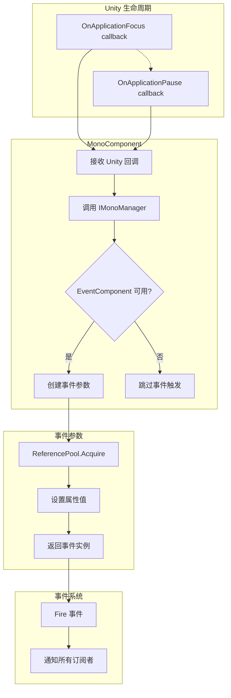

# 事件参数

事件参数（EventArgs）是 GameFrameX Mono 插件中用于在应用程序生命周期事件触发时传递数据的容器类。本文档详细介绍当前插件提供的两种事件参数类型及其使用方式。

## 概述

在 Unity 应用程序运行过程中，某些系统级事件（如应用程序切换到后台、暂停等）需要被其他模块感知并作出响应。事件参数（EventArgs）作为事件系统的核心组成部分，承担着封装事件相关数据的重要职责。

GameFrameX Mono 插件基于 GameFrameX 事件系统构建，提供了两种针对 Unity 应用程序生命周期的事件参数类型：

- **OnApplicationFocusChangedEventArgs**：应用程序前后台切换事件
- **OnApplicationPauseChangedEventArgs**：应用程序暂停/恢复事件

这些事件参数采用对象池模式设计，通过 `ReferencePool` 实现对象的复用，有效减少了垃圾回收（GC）带来的性能开销。

## 架构设计

### 类图结构

```mermaid
classDiagram
    class GameEventArgs {
        <<abstract>>
        +Id: string { get; }
        +Clear(): void
    }
    
    class OnApplicationFocusChangedEventArgs {
        +EventId: string
        +IsFocus: bool
        +Create(isFocus: bool): OnApplicationFocusChangedEventArgs
    }
    
    class OnApplicationPauseChangedEventArgs {
        +EventId: string
        +IsPause: bool
        +Create(isPause: bool): OnApplicationPauseChangedEventArgs
    }
    
    class ReferencePool {
        +Acquire~T~(): T
        +Release(instance): void
    }
    
    GameEventArgs <|-- OnApplicationFocusChangedEventArgs
    GameEventArgs <|-- OnApplicationPauseChangedEventArgs
    OnApplicationFocusChangedEventArgs ..> ReferencePool : uses
    OnApplicationPauseChangedEventArgs ..> ReferencePool : uses
```

### 事件流转流程



## 核心组件详解

### OnApplicationFocusChangedEventArgs

应用程序前后台切换事件参数，当 Unity 应用程序的焦点状态发生变化时触发。

```csharp
public sealed class OnApplicationFocusChangedEventArgs : GameEventArgs
{
    /// <summary>
    /// 应用程序前后台切换事件编号。
    /// </summary>
    public static readonly string EventId = typeof(OnApplicationFocusChangedEventArgs).FullName;

    /// <summary>
    /// 是否是前台。
    /// </summary>
    public bool IsFocus { get; private set; }

    /// <summary>
    /// 创建应用程序前后台切换事件。
    /// </summary>
    public static OnApplicationFocusChangedEventArgs Create(bool isFocus)
    {
        var loadDictionaryUpdateChangedEventArgs = ReferencePool.Acquire<OnApplicationFocusChangedEventArgs>();
        loadDictionaryUpdateChangedEventArgs.IsFocus = isFocus;
        return loadDictionaryUpdateChangedEventArgs;
    }

    /// <summary>
    /// 清理前后台切换事件。
    /// </summary>
    public override void Clear()
    {
        IsFocus = false;
    }
}
```

> Source: [OnApplicationFocusChangedEventArgs.cs](https://github.com/GameFrameX/com.gameframex.unity.mono/blob/main/Runtime/EventArgs/OnApplicationFocusChangedEventArgs.cs#L40-L87)

**属性说明：**

| 属性 | 类型 | 说明 |
|------|------|------|
| EventId | string | 事件的唯一标识符，使用类型的完全限定名 |
| IsFocus | bool | 应用程序是否获得焦点，`true` 表示在前台，`false` 表示在后台 |

### OnApplicationPauseChangedEventArgs

应用程序暂停状态变化事件参数，当 Unity 应用程序的暂停状态发生变化时触发。

```csharp
public sealed class OnApplicationPauseChangedEventArgs : GameEventArgs
{
    /// <summary>
    /// 应用程序是否是暂停状态变化事件编号。
    /// </summary>
    public static readonly string EventId = typeof(OnApplicationPauseChangedEventArgs).FullName;

    /// <summary>
    /// 是否暂停。
    /// </summary>
    public bool IsPause { get; private set; }

    /// <summary>
    /// 创建应用程序是否是暂停状态变化事件。
    /// </summary>
    public static OnApplicationPauseChangedEventArgs Create(bool isPause)
    {
        var loadDictionaryUpdateEventArgs = ReferencePool.Acquire<OnApplicationPauseChangedEventArgs>();
        loadDictionaryUpdateEventArgs.IsPause = isPause;
        return loadDictionaryUpdateEventArgs;
    }

    /// <summary>
    /// 清理应用程序是否是暂停状态变化事件。
    /// </summary>
    public override void Clear()
    {
        IsPause = false;
    }
}
```

> Source: [OnApplicationPauseChangedEventArgs.cs](https://github.com/GameFrameX/com.gameframex.unity.mono/blob/main/Runtime/EventArgs/OnApplicationPauseChangedEventArgs.cs#L40-L88)

**属性说明：**

| 属性 | 类型 | 说明 |
|------|------|------|
| EventId | string | 事件的唯一标识符，使用类型的完全限定名 |
| IsPause | bool | 应用程序是否暂停，`true` 表示暂停，`false` 表示恢复 |

## 事件触发时机

### OnApplicationFocus 事件

当应用程序获得或失去焦点时触发。在 Unity 中，这是由 `MonoBehaviour.OnApplicationFocus(bool)` 回调触发的。

```csharp
/// <summary>
/// 当应用程序失去或获得焦点时调用。
/// </summary>
/// <param name="focusStatus">应用程序的焦点状态。true 表示获得焦点，false 表示失去焦点。</param>
private void OnApplicationFocus(bool focusStatus)
{
    _monoManager.OnApplicationFocus(focusStatus);
    if (m_EventComponent != null)
    {
        m_EventComponent.Fire(this, OnApplicationFocusChangedEventArgs.Create(focusStatus));
    }
}
```

> Source: [MonoComponent.cs](https://github.com/GameFrameX/com.gameframex.unity.mono/blob/main/Runtime/Mono/MonoComponent.cs#L96-L107)

### OnApplicationPause 事件

当应用程序暂停或恢复时触发。在 Unity 中，这是由 `MonoBehaviour.OnApplicationPause(bool)` 回调触发的。

```csharp
/// <summary>
/// 当应用程序暂停或恢复时调用。
/// </summary>
/// <param name="pauseStatus">应用程序的暂停状态。true 表示暂停，false 表示恢复。</param>
private void OnApplicationPause(bool pauseStatus)
{
    _monoManager.OnApplicationPause(pauseStatus);
    if (m_EventComponent != null)
    {
        m_EventComponent.Fire(this, OnApplicationPauseChangedEventArgs.Create(pauseStatus));
    }
}
```

> Source: [MonoComponent.cs](https://github.com/GameFrameX/com.gameframex.unity.mono/blob/main/Runtime/Mono/MonoComponent.cs#L109-L120)

## 使用示例

### 订阅应用程序前后台事件

```csharp
using GameFrameX.Event.Runtime;
using GameFrameX.Mono.Runtime;

public class GameController : MonoBehaviour
{
    private void Start()
    {
        // 订阅应用程序焦点变化事件
        EventComponent.Instance.Subscribe<OnApplicationFocusChangedEventArgs>(OnFocusChanged);
        
        // 订阅应用程序暂停变化事件
        EventComponent.Instance.Subscribe<OnApplicationPauseChangedEventArgs>(OnPauseChanged);
    }

    private void OnDestroy()
    {
        // 取消订阅事件
        EventComponent.Instance.Unsubscribe<OnApplicationFocusChangedEventArgs>(OnFocusChanged);
        EventComponent.Instance.Unsubscribe<OnApplicationPauseChangedEventArgs>(OnPauseChanged);
    }

    private void OnFocusChanged(object sender, OnApplicationFocusChangedEventArgs e)
    {
        if (e.IsFocus)
        {
            Debug.Log("应用程序获得焦点 - 进入前台");
        }
        else
        {
            Debug.Log("应用程序失去焦点 - 进入后台");
        }
    }

    private void OnPauseChanged(object sender, OnApplicationPauseChangedEventArgs e)
    {
        if (e.IsPause)
        {
            Debug.Log("应用程序暂停");
        }
        else
        {
            Debug.Log("应用程序恢复");
        }
    }
}
```

> Source: [MonoComponent.cs](https://github.com/GameFrameX/com.gameframex.unity.mono/blob/main/Runtime/Mono/MonoComponent.cs#L64-L120)

### 处理移动端生命周期事件

在移动设备上，应用程序经常会在不同状态之间切换，以下示例展示如何处理这些场景：

```csharp
public class MobileLifecycleHandler : MonoBehaviour
{
    private bool _isBackground;

    private void OnEnable()
    {
        EventComponent.Instance.Subscribe<OnApplicationFocusChangedEventArgs>(HandleFocusChange);
        EventComponent.Instance.Subscribe<OnApplicationPauseChangedEventArgs>(HandlePauseChange);
    }

    private void OnDisable()
    {
        EventComponent.Instance.Unsubscribe<OnApplicationFocusChangedEventArgs>(HandleFocusChange);
        EventComponent.Instance.Unsubscribe<OnApplicationPauseChangedEventArgs>(HandlePauseChange);
    }

    private void HandleFocusChange(object sender, OnApplicationFocusChangedEventArgs e)
    {
        _isBackground = !e.IsFocus;
        
        if (_isBackground)
        {
            // 保存游戏进度
            SaveGame();
        }
        else
        {
            // 恢复游戏
            ResumeGame();
        }
    }

    private void HandlePauseChange(object sender, OnApplicationPauseChangedEventArgs e)
    {
        if (e.IsPause)
        {
            // 暂停时暂停音乐
            AudioManager.Instance.PauseMusic();
        }
        else
        {
            // 恢复时继续音乐
            AudioManager.Instance.ResumeMusic();
        }
    }
}
```

## 设计模式说明

### 对象池模式

事件参数类采用对象池模式设计，具有以下优势：

1. **减少 GC 压力**：通过复用对象，避免频繁创建和销毁事件参数实例
2. **提高性能**：对象池可以预分配对象，减少内存分配的开销

对象池的核心方法：

```csharp
// 从对象池获取实例
ReferencePool.Acquire<OnApplicationFocusChangedEventArgs>();

// 释放实例回对象池（通过 Clear 方法）
public override void Clear()
{
    IsFocus = false;
}
```

### 工厂方法模式

每个事件参数类都提供一个静态的 `Create()` 工厂方法：

- **封装创建逻辑**：将对象获取和属性初始化的逻辑封装在工厂方法中
- **保证一致性**：确保每次创建的事件参数都经过正确初始化
- **简化调用**：使用者只需调用一个方法即可获取完整配置的事件参数

## API 参考

### OnApplicationFocusChangedEventArgs

#### 属性

| 属性名 | 类型 | 访问级别 | 说明 |
|--------|------|----------|------|
| EventId | string | public static readonly | 事件唯一标识符 |
| Id | string | public override | 重写的基类属性，返回 EventId |
| IsFocus | bool | public get; private set | 应用程序是否在前台 |

#### 方法

| 方法名 | 返回类型 | 说明 |
|--------|----------|------|
| Create(bool isFocus) | OnApplicationFocusChangedEventArgs | 静态工厂方法，创建事件实例 |
| Clear() | void | 重置事件状态，用于对象池回收 |

---

### OnApplicationPauseChangedEventArgs

#### 属性

| 属性名 | 类型 | 访问级别 | 说明 |
|--------|------|----------|------|
| EventId | string | public static readonly | 事件唯一标识符 |
| Id | string | public override | 重写的基类属性，返回 EventId |
| IsPause | bool | public get; private set | 应用程序是否暂停 |

#### 方法

| 方法名 | 返回类型 | 说明 |
|--------|----------|------|
| Create(bool isPause) | OnApplicationPauseChangedEventArgs | 静态工厂方法，创建事件实例 |
| Clear() | void | 重置事件状态，用于对象池回收 |

## 相关链接

- [事件类型](./5-events.1-event-types) - 了解 GameFrameX 事件系统的完整类型体系
- [MonoComponent](./4-core-components.2-monocomponent) - 了解如何触发这些事件的组件
- [MonoManager](./4-core-components.1-monomanager) - 了解 Mono 管理器的核心功能
