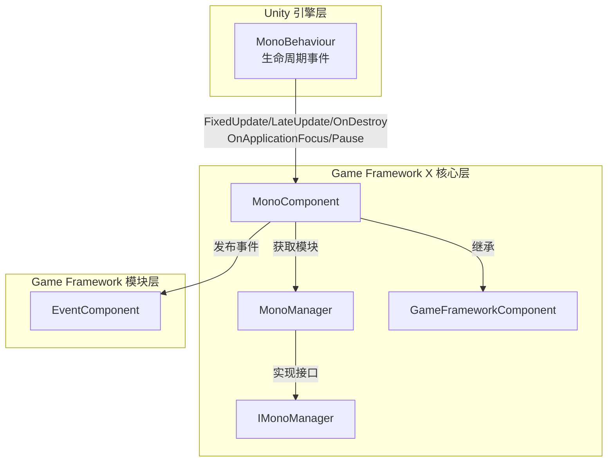

# MonoComponent

MonoComponent 是 Game Framework X 中的核心组件之一，负责管理 Unity MonoBehaviour 的生命周期事件，并提供统一的接口让外部添加和移除各种更新循环事件的监听器。

## 概述

MonoComponent 继承自 `GameFrameworkComponent`，是一个 Unity `MonoBehaviour` 组件。它作为 Game Framework 与 Unity 生命周期事件系统之间的桥梁，主要功能包括：

1. **生命周期事件代理**：将 Unity 的 `Update`、`FixedUpdate`、`LateUpdate`、`OnDestroy` 等生命周期方法委托给内部的 `MonoManager` 处理
2. **事件监听器管理**：提供添加和移除各类事件监听器的公共接口
3. **应用级事件转发**：集成 EventComponent，在应用焦点变化或暂停状态变化时发布相应的事件

### 核心特性

- **线程安全**：使用 `lock` 机制确保多线程环境下监听器列表的安全性
- **异常处理**：监听器执行过程中使用 try-catch 捕获异常，避免单个监听器错误影响整体系统
- **性能优化**：集成 Unity Profiler，支持性能分析
- **事件发布**：自动发布应用级事件（`OnApplicationFocusChangedEventArgs`、`OnApplicationPauseChangedEventArgs`）

## 架构

MonoComponent 在 Game Framework X 中的架构位置如下：



### 组件交互流程

```mermaid
sequenceDiagram
    participant Unity as Unity 引擎
    participant MC as MonoComponent
    participant MM as MonoManager
    participant EC as EventComponent
    participant Listener as 业务监听器

    Unity->>MC: Awake()
    MC->>MC: 初始化组件类型和接口
    MC->>MM: GetModule&lt;IMonoManager&gt;()
    MC->>EC: GameEntry.GetComponent&lt;EventComponent&gt;()

    Unity->>MC: Update(deltaTime, realDeltaTime)
    MC->>MM: Update()
    MM->>MM: QueueInvoking(_updateQueue)
    MM->>Listener: 回调 Update 监听器

    Unity->>MC: OnApplicationFocus(focusStatus)
    MC->>MM: OnApplicationFocus(focusStatus)
    MC->>EC: Fire(this, OnApplicationFocusChangedEventArgs)
    EC->>Listener: 通知关注该事件的组件

    Unity->>MC: OnApplicationPause(pauseStatus)
    MC->>MM: OnApplicationPause(pauseStatus)
    MC->>EC: Fire(this, OnApplicationPauseChangedEventArgs)
```

## 核心功能

### 1. Update 监听器管理

MonoComponent 允许你添加和移除 `Update` 事件的监听器。`Update` 在每帧调用，是最常用的更新循环。

```csharp
// 添加 Update 监听器
MonoComponent.Instance.AddUpdateListener(OnGameUpdate);

// 移除 Update 监听器
MonoComponent.Instance.RemoveUpdateListener(OnGameUpdate);

// 监听器回调函数签名
private void OnGameUpdate(float elapseSeconds, float realElapseSeconds)
{
    // elapseSeconds: 距离上一帧的流逝时间
    // realElapseSeconds: 真实的流逝时间（不受时间缩放影响）
}
```

> Source: [MonoComponent.cs](https://github.com/GameFrameX/com.gameframex.unity.mono/blob/main/Runtime/Mono/MonoComponent.cs#L186-L210)

### 2. FixedUpdate 监听器管理

`FixedUpdate` 以固定时间间隔调用，适合物理相关的逻辑。

```csharp
// 添加 FixedUpdate 监听器
MonoComponent.Instance.AddFixedUpdateListener(OnFixedUpdate);

// 移除 FixedUpdate 监听器
MonoComponent.Instance.RemoveFixedUpdateListener(OnFixedUpdate);

// 监听器回调函数签名
private void OnFixedUpdate(float elapseSeconds, float fixedElapseSeconds)
{
    // elapseSeconds: 距离上一帧的流逝时间
    // fixedElapseSeconds: 固定的时间间隔
}
```

> Source: [MonoComponent.cs](https://github.com/GameFrameX/com.gameframex.unity.mono/blob/main/Runtime/Mono/MonoComponent.cs#L156-L180)

### 3. LateUpdate 监听器管理

`LateUpdate` 在所有 `Update` 方法之后调用，适合需要等待其他更新完成后再执行的逻辑。

```csharp
// 添加 LateUpdate 监听器
MonoComponent.Instance.AddLateUpdateListener(OnLateUpdate);

// 移除 LateUpdate 监听器
MonoComponent.Instance.RemoveLateUpdateListener(OnLateUpdate);

// 监听器回调函数签名
private void OnLateUpdate(float elapseSeconds, float fixedElapseSeconds)
{
    // elapseSeconds: 距离上一帧的流逝时间
    // fixedElapseSeconds: 固定的时间间隔
}
```

> Source: [MonoComponent.cs](https://github.com/GameFrameX/com.gameframex.unity.mono/blob/main/Runtime/Mono/MonoComponent.cs#L126-L150)

### 4. OnDestroy 监听器管理

`OnDestroy` 在组件被销毁时调用，适合做清理工作。

```csharp
// 添加 OnDestroy 监听器
MonoComponent.Instance.AddDestroyListener(OnGameDestroy);

// 移除 OnDestroy 监听器
MonoComponent.Instance.RemoveDestroyListener(OnGameDestroy);

// 监听器回调函数签名
private void OnGameDestroy()
{
    // 清理资源、取消订阅事件等
}
```

> Source: [MonoComponent.cs](https://github.com/GameFrameX/com.gameframex.unity.mono/blob/main/Runtime/Mono/MonoComponent.cs#L216-L240)

### 5. 应用焦点变化监听

监听应用获得或失去焦点的事件。

```csharp
// 添加应用焦点变化监听器
MonoComponent.Instance.AddOnApplicationFocusListener(OnAppFocusChanged);

// 移除应用焦点变化监听器
MonoComponent.Instance.RemoveOnApplicationFocusListener(OnAppFocusChanged);

// 监听器回调函数签名
private void OnAppFocusChanged(bool hasFocus)
{
    // hasFocus: true 表示获得焦点，false 表示失去焦点
    Debug.Log($"应用焦点状态: {(hasFocus ? "获得焦点" : "失去焦点")}");
}
```

> Source: [MonoComponent.cs](https://github.com/GameFrameX/com.gameframex.unity.mono/blob/main/Runtime/Mono/MonoComponent.cs#L276-L300)

### 6. 应用暂停状态监听

监听应用暂停或恢复运行的事件。

```csharp
// 添加应用暂停状态监听器
MonoComponent.Instance.AddOnApplicationPauseListener(OnAppPauseChanged);

// 移除应用暂停状态监听器
MonoComponent.Instance.RemoveOnApplicationPauseListener(OnAppPauseChanged);

// 监听器回调函数签名
private void OnAppPauseChanged(bool isPaused)
{
    // isPaused: true 表示暂停，false 表示恢复
    Debug.Log($"应用暂停状态: {(isPaused ? "已暂停" : "已恢复")}");
}
```

> Source: [MonoComponent.cs](https://github.com/GameFrameX/com.gameframex.unity.mono/blob/main/Runtime/Mono/MonoComponent.cs#L246-L270)

## 使用示例

### 基础用法

以下示例展示了如何注册一个简单的 Update 监听器：

```csharp
using GameFrameX.Mono.Runtime;
using UnityEngine;

public class GameLoopExample : MonoBehaviour
{
    private void Start()
    {
        // 添加 Update 监听器
        MonoComponent.Instance.AddUpdateListener(OnUpdate);
    }

    private void OnUpdate(float elapseSeconds, float realElapseSeconds)
    {
        // 在这里执行每帧需要更新的逻辑
        // 例如：移动角色、处理输入等
    }

    private void OnDestroy()
    {
        // 移除监听器，避免内存泄漏
        MonoComponent.Instance.RemoveUpdateListener(OnUpdate);
    }
}
```

> Source: [MonoComponent.cs](https://github.com/GameFrameX/com.gameframex.unity.mono/blob/main/Runtime/Mono/MonoComponent.cs#L182-L211)

### 高级用法：使用事件系统

除了直接添加监听器，还可以通过事件系统订阅应用级事件：

```csharp
using GameFrameX.Event.Runtime;
using GameFrameX.Mono.Runtime;
using UnityEngine;

public class AppStateExample : MonoBehaviour
{
    private void Start()
    {
        // 订阅应用暂停事件
        var eventComponent = GameEntry.GetComponent<EventComponent>();
        eventComponent.Subscribe(OnApplicationPauseChangedEventArgs.EventId, OnAppPauseHandler);
        
        // 订阅应用焦点事件
        eventComponent.Subscribe(OnApplicationFocusChangedEventArgs.EventId, OnAppFocusHandler);
    }

    private void OnAppPauseHandler(object sender, GameEventArgs e)
    {
        var args = e as OnApplicationPauseChangedEventArgs;
        Debug.Log($"应用暂停状态变化: {(args.IsPause ? "暂停" : "恢复")}");
    }

    private void OnAppFocusHandler(object sender, GameEventArgs e)
    {
        var args = e as OnApplicationFocusChangedEventArgs;
        Debug.Log($"应用焦点变化: {(args.IsFocus ? "获得焦点" : "失去焦点")}");
    }

    private void OnDestroy()
    {
        // 取消订阅事件
        var eventComponent = GameEntry.GetComponent<EventComponent>();
        eventComponent.Unsubscribe(OnApplicationPauseChangedEventArgs.EventId, OnAppPauseHandler);
        eventComponent.Unsubscribe(OnApplicationFocusChangedEventArgs.EventId, OnAppFocusHandler);
    }
}
```

> Source: [MonoComponent.cs](https://github.com/GameFrameX/com.gameframex.unity.mono/blob/main/Runtime/Mono/MonoComponent.cs#L99-L120)

### 典型应用场景

| 场景 | 推荐使用的事件 | 说明 |
|------|---------------|------|
| 游戏逻辑更新 | `Update` | 每帧执行的常规游戏逻辑 |
| 物理计算 | `FixedUpdate` | 物理引擎相关逻辑，需要固定时间步长 |
| 相机跟随 | `LateUpdate` | 在所有移动逻辑完成后执行相机跟随 |
| 资源清理 | `OnDestroy` | 组件销毁时的清理工作 |
| 后台运行处理 | `OnApplicationPause` | 切换到后台时暂停/恢复游戏 |
| 切屏处理 | `OnApplicationFocus` | 处理应用失去/获得焦点 |

## API 参考

### MonoComponent 公共方法

#### `AddUpdateListener(Action<float, float> fun)`

添加 Update 监听器。

**参数：**
- `fun` (Action&lt;float, float&gt;): Update 回调函数，第一个参数是流逝时间，第二个参数是真实流逝时间。

**示例：**
```csharp
MonoComponent.Instance.AddUpdateListener((elapsed, realElapsed) => {
    // 处理更新逻辑
});
```

> Source: [MonoComponent.cs#L186-L195](https://github.com/GameFrameX/com.gameframex.unity.mono/blob/main/Runtime/Mono/MonoComponent.cs#L186-L195)

---

#### `RemoveUpdateListener(Action<float, float> fun)`

移除 Update 监听器。

**参数：**
- `fun` (Action&lt;float, float&gt;): 要移除的 Update 回调函数。

> Source: [MonoComponent.cs#L201-L210](https://github.com/GameFrameX/com.gameframex.unity.mono/blob/main/Runtime/Mono/MonoComponent.cs#L201-L210)

---

#### `AddFixedUpdateListener(Action<float, float> fun)`

添加 FixedUpdate 监听器。

**参数：**
- `fun` (Action&lt;float, float&gt;): FixedUpdate 回调函数，第一个参数是流逝时间，第二个参数是固定流逝时间。

> Source: [MonoComponent.cs#L156-L165](https://github.com/GameFrameX/com.gameframex.unity.mono/blob/main/Runtime/Mono/MonoComponent.cs#L156-L165)

---

#### `RemoveFixedUpdateListener(Action<float, float> fun)`

移除 FixedUpdate 监听器。

**参数：**
- `fun` (Action&lt;float, float&gt;): 要移除的 FixedUpdate 回调函数。

> Source: [MonoComponent.cs#L171-L180](https://github.com/GameFrameX/com.gameframex.unity.mono/blob/main/Runtime/Mono/MonoComponent.cs#L171-L180)

---

#### `AddLateUpdateListener(Action<float, float> fun)`

添加 LateUpdate 监听器。

**参数：**
- `fun` (Action&lt;float, float&gt;): LateUpdate 回调函数，第一个参数是流逝时间，第二个参数是固定流逝时间。

> Source: [MonoComponent.cs#L126-L135](https://github.com/GameFrameX/com.gameframex.unity.mono/blob/main/Runtime/Mono/MonoComponent.cs#L126-L135)

---

#### `RemoveLateUpdateListener(Action<float, float> fun)`

移除 LateUpdate 监听器。

**参数：**
- `fun` (Action&lt;float, float&gt;): 要移除的 LateUpdate 回调函数。

> Source: [MonoComponent.cs#L141-L150](https://github.com/GameFrameX/com.gameframex.unity.mono/blob/main/Runtime/Mono/MonoComponent.cs#L141-L150)

---

#### `AddDestroyListener(Action fun)`

添加 OnDestroy 监听器。

**参数：**
- `fun` (Action): OnDestroy 回调函数，无参数。

> Source: [MonoComponent.cs#L216-L225](https://github.com/GameFrameX/com.gameframex.unity.mono/blob/main/Runtime/Mono/MonoComponent.cs#L216-L225)

---

#### `RemoveDestroyListener(Action fun)`

移除 OnDestroy 监听器。

**参数：**
- `fun` (Action): 要移除的 OnDestroy 回调函数。

> Source: [MonoComponent.cs#L231-L240](https://github.com/GameFrameX/com.gameframex.unity.mono/blob/main/Runtime/Mono/MonoComponent.cs#L231-L240)

---

#### `AddOnApplicationPauseListener(Action<bool> fun)`

添加应用暂停状态变化监听器。

**参数：**
- `fun` (Action&lt;bool&gt;): 暂停状态变化回调函数，参数为暂停状态。

> Source: [MonoComponent.cs#L246-L255](https://github.com/GameFrameX/com.gameframex.unity.mono/blob/main/Runtime/Mono/MonoComponent.cs#L246-L255)

---

#### `RemoveOnApplicationPauseListener(Action<bool> fun)`

移除应用暂停状态变化监听器。

**参数：**
- `fun` (Action&lt;bool&gt;): 要移除的回调函数。

> Source: [MonoComponent.cs#L261-L270](https://github.com/GameFrameX/com.gameframex.unity.mono/blob/main/Runtime/Mono/MonoComponent.cs#L261-L270)

---

#### `AddOnApplicationFocusListener(Action<bool> fun)`

添加应用焦点变化监听器。

**参数：**
- `fun` (Action&lt;bool&gt;): 焦点状态变化回调函数，参数为焦点状态。

> Source: [MonoComponent.cs#L276-L285](https://github.com/GameFrameX/com.gameframex.unity.mono/blob/main/Runtime/Mono/MonoComponent.cs#L276-L285)

---

#### `RemoveOnApplicationFocusListener(Action<bool> fun)`

移除应用焦点变化监听器。

**参数：**
- `fun` (Action&lt;bool&gt;): 要移除的回调函数。

> Source: [MonoComponent.cs#L291-L300](https://github.com/GameFrameX/com.gameframex.unity.mono/blob/main/Runtime/Mono/MonoComponent.cs#L291-L300)

---

### MonoManager 核心方法

MonoManager 是实际执行监听器的核心类，以下是主要方法：

#### `QueueInvoking`

私有方法，用于遍历执行监听器队列中的所有回调。

```csharp
private static void QueueInvoking(LinkedList<Action<float, float>> list, float elapseSeconds, float realElapseSeconds)
{
    lock (Lock)
    {
        foreach (var action in list)
        {
            try
            {
                action.Invoke(elapseSeconds, realElapseSeconds);
            }
            catch (Exception e)
            {
                Log.Error(e);
            }
        }
    }
}
```

**设计意图：**
- 使用 `lock` 确保线程安全
- 包裹在 try-catch 中，确保单个监听器异常不影响其他监听器
- 支持 Unity Profiler 性能分析

> Source: [MonoManager.cs#L364-L380](https://github.com/GameFrameX/com.gameframex.unity.mono/blob/main/Runtime/Mono/MonoManager.cs#L364-L380)

## 相关链接

- [MonoManager](./4-core-components.1-monomanager) - Mono 管理器模块
- [事件类型](./5-events.1-event-types) - Game Framework 事件系统
- [事件参数](./5-events.2-event-args) - 事件参数详解
- [快速开始](./3-getting-started.1-basic-usage) - 基础使用指南
