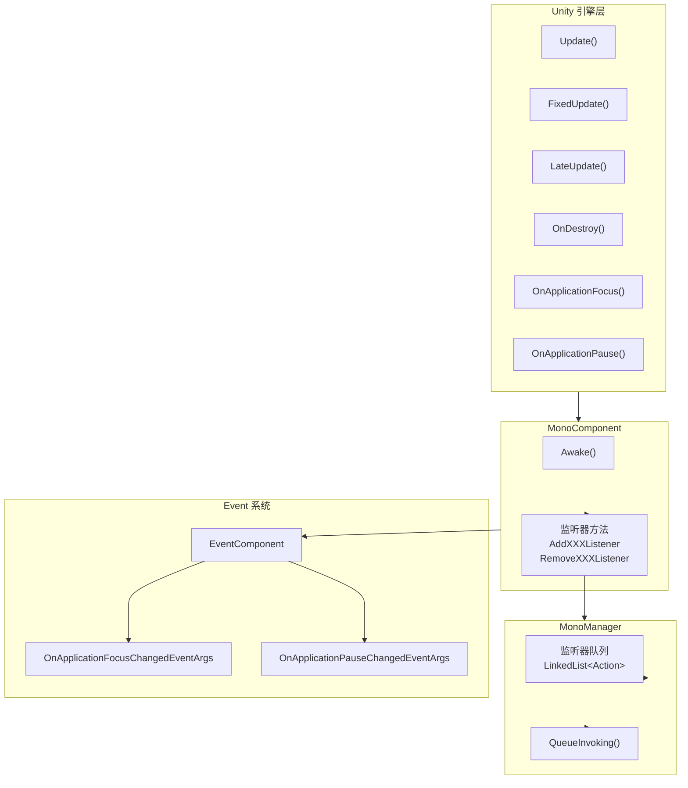

# 常见问题解答

本文档汇总了使用 GameFrameX Unity Mono 生命周期组件时常见的疑问解答。

## 概述

Mono 生命周期组件是 GameFrameX 框架的核心模块之一，用于统一管理 Unity MonoBehaviour 的各种生命周期事件，包括 Update、FixedUpdate、LateUpdate、OnDestroy、OnApplicationFocus 和 OnApplicationPause。本文档旨在帮助开发者快速解决使用过程中遇到的常见问题。

## 依赖问题

### Q1: 编译报错找不到 GameFrameX.Runtime 命名空间

**问题描述：**
在项目中添加 Mono 组件后，编译出现类似以下错误：
```
The type or namespace name 'Runtime' does not exist in the namespace 'GameFrameX'
```

**原因分析：**
Mono 组件依赖于 GameFrameX 核心运行时库。该库是整个 GameFrameX 框架的基础，必须首先安装。

**解决方案：**
需要安装 `com.alianblank.gameframex.unity.runtime` 包。安装方式是在项目的 `manifest.json` 中添加依赖：

```json
{
  "dependencies": {
    "com.alianblank.gameframex.unity.runtime": "https://github.com/GameFrameX/com.alianblank.gameframex.unity.runtime.git"
  }
}
```

> Source: [README.md](https://github.com/GameFrameX/com.gameframex.unity.mono/blob/main/README.md#L42)

---

### Q2: 编译报错找不到 Event 组件

**问题描述：**
编译时出现以下错误：
```
The type or namespace name 'Event' does not exist in the namespace 'GameFrameX'
```

**原因分析：**
MonoComponent 在 `OnApplicationFocus` 和 `OnApplicationPause` 事件触发时，会通过 EventComponent 发布游戏事件。因此需要安装 Event 组件。

**解决方案：**
安装 Event 组件包：

```json
{
  "dependencies": {
    "com.alianblank.gameframex.unity.event": "https://github.com/GameFrameX/com.alianblank.gameframex.unity.event.git"
  }
}
```

> Source: [README.md](https://github.com/GameFrameX/com.gameframex.unity.mono/blob/main/README.md#L42)

---

## 使用问题

### Q3: 如何注册 Update 监听器？

**问题描述：**
开发者想要在游戏每帧执行特定逻辑，但不想创建额外的 MonoBehaviour 脚本。

**解决方案：**
使用 MonoComponent 提供的监听器方法。首先需要在场景中确保有 MonoComponent 组件（通常由 GameFramework 自动创建），然后通过该组件注册监听器：

```csharp
// 获取 MonoComponent 实例（通过 Unity 组件或 GameEntry）
var monoComponent = GameEntry.GetComponent<MonoComponent>();

// 注册 Update 监听器
monoComponent.AddUpdateListener(OnGameUpdate);

// 定义回调方法
private void OnGameUpdate(float elapseSeconds, float realElapseSeconds)
{
    // elapseSeconds: 流逝时间
    // realElapseSeconds: 真实流逝时间
    Debug.Log($"Update called, elapsed: {elapseSeconds}");
}

// 重要：不再使用时需要移除监听器
monoComponent.RemoveUpdateListener(OnGameUpdate);
```

> Source: [MonoComponent.cs](https://github.com/GameFrameX/com.gameframex.unity.mono/blob/main/Runtime/Mono/MonoComponent.cs#L186-L210)

---

### Q4: Update、FixedUpdate、LateUpdate 有什么区别？

**问题描述：**
这三个方法都有对应的监听器，开发者不清楚应该选择哪一个。

**技术说明：**
- **Update**：每帧调用一次，调用间隔不固定，受帧率影响。适合大多数游戏逻辑。
- **FixedUpdate**：固定时间间隔调用（默认 0.02 秒，即 50 次/秒）。适合物理相关的逻辑。
- **LateUpdate**：在所有 Update 调用完成后调用。适合跟随摄像机等需要在其他更新后执行的逻辑。

**使用建议：**
- 普通游戏逻辑 → 使用 Update
- 物理计算相关 → 使用 FixedUpdate
- 相机跟随、UI 更新等 → 使用 LateUpdate

```csharp
// Update 示例 - 每帧执行
monoComponent.AddUpdateListener((elapsed, realElapsed) => {
    // 游戏主逻辑
});

// FixedUpdate 示例 - 固定间隔执行
monoComponent.AddFixedUpdateListener((elapsed, fixedElapsed) => {
    // 物理逻辑
});

// LateUpdate 示例 - 最后执行
monoComponent.AddLateUpdateListener((elapsed, fixedElapsed) => {
    // 相机跟随等
});
```

> Source: [MonoManager.cs](https://github.com/GameFrameX/com.gameframex.unity.mono/blob/main/Runtime/Mono/MonoManager.cs#L63-L76)

---

### Q5: 监听器传入 null 会发生什么？

**问题描述：**
开发者在注册监听器时不小心传入了 null，想知道会发生什么。

**代码行为：**
查看源代码可以发现，系统会对 null 参数进行检测并抛出异常：

```csharp
public void AddUpdateListener(Action<float, float> fun)
{
    if (fun == null)
    {
        Log.Fatal(nameof(fun) + "is invalid.");
        return;
    }
    _monoManager.AddUpdateListener(fun);
}
```

MonoComponent 中传入 null 会记录致命日志并直接返回，不会抛出异常。而 MonoManager 中传入 null 会抛出 `ArgumentNullException`。

> Source: [MonoComponent.cs](https://github.com/GameFrameX/com.gameframex.unity.mono/blob/main/Runtime/Mono/MonoComponent.cs#L188-L195)
> Source: [MonoManager.cs](https://github.com/GameFrameX/com.gameframex.unity.mono/blob/main/Runtime/Mono/MonoManager.cs#L176-L187)

---

### Q6: 如何监听应用程序暂停/恢复事件？

**问题描述：**
开发者需要在玩家切换到后台或恢复游戏时执行特定操作。

**解决方案：**
使用 `OnApplicationPause` 监听器：

```csharp
// 注册暂停监听器
monoComponent.AddOnApplicationPauseListener(OnApplicationPauseChanged);

// 回调方法
private void OnApplicationPauseChanged(bool isPaused)
{
    if (isPaused)
    {
        Debug.Log("游戏已暂停");
        // 保存游戏数据
    }
    else
    {
        Debug.Log("游戏已恢复");
        // 恢复游戏状态
    }
}
```

同样地，可以使用 `OnApplicationFocusListener` 监听焦点变化：

```csharp
monoComponent.AddOnApplicationFocusListener(OnApplicationFocusChanged);

private void OnApplicationFocusChanged(bool hasFocus)
{
    Debug.Log($"应用程序焦点: {hasFocus}");
}
```

> Source: [MonoComponent.cs](https://github.com/GameFrameX/com.gameframex.unity.mono/blob/main/Runtime/Mono/MonoComponent.cs#L246-L270)

---

### Q7: 为什么推荐使用 MonoComponent 而不是直接使用 MonoManager？

**问题描述：**
开发者可以直接通过 `GameFrameworkEntry.GetModule<IMonoManager>()` 获取 MonoManager，为什么还要使用 MonoComponent？

**设计说明：**
MonoComponent 继承自 Unity 的 MonoBehaviour，具有以下优势：

1. **自动生命周期绑定**：MonoComponent 自动绑定到 Unity 的生命周期方法（Update、OnDestroy 等），无需手动调用。
2. **与 GameFramework 无缝集成**：MonoComponent 是 GameFramework 的组件体系的一部分，可以方便地通过 GameEntry 访问。
3. **编辑器友好**：MonoComponent 带有 `[DisallowMultipleComponent]` 和 `[AddComponentMenu("GameFrameX/Mono")]` 属性，在 Unity 编辑器中易于查找和管理。

```csharp
// 通过 GameEntry 获取 MonoComponent
var monoComponent = GameEntry.GetComponent<MonoComponent>();

// 或者直接在场景中的 GameObject 上获取
var monoComponent = someGameObject.GetComponent<MonoComponent>();
```

> Source: [MonoComponent.cs](https://github.com/GameFrameX/com.gameframex.unity.mono/blob/main/Runtime/Mono/MonoComponent.cs#L42-L70)

---

## 生命周期管理问题

### Q8: 不移除监听器会有什么后果？

**问题描述：**
开发者在场景切换或对象销毁时忘记移除监听器，想知道会产生什么问题。

**可能后果：**
1. **内存泄漏**：监听器引用的对象无法被垃圾回收。
2. **空引用异常**：监听器回调尝试访问已销毁的对象。
3. **逻辑错误**：过期的监听器可能执行不正确的游戏逻辑。

**最佳实践：**
始终在适当的时机移除监听器，例如：

```csharp
public class MyController : MonoBehaviour
{
    private MonoComponent _monoComponent;

    private void OnEnable()
    {
        _monoComponent = GameEntry.GetComponent<MonoComponent>();
        _monoComponent.AddUpdateListener(OnUpdate);
        _monoComponent.AddDestroyListener(OnDestroy);
    }

    private void OnDisable()
    {
        if (_monoComponent != null)
        {
            _monoComponent.RemoveUpdateListener(OnUpdate);
            _monoComponent.RemoveDestroyListener(OnDestroy);
        }
    }

    private void OnUpdate(float elapse, float realElapse) { }
    private void OnDestroy() { }
}
```

---

### Q9: MonoManager 是线程安全的吗？

**问题描述：**
开发者在多线程环境下使用监听器，想知道是否存在线程安全问题。

**技术说明：**
是的，MonoManager 是线程安全的。所有监听器的添加和移除操作都使用了 `lock` 锁来保护：

```csharp
public void AddUpdateListener(Action<float, float> action)
{
    if (action == null)
    {
        throw new ArgumentNullException(nameof(action));
    }

    lock (Lock)
    {
        _updateQueue.AddLast(action);
    }
}
```

但请注意，监听器回调本身的执行是在 Unity 主线程中调用的，因此不需要担心回调中的线程安全问题。

> Source: [MonoManager.cs](https://github.com/GameFrameX/com.gameframex.unity.mono/blob/main/Runtime/Mono/MonoManager.cs#L364-L380)

---

## 事件系统问题

### Q10: 如何通过事件系统监听应用程序状态变化？

**问题描述：**
除了使用监听器回调，开发者还想通过事件系统（EventSystem）来响应应用程序状态变化。

**解决方案：**
MonoComponent 在触发 OnApplicationFocus 和 OnApplicationPause 时会同时发布游戏事件。可以通过订阅这些事件来响应：

```csharp
// 订阅事件
EventComponent eventComponent = GameEntry.GetComponent<EventComponent>();
eventComponent.Subscribe<OnApplicationFocusChangedEventArgs>(OnFocusChanged);
eventComponent.Subscribe<OnApplicationPauseChangedEventArgs>(OnPauseChanged);

// 事件处理方法
private void OnFocusChanged(object sender, OnApplicationFocusChangedEventArgs e)
{
    Debug.Log($"焦点变化: {e.IsFocus}");
}

private void OnPauseChanged(object sender, OnApplicationPauseChangedEventArgs e)
{
    Debug.Log($"暂停状态: {e.IsPause}");
}

// 取消订阅
eventComponent.Unsubscribe<OnApplicationFocusChangedEventArgs>(OnFocusChanged);
eventComponent.Unsubscribe<OnApplicationPauseChangedEventArgs>(OnPauseChanged);
```

> Source: [OnApplicationFocusChangedEventArgs.cs](https://github.com/GameFrameX/com.gameframex.unity.mono/blob/main/Runtime/EventArgs/OnApplicationFocusChangedEventArgs.cs#L40-L87)

---

## 安装问题

### Q11: 如何安装 Mono 组件？

**问题描述：**
初次使用该插件，不清楚如何正确安装。

**解决方案：**
有三种安装方式可供选择：

**方式一：通过 manifest.json 安装（推荐）**
在项目的 `Packages/manifest.json` 文件中添加依赖：

```json
{
  "dependencies": {
    "com.gameframex.unity.mono": "https://github.com/GameFrameX/com.gameframex.unity.mono.git"
  }
}
```

**方式二：通过 Unity Package Manager**
1. 打开 Unity 编辑器
2. 进入 Window → Package Manager
3. 点击 + 按钮，选择 "Add package from git URL"
4. 输入：`https://github.com/GameFrameX/com.gameframex.unity.mono.git`

**方式三：直接下载放置**
直接从 GitHub 下载仓库，将内容复制到 Unity 项目的 `Packages` 目录下，系统会自动识别加载。

> Source: [README.md](https://github.com/GameFrameX/com.gameframex.unity.mono/blob/main/README.md#L44-L51)

---

## 架构图

以下图表展示了 Mono 组件的内部架构和事件流：



**图解说明：**
1. Unity 引擎的生命周期方法自动调用到 MonoComponent
2. MonoComponent 暴露公共监听器方法供外部调用
3. MonoManager 内部使用线程安全的 LinkedList 存储监听器
4. OnApplicationFocus 和 OnApplicationPause 事件还会发布到 Event 系统

---

## 相关链接

- [插件介绍](../1-overview.1-introduction)
- [安装指南](../2-installation.1-installation-methods)
- [基础使用](../3-getting-started.1-basic-usage)
- [MonoManager 详解](../4-core-components.1-monomanager)
- [MonoComponent 详解](../4-core-components.2-monocomponent)
- [事件类型](../5-events.1-event-types)
- [事件参数](../5-events.2-event-args)
