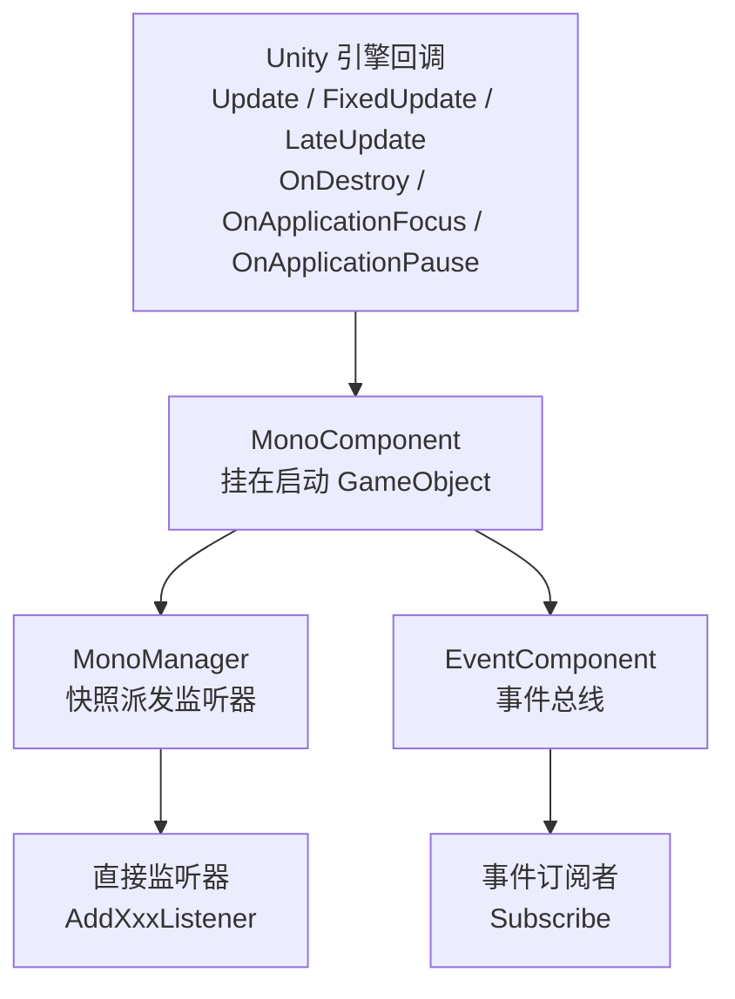

# Mono 组件包简介

`com.gameframex.unity.mono` 是 GameFrameX 框架下的 Mono 生命周期组件包,用于将 Unity `MonoBehaviour` 的 `Update`、`FixedUpdate`、`LateUpdate`、`OnDestroy`、`OnApplicationFocus`、`OnApplicationPause` 等回调统一注册到全局监听器列表中,业务侧无需继承 `MonoBehaviour` 就能订阅这些事件。包内通过 `MonoComponent`(挂在 GameFramework 启动 GameObject 上)和 `MonoManager`(实际派发器)两级协作,并把焦点 / 暂停事件转发到 `EventComponent` 的事件总线。

## 快速开始

### 1. 安装包

编辑 Unity 工程的 `Packages/manifest.json`,在 `dependencies` 中加入:

```json
"com.gameframex.unity.mono": "1.1.1"
```

如果尚未配置 GameFrameX 的 UPM 注册表,需要同时声明 `scopedRegistries`(`scopes: ["com.gameframex"]`)并指向 `https://gameframex.upm.alianblank.uk`,完整示例见 `README.zh-CN.md`。

依赖项只有 `com.gameframex.unity.event` 1.1.0。

### 2. 挂载 MonoComponent

把 `MonoComponent` 挂到 GameFramework 启动 GameObject 上(与 `EventComponent`、`BaseComponent` 等同级)。该组件在 `Awake` 时通过反射查找 `MonoManager` 实现类,并在 `Start` 时取得 `EventComponent` 用于转发焦点/暂停事件。

```csharp
// MonoComponent 类声明与组件菜单路径
[DisallowMultipleComponent]
[AddComponentMenu("GameFrameX/Mono")]
public sealed class MonoComponent : GameFrameworkComponent
```

Source: [MonoComponent.cs#L42-L44](https://github.com/GameFrameX/com.gameframex.unity.mono/blob/main/Runtime/Mono/MonoComponent.cs#L42-L44)

### 3. 注册生命周期监听

在任意脚本里先取到组件,再注册回调:

```csharp
var monoComponent = GameEntry.GetComponent<MonoComponent>();

private void OnUpdate(float elapseSeconds, float realElapseSeconds) { /* 每帧 */ }
private void OnFixedUpdate(float elapseSeconds, float realElapseSeconds) { /* 物理步 */ }
private void OnLateUpdate(float elapseSeconds, float realElapseSeconds) { /* 帧尾 */ }
private void OnDestroyCallback() { /* 组件销毁 */ }
private void OnApplicationFocus(bool isFocus) { /* 焦点变化 */ }
private void OnApplicationPause(bool isPause) { /* 暂停变化 */ }

monoComponent.AddUpdateListener(OnUpdate);
monoComponent.AddFixedUpdateListener(OnFixedUpdate);
monoComponent.AddLateUpdateListener(OnLateUpdate);
monoComponent.AddDestroyListener(OnDestroyCallback);
monoComponent.AddOnApplicationFocusListener(OnApplicationFocus);
monoComponent.AddOnApplicationPauseListener(OnApplicationPause);
```

`Update / FixedUpdate / LateUpdate` 回调的 `elapseSeconds` 是缩放后的增量时间,`realElapseSeconds` 是未缩放的真实增量时间,定义在 `IMonoManager` 接口上。

Source: [IMonoManager.cs](https://github.com/GameFrameX/com.gameframex.unity.mono/blob/main/Runtime/Mono/IMonoManager.cs)

### 4. 焦点 / 暂停事件总线订阅(可选)

`MonoComponent` 在收到 Unity 焦点/暂停回调时,除了调用直接监听器,还会向 `EventComponent` 投递事件,业务可走事件总线订阅:

```csharp
var eventComponent = GameEntry.GetComponent<EventComponent>();
eventComponent.Subscribe(OnApplicationFocusChangedEventArgs.EventId, OnFocusChanged);
eventComponent.Subscribe(OnApplicationPauseChangedEventArgs.EventId, OnPauseChanged);

private void OnFocusChanged(object sender, GameEventArgs e)
{
    var args = (OnApplicationFocusChangedEventArgs)e;
    if (args.IsFocus) { /* 获得焦点 */ }
}
private void OnPauseChanged(object sender, GameEventArgs e)
{
    var args = (OnApplicationPauseChangedEventArgs)e;
    if (args.IsPause) { /* 进入暂停 */ }
}
```

事件由 `MonoComponent.OnApplicationFocus / OnApplicationPause` 通过 `EventComponent.Fire` 发出。

Source: [MonoComponent.cs#L111-L141](https://github.com/GameFrameX/com.gameframex.unity.mono/blob/main/Runtime/Mono/MonoComponent.cs#L111-L141)

## 工作原理速览

整个包只有两条主链路:`Unity 回调 → MonoComponent → MonoManager → 业务监听器`,以及 `Unity 回调 → MonoComponent → EventComponent → 事件订阅者`。



## 接下来

- 监听器注册、移除的细节和线程安全说明,见 [README.zh-CN.md](https://github.com/GameFrameX/com.gameframex.unity.mono/blob/main/README.zh-CN.md)
- 接口签名与默认实现,见 [IMonoManager.cs](https://github.com/GameFrameX/com.gameframex.unity.mono/blob/main/Runtime/Mono/IMonoManager.cs) 与 [MonoManager.cs](https://github.com/GameFrameX/com.gameframex.unity.mono/blob/main/Runtime/Mono/MonoManager.cs)
- 事件参数定义,见 [OnApplicationFocusChangedEventArgs.cs](https://github.com/GameFrameX/com.gameframex.unity.mono/blob/main/Runtime/EventArgs/OnApplicationFocusChangedEventArgs.cs) 与 [OnApplicationPauseChangedEventArgs.cs](https://github.com/GameFrameX/com.gameframex.unity.mono/blob/main/Runtime/EventArgs/OnApplicationPauseChangedEventArgs.cs)
- Inspector 自定义,见 [MonoComponentInspector.cs](https://github.com/GameFrameX/com.gameframex.unity.mono/blob/main/Editor/Inspector/MonoComponentInspector.cs)
- 单元测试参考,见 [UnitTests.cs](https://github.com/GameFrameX/com.gameframex.unity.mono/blob/main/Tests/UnitTests.cs)
