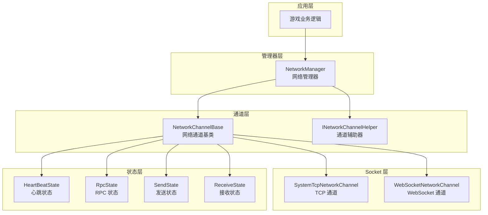
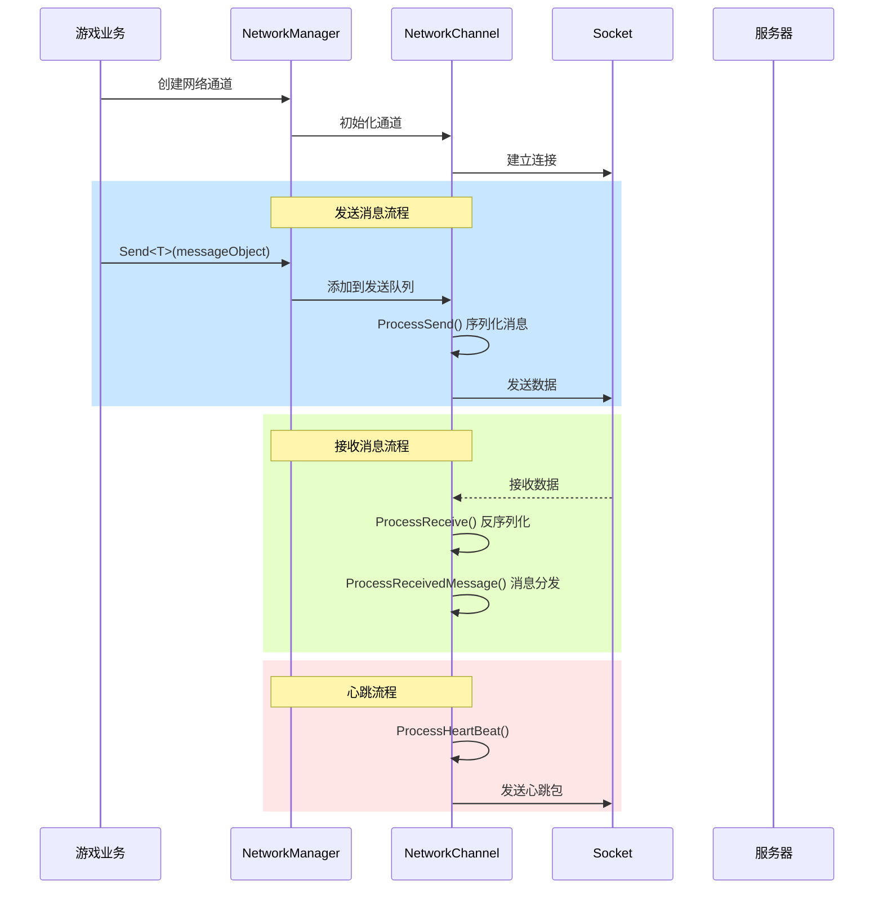
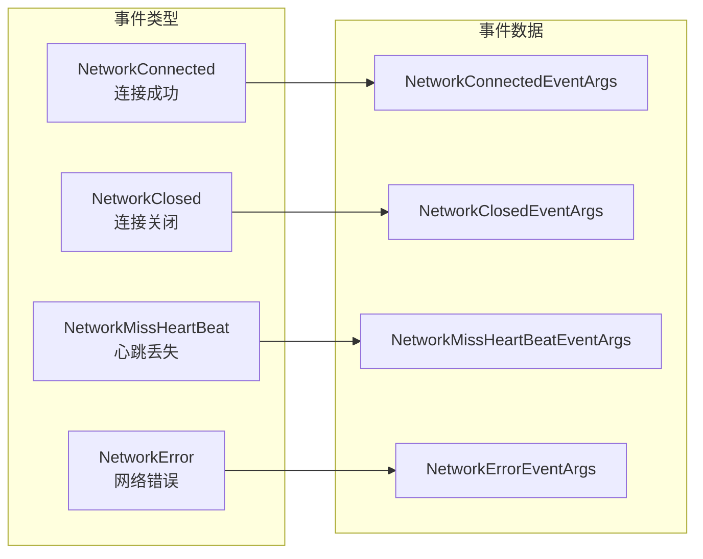

# 网络管理器

NetworkManager 是 GameFrameX 网络模块的核心组件，负责统一管理游戏中的所有网络连接通道。它提供了网络频道创建与销毁、连接状态管理、心跳检测、RPC 远程调用等核心功能。

## 概述

网络管理器作为 GameFrameX 框架的网络层核心，扮演着连接游戏客户端与服务器的关键角色。其设计理念是提供一个统一、简洁且强大的网络抽象层，让开发者可以专注于业务逻辑而不必关心底层网络通信细节。

### 核心职责

NetworkManager 的主要职责包括：

1. **多通道管理**：支持同时维护多个独立的网络通道，每个通道可以连接到不同的服务器
2. **连接生命周期**：管理网络连接的建立、保持和关闭过程
3. **心跳检测**：通过定时发送心跳包检测连接健康状态，自动处理断开连接
4. **RPC 调度**：封装远程过程调用的请求/响应机制，支持异步等待服务器返回
5. **事件通知**：通过事件系统向业务层通知网络状态变化

### 设计理念

NetworkManager 采用了以下设计原则：

- **模块化设计**：将网络通道、心跳、RPC 等功能分离为独立状态类，便于维护和扩展
- **事件驱动**：使用事件机制解耦网络状态变化与业务处理
- **统一接口**：通过 INetworkChannel 接口抽象不同的网络实现（TCP/WebSocket）
- **自动管理**：在游戏主循环中自动更新所有网络通道，减少手动轮询负担

## 架构

NetworkManager 采用分层架构设计，从上到下分为以下几个层次：



### 组件说明

| 组件 | 说明 |
|------|------|
| NetworkManager | 网络管理器主类，负责管理所有网络通道的生命周期 |
| NetworkChannelBase | 网络通道抽象基类，封装 Socket 操作和消息处理逻辑 |
| INetworkChannelHelper | 通道辅助器接口，负责消息的序列化和反序列化 |
| HeartBeatState | 心跳状态类，管理心跳计时和丢失计数 |
| RpcState | RPC 状态类，管理等待响应的 RPC 请求和超时处理 |
| SendState | 发送状态类，管理待发送消息队列 |
| ReceiveState | 接收状态类，管理接收缓冲区和数据包解析 |

### 消息处理流程



## 核心功能

### 网络通道管理

NetworkManager 使用字典结构存储所有网络通道，支持通过通道名称进行快速检索：

```csharp
// 创建网络通道
INetworkChannel channel = networkManager.CreateNetworkChannel("MainServer", channelHelper, 30000);

// 检查通道是否存在
if (networkManager.HasNetworkChannel("MainServer"))
{
    // 获取通道
    INetworkChannel channel = networkManager.GetNetworkChannel("MainServer");
}

// 获取所有通道
INetworkChannel[] channels = networkManager.GetAllNetworkChannels();

// 销毁通道
networkManager.DestroyNetworkChannel("MainServer");
```

> Source: [NetworkManager.cs](https://github.com/GameFrameX/com.gameframex.unity.network/blob/main/Runtime/Network/Network/NetworkManager.cs#L203-L247)

### 连接管理

网络通道支持连接到远程服务器，并提供完善的连接状态管理：

```csharp
// 连接到服务器
channel.Connect(new Uri("tcp://127.0.0.1:8888"), userData);

// 关闭连接
channel.Close("主动关闭");
```

> Source: [NetworkManager.NetworkChannelBase.cs](https://github.com/GameFrameX/com.gameframex.unity.network/blob/main/Runtime/Network/Network/NetworkManager.NetworkChannelBase.cs#L638-L756)

### RPC 远程调用

NetworkManager 提供了基于 Task 的异步 RPC 调用机制，支持等待服务器响应：

```csharp
// 发送 RPC 请求并等待响应
var request = new C2S_LoginRequest { Username = "test", Password = "123" };
var response = await channel.Call<C2S_LoginResponse>(request);

// 设置 RPC 回调
channel.SetRPCStartHandler((sender, msg) => { 
    Debug.Log($"RPC 开始: {msg.GetType().Name}");
});

channel.SetRPCEndHandler((sender, msg) => { 
    Debug.Log($"RPC 结束: {msg.GetType().Name}");
});

channel.SetRPCErrorHandler((sender, msg) => { 
    Debug.Log($"RPC 错误: {msg.GetType().Name}");
});
```

> Source: [NetworkManager.RpcState.cs](https://github.com/GameFrameX/com.gameframex.unity.network/blob/main/Runtime/Network/Network/NetworkManager.RpcState.cs#L125-L144)

### 心跳检测

网络通道内置心跳检测机制，当丢失心跳达到阈值时自动断开连接：

```csharp
// 设置心跳间隔（秒）
channel.HeartBeatInterval = 30f;

// 设置收到消息时重置心跳计时
channel.ResetHeartBeatElapseSecondsWhenReceivePacket = true;

// 设置失去焦点时是否发送心跳
networkManager.SetFocusHeartbeat(true);
```

> Source: [NetworkManager.NetworkChannelBase.cs](https://github.com/GameFrameX/com.gameframex.unity.network/blob/main/Runtime/Network/Network/NetworkManager.NetworkChannelBase.cs#L293-L311)

## 事件系统

NetworkManager 提供了完整的事件系统，用于通知网络状态变化：



### 事件类型说明

| 事件 | 说明 | 事件参数 |
|------|------|----------|
| NetworkConnected | 成功连接到服务器时触发 | NetworkConnectedEventArgs |
| NetworkClosed | 连接关闭时触发 | NetworkClosedEventArgs |
| NetworkMissHeartBeat | 心跳丢失时触发 | NetworkMissHeartBeatEventArgs |
| NetworkError | 发生网络错误时触发 | NetworkErrorEventArgs |

### 事件订阅示例

```csharp
// 订阅连接成功事件
networkManager.NetworkConnected += OnNetworkConnected;

// 订阅连接关闭事件
networkManager.NetworkClosed += OnNetworkClosed;

// 订阅心跳丢失事件
networkManager.NetworkMissHeartBeat += OnNetworkMissHeartBeat;

// 订阅网络错误事件
networkManager.NetworkError += OnNetworkError;

private void OnNetworkConnected(object sender, NetworkConnectedEventArgs e)
{
    Debug.Log($"连接成功: {e.NetworkChannel.Name}");
}

private void OnNetworkClosed(object sender, NetworkClosedEventArgs e)
{
    Debug.Log($"连接关闭: {e.NetworkChannel.Name}, 原因: {e.Reason}, 错误码: {e.ErrorCode}");
}

private void OnNetworkMissHeartBeat(object sender, NetworkMissHeartBeatEventArgs e)
{
    Debug.Log($"心跳丢失次数: {e.MissHeartBeatCount}");
}

private void OnNetworkError(object sender, NetworkErrorEventArgs e)
{
    Debug.Log($"网络错误: {e.ErrorCode}, 消息: {e.ErrorMessage}");
}
```

> Source: [NetworkConnectedEventArgs.cs](https://github.com/GameFrameX/com.gameframex.unity.network/blob/main/Runtime/EventArgs/NetworkConnectedEventArgs.cs)

## 数据包处理器

NetworkManager 通过可插拔的处理器机制处理数据包的发送和接收：

```csharp
// 注册发送头处理器
channel.RegisterHandler(new DefaultPacketSendHeaderHandler());

// 注册发送体处理器
channel.RegisterHandler(new DefaultPacketSendBodyHandler());

// 注册接收头处理器
channel.RegisterHandler(new DefaultPacketReceiveHeaderHandler());

// 注册接收体处理器
channel.RegisterHandler(new DefaultPacketReceiveBodyHandler());

// 注册心跳处理器
channel.RegisterHeartBeatHandler(new DefaultPacketHeartBeatHandler());
```

> Source: [INetworkChannel.cs](https://github.com/GameFrameX/com.gameframex.unity.network/blob/main/Runtime/Network/Interface/INetworkChannel.cs#L100-L174)

### 消息压缩

支持消息压缩以减少网络传输数据量：

```csharp
// 注册消息压缩处理器
channel.RegisterMessageCompressHandler(new DefaultMessageCompressHandler());

// 注册消息解压处理器
channel.RegisterMessageDecompressHandler(new DefaultMessageDecompressHandler());
```

## 配置选项

### NetworkManager 配置

NetworkManager 本身作为 GameFrameworkModule 工作，无需直接配置。所有配置通过创建网络通道时指定。

### NetworkChannel 配置

| 选项 | 类型 | 默认值 | 说明 |
|------|------|--------|------|
| HeartBeatInterval | float | 30.0 | 心跳发送间隔（秒） |
| ResetHeartBeatElapseSecondsWhenReceivePacket | bool | false | 收到消息时是否重置心跳计时 |
| MissHeartBeatCountByClose | int | 10 | 丢失心跳次数阈值，超过则断开连接 |

> Source: [NetworkManager.NetworkChannelBase.cs](https://github.com/GameFrameX/com.gameframex.unity.network/blob/main/Runtime/Network/Network/NetworkManager.NetworkChannelBase.cs#L52-L77)

## API 参考

### `NetworkManager` 类

继承自 `GameFrameworkModule`，是网络模块的主入口。

#### 属性

| 属性 | 类型 | 说明 |
|------|------|------|
| NetworkChannelCount | int | 获取网络通道数量 |

#### 事件

| 事件 | 说明 |
|------|------|
| NetworkConnected | 网络连接成功事件 |
| NetworkClosed | 网络连接关闭事件 |
| NetworkMissHeartBeat | 心跳丢失事件 |
| NetworkError | 网络错误事件 |

#### 方法

### `HasNetworkChannel(channelName: string): bool`

检查是否存在指定名称的网络通道。

**参数：**
- `channelName` (string): 网络频道名称

**返回：** 是否存在网络频道

---

### `GetNetworkChannel(channelName: string): INetworkChannel`

获取指定名称的网络通道。

**参数：**
- `channelName` (string): 网络频道名称

**返回：** 网络通道接口，如果不存在则返回 null

---

### `CreateNetworkChannel(channelName: string, networkChannelHelper: INetworkChannelHelper, rpcTimeout: int): INetworkChannel`

创建新的网络通道。

**参数：**
- `channelName` (string): 网络频道名称
- `networkChannelHelper` (INetworkChannelHelper): 网络频道辅助器
- `rpcTimeout` (int): RPC 超时时间（毫秒），最小值 3000

**返回：** 创建的网络通道

**异常：**
- `GameFrameworkException`: 当通道已存在时抛出

---

### `DestroyNetworkChannel(channelName: string): bool`

销毁指定的网络通道。

**参数：**
- `channelName` (string): 网络频道名称

**返回：** 是否销毁成功

---

### `SetFocusHeartbeat(hasFocus: bool): void`

设置是否在应用程序失去焦点时发送心跳包。

**参数：**
- `hasFocus` (bool): 是否在获得焦点时发送心跳

---

### `INetworkChannel` 接口

网络通道接口，定义网络通道的核心操作。

#### 属性

| 属性 | 类型 | 说明 |
|------|------|------|
| Name | string | 获取通道名称 |
| Socket | INetworkSocket | 获取 Socket 对象 |
| Connected | bool | 获取是否已连接 |
| AddressFamily | AddressFamily | 获取地址类型 |
| SendPacketCount | int | 获取待发送消息数量 |
| SentPacketCount | int | 获取已发送消息数量 |
| ReceivedPacketCount | int | 获取已接收消息数量 |
| HeartBeatInterval | float | 获取或设置心跳间隔 |
| HeartBeatElapseSeconds | float | 获取心跳流逝时间 |
| MissHeartBeatCount | int | 获取丢失心跳次数 |

#### 方法

### `Connect(address: Uri, userData: object): void`

连接到远程服务器。

**参数：**
- `address` (Uri): 服务器地址
- `userData` (object): 用户自定义数据

---

### `Send<T>(messageObject: T): void` 

向服务器发送消息。

**参数：**
- `messageObject` (T): 消息对象，必须继承自 MessageObject

---

### `Call<TResult>(messageObject: MessageObject, isIgnoreErrorCode: bool): Task<TResult>`

发送 RPC 请求并等待响应。

**参数：**
- `messageObject` (MessageObject): 请求消息
- `isIgnoreErrorCode` (bool): 是否忽略错误码

**返回：** 响应消息的 Task

---

### `Close(reason: string, code: ushort): void`

关闭网络通道。

**参数：**
- `reason` (string): 关闭原因
- `code` (ushort): 错误码

---

### `RegisterHandler(handler: IPacketSendHeaderHandler): void`

注册数据包发送头处理器。

---

### `RegisterHeartBeatHandler(handler: IPacketHeartBeatHandler): void`

注册心跳处理器。

---

### `SetRPCErrorHandler(handler: EventHandler<MessageObject>): void`

设置 RPC 错误处理函数。

---

### `SetRPCStartHandler(handler: EventHandler<MessageObject>): void`

设置 RPC 开始处理函数。

---

### `SetRPCEndHandler(handler: EventHandler<MessageObject>): void`

设置 RPC 结束处理函数。

---

## 相关链接

- [网络频道](./4-core-concepts.2-network-channel) - 详细了解网络通道的实现
- [消息类型](./4-core-concepts.3-message-types) - 了解消息对象的定义
- [数据包处理器](./4-core-concepts.4-packet-handlers) - 了解数据包的序列化和处理
- [心跳机制](./5-heartbeat) - 深入了解心跳检测机制
- [事件系统](./6-events) - 了解事件系统的使用
- [消息压缩](./7-message-compression) - 了解消息压缩功能
- [RPC 远程调用](./8-rpc) - 深入了解 RPC 机制
