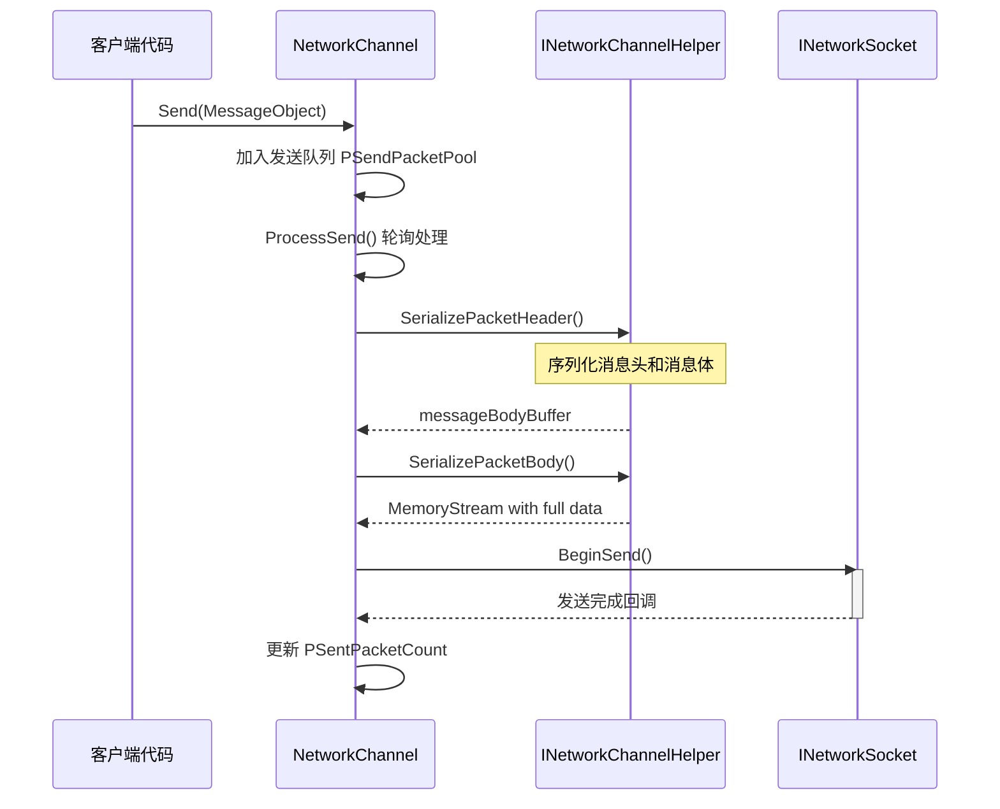
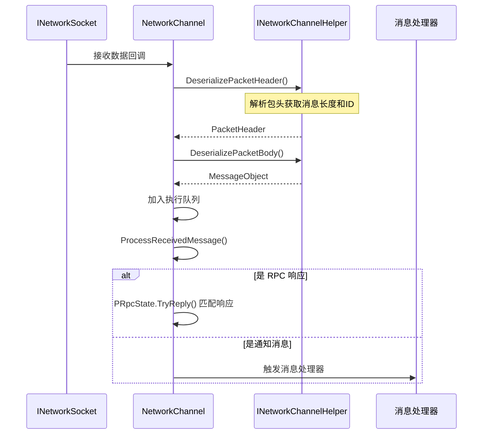
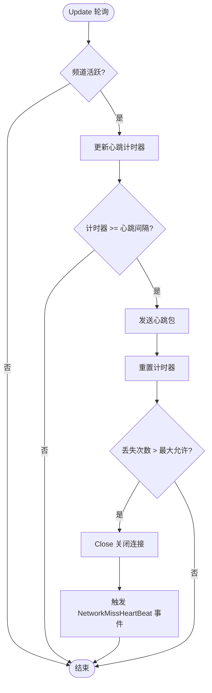

# 网络频道

网络频道（Network Channel）是 GameFrameX 网络框架中的核心组件，负责管理与远程服务器的单一连接。它封装了 Socket 通信、消息序列化/反序列化、心跳检测、RPC 调用等完整功能，使开发者能够方便地进行网络通信开发。

## 概述

在 GameFrameX 网络框架中，每个网络频道代表一个独立的网络连接。框架支持创建多个频道同时连接不同的服务器，每个频道维护自己的连接状态、发送队列、接收队列和心跳状态。

网络频道的设计采用了分层架构：

- **接口层**：定义 `INetworkChannel` 接口，抽象所有网络操作
- **基类层**：提供 `NetworkChannelBase` 抽象基类，实现通用逻辑
- **实现层**：包括 `SystemTcpNetworkChannel`（TCP 连接）和 `WebSocketNetworkChannel`（WebSocket 连接）
- **辅助层**：通过 `INetworkChannelHelper` 委托消息的序列化和反序列化

### 核心功能

网络频道提供以下核心功能：

1. **连接管理**：建立和维护与远程服务器的连接
2. **消息发送**：将 MessageObject 序列化为网络数据并发送
3. **消息接收**：接收网络数据并反序列化为 MessageObject
4. **心跳机制**：定期发送心跳包检测连接状态
5. **RPC 调用**：支持请求-响应模式的远程过程调用
6. **消息压缩**：支持消息压缩以减少网络传输量
7. **事件通知**：通过事件系统通知连接状态变更

## 架构

```mermaid
graph TD
    subgraph "外部调用"
        NetworkComponent
        GameLogic
    end
    
    subgraph "NetworkManager"
        Manager[网络管理器]
    end
    
    subgraph "网络频道层"
        INetworkChannel[INetworkChannel 接口]
        BaseChannel[NetworkChannelBase 基类]
        TcpChannel[SystemTcpNetworkChannel]
        WsChannel[WebSocketNetworkChannel]
    end
    
    subgraph "处理器层"
        SendHeader[IPacketSendHeaderHandler]
        SendBody[IPacketSendBodyHandler]
        RecvHeader[IPacketReceiveHeaderHandler]
        RecvBody[IPacketReceiveBodyHandler]
        HeartBeat[IPacketHeartBeatHandler]
        Compress[IMessageCompressHandler]
        Decompress[IMessageDecompressHandler]
    end
    
    subgraph "辅助层"
        Helper[INetworkChannelHelper]
        DefaultHelper[DefaultNetworkChannelHelper]
    end
    
    subgraph "底层网络"
        Socket[INetworkSocket]
    end
    
    NetworkComponent --> Manager
    Manager --> INetworkChannel
    INetworkChannel <|-- BaseChannel
    BaseChannel --> TcpChannel
    BaseChannel --> WsChannel
    BaseChannel --> Helper
    BaseChannel --> SendHeader
    BaseChannel --> SendBody
    BaseChannel --> RecvHeader
    BaseChannel --> RecvBody
    BaseChannel --> HeartBeat
    BaseChannel --> Compress
    BaseChannel --> Decompress
    Helper <|.. DefaultHelper
    TcpChannel --> Socket
    WsChannel --> Socket
```

### 组件说明

| 组件 | 说明 |
|------|------|
| `INetworkChannel` | 网络频道接口，定义所有网络操作 |
| `NetworkChannelBase` | 抽象基类，实现通用逻辑和状态管理 |
| `SystemTcpNetworkChannel` | 基于 System.Net.Sockets 的 TCP 实现 |
| `WebSocketNetworkChannel` | 基于 WebSocket 的连接实现 |
| `INetworkChannelHelper` | 消息序列化/反序列化辅助器接口 |
| `DefaultNetworkChannelHelper` | 默认实现，自动注册处理器 |

## 消息处理流程

### 发送流程

当客户端调用 `Send` 方法发送消息时，网络频道按照以下流程处理：



> Source: [NetworkManager.NetworkChannelBase.cs](https://github.com/GameFrameX/com.gameframex.unity.network/blob/main/Runtime/Network/Network/NetworkManager.NetworkChannelBase.cs#L779-L822)

### 接收流程

接收到网络数据时，网络频道按照以下流程处理：



> Source: [NetworkManager.NetworkChannelBase.cs](https://github.com/GameFrameX/com.gameframex.unity.network/blob/main/Runtime/Network/Network/NetworkManager.NetworkChannelBase.cs#L392-L430)

## 心跳机制

网络频道内置心跳机制，用于检测连接是否仍然有效。



> Source: [NetworkManager.NetworkChannelBase.cs](https://github.com/GameFrameX/com.gameframex.unity.network/blob/main/Runtime/Network/Network/NetworkManager.NetworkChannelBase.cs#L436-L479)

### 心跳配置

| 属性 | 默认值 | 说明 |
|------|--------|------|
| `HeartBeatInterval` | 30秒 | 心跳发送间隔 |
| `MissHeartBeatCountByClose` | 10 | 丢失心跳次数阈值，超过后自动断开 |
| `ResetHeartBeatElapseSecondsWhenReceivePacket` | false | 收到消息时是否重置心跳计时器 |

## 使用示例

### 创建频道

```csharp
// 通过 NetworkComponent 创建网络频道
var networkChannel = networkComponent.CreateNetworkChannel(
    "GameServer", 
    new DefaultNetworkChannelHelper()
);
```

> Source: [NetworkComponent.cs](https://github.com/GameFrameX/com.gameframex.unity.network/blob/main/Runtime/Network/NetworkComponent.cs#L176-L180)

### 连接服务器

```csharp
// 连接到远程服务器
var channel = networkComponent.GetNetworkChannel("GameServer");
channel.Connect(new Uri("tcp://127.0.0.1:8888"));
```

> Source: [NetworkManager.NetworkChannelBase.cs](https://github.com/GameFrameX/com.gameframex.unity.network/blob/main/Runtime/Network/Network/NetworkManager.NetworkChannelBase.cs#L638-L706)

### 发送消息

```csharp
// 发送消息（异步无返回）
var message = new C2S_LoginMessage 
{ 
    Username = "player1", 
    Password = "password" 
};
channel.Send(message);

// 发送 RPC 请求（等待响应）
var response = await channel.Call<S2C_LoginResponse>(new C2S_LoginMessage 
{ 
    Username = "player1", 
    Password = "password" 
});
```

> Source: [NetworkManager.NetworkChannelBase.cs](https://github.com/GameFrameX/com.gameframex.unity.network/blob/main/Runtime/Network/Network/NetworkManager.NetworkChannelBase.cs#L765-L771)

### 配置心跳

```csharp
// 设置心跳间隔为 15 秒
channel.HeartBeatInterval = 15f;

// 设置丢失 5 次心跳后断开
MissHeartBeatCountByClose = 5;

// 收到消息时重置心跳计时器
channel.ResetHeartBeatElapseSecondsWhenReceivePacket = true;
```

> Source: [NetworkManager.NetworkChannelBase.cs](https://github.com/GameFrameX/com.gameframex.unity.network/blob/main/Runtime/Network/Network/NetworkManager.NetworkChannelBase.cs#L290-L297)

### 注册消息处理器

```csharp
// 在 DefaultNetworkChannelHelper.Initialize 中自动注册所有处理器
// 开发者可以通过继承 INetworkChannelChannelHelper 自定义处理器注册逻辑

// 注册自定义心跳处理器
channel.RegisterHeartBeatHandler(new CustomHeartBeatHandler());
```

> Source: [DefaultNetworkChannelHelper.cs](https://github.com/GameFrameX/com.gameframex.unity.network/blob/main/Runtime/Network/Helper/DefaultNetworkChannelHelper.cs#L40-L107)

### 关闭频道

```csharp
// 关闭网络频道
channel.Close("主动关闭", (ushort)NetworkErrorCode.Normal);
```

> Source: [NetworkManager.NetworkChannelBase.cs](https://github.com/GameFrameX/com.gameframex.unity.network/blob/main/Runtime/Network/Network/NetworkManager.NetworkChannelBase.cs#L714-L756)

## INetworkChannel 接口参考

### 连接管理

| 方法 | 说明 |
|------|------|
| `Connect(Uri address, object userData = null)` | 连接到远程服务器 |
| `Close(string reason, ushort code = 0)` | 关闭网络连接 |
| `Send<T>(T messageObject) where T : MessageObject` | 发送消息 |
| `Call<TResult>(MessageObject messageObject, bool isIgnoreErrorCode = false)` | 发送 RPC 请求并等待响应 |

### 属性

| 属性 | 类型 | 说明 |
|------|------|------|
| `Name` | string | 获取频道名称 |
| `Connected` | bool | 获取是否已连接 |
| `AddressFamily` | AddressFamily | 获取地址类型（IPv4/IPv6） |
| `Socket` | INetworkSocket | 获取底层 Socket |
| `SendPacketCount` | int | 获取待发送消息数量 |
| `SentPacketCount` | int | 获取已发送消息总数 |
| `ReceivedPacketCount` | int | 获取已接收消息总数 |
| `HeartBeatInterval` | float | 获取或设置心跳间隔（秒） |
| `HeartBeatElapseSeconds` | float | 获取心跳流逝时间 |
| `MissHeartBeatCount` | int | 获取丢失心跳次数 |

### 处理器管理

| 方法 | 说明 |
|------|------|
| `RegisterHandler(IPacketSendHeaderHandler)` | 注册发送包头处理器 |
| `RegisterHandler(IPacketSendBodyHandler)` | 注册发送包体处理器 |
| `RegisterHandler(IPacketReceiveHeaderHandler)` | 注册接收包头处理器 |
| `RegisterHandler(IPacketReceiveBodyHandler)` | 注册接收包体处理器 |
| `RegisterHeartBeatHandler(IPacketHeartBeatHandler)` | 注册心跳处理器 |
| `RegisterMessageCompressHandler(IMessageCompressHandler)` | 注册消息压缩处理器 |
| `RegisterMessageDecompressHandler(IMessageDecompressHandler)` | 注册消息解压处理器 |

### RPC 回调设置

| 方法 | 说明 |
|------|------|
| `SetRPCErrorCodeHandler(EventHandler<MessageObject>)` | 设置 RPC 错误码回调 |
| `SetRPCErrorHandler(EventHandler<MessageObject>)` | 设置 RPC 错误回调 |
| `SetRPCStartHandler(EventHandler<MessageObject>)` | 设置 RPC 开始回调 |
| `SetRPCEndHandler(EventHandler<MessageObject>)` | 设置 RPC 结束回调 |

> Source: [INetworkChannel.cs](https://github.com/GameFrameX/com.gameframex.unity.network/blob/main/Runtime/Network/Interface/INetworkChannel.cs)

## INetworkChannelHelper 接口参考

`INetworkChannelHelper` 是网络频道的辅助器接口，负责消息的序列化和反序列化。

| 方法 | 说明 |
|------|------|
| `Initialize(INetworkChannel)` | 初始化辅助器 |
| `Shutdown()` | 关闭并清理辅助器 |
| `PrepareForConnecting()` | 连接前准备工作 |
| `SendHeartBeat()` | 发送心跳消息 |
| `SerializePacketHeader<T>()` | 序列化消息头 |
| `SerializePacketBody()` | 序列化消息体 |
| `DeserializePacketHeader()` | 反序列化消息头 |
| `DeserializePacketBody()` | 反序列化消息体 |

> Source: [INetworkChannelHelper.cs](https://github.com/GameFrameX/com.gameframex.unity.network/blob/main/Runtime/Network/Interface/INetworkChannelHelper.cs)

## 相关链接

- [网络管理器](./4-core-concepts.1-network-manager)
- [消息类型](./4-core-concepts.3-message-types)
- [数据包处理器](./4-core-concepts.4-packet-handlers)
- [心跳机制](./5-heartbeat)
- [事件系统](./6-events)
- [消息压缩](./7-message-compression)
- [RPC 远程调用](./8-rpc)
