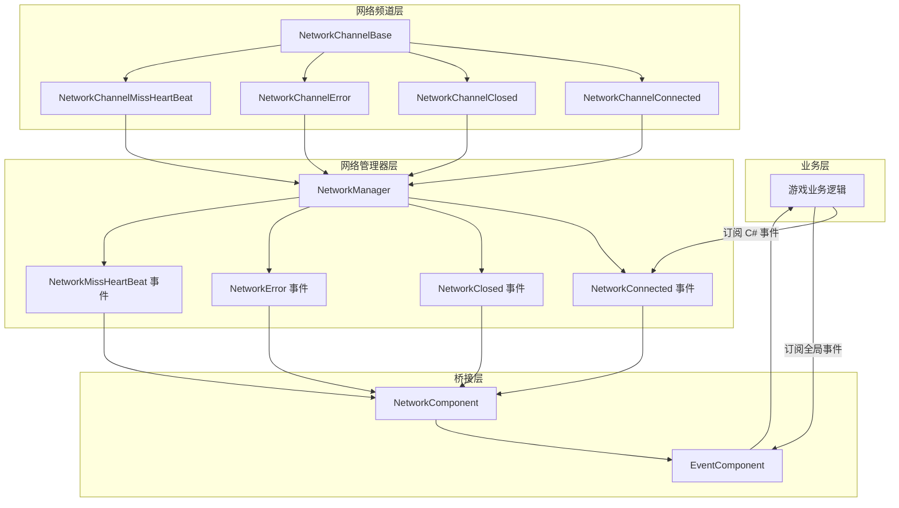
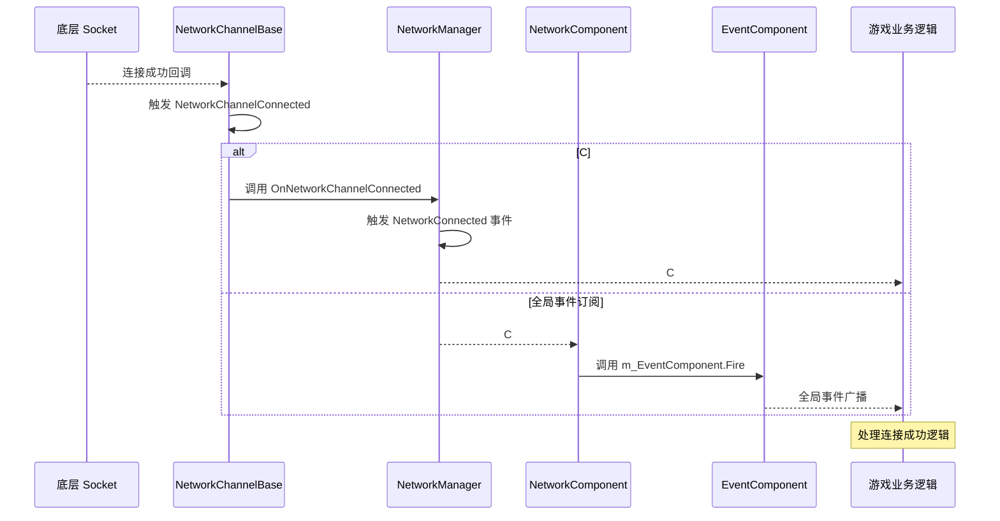

# 事件系统

GameFrameX Unity Network 模块提供了完整的事件系统，用于通知网络连接状态变化、错误发生以及心跳丢失等关键网络事件。该事件系统采用双层架构，既支持 C# 原生事件，也集成了 GameFrameX 的全局事件系统。

## 概述

网络事件系统是 GameFrameX Unity Network 模块的核心组件之一，它解耦了网络逻辑与业务逻辑，使开发者可以灵活地响应各种网络状态变化。事件系统设计遵循以下原则：

- **解耦设计**：网络底层通过事件向上层通知状态变化，业务层通过订阅事件来处理网络状态
- **双重支持**：同时支持 C# 原生事件委托和 GameFrameX 全局事件系统
- **对象复用**：使用对象池技术管理事件参数，减少内存分配开销

事件系统在游戏开发中尤为重要，因为它允许您在不修改网络核心代码的情况下，为游戏添加断线重连、掉线提示、心跳异常处理等功能。

## 架构

GameFrameX Unity Network 的事件系统采用双层架构设计，这种设计兼顾了易用性和灵活性。



### 架构说明

**网络频道层（NetworkChannelBase）** 是网络事件的发源地。当底层 Socket 连接成功、断开、发生错误或心跳丢失时，NetworkChannelBase 会触发相应的 Action 委托。

**网络管理器层（NetworkManager）** 订阅了 NetworkChannelBase 的内部事件，然后将这些事件转换为公开的 C# 事件（event）。这一层是开发者直接交互的主要接口。

**桥接层（NetworkComponent）** 充当了 C# 事件系统和 GameFrameX 全局事件系统之间的桥梁。它既提供了 C# 事件的直接订阅方式，也通过 EventComponent 提供了全局事件订阅能力。

## 事件类型

GameFrameX Unity Network 模块定义了四种核心网络事件，每种事件都有对应的 EventArgs 类来携带事件相关数据。

### NetworkConnectedEventArgs - 连接成功事件

当网络连接成功建立时触发此事件。该事件是最常用的网络事件之一，通常用于触发游戏登录、获取服务器时间等后续操作。

```csharp
using GameFrameX.Network.Runtime;

// 事件参数属性说明
public sealed class NetworkConnectedEventArgs : GameEventArgs
{
    // 事件唯一标识符
    public static readonly string EventId = typeof(NetworkConnectedEventArgs).FullName;

    // 获取网络连接成功事件编号
    public override string Id => EventId;

    // 获取网络频道 - 触发此事件的频道对象
    public INetworkChannel NetworkChannel { get; private set; }

    // 获取用户自定义数据 - Connect 方法传入的 userData 参数
    public object UserData { get; private set; }
}
```

> Source: [NetworkConnectedEventArgs.cs](https://github.com/GameFrameX/com.gameframex.unity.network/blob/main/Runtime/EventArgs/NetworkConnectedEventArgs.cs#L41-L97)

### NetworkClosedEventArgs - 连接关闭事件

当网络连接关闭时触发此事件。该事件携带关闭原因和错误码，可用于判断是正常关闭还是异常断开。

```csharp
public sealed class NetworkClosedEventArgs : GameEventArgs
{
    // 事件唯一标识符
    public static readonly string EventId = typeof(NetworkClosedEventArgs).FullName;

    // 获取网络频道
    public INetworkChannel NetworkChannel { get; private set; }

    // 获取关闭原因
    // 可能的值：Normal, Timeout, Dispose, ConnectClose, ConnectAddressError, ConnectAddressExceptionError, MissHeartBeat
    public string Reason { get; private set; }

    // 获取错误码
    public ushort ErrorCode { get; private set; }
}
```

> Source: [NetworkClosedEventArgs.cs](https://github.com/GameFrameX/com.gameframex.unity.network/blob/main/Runtime/EventArgs/NetworkClosedEventArgs.cs#L41-L103)

### NetworkErrorEventArgs - 网络错误事件

当网络发生错误时触发此事件。该事件提供了丰富的错误信息，包括应用层错误码和底层 Socket 错误码。

```csharp
public sealed class NetworkErrorEventArgs : GameEventArgs
{
    // 事件唯一标识符
    public static readonly string EventId = typeof(NetworkErrorEventArgs).FullName;

    // 获取网络频道
    public INetworkChannel NetworkChannel { get; private set; }

    // 获取应用层错误码
    // 枚举值：Unknown, AddressFamilyError, SocketError, ConnectError, SendError, ReceiveError, SerializeError, DeserializePacketHeaderError, DeserializePacketError, MissHeartBeatError, DisposeError
    public NetworkErrorCode ErrorCode { get; private set; }

    // 获取底层 Socket 错误码
    public SocketError SocketErrorCode { get; private set; }

    // 获取错误信息
    public string ErrorMessage { get; private set; }
}
```

> Source: [NetworkErrorEventArgs.cs](https://github.com/GameFrameX/com.gameframex.unity.network/blob/main/Runtime/EventArgs/NetworkErrorEventArgs.cs#L42-L116)

### NetworkMissHeartBeatEventArgs - 心跳丢失事件

当心跳包丢失达到一定次数时触发此事件。该事件可用于实现更细粒度的断线重连逻辑，例如在丢失 3 次心跳时提示用户网络不稳定。

```csharp
public sealed class NetworkMissHeartBeatEventArgs : GameEventArgs
{
    // 事件唯一标识符
    public static readonly string EventId = typeof(NetworkMissHeartBeatEventArgs).FullName;

    // 获取网络频道
    public INetworkChannel NetworkChannel { get; private set; }

    // 获取心跳包已丢失次数
    // 当丢失次数超过 MissHeartBeatCountByClose（默认 10 次）时，连接将被自动关闭
    public int MissCount { get; private set; }
}
```

> Source: [NetworkMissHeartBeatEventArgs.cs](https://github.com/GameFrameX/com.gameframex.unity.network/blob/main/Runtime/EventArgs/NetworkMissHeartBeatEventArgs.cs#L41-L97)

## 事件流程

网络事件的完整流程涉及多个组件的协作。理解这个流程有助于您更好地使用事件系统来构建可靠的网络功能。



### 事件触发时机

| 事件类型 | 触发时机 | 后续动作 |
|---------|---------|---------|
| NetworkConnected | 成功建立 TCP 连接后 | 可发送登录请求或获取服务器时间 |
| NetworkClosed | 连接断开时（正常/异常） | 清理资源，触发重连逻辑 |
| NetworkError | 发生网络错误时 | 记录日志，可能触发断开连接 |
| NetworkMissHeartBeat | 心跳包丢失时 | 更新 UI 提示，可能触发断开连接 |

## 使用示例

### 方式一：使用 C# 原生事件

C# 原生事件是最直接的事件订阅方式，适合简单的网络事件处理场景。

```csharp
using GameFrameX.Network.Runtime;
using UnityEngine;

public class NetworkExample : MonoBehaviour
{
    private INetworkManager networkManager;
    private INetworkChannel channel;

    private void Start()
    {
        // 获取网络管理器
        networkManager = GameFrameworkEntry.GetModule<INetworkManager>();
        
        // 订阅网络事件
        networkManager.NetworkConnected += OnNetworkConnected;
        networkManager.NetworkClosed += OnNetworkClosed;
        networkManager.NetworkError += OnNetworkError;
        networkManager.NetworkMissHeartBeat += OnNetworkMissHeartBeat;
        
        // 创建网络频道
        var helper = new DefaultNetworkChannelHelper();
        channel = networkManager.CreateNetworkChannel("GameServer", helper, 5000);
        
        // 连接到服务器
        channel.Connect(new Uri("tcp://127.0.0.1:8888"));
    }

    private void OnNetworkConnected(object sender, NetworkConnectedEventArgs e)
    {
        Debug.Log($"连接成功！频道: {e.NetworkChannel.Name}, 用户数据: {e.UserData}");
    }

    private void OnNetworkClosed(object sender, NetworkClosedEventArgs e)
    {
        Debug.Log($"连接关闭！原因: {e.Reason}, 错误码: {e.ErrorCode}");
    }

    private void OnNetworkError(object sender, NetworkErrorEventArgs e)
    {
        Debug.LogError($"网络错误！错误码: {e.ErrorCode}, Socket错误: {e.SocketErrorCode}, 消息: {e.ErrorMessage}");
    }

    private void OnNetworkMissHeartBeat(object sender, NetworkMissHeartBeatEventArgs e)
    {
        Debug.LogWarning($"心跳丢失！次数: {e.MissCount}");
    }

    private void OnDestroy()
    {
        // 取消订阅事件
        if (networkManager != null)
        {
            networkManager.NetworkConnected -= OnNetworkConnected;
            networkManager.NetworkClosed -= OnNetworkClosed;
            networkManager.NetworkError -= OnNetworkError;
            networkManager.NetworkMissHeartBeat -= OnNetworkMissHeartBeat;
        }
    }
}
```

> Source: [NetworkManager.cs](https://github.com/GameFrameX/com.gameframex.unity.network/blob/main/Runtime/Network/Network/NetworkManager.cs#L261-L311)

### 方式二：使用 NetworkComponent 订阅全局事件

NetworkComponent 提供了与 GameFrameX EventComponent 的集成，您可以通过订阅全局事件来处理网络状态变化。这种方式更适合需要跨模块通信的场景。

```csharp
using GameFrameX.Event.Runtime;
using GameFrameX.Network.Runtime;
using UnityEngine;

public class GlobalEventExample : MonoBehaviour
{
    private EventComponent eventComponent;

    private void Start()
    {
        // 获取事件组件
        eventComponent = GameEntry.GetComponent<EventComponent>();
        
        // 订阅全局事件
        eventComponent.Subscribe(NetworkConnectedEventArgs.EventId, OnNetworkConnected);
        eventComponent.Subscribe(NetworkClosedEventArgs.EventId, OnNetworkClosed);
        eventComponent.Subscribe(NetworkErrorEventArgs.EventId, OnNetworkError);
        eventComponent.Subscribe(NetworkMissHeartBeatEventArgs.EventId, OnNetworkMissHeartBeat);
    }

    private void OnNetworkConnected(object sender, GameEventArgs e)
    {
        var args = e as NetworkConnectedEventArgs;
        Debug.Log($"全局事件 - 连接成功！频道: {args.NetworkChannel.Name}");
    }

    private void OnNetworkClosed(object sender, GameEventArgs e)
    {
        var args = e as NetworkClosedEventArgs;
        Debug.Log($"全局事件 - 连接关闭！原因: {args.Reason}");
    }

    private void OnNetworkError(object sender, GameEventArgs e)
    {
        var args = e as NetworkErrorEventArgs;
        Debug.LogError($"全局事件 - 网络错误: {args.ErrorMessage}");
    }

    private void OnNetworkMissHeartBeat(object sender, GameEventArgs e)
    {
        var args = e as NetworkMissHeartBeatEventArgs;
        Debug.LogWarning($"全局事件 - 心跳丢失次数: {args.MissCount}");
    }

    private void OnDestroy()
    {
        // 取消订阅全局事件
        if (eventComponent != null)
        {
            eventComponent.Unsubscribe(NetworkConnectedEventArgs.EventId, OnNetworkConnected);
            eventComponent.Unsubscribe(NetworkClosedEventArgs.EventId, OnNetworkClosed);
            eventComponent.Unsubscribe(NetworkErrorEventArgs.EventId, OnNetworkError);
            eventComponent.Unsubscribe(NetworkMissHeartBeatEventArgs.EventId, OnNetworkMissHeartBeat);
        }
    }
}
```

> Source: [NetworkComponent.cs](https://github.com/GameFrameX/com.gameframex.unity.network/blob/main/Runtime/Network/NetworkComponent.cs#L196-L214)

### 方式三：使用 NetworkComponent 事件属性

NetworkComponent 也直接暴露了与 NetworkManager 相同的事件属性，方便在 Unity 编辑器中通过 Inspector 或脚本直接订阅。

```csharp
public class DirectSubscribeExample : MonoBehaviour
{
    private NetworkComponent networkComponent;

    private void Start()
    {
        // 直接从 NetworkComponent 订阅事件
        networkComponent = GetComponent<NetworkComponent>();
        networkComponent.NetworkConnected += OnConnected;
        networkComponent.NetworkClosed += OnClosed;
    }

    private void OnConnected(object sender, NetworkConnectedEventArgs e)
    {
        Debug.Log("连接成功");
    }

    private void OnClosed(object sender, NetworkClosedEventArgs e)
    {
        Debug.Log($"连接关闭: {e.Reason}");
    }
}
```

> Source: [NetworkComponent.cs](https://github.com/GameFrameX/com.gameframex.unity.network/blob/main/Runtime/Network/NetworkComponent.cs#L109-L112)

## 错误码参考

### NetworkCloseReason - 关闭原因

| 常量 | 说明 |
|-----|------|
| Normal | 正常关闭 |
| Timeout | 超时关闭 |
| Dispose | 资源释放关闭 |
| ConnectClose | 连接关闭 |
| ConnectAddressError | 连接地址错误关闭 |
| ConnectAddressExceptionError | 连接地址异常错误关闭 |
| MissHeartBeat | 心跳丢失关闭 |

> Source: [NetworkErrorCode.cs](https://github.com/GameFrameX/com.gameframex.unity.network/blob/main/Runtime/Network/Base/NetworkErrorCode.cs#L34-L74)

### NetworkErrorCode - 错误码

| 值 | 说明 |
|---|------|
| Unknown | 未知错误 |
| AddressFamilyError | 地址族错误 |
| SocketError | Socket 错误 |
| ConnectError | 连接错误 |
| SendError | 发送错误 |
| ReceiveError | 接收错误 |
| SerializeError | 序列化错误 |
| DeserializePacketHeaderError | 反序列化消息包头错误 |
| DeserializePacketError | 反序列化消息包错误 |
| MissHeartBeatError | 心跳丢失错误 |
| DisposeError | 资源释放错误 |

> Source: [NetworkErrorCode.cs](https://github.com/GameFrameX/com.gameframex.unity.network/blob/main/Runtime/Network/Base/NetworkErrorCode.cs#L76-L137)

## 最佳实践

### 事件订阅建议

1. **在合适的位置订阅**：在游戏开始或网络模块初始化时订阅事件，在游戏结束或场景切换时取消订阅
2. **使用弱引用**：在某些场景下可以考虑使用弱引用模式，避免内存泄漏
3. **异常处理**：在事件处理回调中添加适当的异常处理，避免单个事件处理错误影响整个系统
4. **避免耗时操作**：事件回调中避免执行耗时操作，如需处理复杂逻辑，考虑使用消息队列异步处理

### 断线重连示例

以下是一个使用事件系统实现断线重连的示例：

```csharp
public class ReconnectExample : MonoBehaviour
{
    private INetworkManager networkManager;
    private int reconnectAttempts = 0;
    private const int MaxReconnectAttempts = 3;
    private string serverAddress = "tcp://127.0.0.1:8888";

    private void Start()
    {
        networkManager = GameFrameworkEntry.GetModule<INetworkManager>();
        networkManager.NetworkClosed += OnNetworkClosed;
        networkManager.NetworkConnected += OnNetworkConnected;
        
        Connect();
    }

    private void Connect()
    {
        var helper = new DefaultNetworkChannelHelper();
        var channel = networkManager.CreateNetworkChannel("GameServer", helper, 5000);
        channel.Connect(new Uri(serverAddress));
    }

    private void OnNetworkConnected(object sender, NetworkConnectedEventArgs e)
    {
        reconnectAttempts = 0;
        Debug.Log("连接成功，开始游戏");
    }

    private void OnNetworkClosed(object sender, NetworkClosedEventArgs e)
    {
        // 检查是否需要重连
        if (e.Reason != NetworkCloseReason.Normal && reconnectAttempts < MaxReconnectAttempts)
        {
            reconnectAttempts++;
            Debug.Log($"连接断开，{reconnectAttempts} 秒后尝试重连...");
            Invoke(nameof(Connect), 3f);
        }
    }
}
```

## 相关链接

- [网络管理器](./4-core-concepts.1-network-manager) - 了解 NetworkManager 的完整 API
- [网络频道](./4-core-concepts.2-network-channel) - 了解网络频道的概念和使用
- [心跳机制](./5-heartbeat) - 了解心跳检测的工作原理
- [RPC 远程调用](./8-rpc) - 了解 RPC 调用与事件的配合使用
- [事件系统（GameFrameX Core）](https://github.com/GameFrameX/com.gameframex.unity.event) - 了解更多关于 GameFrameX 全局事件系统
