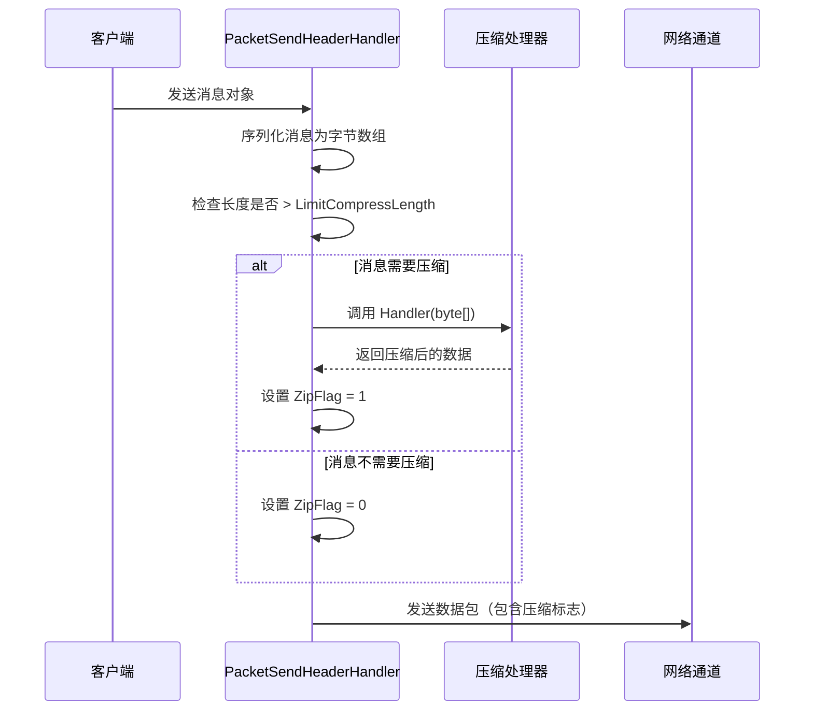
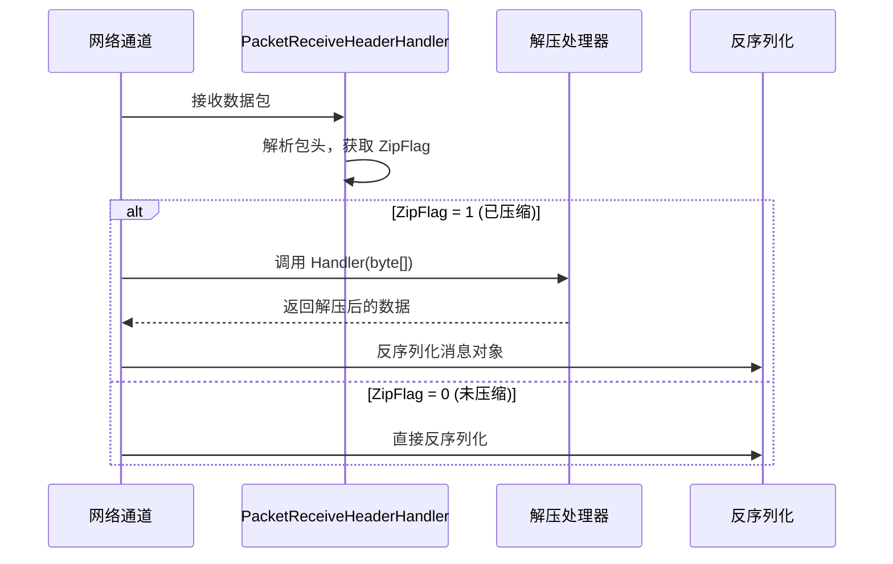

# 消息压缩

消息压缩功能用于在网络传输过程中对消息 payload 进行压缩，以减少网络带宽消耗和传输时间。

## 概述

GameFrameX Network 提供了可扩展的消息压缩机制，默认使用 GZIP 压缩算法。压缩系统采用阈值策略，只对超过指定大小的消息进行压缩，避免对小消息进行不必要的压缩处理。

### 核心功能

- **自动压缩**：消息发送时自动判断是否需要压缩
- **自动解压**：接收消息时根据压缩标志自动解压
- **可扩展接口**：支持自定义压缩算法
- **阈值控制**：通过 `LimitCompressLength` 配置压缩启用阈值

## Architecture

```mermaid
flowchart TD
    subgraph Send["消息发送流程"]
        S1[序列化消息] --> S2{消息长度 > LimitCompressLength?}
        S2 -->|是| S3[调用压缩处理器]
        S2 -->|否| S4[不压缩]
        S3 --> S5[设置压缩标志]
        S5 --> S6[添加包头并发送]
        S4 --> S6
    end

    subgraph Receive["消息接收流程"]
        R1[接收数据包] --> R2[解析包头]
        R2 --> R3{ZipFlag = 1?}
        R3 -->|是| R4[调用解压处理器]
        R3 -->|否| R5[直接反序列化]
        R4 --> R6[反序列化消息]
        R5 --> R6
    end

    subgraph Handlers["压缩处理器"]
        H1[IMessageCompressHandler]
        H2[IMessageDecompressHandler]
        H3[DefaultMessageCompressHandler]
        H4[DefaultMessageDecompressHandler]
    end

    H1 <|.. H3
    H2 <|.. H4
    S3 -->|调用| H3
    R4 -->|调用| H4
```

## 核心组件

### 接口定义

#### IMessageCompressHandler

消息压缩处理器接口，定义压缩消息数据的方法。

> Source: [IMessageCompressHandler.cs](https://github.com/GameFrameX/com.gameframex.unity.network/blob/main/Runtime/Network/Interface/IMessageCompressHandler.cs#L6-L14)

```csharp
public interface IMessageCompressHandler
{
    /// <summary>
    /// 压缩处理
    /// </summary>
    /// <param name="message">消息未压缩内容</param>
    /// <returns>压缩后的字节数组</returns>
    byte[] Handler(byte[] message);
}
```

#### IMessageDecompressHandler

消息解压器接口，定义解压压缩消息的方法。

> Source: [IMessageDecompressHandler.cs](https://github.com/GameFrameX/com.gameframex.unity.network/blob/main/Runtime/Network/Interface/IMessageDecompressHandler.cs#L6-L14)

```csharp
public interface IMessageDecompressHandler
{
    /// <summary>
    /// 解压处理
    /// </summary>
    /// <param name="message">消息压缩内容</param>
    /// <returns>解压后的字节数组</returns>
    byte[] Handler(byte[] message);
}
```

### 默认实现

#### DefaultMessageCompressHandler

默认的消息压缩处理器，使用 GZIP 压缩算法。

> Source: [DefaultMessageCompressHandler.cs](https://github.com/GameFrameX/com.gameframex.unity.network/blob/main/Runtime/Network/Helper/DefaultMessageCompressHandler.cs#L9-L20)

```csharp
[UnityEngine.Scripting.Preserve]
public sealed class DefaultMessageCompressHandler : IMessageCompressHandler, IPacketHandler
{
    public byte[] Handler(byte[] message)
    {
        return ZipHelper.Compress(message);
    }
}
```

#### DefaultMessageDecompressHandler

默认的消息解压处理器，使用 GZIP 解压算法。

> Source: [DefaultMessageDecompressHandler.cs](https://github.com/GameFrameX/com.gameframex.unity.network/blob/main/Runtime/Network/Helper/DefaultMessageDecompressHandler.cs#L9-L20)

```csharp
[UnityEngine.Scripting.Preserve]
public sealed class DefaultMessageDecompressHandler : IMessageDecompressHandler, IPacketHandler
{
    public byte[] Handler(byte[] message)
    {
        return ZipHelper.Decompress(message);
    }
}
```

## 压缩流程详解

### 消息发送时的压缩流程



发送流程的核心逻辑在 `DefaultPacketSendHeaderHandler` 中：

> Source: [DefaultPacketSendHeaderHandler.cs#L83-L97](https://github.com/GameFrameX/com.gameframex.unity.network/blob/main/Runtime/Network/Helper/DefaultPacketSendHeaderHandler.cs#L83-L97)

```csharp
public bool Handler<T>(T messageObject, IMessageCompressHandler messageCompressHandler, 
    MemoryStream destination, out byte[] messageBodyBuffer) where T : MessageObject
{
    var messageType = messageObject.GetType();
    Id = ProtoMessageIdHandler.GetReqMessageIdByType(messageType);
    messageBodyBuffer = SerializerHelper.Serialize(messageObject);
    
    if (messageCompressHandler != null && messageBodyBuffer.Length > LimitCompressLength)
    {
        IsZip = true;
        messageBodyBuffer = messageCompressHandler.Handler(messageBodyBuffer);
    }
    else
    {
        IsZip = false;
    }
    // ... 后续处理
}
```

### 消息接收时的解压流程

当接收到网络数据包时，网络通道根据包头中的 `ZipFlag` 标志判断是否需要解压：



TCP 网络通道的解压实现：

> Source: [NetworkManager.SystemTcpNetworkChannel.cs#L225-L230](https://github.com/GameFrameX/com.gameframex.unity.network/blob/main/Runtime/Network/Network/SystemSocket/NetworkManager.SystemTcpNetworkChannel.cs#L225-L230)

```csharp
if (PReceiveState.PacketHeader.ZipFlag != 0)
{
    // 解压
    GameFrameworkGuard.NotNull(MessageDecompressHandler, nameof(MessageDecompressHandler));
    buffer = MessageDecompressHandler.Handler(buffer);
}
```

## 自动注册机制

消息压缩处理器通过 `IPacketHandler` 接口标记，利用反射自动注册到网络通道中。

> Source: [DefaultNetworkChannelHelper.cs#L91-L100](https://github.com/GameFrameX/com.gameframex.unity.network/blob/main/Runtime/Network/Helper/DefaultNetworkChannelHelper.cs#L91-L100)

```csharp
// 反射注册消息压缩处理器
var messageCompressHandlerBaseType = typeof(IMessageCompressHandler);
var messageDecompressHandlerBaseType = typeof(IMessageDecompressHandler);

foreach (var type in types)
{
    // ... 
    else if (type.IsImplWithInterface(messageCompressHandlerBaseType))
    {
        var handler = (IMessageCompressHandler)Activator.CreateInstance(type);
        m_NetworkChannel.RegisterMessageCompressHandler(handler);
    }
    else if (type.IsImplWithInterface(messageDecompressHandlerBaseType))
    {
        var handler = (IMessageDecompressHandler)Activator.CreateInstance(type);
        m_NetworkChannel.RegisterMessageDecompressHandler(handler);
    }
}
```

## 使用示例

### 使用默认压缩处理器

默认情况下，系统会自动注册 `DefaultMessageCompressHandler` 和 `DefaultMessageDecompressHandler`，无需手动配置：

```csharp
// 消息会自动进行压缩处理
// 仅当消息体大小超过 LimitCompressLength (默认512字节) 时才会压缩
networkChannel.Send(new TestMessage { Data = "Hello World" });
```

### 自定义压缩处理器

如果需要使用其他压缩算法（如 LZ4、Zstd），可以创建自定义处理器：

```csharp
// 自定义压缩处理器示例
public class LZ4CompressHandler : IMessageCompressHandler, IPacketHandler
{
    public byte[] Handler(byte[] message)
    {
        // 使用 LZ4 算法压缩
        return LZ4.Compress(message);
    }
}

public class LZ4DecompressHandler : IMessageDecompressHandler, IPacketHandler
{
    public byte[] Handler(byte[] message)
    {
        // 使用 LZ4 算法解压
        return LZ4.Decompress(message);
    }
}
```

自定义处理器会自动被系统发现并注册，前提是：
1. 实现 `IMessageCompressHandler` 或 `IMessageDecompressHandler` 接口
2. 实现 `IPacketHandler` 接口（用于标记自动注册）
3. 放置在程序集中（会被反射扫描到）

### 禁用压缩

如果不需要消息压缩，可以不添加压缩处理器到程序集中，或者手动将处理器设置为 null：

> Source: [NetworkManager.NetworkChannelBase.cs#L496-L502](https://github.com/GameFrameX/com.gameframex.unity.network/blob/main/Runtime/Network/Network/NetworkManager.NetworkChannelBase.cs#L496-L502)

```csharp
// 设置为 null 可禁用压缩
networkChannel.RegisterMessageCompressHandler(null);
networkChannel.RegisterMessageDecompressHandler(null);
```

## 配置选项

### LimitCompressLength

压缩阈值配置，控制消息超过多大小时启用压缩。

> Source: [DefaultPacketSendHeaderHandler.cs#L66-L69](https://github.com/GameFrameX/com.gameframex.unity.network/blob/main/Runtime/Network/Helper/DefaultPacketSendHeaderHandler.cs#L66-L69)

| 属性 | 类型 | 默认值 | 描述 |
|------|------|--------|------|
| LimitCompressLength | uint | 512 | 消息体超过此长度时启用压缩（字节） |

### 修改默认阈值

如需修改压缩阈值，可以继承 `DefaultPacketSendHeaderHandler`：

```csharp
public class CustomPacketSendHeaderHandler : DefaultPacketSendHeaderHandler
{
    // 将压缩阈值设置为 1024 字节
    public override uint LimitCompressLength { get; } = 1024;
}
```

## 包头结构

消息包头中包含压缩标志，用于标识消息体是否经过压缩：

| 字段 | 长度 | 描述 |
|------|------|------|
| PacketLength | 4 字节 | 数据包总长度 |
| OperationType | 1 字节 | 操作类型 (1=心跳, 4=普通消息) |
| **ZipFlag** | **1 字节** | **压缩标志 (0=未压缩, 1=已压缩)** |
| UniqueId | 4 字节 | 消息唯一编号 |
| Id | 4 字节 | 消息协议号 |

> Source: [DefaultPacketSendHeaderHandler.cs#L30-L31](https://github.com/GameFrameX/com.gameframex.unity.network/blob/main/Runtime/Network/Helper/DefaultPacketSendHeaderHandler.cs#L30-L31)

## API Reference

### IMessageCompressHandler

```csharp
byte[] Handler(byte[] message)
```

**参数：**
- `message` (byte[]): 未压缩的原始消息字节数组

**返回：** 压缩后的字节数组

**抛出：**
- 空实现可能返回 null

### IMessageDecompressHandler

```csharp
byte[] Handler(byte[] message)
```

**参数：**
- `message` (byte[]): 压缩后的消息字节数组

**返回：** 解压后的原始字节数组

### INetworkChannel

```csharp
void RegisterMessageCompressHandler(IMessageCompressHandler handler)
```

注册消息压缩处理器。

```csharp
void RegisterMessageDecompressHandler(IMessageDecompressHandler handler)
```

注册消息解压处理器。

```csharp
IMessageCompressHandler MessageCompressHandler { get; }
```

获取当前配置的压缩处理器。

```csharp
IMessageDecompressHandler MessageDecompressHandler { get; }
```

获取当前配置的解压处理器。

## Related Links

- [网络管理器](./4-core-concepts.1-network-manager) - 网络管理器概述
- [网络频道](./4-core-concepts.2-network-channel) - 网络通道配置
- [数据包处理器](./4-core-concepts.4-packet-handlers) - 包处理器详解
- [心跳机制](./5-heartbeat) - 心跳与压缩标志
- [事件系统](./6-events) - 网络事件处理
