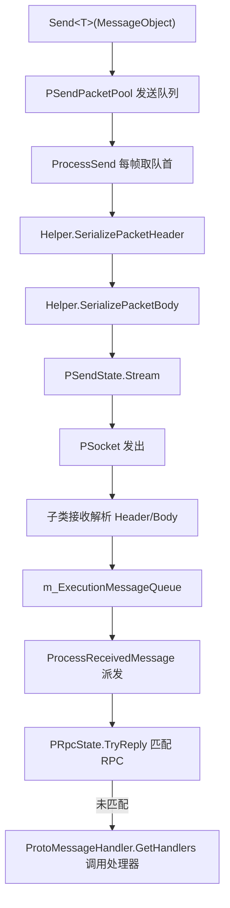

# 工作原理:网络频道与数据收发流程

网络频道(`NetworkChannelBase`)是 `NetworkManager` 中负责一条连接的收发单元：发送消息先进队列、每帧由 `Update` 驱动序列化后写出;接收消息在子类(TCP / WebSocket)中解析后进入线程安全队列,再由主线程统一派发给 RPC 或消息处理器,同时附带心跳与超时断开机制。

## 整体数据流



发送与接收的汇合点都在 `NetworkChannelBase.Update` 中,子类实现只负责具体的 Socket 收发。

## 频道轮询:Update 一帧内做什么

每帧按固定顺序执行发送、接收、心跳、消息派发与 RPC 超时检查:

```csharp
public virtual void Update(float elapseSeconds, float realElapseSeconds)
{
    if (PSocket == null || !PActive)
    {
        return;
    }

    ProcessSend();
    ProcessReceive();
    if (PSocket == null || !PActive)
    {
        return;
    }

    ProcessHeartBeat(realElapseSeconds);
    ProcessReceivedMessage();
    PRpcState.Update(elapseSeconds, realElapseSeconds);
}
```

Source: [NetworkManager.NetworkChannelBase.cs](https://github.com/GameFrameX/com.gameframex.unity.network/blob/main/Runtime/Network/Network/NetworkManager.NetworkChannelBase.cs#L378-L395)

## 发送流程

1. 调用 `Send<T>` 做前置检查后,把消息放入发送队列 `PSendPacketPool`(`GameFrameworkLinkedList<MessageObject>`)。
2. 每帧 `ProcessSend` 从队首取出消息调用 `ProcessSendMessage`。
3. `ProcessSendMessage` 依次调用频道辅助器 `INetworkChannelHelper.SerializePacketHeader` 与 `SerializePacketBody`,把序列化结果写入 `PSendState.Stream`,随后 `ReferencePool.Release(messageObject)` 回收消息对象。
4. 任一步序列化失败,触发 `NetworkChannelError`(`NetworkErrorCode.SerializeError`)或抛出 `GameFrameworkException`。

```csharp
public void Send<T>(T messageObject) where T : MessageObject
{
    GameFrameworkGuard.NotNull(messageObject, nameof(messageObject));
    if (PSocket == null)
    {
        const string errorMessage = "You must connect first.";
        // ... 触发 NetworkChannelError 或抛出异常
    }

    if (!PActive)
    {
        const string errorMessage = "Socket is not active.";
        // ...
    }

    lock (PSendPacketPool)
    {
        PSendPacketPool.AddLast(messageObject);
    }
}
```

Source: [NetworkManager.NetworkChannelBase.cs](https://github.com/GameFrameX/com.gameframex.unity.network/blob/main/Runtime/Network/Network/NetworkManager.NetworkChannelBase.cs#L799-L830)

```csharp
protected virtual bool ProcessSendMessage(MessageObject messageObject)
{
    bool serializeResult = PNetworkChannelHelper.SerializePacketHeader(messageObject, PSendState.Stream, out var messageBodyBuffer);
    if (serializeResult)
    {
        serializeResult = PNetworkChannelHelper.SerializePacketBody(messageBodyBuffer, PSendState.Stream);
    }
    else
    {
        const string errorMessage = "Serialized packet failure.";
        throw new InvalidOperationException(errorMessage);
    }

    ReferencePool.Release(messageObject);
    return serializeResult;
}
```

Source: [NetworkManager.NetworkChannelBase.cs](https://github.com/GameFrameX/com.gameframex.unity.network/blob/main/Runtime/Network/Network/NetworkManager.NetworkChannelBase.cs#L867-L882)

## 接收流程

接收到的消息对象进入 `m_ExecutionMessageQueue`(`ConcurrentQueue<MessageObject>`,由子类在接收线程写入),主线程在每帧的 `ProcessReceivedMessage` 中派发:

1. 先调用 `PRpcState.TryReply(messageObject)` 尝试匹配未完成的 RPC 调用,匹配成功即结束本条消息的处理。
2. 匹配失败则按消息类型取回注册的处理器 `ProtoMessageHandler.GetHandlers(messageObject.GetType())`,逐个 `SetMessageObject` 后 `Invoke()`。
3. 单个处理器抛出的异常会被 `Log.Fatal(e)` 记录,不会中断同帧其余消息的派发。

```csharp
private void ProcessReceivedMessage()
{
    while (m_ExecutionMessageQueue.TryDequeue(out var messageObject))
    {
        try
        {
            // 执行RPC匹配
            var replySuccess = PRpcState.TryReply(messageObject);
            if (replySuccess)
            {
                continue;
            }

            // 执行通知消息
            var handlers = ProtoMessageHandler.GetHandlers(messageObject.GetType());
            foreach (var handler in handlers)
            {
                handler.SetMessageObject(messageObject);
                try
                {
                    handler.Invoke();
                }
                catch (Exception e)
                {
                    Log.Fatal(e);
                }
            }
        }
        catch (Exception e)
        {
            Log.Fatal(e);
        }
    }
}
```

Source: [NetworkManager.NetworkChannelBase.cs](https://github.com/GameFrameX/com.gameframex.unity.network/blob/main/Runtime/Network/Network/NetworkManager.NetworkChannelBase.cs#L400-L433)

基类中的 `ProcessReceive()` 目前为空实现,实际的字节接收与 Header/Body 解析在子类 `SystemTcpNetworkChannel` 与 `WebSocketNetworkChannel` 中完成,解析成功后统一写入 `m_ExecutionMessageQueue`。

## RPC 调用

`Call<TResult>` 是"发送 + 等待响应"的组合:先 `Send(messageObject)` 入队,再 `await PRpcState.Call(messageObject, isIgnoreErrorCode)` 等待同频道接收流程中的 `TryReply` 匹配到响应。返回类型与 `TResult` 不一致时抛出:

```
RPC response type mismatch. Expected: {0}, Actual: {1}
```

Source: [NetworkManager.NetworkChannelBase.cs](https://github.com/GameFrameX/com.gameframex.unity.network/blob/main/Runtime/Network/Network/NetworkManager.NetworkChannelBase.cs#L777-L791)

## 心跳与超时断开

心跳默认值:间隔 `DefaultHeartBeatInterval = 30f` 秒,丢失超过 `DefaultMissHeartBeatCountByClose = 10` 次触发断开。可通过 `RegisterHeartBeatHandler(IPacketHeartBeatHandler)` 覆盖(handler 的 `HeartBeatInterval`、`MissHeartBeatCountByClose` 大于 0 时生效)。

`ProcessHeartBeat` 的判定逻辑:

- `HeartBeatElapseSeconds` 累加 `realElapseSeconds`,达到 `PHeartBeatInterval` 时置位 `sendHeartBeat`、清零计时并将 `MissHeartBeatCount++`。
- 发送心跳(`PNetworkChannelHelper.SendHeartBeat()`)成功且此前已丢失过心跳,则触发 `NetworkChannelMissHeartBeat` 回调。
- `MissHeartBeatCount > MissHeartBeatCountByClose` 时调用 `Close(NetworkCloseReason.MissHeartBeat, (ushort)NetworkErrorCode.MissHeartBeatError)` 主动断开。

Source: [NetworkManager.NetworkChannelBase.cs](https://github.com/GameFrameX/com.gameframex.unity.network/blob/main/Runtime/Network/Network/NetworkManager.NetworkChannelBase.cs#L439-L488)

## 连接与关闭

`Connect(Uri address, object userData = null)` 会:关闭旧连接 → 解析主机为 `IPEndPoint`(解析失败时以 `NetworkCloseReason.ConnectAddressError` / `ConnectAddressExceptionError` 关闭并回调 `NetworkChannelError`)→ 依据 `AddressFamily` 设置 `PAddressFamily`(IPv4/IPv6,不支持的类型报 `NetworkErrorCode.AddressFamilyError`)→ `PSendState.Reset()`、`PReceiveState.PrepareForPacketHeader()` 准备接收包头。

`Close(string reason, ushort code = 0)` 在锁内依次:`PActive = false` → `PSocket.Shutdown()` / `Close()` → 触发 `NetworkChannelClosed` 回调 → 清空发送队列、心跳状态、RPC 状态与 `m_ExecutionMessageQueue` 中未派发的消息。

Source: [NetworkManager.NetworkChannelBase.cs](https://github.com/GameFrameX/com.gameframex.unity.network/blob/main/Runtime/Network/Network/NetworkManager.NetworkChannelBase.cs#L723-L768)

## 频道上的处理器注册

| 方法 | 处理器 | 作用 |
|------|--------|------|
| `RegisterHandler(IPacketSendHeaderHandler)` | 发送包头 | 序列化消息包头 |
| `RegisterHandler(IPacketSendBodyHandler)` | 发送包体 | 序列化消息包体 |
| `RegisterHandler(IPacketReceiveHeaderHandler)` | 接收包头 | 解析消息包头 |
| `RegisterHandler(IPacketReceiveBodyHandler)` | 接收包体 | 解析消息包体 |
| `RegisterHeartBeatHandler(IPacketHeartBeatHandler)` | 心跳 | 定义心跳消息并覆盖间隔/断开次数 |
| `RegisterMessageCompressHandler(IMessageCompressHandler)` | 压缩 | 发送侧消息压缩,传 null 关闭 |
| `RegisterMessageDecompressHandler(IMessageDecompressHandler)` | 解压 | 接收侧消息解压,传 null 关闭 |
| `SetRPCErrorHandler(EventHandler<MessageObject>)` | RPC | RPC 错误回调 |

所有注册方法内部都会 `GameFrameworkGuard.NotNull` 校验,传 null 抛出参数异常。默认实现可参考 [DefaultNetworkChannelHelper.cs](https://github.com/GameFrameX/com.gameframex.unity.network/blob/main/Runtime/Network/Helper/DefaultNetworkChannelHelper.cs#L13)。

## 常见错误

| 现象 | 原因 | 处理 |
|------|------|------|
| `You must connect first.` | `Send` 时 `PSocket == null`,尚未连接 | 先调用 `Connect` 并等待连接成功 |
| `Socket is not active.` | 连接已建立但 `PActive` 为 false | 检查频道是否被关闭或出错置为非激活 |
| `Serialized packet failure.` / `NetworkErrorCode.SerializeError` | Header 或 Body 序列化失败 | 检查 `INetworkChannelHelper` 的序列化实现与消息定义 |
| 无报错但收不到消息回调 | 响应被 `PRpcState.TryReply` 消费,或消息类型未注册处理器 | 确认处理器已通过 `ProtoMessageHandler` 注册 |
| 连接被主动断开,错误码 `MissHeartBeatError` | 心跳丢失次数超过 `MissHeartBeatCountByClose` | 调整心跳处理器参数或排查网络质量 |

## 相关链接

- 频道子类实现:[NetworkManager.SystemTcpNetworkChannel.cs](https://github.com/GameFrameX/com.gameframex.unity.network/blob/main/Runtime/Network/Network/SystemSocket/NetworkManager.SystemTcpNetworkChannel.cs#L45)、[NetworkManager.WebSocketNetworkChannel.cs](https://github.com/GameFrameX/com.gameframex.unity.network/blob/main/Runtime/Network/Network/WebSocket/NetworkManager.WebSocketNetworkChannel.cs#L48)
- 默认频道辅助器:[DefaultNetworkChannelHelper.cs](https://github.com/GameFrameX/com.gameframex.unity.network/blob/main/Runtime/Network/Helper/DefaultNetworkChannelHelper.cs#L13)
- 心跳处理器基类:[BasePacketHeartBeatHandler.cs](https://github.com/GameFrameX/com.gameframex.unity.network/blob/main/Runtime/Network/Helper/BasePacketHeartBeatHandler.cs)
- 错误码定义:[NetworkErrorCode.cs](https://github.com/GameFrameX/com.gameframex.unity.network/blob/main/Runtime/Network/Base/NetworkErrorCode.cs)
