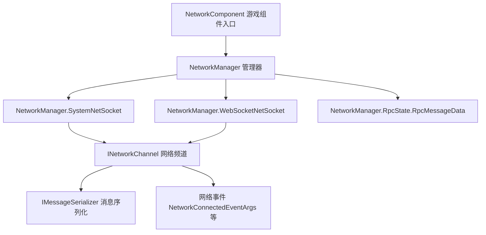

# 概述

Game Frame X Network 是 GameFrameX 的 **长连接网络组件**(包名 `com.gameframex.unity.network`),为 Unity 项目提供 TCP / WebSocket 长连接、RPC 调用、心跳保活、可插拔消息序列化与网络事件等能力,覆盖 Windows、macOS、Linux、Android、iOS 与 WebGL 平台。

## 快速开始

### 安装

任选以下一种方式(内容摘自官方中文 README):

1. 编辑 Unity 项目的 `Packages/manifest.json`,添加 `scopedRegistries` 并声明依赖:

```json
{
  "scopedRegistries": [
    {
      "name": "GameFrameX",
      "url": "https://gameframex.upm.alianblank.uk",
      "scopes": [
        "com.gameframex"
      ]
    }
  ],
  "dependencies": {
    "com.gameframex.unity.network": "2.6.6"
  }
}
```

Source: [README.zh-CN.md](https://github.com/GameFrameX/com.gameframex.unity.network/blob/main/README.zh-CN.md#L44-L59)

2. 直接在 `manifest.json` 的 `dependencies` 节点下添加:

```json
{
  "com.gameframex.unity.network": "https://github.com/gameframex/com.gameframex.unity.network.git"
}
```

Source: [README.zh-CN.md](https://github.com/GameFrameX/com.gameframex.unity.network/blob/main/README.zh-CN.md#L64-L69)

3. 在 Unity 的 `Package Manager` 中用 `Git URL` 方式添加仓库地址:`https://github.com/gameframex/com.gameframex.unity.network.git`。
4. 直接下载仓库放置到 Unity 项目的 `Packages` 目录下,Unity 会自动加载识别。

安装完成后需要重启 Unity 或刷新 Package Manager,让 `scopedRegistries` 生效;`scopes` 只对以 `com.gameframex` 开头的包生效。

### 依赖要求

| 依赖包 | 版本 |
|--------|------|
| `com.gameframex.unity` | 1.1.1 |
| `com.gameframex.unity.event` | 1.0.0 |

Source: [README.zh-CN.md](https://github.com/GameFrameX/com.gameframex.unity.network/blob/main/README.zh-CN.md#L97-L102)

### 主要功能

| 功能 | 说明 |
|------|------|
| 长连接 | TCP(`SystemNetSocket`)与 WebSocket(`WebSocketNetSocket`)两种 Socket 实现 |
| RPC 调用 | RPC 调用机制及超时处理(`RpcState` / `RpcMessageData`) |
| 心跳包 | 心跳保活,支持应用获得/失去焦点时发送配置 |
| 可插拔序列化 | `IMessageSerializer` 接口,支持两级注册(全局默认 + 按频道覆盖) |
| 网络频道管理 | 以频道为单位创建与管理连接(`INetworkChannel`) |
| 网络事件 | 连接 / 断开 / 错误 / 心跳丢失等事件参数(`NetworkConnectedEventArgs` 等) |

Source: [README.zh-CN.md](https://github.com/GameFrameX/com.gameframex.unity.network/blob/main/README.zh-CN.md#L28-L36)

## 工作原理速览

组件以 `NetworkComponent`(挂在 Unity 场景上的 `GameFrameworkComponent`)为统一入口,内部委托给 `NetworkManager` 的多个 partial 实现(`SystemNetSocket` / `WebSocketNetSocket` / `RpcState`)完成不同传输层与 RPC 状态管理:



- 源码入口:[NetworkComponent.cs](https://github.com/GameFrameX/com.gameframex.unity.network/blob/main/Runtime/Network/NetworkComponent.cs#L45)(`public sealed class NetworkComponent : GameFrameworkComponent`)
- 频道接口:[INetworkChannel.cs](https://github.com/GameFrameX/com.gameframex.unity.network/blob/main/Runtime/Network/Interface/INetworkChannel.cs#L42)(`public interface INetworkChannel`)
- 频道辅助接口:[INetworkChannelHelper.cs](https://github.com/GameFrameX/com.gameframex.unity.network/blob/main/Runtime/Network/Interface/INetworkChannelHelper.cs#L39)(`public interface INetworkChannelHelper`)
- TCP 实现:[NetworkManager.SystemNetSocket.cs](https://github.com/GameFrameX/com.gameframex.unity.network/blob/main/Runtime/Network/Network/SystemSocket/NetworkManager.SystemNetSocket.cs#L7)
- WebSocket 实现:[NetworkManager.WebSocketNetSocket.cs](https://github.com/GameFrameX/com.gameframex.unity.network/blob/main/Runtime/Network/Network/WebSocket/NetworkManager.WebSocketNetSocket.cs#L10)
- RPC 状态:[NetworkManager.RpcState.RpcMessageData.cs](https://github.com/GameFrameX/com.gameframex.unity.network/blob/main/Runtime/Network/Network/NetworkManager.RpcState.RpcMessageData.cs#L7)

## 接下来

- 官方文档:https://gameframex.doc.alianblank.com
- 更新日志:见仓库 [CHANGELOG.md](https://github.com/GameFrameX/com.gameframex.unity.network/blob/main/CHANGELOG.md)
- 开源协议:见 [LICENSE.md](https://github.com/GameFrameX/com.gameframex.unity.network/blob/main/LICENSE.md)
- 社区支持:QQ 群 467608841 / 233840761(通过[二维码](https://qm.qq.com/cgi-bin/qm/qr?k=ikT9gA5m2sKwOyNOfYmQvSAPK_c3GmD6)加入)
