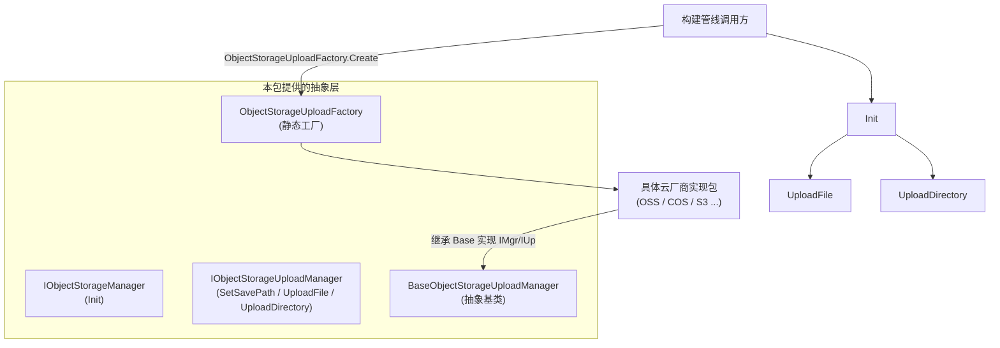

# 对象存储组件概述

GameFrameX 对象存储组件（`com.gameframex.unity.objectstorage`）为 Unity 项目提供上传文件与目录到云端对象存储服务的基础接口与抽象。它本身不绑定具体云厂商，而是通过 `IObjectStorageManager` / `IObjectStorageUploadManager` 接口约定核心契约，各家服务商（OSS、COS、S3 等）的具体实现以独立包的形式提供。

## 快速开始

1. **安装包**。在 Unity 项目根目录的 `Packages/manifest.json` 中添加依赖（任选其一）：
   - 通过 GameFrameX 的 scoped registry：
     ```json
     {
       "scopedRegistries": [
         {
           "name": "GameFrameX",
           "url": "https://gameframex.upm.alianblank.uk",
           "scopes": ["com.gameframex"]
         }
       ],
       "dependencies": {
         "com.gameframex.unity.objectstorage": "1.1.0"
       }
     }
     ```
   - 直接以 Git URL 形式添加：
     ```json
     {
       "dependencies": {
         "com.gameframex.unity.objectstorage": "https://github.com/gameframex/com.gameframex.unity.objectstorage.git"
       }
     }
     ```
   - 或者把仓库克隆到 `Packages/` 目录下，Unity 会自动加载。

   Source: [README.md](https://github.com/GameFrameX/com.gameframex.unity.objectstorage/blob/main/README.md#L37-L68)

2. **确认目标平台受支持**：

   | 平台 | 支持 |
   |------|------|
   | Windows | 是 |
   | macOS | 是 |
   | Linux | 是 |
   | Android | 是 |
   | iOS | 是 |

   Source: [README.zh-CN.md](https://github.com/GameFrameX/com.gameframex.unity.objectstorage/blob/main/README.zh-CN.md#L69-L78)

3. **选用一个具体实现**。本包只提供抽象与默认实现，需要按云厂商接入对应实现包，例如 OSS、COS、MinIO 等。

4. **调用上传接口**。在编辑器构建管线中，通过 `ObjectStorageUploadFactory` 拿到上传管理器实例，调用 `Init` 配置凭证，再调用 `UploadFile` / `UploadDirectory` 上传资源。

## 工作原理速览



- 接口 `IObjectStorageManager` 只暴露 `Init`，负责接入凭证与桶名；
- `IObjectStorageUploadManager` 在其上扩展 `SetSavePath`、`UploadFile`、`UploadDirectory`；
- `BaseObjectStorageUploadManager` 是抽象基类，第三方实现包继承它后由 `ObjectStorageUploadFactory` 构造实例。

Source: [IObjectStorageManager.cs](https://github.com/GameFrameX/com.gameframex.unity.objectstorage/blob/main/Editor/IObjectStorageManager.cs#L1-L14)、[IObjectStorageUploadManager.cs](https://github.com/GameFrameX/com.gameframex.unity.objectstorage/blob/main/Editor/IObjectStorageUploadManager.cs#L1-L22)、[ObjectStorageUploadFactory.cs](https://github.com/GameFrameX/com.gameframex.unity.objectstorage/blob/main/Editor/ObjectStorageUploadFactory.cs)

## 接下来

- 关于接口契约与签名细节，见《[接口参考](reference/interfaces)》。
- 关于如何接入一个具体云厂商实现并完成首次上传，见《[如何上传文件到对象存储](tasks/upload-file)》。
- 关于上传失败时的排查思路，见《[上传失败怎么办](troubleshooting/upload-failures)》。