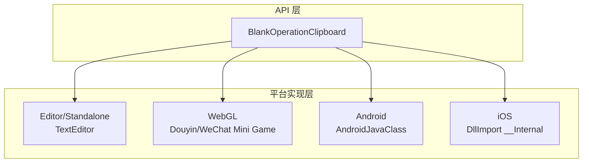
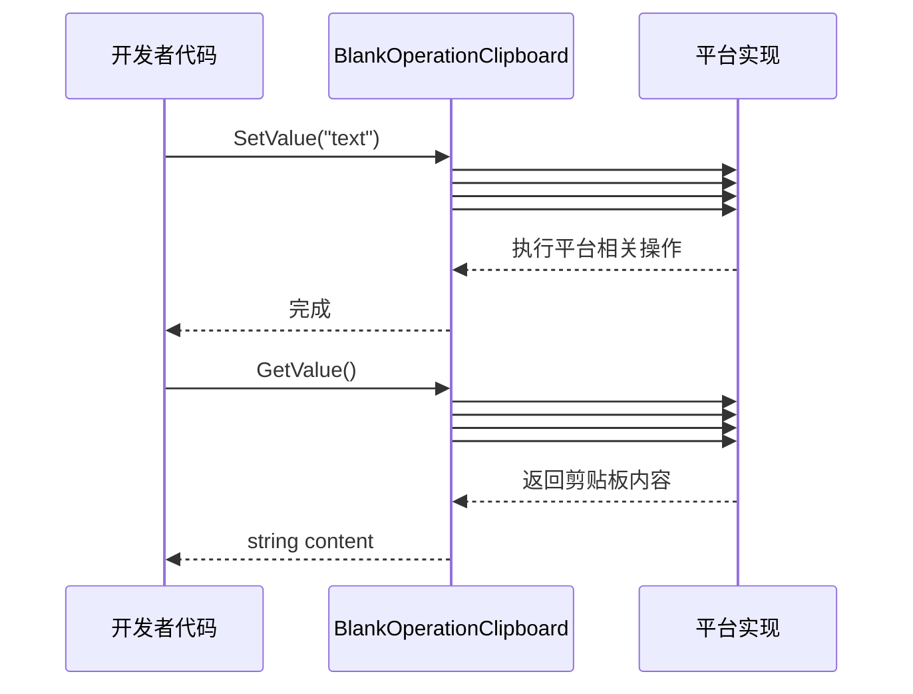

# 使用方法

本文档介绍如何使用 BlankOperationClipboard 插件进行剪贴板的读写操作。

## 概述

BlankOperationClipboard 是一个跨平台的 Unity 剪贴板操作工具类，提供了简洁的 API 接口用于获取和设置系统剪贴板内容。该库通过条件编译支持多种平台，包括 Unity 编辑器、桌面平台、WebGL（抖音/微信小游戏）、Android 和 iOS。

**设计意图**：通过统一的静态方法接口，开发者无需关心底层平台实现细节，即可完成跨平台的剪贴板操作。

## 架构



**架构说明**：
- **API 层**：提供统一的 `GetValue()` 和 `SetValue(string)` 静态方法
- **平台实现层**：通过 C# 条件编译 (`#if`) 实现各平台的原生调用

## 核心 API

### `GetValue(): string`

获取当前系统剪贴板中的文本内容。

**返回值**：剪贴板中的文本内容；如果剪贴板为空则返回空字符串。

> Source: [BlankOperationClipboard.cs](https://github.com/GameFrameX/com.gameframex.unity.operationclipboard/blob/main/Runtime/BlankOperationClipboard.cs#L31-L69)

### `SetValue(text: string): void`

将指定的文本内容设置到系统剪贴板。

**参数**：
- `text` (string)：要设置到剪贴板的文本内容

> Source: [BlankOperationClipboard.cs](https://github.com/GameFrameX/com.gameframex.unity.operationclipboard/blob/main/Runtime/BlankOperationClipboard.cs#L78-L106)

## 基本用法

### 读取剪贴板内容

```csharp
using UnityEngine;

public class ClipboardDemo : MonoBehaviour
{
    void ReadClipboard()
    {
        // 获取剪贴板内容
        string clipboardContent = BlankOperationClipboard.GetValue();
        Debug.Log("剪贴板内容: " + clipboardContent);
    }
}
```
> Source: [BlankOperationClipboardExample.cs](https://github.com/GameFrameX/com.gameframex.unity.operationclipboard/blob/main/Samples~/BlankOperationClipboardExample.cs#L46-L50)

### 写入剪贴板内容

```csharp
using UnityEngine;

public class ClipboardDemo : MonoBehaviour
{
    void WriteClipboard()
    {
        // 设置剪贴板内容
        string textToCopy = "要复制的文本内容";
        BlankOperationClipboard.SetValue(textToCopy);
        Debug.Log("已设置剪贴板内容");
    }
}
```
> Source: [BlankOperationClipboardExample.cs](https://github.com/GameFrameX/com.gameframex.unity.operationclipboard/blob/main/Samples~/BlankOperationClipboardExample.cs#L44-L47)

### 完整示例

以下是一个完整的 MonoBehaviour 示例，演示了如何结合读写操作：

```csharp
using UnityEngine;

public class BlankOperationClipboardExample : MonoBehaviour
{
    private string text = "AAAA";
    private string result = "";

    void OnGUI()
    {
        // 文本输入框
        text = GUILayout.TextField(text, GUILayout.Width(500), GUILayout.Height(100));

        // 设置剪贴板按钮
        if (GUILayout.Button("SetValue", GUILayout.Width(500), GUILayout.Height(100)))
        {
            BlankOperationClipboard.SetValue(text);
        }

        // 读取剪贴板按钮
        if (GUILayout.Button("GetValue", GUILayout.Width(500), GUILayout.Height(100)))
        {
            result = BlankOperationClipboard.GetValue();
        }

        // 显示读取结果
        GUILayout.Label(result);
    }
}
```
> Source: [BlankOperationClipboardExample.cs](https://github.com/GameFrameX/com.gameframex.unity.operationclipboard/blob/main/Samples~/BlankOperationClipboardExample.cs#L37-L53)

## 平台行为差异

不同平台获取剪贴板的行为存在差异：

| 平台 | 获取剪贴板 | 设置剪贴板 | 备注 |
|------|-----------|-----------|------|
| Unity Editor | 使用 TextEditor 模拟粘贴操作 | 使用 TextEditor 模拟复制操作 | 开发调试用 |
| Standalone | 使用 TextEditor 模拟粘贴操作 | 使用 TextEditor 模拟复制操作 | 桌面平台 |
| WebGL (抖音) | 异步回调获取 | 同步设置 | 需要开启 ENABLE_DOUYIN_MINI_GAME |
| WebGL (微信) | 异步回调获取 | 同步设置 | 需要开启 ENABLE_WECHAT_MINI_GAME |
| Android | 调用 Java 方法 GetClipBoard | 调用 Java 方法 SetClipBoard | 需要 Android 原生插件 |
| iOS | 调用原生方法 GetClipBoard | 调用原生方法 SetClipBoard | 需要 iOS 原生插件 |

> ⚠️ 注意：Android 和 iOS 平台需要配置对应的原生插件才能正常工作。详细配置请参考 [平台配置](./4-platforms) 文档。

## 核心流程



## 注意事项

1. **空值处理**：`GetValue()` 方法在剪贴板为空时返回空字符串 `""`，而不是 `null`。

2. **Unity 编辑器限制**：在编辑器中运行时，使用 `TextEditor` 类模拟剪贴板操作，这意味着需要编辑器窗口处于激活状态才能正确获取焦点。

3. **WebGL 异步获取**：在 WebGL 平台（抖音/微信小游戏），获取剪贴板内容是异步操作，当前实现使用回调方式处理。

4. **平台原生插件**：Android 和 iOS 平台需要配合原生插件使用，请确保已正确配置平台相关的原生代码。

## 相关链接

- [概述](./1-overview) - 项目整体介绍
- [安装](./2-installation) - 安装指南
- [平台配置](./4-platforms) - 各平台详细配置说明
- [示例](./5-samples) - 更多使用示例
- [常见问题](./6-troubleshooting) - 常见问题与解决方案
