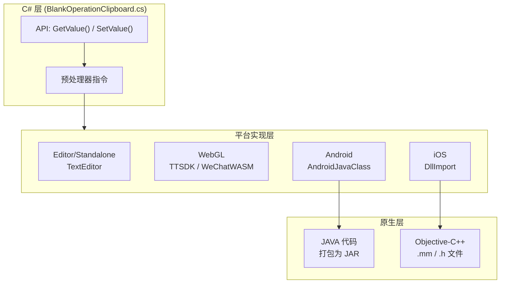

# 平台配置

本文档详细介绍 BlankOperationClipboard 插件在各平台上的配置方法，包括 Android、iOS、WebGL 小游戏等平台的原生代码集成和配置要求。

## 概述

BlankOperationClipboard 插件通过平台特定的预处理器指令实现跨平台剪贴板操作。不同平台需要不同的原生代码配置：

| 平台 | 实现方式 | 关键文件 |
|------|----------|----------|
| Android | AndroidJavaClass 调用 JAR | `Plugins/Android/com.alianhome.operationclipboard.jar` |
| iOS | DllImport 调用 Objective-C++ | `Plugins/iOS/BlankOperationClipboard/` |
| WebGL (抖音) | TTSDK.TT API | C# 条件编译 `ENABLE_DOUYIN_MINI_GAME` |
| WebGL (微信) | WeChatWASM API | C# 条件编译 `ENABLE_WECHAT_MINI_GAME` |
| Editor/Standalone | TextEditor 类 | 无需额外配置 |

## 架构



### 平台调用流程

```mermaid
sequenceDiagram
    participant User as 用户代码
    participant CSharp as C# 层
    participant Native as 原生平台
    participant System as 系统剪贴板

    User->>CSharp: BlankOperationClipboard.GetValue()
    CSharp->>CSharp: #if UNITY_IOS 判断平台
    
    alt UNITY_IOS
        CSharp->>Native: DllImport 调用 GetClipBoard()
        Native->>System: UIPasteboard.generalPasteboard
        System-->>Native: 剪贴板内容
        Native-->>CSharp: char* 返回值
    elif UNITY_ANDROID
        CSharp->>Native: AndroidJavaClass.CallStatic()
        Native->>System: Android ClipboardManager
        System-->>Native: 剪贴板内容
        Native-->>CSharp: String 返回值
    elif UNITY_WEBGL
        CSharp->>Native: TTSDK.TT / WeChatWASM API
        Native-->>CSharp: 异步回调
    else
        CSharp->>System: GUIUtility.systemCopyBuffer
    end
    
    CSharp-->>User: string 内容
```

## 平台详细配置

### Android 平台配置

Android 平台需要将原生 JAR 文件放置在 `Plugins/Android` 目录下。

**文件位置：**
```
Plugins/
└── Android/
    └── com.alianhome.operationclipboard.jar
```

**JAR 包结构：**
JAR 文件中包含 `MainActivity` 类，提供以下静态方法：
- `GetClipBoard()`: 获取剪贴板内容
- `SetClipBoard(String text)`: 设置剪贴板内容

**C# 调用代码：**
```csharp
#if UNITY_ANDROID
using (AndroidJavaClass androidJavaClass = new AndroidJavaClass("com.alianhome.operationclipboard.MainActivity"))
{
    // 获取剪贴板
    string content = androidJavaClass.CallStatic<string>("GetClipBoard");
    
    // 设置剪贴板
    androidJavaClass.CallStatic("SetClipBoard", text);
}
#endif
```
> Source: [BlankOperationClipboard.cs](https://github.com/GameFrameX/com.gameframex.unity.operationclipboard/blob/main/Runtime/BlankOperationClipboard.cs#L58-L62)

### iOS 平台配置

iOS 平台需要在 `Plugins/iOS` 目录下放置原生 Objective-C++ 代码文件。

**文件结构：**
```
Plugins/
└── iOS/
    └── BlankOperationClipboard/
        ├── BlankOperationClipboard.h
        └── BlankOperationClipboard.mm
```

**头文件 (BlankOperationClipboard.h)：**
```objc
#import <Foundation/Foundation.h>

@interface BlankOperationClipboard : NSObject

#if defined (__cplusplus)
extern "C" {
#endif
    char * GetClipBoard();
    void SetClipBoard(char* text);
#if defined (__cplusplus)
}
#endif

@end
```
> Source: [BlankOperationClipboard.h](https://github.com/GameFrameX/com.gameframex.unity.operationclipboard/blob/main/Plugins/iOS/BlankOperationClipboard/BlankOperationClipboard.h#L1-L14)

**实现文件 (BlankOperationClipboard.mm)：**
```objc
#import "BlankOperationClipboard.h"

@implementation BlankOperationClipboard

    char * GetClipBoard(){
        UIPasteboard * pasteboard = [UIPasteboard generalPasteboard];			
        const char * a = [pasteboard.string UTF8String];
        char * b = (char*)malloc(strlen(a)+1);
        strcpy(b, a);
        return b;
    }
    void SetClipBoard(char * text){
        UIPasteboard * pasteboard = [UIPasteboard generalPasteboard];
        pasteboard.string = [NSString stringWithUTF8String:text];
    }

@end
```
> Source: [BlankOperationClipboard.mm](https://github.com/GameFrameX/com.gameframex.unity.operationclipboard/blob/main/Plugins/iOS/BlankOperationClipboard/BlankOperationClipboard.mm#L1-L22)

**C# 调用代码：**
```csharp
#if UNITY_IOS
using System.Runtime.InteropServices;

[DllImport("__Internal")]
private static extern string GetClipBoard();

[DllImport("__Internal")]
private static extern void SetClipBoard(string text);
#endif
```
> Source: [BlankOperationClipboard.cs](https://github.com/GameFrameX/com.gameframex.unity.operationclipboard/blob/main/Runtime/BlankOperationClipboard.cs#L15-L21)

### WebGL 平台配置

WebGL 平台支持抖音和微信小游戏，需要通过条件编译启用相应的功能。

**抖音小游戏配置：**

```csharp
#if ENABLE_DOUYIN_MINI_GAME
TTSDK.TT.GetClipboardData((b, text) =>
{
    if (b)
    {
        content = text;
    }
});
TTSDK.TT.SetClipboardData(text);
#endif
```
> Source: [BlankOperationClipboard.cs](https://github.com/GameFrameX/com.gameframex.unity.operationclipboard/blob/main/Runtime/BlankOperationClipboard.cs#L41-L49)

**微信小游戏配置：**

```csharp
#if ENABLE_WECHAT_MINI_GAME
var clipboardDataOption = new WeChatWASM.GetClipboardDataOption
{
    success = option => { content = option.data; },
};
WeChatWASM.WX.GetClipboardData(clipboardDataOption);

WeChatWASM.WX.SetClipboardData(new WeChatWASM.SetClipboardDataOption
{
    data = text,
});
#endif
```
> Source: [BlankOperationClipboard.cs](https://github.com/GameFrameX/com.gameframex.unity.operationclipboard/blob/main/Runtime/BlankOperationClipboard.cs#L50-L56)

**启用条件编译符号：**

在 Unity 项目中启用小游戏支持，需要在 Player Settings 中添加编译符号：

| 编译符号 | 平台 | 说明 |
|----------|------|------|
| `ENABLE_DOUYIN_MINI_GAME` | WebGL | 启用抖音小游戏支持 |
| `ENABLE_WECHAT_MINI_GAME` | WebGL | 启用微信小游戏支持 |

### Editor 和 Standalone 配置

Editor 和 Standalone 平台使用 Unity 内置的 `TextEditor` 类，无需额外的原生代码配置。

```csharp
#if UNITY_EDITOR || UNITY_STANDALONE
TextEditor textEditor = new TextEditor();
textEditor.OnFocus();
textEditor.Paste();  // 获取
textEditor.Copy();  // 设置
#endif
```
> Source: [BlankOperationClipboard.cs](https://github.com/GameFrameX/com.gameframex.unity.operationclipboard/blob/main/Runtime/BlankOperationClipboard.cs#L33-L38)

### 其他平台配置

对于不支持的平台，插件会回退到使用 `GUIUtility.systemCopyBuffer`：

```csharp
UnityEngine.GUIUtility.systemCopyBuffer = text;
```
> Source: [BlankOperationClipboard.cs](https://github.com/GameFrameX/com.gameframex.unity.operationclipboard/blob/main/Runtime/BlankOperationClipboard.cs#L67)

## 链接器配置

插件包含 `link.xml` 文件以防止代码在 IL2CPP 编译时被裁剪：

```xml
<?xml version="1.0" encoding="UTF-8"?>
<linker>
    <assembly fullname="BlankGetChannel.Runtime" preserve="all"/>
</linker>
```
> Source: [link.xml](https://github.com/GameFrameX/com.gameframex.unity.operationclipboard/blob/main/Runtime/link.xml#L1-L4)

## 平台兼容性总结

| 平台 | 读取剪贴板 | 写入剪贴板 | 备注 |
|------|------------|------------|------|
| Unity Editor | ✅ | ✅ | 使用 TextEditor |
| Standalone (PC/Mac) | ✅ | ✅ | 使用 TextEditor |
| Android | ✅ | ✅ | 需要 JAR 插件 |
| iOS | ✅ | ✅ | 需要 .mm/.h 文件 |
| 抖音小游戏 | ✅ | ✅ | 需要 ENABLE_DOUYIN_MINI_GAME |
| 微信小游戏 | ✅ | ✅ | 需要 ENABLE_WECHAT_MINI_GAME |
| 其他平台 | ✅ | ✅ | 使用 GUIUtility.systemCopyBuffer |

## 相关链接

- [概述](./1-overview) - 项目概述和核心功能介绍
- [安装](./2-installation) - 插件安装方法
- [使用方法](./3-usage) - API 使用说明和代码示例
- [示例](./5-samples) - 完整示例代码
- [常见问题](./6-troubleshooting) - 常见问题排查
