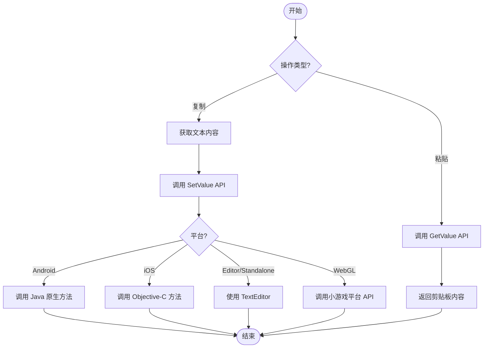

# 示例

本文档提供 `BlankOperationClipboard` 工具类的完整代码示例，演示如何在 Unity 项目中实现剪贴板的读取和写入操作。

## 概述

`BlankOperationClipboard` 是一个跨平台的静态工具类，支持在 Unity 编辑器、桌面平台、WebGL（小游戏）、Android 和 iOS 等多种平台上进行剪贴板操作。该类提供两个核心 API：`GetValue()` 用于获取剪贴板内容，`SetValue(string text)` 用于设置剪贴板内容。

> 注意：完整的 API 方法签名和参数说明请参阅 [使用方法](./3-usage) 文档。

## 基础使用示例

以下示例展示了最基础的剪贴板读写操作，通过 Unity 的旧版 OnGUI 系统实现简单的交互界面。

```csharp
using UnityEngine;

public class BlankOperationClipboardExample : MonoBehaviour
{
    private string text = "AAAA";
    private string result = "";
    void OnGUI()
    {
        // 文本输入框
        text = GUILayout.TextField(text, GUILayout.Width(500), GUILayout.Height(100));
        
        // 设置剪贴板按钮
        if (GUILayout.Button("SetValue", GUILayout.Width(500), GUILayout.Height(100)))
        {
            BlankOperationClipboard.SetValue(text);
        }
        
        // 获取剪贴板按钮
        if (GUILayout.Button("GetValue", GUILayout.Width(500), GUILayout.Height(100)))
        {
            result = BlankOperationClipboard.GetValue();
        }
        
        // 显示获取的结果
        GUILayout.Label(result);
    }
}
```

> Source: [BlankOperationClipboardExample.cs](https://github.com/GameFrameX/com.gameframex.unity.operationclipboard/blob/main/Samples~/BlankOperationClipboardExample.cs#L37-L54)

### 代码解析

| 代码段 | 说明 |
|--------|------|
| `private string text = "AAAA"` | 存储要复制到剪贴板的文本 |
| `private string result = ""` | 存储从剪贴板读取的结果 |
| `GUILayout.TextField()` | 创建可编辑的文本输入框 |
| `BlankOperationClipboard.SetValue(text)` | 将文本内容写入系统剪贴板 |
| `BlankOperationClipboard.GetValue()` | 从系统剪贴板读取文本内容 |
| `GUILayout.Label()` | 显示读取的文本结果 |

## 进阶使用示例

### 在 UI 按钮中使用

以下示例展示如何在现代 Unity UI 系统中使用剪贴板功能：

```csharp
using UnityEngine;
using UnityEngine.UI;

public class ClipboardUIExample : MonoBehaviour
{
    [SerializeField] private InputField inputField;
    [SerializeField] private Text resultText;
    [SerializeField] private Button copyButton;
    [SerializeField] private Button pasteButton;

    void Start()
    {
        // 绑定按钮点击事件
        copyButton.onClick.AddListener(OnCopyClicked);
        pasteButton.onClick.AddListener(OnPasteClicked);
    }

    private void OnCopyClicked()
    {
        // 获取输入框内容并复制到剪贴板
        string content = inputField.text;
        BlankOperationClipboard.SetValue(content);
        Debug.Log($"已复制到剪贴板: {content}");
    }

    private void OnPasteClicked()
    {
        // 从剪贴板读取内容并显示
        string content = BlankOperationClipboard.GetValue();
        resultText.text = content;
        Debug.Log($"从剪贴板读取: {content}");
    }
}
```

### 在 UGUI 中使用

对于使用 UGUI（Unity GUI）系统的项目，可以按以下方式集成：

```csharp
using UnityEngine;
using UnityEngine.UI;

public class UGUIClipboardExample : MonoBehaviour
{
    [SerializeField] private TMP_InputField inputField;
    [SerializeField] private TextMeshProUGUI resultText;

    public void CopyToClipboard()
    {
        if (string.IsNullOrEmpty(inputField.text))
        {
            Debug.LogWarning("输入框内容为空");
            return;
        }
        BlankOperationClipboard.SetValue(inputField.text);
    }

    public void PasteFromClipboard()
    {
        string clipboardContent = BlankOperationClipboard.GetValue();
        resultText.text = string.IsNullOrEmpty(clipboardContent) 
            ? "剪贴板为空" 
            : clipboardContent;
    }
}
```

### 在游戏逻辑中使用

以下示例展示如何在游戏内购买或兑换码场景中使用剪贴板功能：

```csharp
using UnityEngine;

public class GameClipboardExample : MonoBehaviour
{
    // 复制邀请链接
    public void CopyInviteLink(string playerId)
    {
        string inviteLink = $"https://game.example.com/invite/{playerId}";
        BlankOperationClipboard.SetValue(inviteLink);
        Debug.Log($"邀请链接已复制: {inviteLink}");
    }

    // 复制游戏内金币地址
    public void CopyWalletAddress(string walletAddress)
    {
        BlankOperationClipboard.SetValue(walletAddress);
        Debug.Log($"钱包地址已复制");
    }

    // 粘贴兑换码
    public string GetRedeemCode()
    {
        string code = BlankOperationClipboard.GetValue();
        // 简单验证兑换码格式
        if (string.IsNullOrWhiteSpace(code) || code.Length < 8)
        {
            Debug.LogWarning("无效的兑换码");
            return null;
        }
        return code.Trim().ToUpper();
    }
}
```

## 使用流程图

以下流程图展示了剪贴板操作的标准流程：



## 平台注意事项

| 平台 | 注意事项 |
|------|----------|
| Unity Editor | 使用 TextEditor 类，需要编辑器窗口处于激活状态 |
| Standalone | 同样使用 TextEditor，需要目标窗口获得焦点 |
| Android | 需要在 Android 原生代码中实现 `GetClipBoard` 和 `SetClipBoard` 方法 |
| iOS | 需要在 iOS 原生代码中实现对应的 C 函数 |
| WebGL (微信/抖音) | 需要在小游戏平台正确配置剪贴板权限 |

> 详细的平台特定配置说明请参阅 [平台配置](./4-platforms) 文档。

## 常见错误处理

### 处理空剪贴板

```csharp
public string SafeGetClipboardValue()
{
    string value = BlankOperationClipboard.GetValue();
    return value ?? string.Empty;
}
```

### 处理异常情况

```csharp
public bool TryCopyToClipboard(string text)
{
    try
    {
        if (string.IsNullOrEmpty(text))
        {
            Debug.LogWarning("复制的文本为空");
            return false;
        }
        BlankOperationClipboard.SetValue(text);
        return true;
    }
    catch (System.Exception ex)
    {
        Debug.LogError($"复制到剪贴板失败: {ex.Message}");
        return false;
    }
}
```

## 相关链接

- [概述](./1-overview) - 项目概述与功能介绍
- [安装](./2-installation) - 插件安装指南
- [使用方法](./3-usage) - API 详细说明与参数表
- [平台配置](./4-platforms) - 各平台具体配置方法
- [常见问题](./6-troubleshooting) - 常见问题与解决方案
