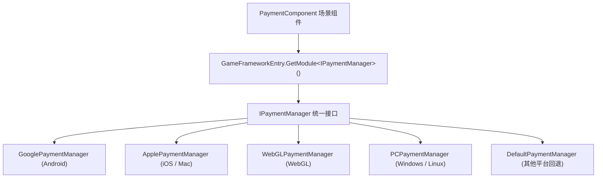

# 安装与快速上手

Game Frame X Payment 是一个 Unity 支付包，为应用内购买和订阅提供统一接口，支持 Google Play 与 Apple App Store。本页带你从安装包、挂载组件到发起第一次购买，几分钟内跑通完整链路。

## 快速开始

### 1. 确认环境

| 依赖项 | 版本要求 |
|--------|----------|
| Unity | 2019.4 及以上 |
| `com.gameframex.unity` | 2.5.1 |
| `com.gameframex.unity.payment.google` | 1.0.1 |

以上依赖声明来自包的 `package.json`，安装时由 UPM 自动解析。

Source: [package.json](https://github.com/GameFrameX/com.gameframex.unity.payment/blob/main/package.json#L24-L27)

### 2. 安装包

任选以下一种方式：

**方式一：scopedRegistries（推荐）**

编辑 Unity 项目的 `Packages/manifest.json`，添加 `scopedRegistries` 部分：

```json
{
  "scopedRegistries": [
    {
      "name": "GameFrameX",
      "url": "https://gameframex.upm.alianblank.uk",
      "scopes": [
        "com.gameframex"
      ]
    }
  ],
  "dependencies": {
    "com.gameframex.unity.payment": "1.1.0"
  }
}
```

`scopes` 控制哪些包通过此注册表解析，只有以 `com.gameframex` 开头的包才会从这个注册表获取。

Source: [README.zh-CN.md](https://github.com/GameFrameX/com.gameframex.unity.payment/blob/main/README.zh-CN.md#L40-L58)

**方式二：直接写 Git 地址**

在 `manifest.json` 的 `dependencies` 节点下添加：

```json
{
   "com.gameframex.unity.payment": "https://github.com/gameframex/com.gameframex.unity.payment.git"
}
```

Source: [README.zh-CN.md](https://github.com/GameFrameX/com.gameframex.unity.payment/blob/main/README.zh-CN.md#L60-L65)

**方式三：Package Manager 添加 Git URL**

Unity 菜单 `Window > Package Manager > + > Add package from git URL`，地址填 `https://github.com/gameframex/com.gameframex.unity.payment.git`。

**方式四：源码直放**

直接下载仓库放置到 Unity 项目的 `Packages` 目录下，Unity 会自动加载识别。

Source: [README.zh-CN.md](https://github.com/GameFrameX/com.gameframex.unity.payment/blob/main/README.zh-CN.md#L66-L67)

### 3. 挂载 PaymentComponent 组件

在场景中创建 GameFrameX 物体，通过 `AddComponentMenu` 路径 `GameFrameX/Payment` 添加 `PaymentComponent`。组件带有 `[RequireComponent(typeof(GameFrameXPaymentCroppingHelper))]`，会自动携带裁剪辅助组件，且 `[DisallowMultipleComponent]` 限制同物体只能挂一个。

```csharp
[DisallowMultipleComponent]
[RequireComponent(typeof(GameFrameXPaymentCroppingHelper))]
[AddComponentMenu("GameFrameX/Payment")]
[UnityEngine.Scripting.Preserve]
public class PaymentComponent : GameFrameworkComponent
```

Source: [PaymentComponent.cs](https://github.com/GameFrameX/com.gameframex.unity.payment/blob/main/Runtime/PaymentComponent.cs#L17-L21)

组件在 `Awake()` 中按当前编译平台自动选择对应平台的支付管理器实现（Android 用 Google、iOS/Mac 用 Apple、WebGL、PC 各自独立，其余平台回退到 `DefaultPaymentManager`），无需手动指定：

```csharp
#if UNITY_ANDROID
    componentType = m_componentAndroidType;
#elif UNITY_IOS
    componentType = m_componentIOSType;
#elif UNITY_WEBGL
    componentType = m_componentWebGLType;
#elif UNITY_STANDALONE_WIN || UNITY_STANDALONE_LINUX
    componentType = m_componentPCType;
#elif UNITY_STANDALONE_OSX
    componentType = m_componentMacType;
#else
    componentType = typeof(DefaultPaymentManager).FullName;
#endif
    ImplementationComponentType = Utility.Assembly.GetType(componentType);
    InterfaceComponentType = typeof(IPaymentManager);
    base.Awake();
```

Source: [PaymentComponent.cs](https://github.com/GameFrameX/com.gameframex.unity.payment/blob/main/Runtime/PaymentComponent.cs#L69-L86)

### 4. 初始化支付系统

启动时调用 `Init`，参数 `isDebug` 控制沙盒模式，`isClientVerify` 控制是否执行客户端购买验证：

```csharp
public void Init(bool isDebug = false, bool isClientVerify = true)
{
    _paymentManager.Init(isDebug, isClientVerify);
}
```

Source: [PaymentComponent.cs](https://github.com/GameFrameX/com.gameframex.unity.payment/blob/main/Runtime/PaymentComponent.cs#L102-L105)

如需预加载商品信息，在初始化之前调用 `SetPredefinedProductIds`（源码注释明确要求此方法在 `Initialize()` 之前调用），分别传入内购商品 ID 列表和订阅商品 ID 列表：

```csharp
public void SetPredefinedProductIds(List<string> inAppProductIds, List<string> subsProductIds)
{
    _paymentManager.SetPredefinedProductIds(inAppProductIds, subsProductIds);
}
```

Source: [PaymentComponent.cs](https://github.com/GameFrameX/com.gameframex.unity.payment/blob/main/Runtime/PaymentComponent.cs#L122-L126)

初始化后可用 `IsReady()` 检查支付系统是否准备就绪，返回 `bool`。

### 5. 订阅事件并发起购买

先订阅结果事件（组件上直接暴露了四个事件：`OnPurchaseSuccess`、`OnPurchaseFailed`、`OnQueryPurchasesResult`、`OnConsumePurchaseResult`，均为 `EventHandler<PaymentEventArgs>`），再用推荐的 `Buy(PurchaseParams)` 发起购买：

```csharp
public void Buy(PurchaseParams purchaseParams)
```

Source: [PaymentComponent.cs](https://github.com/GameFrameX/com.gameframex.unity.payment/blob/main/Runtime/PaymentComponent.cs#L233-L238)

`PurchaseParams` 携带产品 ID、订单 ID 等参数，各支付渠道可使用对应子类传入渠道特有参数。注意旧的 `BuyInApp` / `BuySubs` / `Buy(productId, productType, ...)` 已标记 `[Obsolete("请使用 Buy(PurchaseParams) 替代")]`，新代码不要使用。

Source: [PaymentComponent.cs](https://github.com/GameFrameX/com.gameframex.unity.payment/blob/main/Runtime/PaymentComponent.cs#L161-L163)

### 6. 处理购买结果并消耗

购买成功后，对一次性商品调用 `ConsumePurchase(purchaseToken)` 消耗购买（`purchaseToken` 为空时组件会打 `Log.Warning("Purchase token is null or empty.")` 并直接返回）；用 `QueryPurchases(PaymentProductType)` 查询历史购买记录，`productType` 取 `PaymentProductType` 枚举的 inapp 或 subs 值。

Source: [PaymentComponent.cs](https://github.com/GameFrameX/com.gameframex.unity.payment/blob/main/Runtime/PaymentComponent.cs#L133-L151)

## 工作原理速览

组件本身只是一层薄封装：`PaymentComponent` 在 `Awake()` 里按平台解析实现类类型，再通过 `GameFrameworkEntry.GetModule<IPaymentManager>()` 拿到当前平台的支付管理器，后续所有 API 都转调给它。



## 接下来

- 完整 API 说明与参数细节：见仓库 [README.zh-CN.md](https://github.com/GameFrameX/com.gameframex.unity.payment/blob/main/README.zh-CN.md#L68-L126)
- 版本历史：[CHANGELOG.md](https://github.com/GameFrameX/com.gameframex.unity.payment/blob/main/CHANGELOG.md)
- 官方文档与支持：[https://gameframex.doc.alianblank.com](https://gameframex.doc.alianblank.com)，QQ 群 467608841 / 233840761
