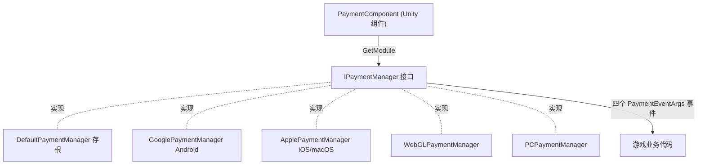

# 支付组件概述

Payment 支付组件是 GameFrameX 的 Unity 内购包，为应用内购买和订阅提供统一接口 `IPaymentManager`。你在场景里挂一个 `PaymentComponent`，运行时会按平台自动装配对应渠道实现（Android → Google Play、iOS/macOS → App Store 等），业务代码只面向同一套 `Init` / `Buy` / `QueryPurchases` / `ConsumePurchase` API。

## 快速开始

### 1. 安装包

编辑 Unity 项目的 `Packages/manifest.json`，任选一种方式：

```json
{
  "scopedRegistries": [
    {
      "name": "GameFrameX",
      "url": "https://gameframex.upm.alianblank.uk",
      "scopes": [
        "com.gameframex"
      ]
    }
  ],
  "dependencies": {
    "com.gameframex.unity.payment": "1.1.0"
  }
}
```

也可以在 `dependencies` 下直接写 Git 地址 `https://github.com/gameframex/com.gameframex.unity.payment.git`，或用 Package Manager 的 Add package from git URL 添加。

Source: [README.zh-CN.md](https://github.com/GameFrameX/com.gameframex.unity.payment/blob/main/README.zh-CN.md#L40-L66)

### 2. 挂载支付组件

在 Unity 菜单选择 `GameFrameX/Payment` 添加组件，它会强制带上裁剪辅助组件：

```csharp
[DisallowMultipleComponent]
[RequireComponent(typeof(GameFrameXPaymentCroppingHelper))]
[AddComponentMenu("GameFrameX/Payment")]
[UnityEngine.Scripting.Preserve]
public class PaymentComponent : GameFrameworkComponent
```

Source: [PaymentComponent.cs](https://github.com/GameFrameX/com.gameframex.unity.payment/blob/main/Runtime/PaymentComponent.cs#L17-L21)

组件在 `Awake` 中按编译平台选择实现类型，并从框架模块系统取出 `IPaymentManager`：

```csharp
#if UNITY_ANDROID
    componentType = m_componentAndroidType;
#elif UNITY_IOS
    componentType = m_componentIOSType;
#elif UNITY_WEBGL
    componentType = m_componentWebGLType;
#elif UNITY_STANDALONE_WIN || UNITY_STANDALONE_LINUX
    componentType = m_componentPCType;
#elif UNITY_STANDALONE_OSX
    componentType = m_componentMacType;
#else
    componentType = typeof(DefaultPaymentManager).FullName;
#endif
    ImplementationComponentType = Utility.Assembly.GetType(componentType);
    InterfaceComponentType = typeof(IPaymentManager);
    base.Awake();

    _paymentManager = GameFrameworkEntry.GetModule<IPaymentManager>();
```

Source: [PaymentComponent.cs](https://github.com/GameFrameX/com.gameframex.unity.payment/blob/main/Runtime/PaymentComponent.cs#L71-L93)

平台与默认实现的映射：

| 平台 | 默认实现类型（可在 Inspector 修改） |
|------|------------------------------------|
| UNITY_ANDROID | `GameFrameX.Payment.Google.Runtime.GooglePaymentManager` |
| UNITY_IOS / UNITY_STANDALONE_OSX | `GameFrameX.Payment.Apple.Runtime.ApplePaymentManager` |
| UNITY_WEBGL | `GameFrameX.Payment.WebGL.Runtime.WebGLPaymentManager` |
| UNITY_STANDALONE_WIN / LINUX | `GameFrameX.Payment.PC.Runtime.PCPaymentManager` |
| 其他平台 | `DefaultPaymentManager`（存根，仅告警） |

### 3. 初始化并预加载商品

`SetPredefinedProductIds` 必须在 `Init` 之前调用，用于预加载商品缓存：

```csharp
public void Init(bool isDebug = false, bool isClientVerify = true)
{
    _paymentManager.Init(isDebug, isClientVerify);
}
```

Source: [PaymentComponent.cs](https://github.com/GameFrameX/com.gameframex.unity.payment/blob/main/Runtime/PaymentComponent.cs#L102-L105)

`isDebug` 为沙盒模式开关；`isClientVerify` 是否在客户端验证购买，采用服务器验证（强联网）时应设为 `false`（注意：组件层 `Init` 的默认值是 `true`，接口 `IPaymentManager.Init` 的默认值是 `false`）。

### 4. 订阅支付事件

组件暴露四个事件，直接转发到当前平台的 `IPaymentManager` 实现：`OnPurchaseSuccess`、`OnPurchaseFailed`、`OnQueryPurchasesResult`、`OnConsumePurchaseResult`，参数均为 `PaymentEventArgs`。

Source: [PaymentComponent.cs](https://github.com/GameFrameX/com.gameframex.unity.payment/blob/main/Runtime/PaymentComponent.cs#L33-L64)

### 5. 发起购买

推荐使用 `Buy(PurchaseParams)`，各渠道用对应子类传入渠道特有参数；组件层会先做参数校验（`ProductId`、`OrderId` 为空时打印 `Log.Warning` 并直接返回）：

```csharp
public void Buy(PurchaseParams purchaseParams)
{
    if (purchaseParams == null)
    {
        Log.Warning("Purchase params is null.");
        return;
    }

    if (string.IsNullOrEmpty(purchaseParams.ProductId))
    {
        Log.Warning("Product ID is null or empty.");
        return;
    }

    if (string.IsNullOrEmpty(purchaseParams.OrderId))
    {
        Log.Warning("Order ID is null or empty.");
        return;
    }

    _paymentManager.Buy(purchaseParams);
}
```

Source: [PaymentComponent.cs](https://github.com/GameFrameX/com.gameframex.unity.payment/blob/main/Runtime/PaymentComponent.cs#L238-L259)

旧的 `BuyInApp` / `BuySubs` / `Buy(productId, productType, orderId, ...)` 均已标记 `[Obsolete("请使用 Buy(PurchaseParams) 替代")]`，仍可用但不建议新代码使用。

Source: [IPaymentManager.cs](https://github.com/GameFrameX/com.gameframex.unity.payment/blob/main/Runtime/IPaymentManager.cs#L79-L105)

### 6. 查询与消耗

- `QueryPurchases(PaymentProductType productType)`：按产品类型查询购买记录，结果走 `OnQueryPurchasesResult` 事件。
- `ConsumePurchase(string purchaseToken)`：消耗购买，`purchaseToken` 为空时打印 `Purchase token is null or empty.` 并返回。
- `IsReady()`：支付系统是否初始化完成，购买前建议先检查。

Source: [PaymentComponent.cs](https://github.com/GameFrameX/com.gameframex.unity.payment/blob/main/Runtime/PaymentComponent.cs#L112-L152)

## 工作原理速览

`PaymentComponent` 只做平台路由与参数校验，真正的支付逻辑在各渠道的 `IPaymentManager` 实现里；`DefaultPaymentManager` 是空存根，调用其方法只会输出提示 "You are using DefaultPaymentManager which is a stub. Please integrate a channel-specific implementation (e.g. Google, Apple)."。



Source: [PaymentComponent.cs](https://github.com/GameFrameX/com.gameframex.unity.payment/blob/main/Runtime/PaymentComponent.cs#L23-L28)、[DefaultPaymentManager.cs](https://github.com/GameFrameX/com.gameframex.unity.payment/blob/main/Runtime/DefaultPaymentManager.cs#L17-L27)

## 接下来

- 接口契约与事件定义：[IPaymentManager.cs](https://github.com/GameFrameX/com.gameframex.unity.payment/blob/main/Runtime/IPaymentManager.cs#L16-L113)
- 组件层全部公开 API 与校验逻辑：[PaymentComponent.cs](https://github.com/GameFrameX/com.gameframex.unity.payment/blob/main/Runtime/PaymentComponent.cs)
- Editor 下的 Inspector 定制：[PaymentComponentInspector.cs](https://github.com/GameFrameX/com.gameframex.unity.payment/blob/main/Editor/PaymentComponentInspector.cs)
- 版本历史：[CHANGELOG.md](https://github.com/GameFrameX/com.gameframex.unity.payment/blob/main/CHANGELOG.md)
- 官方文档站：<https://gameframex.doc.alianblank.com>
