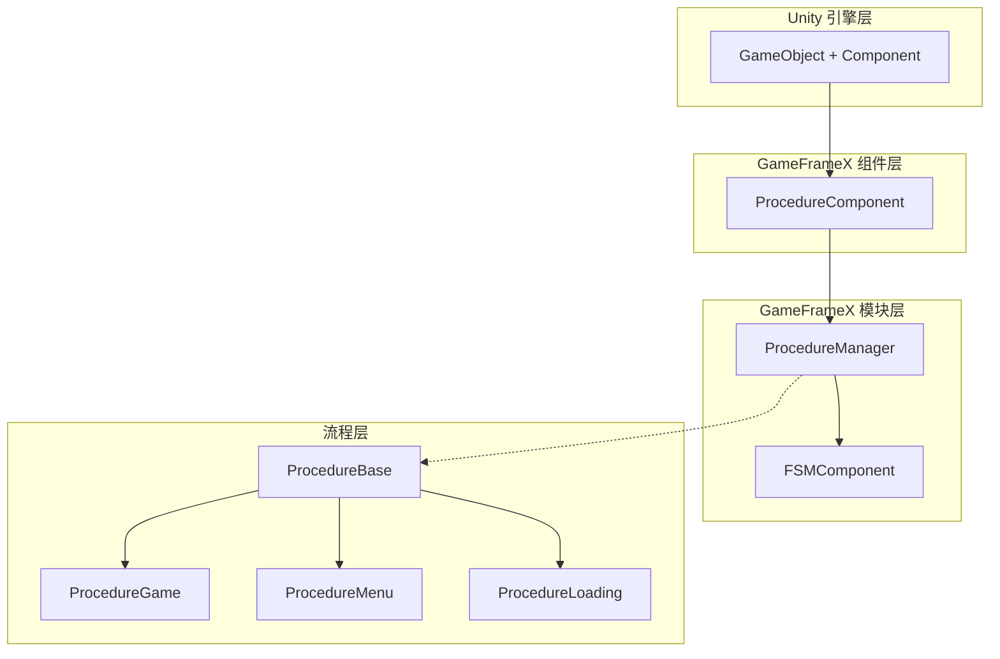
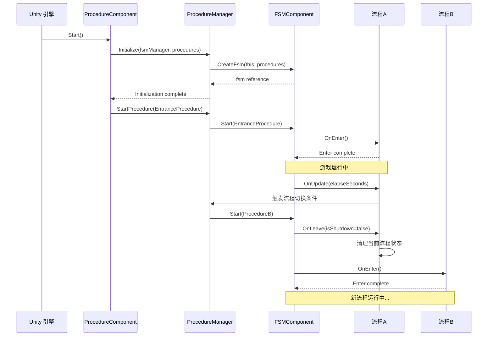

# 功能特性

GameFrameX Procedure 流程管理组件为 Unity 游戏提供了一套完整的游戏流程状态管理解决方案，支持通过有限状态机（FSM）管理游戏的各个阶段。

## 概述

Procedure 流程管理组件是 GameFrameX 框架的核心模块之一，专门用于管理游戏的业务流程和状态切换。该组件基于有限状态机（FSM）设计，允许开发者将游戏划分为多个独立的流程阶段，如启动流程、加载流程、主菜单流程、游戏流程、暂停流程和结束流程等。

每个流程都是一个独立的状态，拥有完整的生命周期管理，包括初始化、进入、更新、离开和销毁等阶段。这种设计使得游戏逻辑更加模块化，便于维护和扩展，同时也为团队协作提供了清晰的分工边界。

## 核心功能

### 流程状态管理

组件提供了完整的流程状态管理能力，支持在游戏运行时动态切换不同的流程状态。开发者可以通过简单的 API 调用实现从加载界面到游戏主菜单、再到具体游戏玩法的平滑过渡。流程管理器维护了所有可用流程的引用，并提供了查询当前流程、获取流程持续时间等实用功能。

```csharp
// 检查是否存在指定流程
bool hasProcedure = procedureComponent.HasProcedure<ProcedureGame>();

// 获取当前正在执行的流程
ProcedureBase current = procedureComponent.CurrentProcedure;

// 获取当前流程已持续的时间
float elapsedTime = procedureComponent.CurrentProcedureTime;
```

> Source: [ProcedureComponent.cs](https://github.com/GameFrameX/com.gameframex.unity.procedure/blob/main/Runtime/Procedure/ProcedureComponent.cs#L114-L147)

### 自动流程初始化

组件在游戏启动时自动完成所有流程的创建和初始化工作。开发者只需要在 Unity 编辑器中配置好可用的流程类型，组件会自动使用反射机制创建流程实例，并在游戏帧加载完成后自动启动入口流程。这种设计大大简化了游戏的启动逻辑，开发者可以专注于业务逻辑的实现。

```csharp
// ProcedureComponent 在 Start 方法中自动完成流程初始化
private IEnumerator Start()
{
    ProcedureBase[] procedures = new ProcedureBase[m_AvailableProcedureTypeNames.Length];
    for (int i = 0; i < m_AvailableProcedureTypeNames.Length; i++)
    {
        Type procedureType = Utility.Assembly.GetType(m_AvailableProcedureTypeNames[i]);
        procedures[i] = (ProcedureBase)Activator.CreateInstance(procedureType);
    }
    m_ProcedureManager.Initialize(GameFrameworkEntry.GetModule<IFsmManager>(), procedures);
    yield return new WaitForEndOfFrame();
    m_ProcedureManager.StartProcedure(m_EntranceProcedure.GetType());
}
```

> Source: [ProcedureComponent.cs](https://github.com/GameFrameX/com.gameframex.unity.procedure/blob/main/Runtime/Procedure/ProcedureComponent.cs#L71-L107)

### 流程生命周期钩子

每个自定义流程都可以通过重写基类方法来实现特定的业务逻辑。组件提供了完整的生命周期钩子，覆盖了流程从创建到销毁的全过程。这些钩子包括：`OnInit`（初始化时调用）、`OnEnter`（进入流程时调用）、`OnUpdate`（每帧更新时调用）、`OnFixedUpdate`（固定帧率更新时调用）、`OnLeave`（离开流程时调用）和`OnDestroy`（流程销毁时调用）。

```csharp
public abstract class ProcedureBase : FsmState<IProcedureManager>
{
    // 状态初始化时调用
    protected override void OnInit(IFsm<IProcedureManager> procedureOwner) { }

    // 进入状态时调用
    protected override void OnEnter(IFsm<IProcedureManager> procedureOwner) { }

    // 状态轮询时调用
    protected override void OnUpdate(IFsm<IProcedureManager> procedureOwner, float elapseSeconds, float realElapseSeconds) { }

    // 固定帧率更新时调用
    protected override void OnFixedUpdate(IFsm<IProcedureManager> procedureOwner, float elapseSeconds, float realElapseSeconds) { }

    // 离开状态时调用
    protected override void OnLeave(IFsm<IProcedureManager> procedureOwner, bool isShutdown) { }

    // 状态销毁时调用
    protected override void OnDestroy(IFsm<IProcedureManager> procedureOwner) { }
}
```

> Source: [ProcedureBase.cs](https://github.com/GameFrameX/com.gameframex.unity.procedure/blob/main/Runtime/Procedure/ProcedureBase.cs#L16-L76)

### 流程查询与获取

提供了灵活的程序化查询接口，支持通过类型或类型名称检查流程是否存在，以及获取特定流程的实例引用。这些功能使得游戏代码可以在运行时动态与流程系统交互，例如在非流程类中检查当前游戏状态或获取特定流程进行数据交换。

```csharp
// 通过泛型方法检查和获取流程
if (procedureComponent.HasProcedure<ProcedureMenu>())
{
    var menuProcedure = procedureComponent.GetProcedure<ProcedureMenu>();
}

// 通过 Type 对象检查和获取流程
Type menuType = typeof(ProcedureMenu);
if (procedureComponent.HasProcedure(menuType))
{
    var menuProcedure = (ProcedureMenu)procedureComponent.GetProcedure(menuType);
}
```

> Source: [IProcedureManager.cs](https://github.com/GameFrameX/com.gameframex.unity.procedure/blob/main/Runtime/Procedure/IProcedureManager.cs#L47-L73)

### 编辑器可视化配置

组件提供了自定义 Unity 编辑器检查器，支持在 Inspector 面板中直观地配置可用流程列表和入口流程。通过勾选框可以方便地选择需要包含在流程系统中的流程类型，并通过下拉菜单设置游戏启动时的首个流程。运行状态下，检查器还会显示当前正在执行的流程名称，便于调试。

```csharp
// 编辑器检查器核心逻辑
foreach (string procedureTypeName in m_ProcedureTypeNames)
{
    bool selected = m_CurrentAvailableProcedureTypeNames.Contains(procedureTypeName);
    if (selected != EditorGUILayout.ToggleLeft(procedureTypeName, selected))
    {
        // 处理流程选择状态变更
    }
}

// 运行状态下显示当前流程
if (EditorApplication.isPlaying)
{
    EditorGUILayout.LabelField("Current Procedure", t.CurrentProcedure == null ? "None" : t.CurrentProcedure.GetType().ToString());
}
```

> Source: [ProcedureComponentInspector.cs](https://github.com/GameFrameX/com.gameframex.unity.procedure/blob/main/Editor/Inspector/ProcedureComponentInspector.cs#L46-L96)

## 系统架构



如上图所示，系统采用分层架构设计。`ProcedureComponent` 作为 Unity 组件层，负责与 Unity 引擎交互并暴露公共接口。`ProcedureManager` 作为核心模块，负责实际的流程管理逻辑，并依赖于 `FSMComponent` 提供的有限状态机功能。`ProcedureBase` 是所有自定义流程的基类，提供了生命周期的统一抽象。

## 流程切换机制



流程切换由 FSM 组件统一管理。当调用 `StartProcedure` 方法时，FSM 会先触发当前流程的 `OnLeave` 回调，执行清理工作，然后触发目标流程的 `OnEnter` 回调，完成初始化。这种设计确保了流程切换时的状态一致性，避免了资源泄漏和数据混乱。

## 典型使用场景

### 游戏启动流程

典型的游戏启动流程通常包含多个阶段：资源加载、数据初始化、配置读取、登录验证等。每个阶段都可以作为一个独立的流程实现，通过流程管理器按顺序切换。这种设计使得启动逻辑清晰可控，也便于在每个阶段显示不同的加载界面。

### 游戏状态管理

在游戏进行过程中，可以使用流程系统管理不同的游戏状态。例如：游戏准备状态、游戏中状态、游戏暂停状态、游戏结算状态等。流程之间的切换条件可以是玩家操作、计时器到期、或者某些游戏事件的触发。

### 场景切换管理

当游戏需要在不同场景之间切换时，流程系统可以很好地协调加载和初始化工作。例如：从主菜单进入游戏场景时，可以先切换到加载流程，显示加载进度条，后台完成场景资源加载和初始化，完成后再切换到游戏流程。

## 依赖关系

该组件依赖于 GameFrameX 框架的其他核心模块：

| 依赖组件 | 说明 |
|---------|------|
| FSMComponent | 提供有限状态机功能，用于实现流程的状态转换 |
| GameFrameworkEntry | 框架入口，用于获取和注册各模块 |
| GameFrameworkComponent | 组件基类，提供组件通用功能 |
| GameFrameworkModule | 模块基类，提供模块通用功能 |

## 平台支持

该组件基于 Unity 引擎开发，支持以下平台：

- **iOS**：使用 IL2CPP 或 Mono 脚本后端
- **Android**：使用 IL2CPP 或 Mono 脚本后端
- **Windows**：Editor 和独立运行版本
- **macOS**：Editor 和独立运行版本
- **Linux**：独立运行版本
- **WebGL**：基于 WebGL 构建目标

## 注意事项

1. **流程基类继承**：所有自定义流程必须继承自 `ProcedureBase` 基类
2. **入口流程配置**：必须在 Inspector 中配置入口流程，否则游戏无法正常启动
3. **流程类型注册**：需要在 `m_AvailableProcedureTypeNames` 数组中添加所有可用的流程类型
4. **单组件限制**：同一个 GameObject 上只能添加一个 `ProcedureComponent`（由 `[DisallowMultipleComponent]` 属性限制）
5. **FSM 依赖**：组件正常工作需要先正确配置和初始化 FSMComponent

## 相关链接

- [插件简介](./1-overview.introduction) - 了解组件的基本概念和使用前提
- [安装指南](./2-installation) - 详细的安装和配置步骤
- [ProcedureComponent](./3-core-concepts.procedure-component) - 组件的详细 API 文档
- [ProcedureBase](./3-core-concepts.procedure-base) - 流程基类的详细说明
- [IProcedureManager](./3-core-concepts.iprocedure-manager) - 流程管理器接口
- [ProcedureManager](./3-core-concepts.procedure-manager) - 流程管理器实现
- [自定义流程](./4-custom-procedures) - 如何创建自定义流程
- [编辑器使用](./5-editor-usage) - 编辑器配置指南
