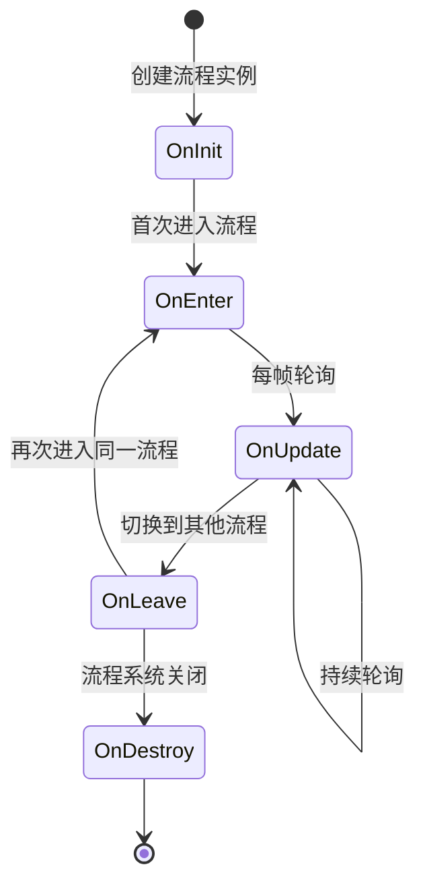

# ProcedureBase

流程基类，用于定义游戏中的各个流程状态。

## 概述

`ProcedureBase` 是 GameFrameX 流程管理系统的核心抽象类，继承自 `FsmState<IProcedureManager>`。它提供了游戏流程生命周期的完整模板方法，开发者可以通过继承该类来创建自定义的游戏流程，如启动流程、主菜单流程、游戏流程、暂停流程、结算流程等。

**设计意图：**
GameFrameX 的流程管理系统采用有限状态机（FSM）模式设计。`ProcedureBase` 作为状态基类，为每个流程状态定义了一套标准的生命周期钩子方法。这种设计使得游戏流程的管理变得清晰、可控，便于在不同流程之间平滑切换，同时支持流程间的数据传递和状态保持。

**核心特性：**
- 完整的流程生命周期管理（初始化 → 进入 → 更新 → 离开 → 销毁）
- 支持帧更新（Update）和固定帧更新（FixedUpdate）
- 基于有限状态机的流程切换机制
- 与 ProcedureManager 无缝集成

## 架构

```mermaid
graph TD
    subgraph GameFrameX 核心模块
        FsmState[FsmState&lt;IProcedureManager&gt;]
    end

    subgraph Procedure 流程模块
        ProcedureBase["ProcedureBase<br/>(抽象基类)"]
        IProcedureManager[IProcedureManager<br/>(接口)]
        ProcedureManager["ProcedureManager<br/>(流程管理器)"]
    end

    subgraph Unity 集成层
        ProcedureComponent["ProcedureComponent<br/>(流程组件)"]
    end

    subgraph 自定义流程
        CustomProcedure1["自定义流程 A<br/>(继承 ProcedureBase)"]
        CustomProcedure2["自定义流程 B<br/>(继承 ProcedureBase)"]
        CustomProcedureN["自定义流程 N<br/>(继承 ProcedureBase)"]
    end

    FsmState <|-- ProcedureBase
    ProcedureBase <|-- CustomProcedure1
    ProcedureBase <|-- CustomProcedure2
    ProcedureBase <|-- CustomProcedureN
    
    IProcedureManager <|.. ProcedureManager
    ProcedureManager --> ProcedureBase
    ProcedureComponent --> ProcedureManager
```

**架构说明：**

| 组件 | 角色 | 职责 |
|------|------|------|
| `FsmState<IProcedureManager>` | 基类 | 提供有限状态机的基础功能 |
| `ProcedureBase` | 抽象基类 | 定义流程的标准生命周期模板 |
| `IProcedureManager` | 接口 | 定义流程管理器的标准操作 |
| `ProcedureManager` | 实现类 | 管理和调度所有流程状态 |
| `ProcedureComponent` | Unity组件 | 在 Unity 环境中初始化流程系统 |
| 自定义流程 | 具体实现 | 继承 ProcedureBase 实现具体业务逻辑 |

## 生命周期



**生命周期阶段说明：**

| 阶段 | 方法 | 调用时机 | 典型用途 |
|------|------|----------|----------|
| 初始化 | `OnInit` | 流程实例创建后首次进入前 | 初始化流程数据、加载配置 |
| 进入 | `OnEnter` | 进入流程状态时 | 准备流程资源、显示界面 |
| 更新 | `OnUpdate` | 每帧调用（逻辑帧） | 业务逻辑处理、状态检查 |
| 固定更新 | `OnFixedUpdate` | 固定时间间隔调用 | 物理相关逻辑 |
| 离开 | `OnLeave` | 离开流程状态时 | 释放临时资源、保存状态 |
| 销毁 | `OnDestroy` | 流程系统关闭时 | 清理所有资源 |

## 核心方法

### OnInit - 流程初始化

```csharp
protected override void OnInit(IFsm<IProcedureManager> procedureOwner)
```
> Source: [ProcedureBase.cs](https://github.com/GameFrameX/com.gameframex.unity.procedure/blob/main/Runtime/Procedure/ProcedureBase.cs#L22-L25)

在流程状态首次初始化时调用。此方法在流程实例创建后、首次进入流程前被调用。

**设计意图：**
提供一次性的初始化机会，用于加载流程所需的静态数据、配置信息或预创建游戏对象。此方法在整个流程生命周期中只会被调用一次。

**参数：**
- `procedureOwner` (IFsm<IProcedureManager>)：流程持有者的有限状态机

---

### OnEnter - 进入流程

```csharp
protected override void OnEnter(IFsm<IProcedureManager> procedureOwner)
```
> Source: [ProcedureBase.cs](https://github.com/GameFrameX/com.gameframex.unity.procedure/blob/main/Runtime/Procedure/ProcedureBase.cs#L31-L34)

当流程状态从其他状态切换到当前状态时调用。

**设计意图：**
每次进入流程时都会调用，适合用于准备流程所需的资源、显示对应的 UI 界面、开始特定的声音或动画等。每次流程被激活时都会触发。

**参数：**
- `procedureOwner` (IFsm<IProcedureManager>)：流程持有者的有限状态机

---

### OnUpdate - 流程更新

```csharp
protected override void OnUpdate(IFsm<IProcedureManager> procedureOwner, float elapseSeconds, float realElapseSeconds)
```
> Source: [ProcedureBase.cs](https://github.com/GameFrameX/com.gameframex.unity.procedure/blob/main/Runtime/Procedure/ProcedureBase.cs#L42-L45)

在流程状态处于活动状态时每帧调用。

**设计意图：**
这是实现流程核心业务逻辑的主要钩子。可以在这里检测流程切换条件、更新游戏状态、处理用户输入等。

**参数：**
- `procedureOwner` (IFsm<IProcedureManager>)：流程持有者的有限状态机
- `elapseSeconds` (float)：逻辑流逝时间，以秒为单位（受时间缩放影响）
- `realElapseSeconds` (float)：真实流逝时间，以秒为单位（不受时间缩放影响）

---

### OnFixedUpdate - 固定频率更新

```csharp
protected override void OnFixedUpdate(IFsm<IProcedureManager> procedureOwner, float elapseSeconds, float realElapseSeconds)
```
> Source: [ProcedureBase.cs](https://github.com/GameFrameX/com.gameframex.unity.procedure/blob/main/Runtime/Procedure/ProcedureBase.cs#L53-L56)

以固定时间间隔调用，用于物理相关的逻辑处理。

**设计意图：**
Unity 的 FixedUpdate 以固定时间间隔（默认 0.02 秒）调用，适合处理物理引擎相关逻辑，确保逻辑的确定性。

**参数：**
- `procedureOwner` (IFsm<IProcedureManager>)：流程持有者的有限状态机
- `elapseSeconds` (float)：逻辑流逝时间，以秒为单位
- `realElapseSeconds` (float)：真实流逝时间，以秒为单位

---

### OnLeave - 离开流程

```csharp
protected override void OnLeave(IFsm<IProcedureManager> procedureOwner, bool isShutdown)
```
> Source: [ProcedureBase.cs](https://github.com/GameFrameX/com.gameframex.unity.procedure/blob/main/Runtime/Procedure/ProcedureBase.cs#L63-L66)

当流程状态从当前状态切换到其他状态时调用。

**设计意图：**
用于清理当前流程的临时资源、保存状态数据、隐藏 UI 界面等。注意：如果 `isShutdown` 为 true，表示是关闭整个流程系统而非切换流程。

**参数：**
- `procedureOwner` (IFsm<IProcedureManager>)：流程持有者的有限状态机
- `isShutdown` (bool)：是否是关闭状态机时触发

---

### OnDestroy - 流程销毁

```csharp
protected override void OnDestroy(IFsm<IProcedureManager> procedureOwner)
```
> Source: [ProcedureBase.cs](https://github.com/GameFrameX/com.gameframex.unity.procedure/blob/main/Runtime/Procedure/ProcedureBase.cs#L72-L75)

当流程状态被销毁时调用。

**设计意图：**
在整个流程系统关闭时调用，用于执行最终的清理工作，释放所有资源。这是流程生命周期的最后一个阶段。

**参数：**
- `procedureOwner` (IFsm<IProcedureManager>)：流程持有者的有限状态机

## 使用示例

### 基本自定义流程

创建一个简单的启动流程：

```csharp
using GameFrameX.Procedure.Runtime;
using GameFrameX.Fsm.Runtime;

public class ProcedureLaunch : ProcedureBase
{
    protected override void OnInit(IFsm<IProcedureManager> procedureOwner)
    {
        base.OnInit(procedureOwner);
        // 初始化启动数据
    }

    protected override void OnEnter(IFsm<IProcedureManager> procedureOwner)
    {
        base.OnEnter(procedureOwner);
        // 显示启动界面
    }

    protected override void OnUpdate(IFsm<IProcedureManager> procedureOwner, float elapseSeconds, float realElapseSeconds)
    {
        base.OnUpdate(procedureOwner, elapseSeconds, realElapseSeconds);
        
        // 检查是否完成启动，可以切换到下一个流程
        // procedureOwner.Owner.StartProcedure<ProcedureMenu>();
    }

    protected override void OnLeave(IFsm<IProcedureManager> procedureOwner, bool isShutdown)
    {
        base.OnLeave(procedureOwner, isShutdown);
        // 隐藏启动界面
    }
}
```

### 流程切换示例

在流程中切换到另一个流程：

```csharp
protected override void OnUpdate(IFsm<IProcedureManager> procedureOwner, float elapseSeconds, float realElapseSeconds)
{
    base.OnUpdate(procedureOwner, elapseSeconds, realElapseSeconds);
    
    // 假设满足某个条件后切换到菜单流程
    if (someCondition)
    {
        // 获取流程管理器并启动下一个流程
        procedureOwner.Owner.StartProcedure<ProcedureMenu>();
    }
}
```

### 获取当前流程信息

```csharp
// 在任意位置获取当前流程和持续时间
var procedureComponent = UnityEngine.Object.FindObjectOfType<ProcedureComponent>();
var currentProcedure = procedureComponent.CurrentProcedure;
var elapsedTime = procedureComponent.CurrentProcedureTime;
```

## 与其他组件的关系

| 组件 | 关系 | 说明 |
|------|------|------|
| ProcedureComponent | 使用 | Unity 组件，用于初始化流程系统 |
| ProcedureManager | 管理 | 实际管理 ProcedureBase 状态转换的类 |
| IProcedureManager | 实现 | ProcedureManager 实现的接口 |
| FsmState | 继承 | 来自 GameFrameX.Fsm 的基类 |

## 常见问题

### Q: 为什么不直接在 Update 中处理逻辑？

**A:** `ProcedureBase` 提供了结构化的生命周期方法，这种设计：
- 使代码更清晰，每个阶段职责明确
- 便于调试和维护
- 支持状态的正确进入/退出处理
- 与其他系统（如 UI 系统、资源系统）更好地集成

### Q: 如何在流程间传递数据？

**A:** 可以通过以下方式：
1. 使用静态变量（不推荐，可能导致内存泄漏）
2. 将数据存储在独立的配置类中，通过 `procedureOwner.Owner` 获取 ProcedureManager 访问
3. 使用游戏框架的数据库或配置系统

### Q: OnInit 和 OnEnter 有什么区别？

**A:** 
- `OnInit`：只在流程实例创建后调用一次，整个生命周期中不会再调用
- `OnEnter`：每次进入该流程状态时都会调用，可能被调用多次

## 相关链接

- [ProcedureComponent](./3-core-concepts.procedure-component) - 流程组件
- [IProcedureManager](./3-core-concepts.iprocedure-manager) - 流程管理器接口
- [ProcedureManager](./3-core-concepts.procedure-manager) - 流程管理器实现
- [自定义流程](./4-custom-procedures) - 创建自定义流程
