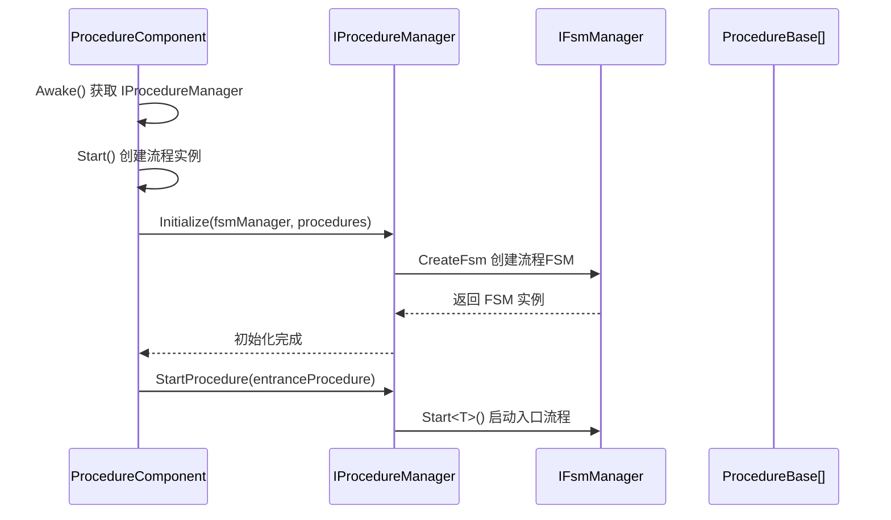
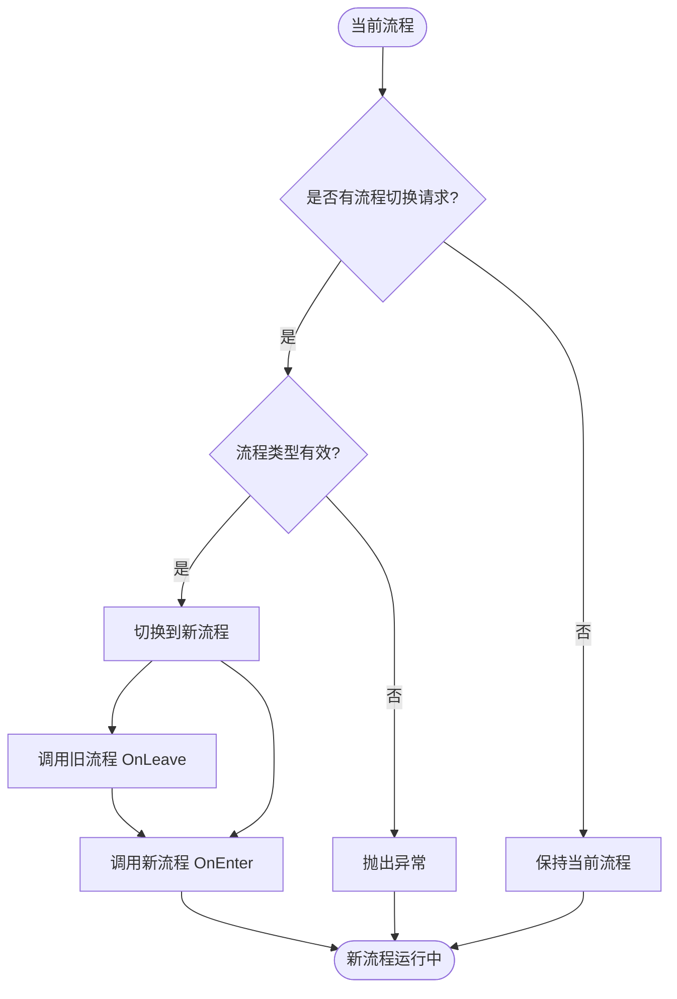

# IProcedureManager

流程管理器接口，定义了流程管理的基本操作，用于管理游戏中的各种流程状态转换。

## 概述

IProcedureManager 是 GameFrameX 流程系统的核心接口，负责管理游戏中的各种流程（如登录流程、主菜单流程、游戏流程等）。它基于有限状态机（FSM）模式实现，提供了流程的初始化、切换、查询等功能。

**设计意图：**
- 提供统一的流程管理接口，屏蔽底层实现细节
- 基于 FSM 模式实现，确保流程状态转换的可靠性和可追踪性
- 支持泛型和非泛型两种 API，满足不同的使用场景

## 架构

```mermaid
flowchart TD
    subgraph External["外部调用者"]
        User[用户代码]
    end

    subgraph Component["Unity组件层"]
        PC[ProcedureComponent]
    end

    subgraph Interface["接口层"]
        IPM[IProcedureManager]
    end

    subgraph Implementation["实现层"]
        PM[ProcedureManager]
    end

    subgraph FSM["FSM子系统"]
        FSM[IFsmManager]
        FSMState[IFsm&lt;IProcedureManager&gt;]
    end

    subgraph Procedure["流程层"]
        PB1[ProcedureBase - 登录流程]
        PB2[ProcedureBase - 主菜单流程]
        PB3[ProcedureBase - 游戏流程]
    end

    User --> PC
    PC --> IPM
    IPM <|.. PM
    PM --> FSM
    FSM --> FSMState
    FSMState --> PB1
    FSMState --> PB2
    FSMState --> PB3
```

**架构说明：**

| 组件 | 职责 |
|------|------|
| **ProcedureComponent** | Unity 组件，作为入口点获取 IProcedureManager 实例 |
| **IProcedureManager** | 定义流程管理的公共接口 |
| **ProcedureManager** | 接口的具体实现，内部使用 FSM 管理流程状态 |
| **IFsmManager** | 有限状态机管理器，由外部注入 |
| **ProcedureBase** | 所有具体流程的基类，表示一个流程状态 |

## 核心流程

### 初始化流程



### 流程切换流程



## API 参考

### 属性

#### `CurrentProcedure: ProcedureBase`

获取当前正在执行的流程实例。

**返回：** 当前流程对象，如果未初始化则抛出异常

---

#### `CurrentProcedureTime: float`

获取当前流程已持续的时间（秒）。

**返回：** 流程持续时间，如果未初始化则抛出异常

---

### 方法

### `Initialize(fsmManager: IFsmManager, procedures: ProcedureBase[]): void`

初始化流程管理器。

**参数：**
- `fsmManager` (IFsmManager): 有限状态机管理器，不能为空
- `procedures` (params ProcedureBase[]): 要管理的流程数组

**说明：** 
- 必须在调用其他方法之前调用此方法
- 该方法会创建一个内部 FSM 来管理所有流程状态

> Source: [IProcedureManager.cs](https://github.com/GameFrameX/com.gameframex.unity.procedure/blob/main/Runtime/Procedure/IProcedureManager.cs#L28-L33)

---

### `StartProcedure<T>(): void` (泛型版本)

开始指定类型的流程。

**类型参数：**
- `T`: 要开始的流程类型，必须继承自 ProcedureBase

**说明：**
- 泛型版本提供编译时类型检查
- 如果流程管理器未初始化，抛出 GameFrameworkException

> Source: [IProcedureManager.cs](https://github.com/GameFrameX/com.gameframex.unity.procedure/blob/main/Runtime/Procedure/IProcedureManager.cs#L35-L39)

---

### `StartProcedure(procedureType: Type): void` (非泛型版本)

开始指定类型的流程。

**参数：**
- `procedureType` (Type): 要开始的流程类型

**说明：**
- 非泛型版本支持运行时动态指定流程类型
- 如果流程管理器未初始化，抛出 GameFrameworkException

> Source: [IProcedureManager.cs](https://github.com/GameFrameX/com.gameframex.unity.procedure/blob/main/Runtime/Procedure/IProcedureManager.cs#L41-L45)

---

### `HasProcedure<T>(): bool` (泛型版本)

检查是否存在指定类型的流程。

**类型参数：**
- `T`: 要检查的流程类型

**返回：** 是否存在该流程

> Source: [IProcedureManager.cs](https://github.com/GameFrameX/com.gameframex.unity.procedure/blob/main/Runtime/Procedure/IProcedureManager.cs#L47-L52)

---

### `HasProcedure(procedureType: Type): bool` (非泛型版本)

检查是否存在指定类型的流程。

**参数：**
- `procedureType` (Type): 要检查的流程类型

**返回：** 是否存在该流程

> Source: [IProcedureManager.cs](https://github.com/GameFrameX/com.gameframex.unity.procedure/blob/main/Runtime/Procedure/IProcedureManager.cs#L54-L59)

---

### `GetProcedure<T>(): ProcedureBase` (泛型版本)

获取指定类型的流程实例。

**类型参数：**
- `T`: 要获取的流程类型

**返回：** 流程实例，如果不存在则抛出异常

> Source: [IProcedureManager.cs](https://github.com/GameFrameX/com.gameframex.unity.procedure/blob/main/Runtime/Procedure/IProcedureManager.cs#L61-L66)

---

### `GetProcedure(procedureType: Type): ProcedureBase` (非泛型版本)

获取指定类型的流程实例。

**参数：**
- `procedureType` (Type): 要获取的流程类型

**返回：** 流程实例，如果不存在则抛出异常

> Source: [IProcedureManager.cs](https://github.com/GameFrameX/com.gameframex.unity.procedure/blob/main/Runtime/Procedure/IProcedureManager.cs#L68-L73)

---

## 使用示例

### 基本使用

通过 ProcedureComponent 获取 IProcedureManager 并切换流程：

```csharp
// 获取流程组件
var procedureComponent = UnityEngine.Object.FindObjectOfType<ProcedureComponent>();

// 获取当前流程
var currentProcedure = procedureComponent.CurrentProcedure;

// 获取流程管理器
var procedureManager = procedureComponent.Procedure;

// 检查是否存在某个流程
if (procedureManager.HasProcedure<MenuProcedure>())
{
    // 切换到菜单流程
    procedureManager.StartProcedure<MenuProcedure>();
}
```

> Source: [ProcedureComponent.cs](https://github.com/GameFrameX/com.gameframex.unity.procedure/blob/main/Runtime/Procedure/ProcedureComponent.cs#L42-L52)

### 初始化流程

IProcedureManager 的初始化由 ProcedureComponent 自动完成：

```csharp
// ProcedureComponent.Start() 方法中
IEnumerator Start()
{
    // ... 创建流程实例 ...
    
    // 初始化流程管理器
    m_ProcedureManager.Initialize(
        GameFrameworkEntry.GetModule<IFsmManager>(), 
        procedures
    );
    
    yield return new WaitForEndOfFrame();
    
    // 启动入口流程
    m_ProcedureManager.StartProcedure(m_EntranceProcedure.GetType());
}
```

> Source: [ProcedureComponent.cs](https://github.com/GameFrameX/com.gameframex.unity.procedure/blob/main/Runtime/Procedure/ProcedureComponent.cs#L102-L106)

## 注意事项

1. **初始化顺序**：必须在 IFsmManager 初始化之后才能调用 Initialize 方法
2. **入口流程**：需要指定一个入口流程（Entrance Procedure），游戏启动时自动开始执行
3. **异常处理**：大部分方法在未初始化时会抛出 GameFrameworkException
4. **线程安全**：流程管理器不是线程安全的，应在主线程中操作
5. **FSM 依赖**：IProcedureManager 内部依赖 IFsmManager，需要确保 FsmModule 已注册

## 相关链接

- [ProcedureComponent](./3-core-concepts.procedure-component) - 流程组件
- [ProcedureBase](./3-core-concepts.procedure-base) - 流程基类
- [ProcedureManager](./3-core-concepts.procedure-manager) - 流程管理器实现
- [自定义流程](./4-custom-procedures) - 如何创建自定义流程
