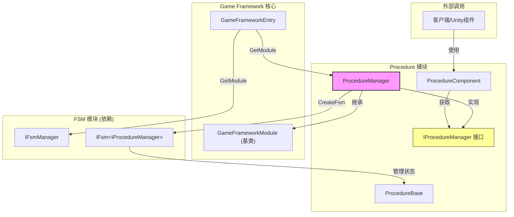

# ProcedureManager

ProcedureManager 是 GameFrameX 流程管理系统的核心实现类，负责管理游戏中的各种流程状态及其切换。

## 概述

ProcedureManager 实现了 `IProcedureManager` 接口，继承自 `GameFrameworkModule` 基类，是流程管理模块的主要实现。它基于有限状态机（FSM）来实现流程的创建、切换和管理功能。

**设计意图：**
- 提供统一的流程管理机制，支持游戏在不同阶段（如启动、菜单、游戏中、暂停、结算等）之间平滑切换
- 利用 FSM 的特性，确保流程切换的可靠性和可追踪性
- 作为 GameFramework 的核心模块，支持热更新和模块化扩展

## 架构



### 组件职责

| 组件 | 职责 |
|------|------|
| **ProcedureManager** | 核心实现类，管理流程的创建、切换、查询 |
| **IProcedureManager** | 接口定义，抽象流程管理操作 |
| **ProcedureComponent** | Unity 组件，用于在场景中配置和初始化流程 |
| **ProcedureBase** | 流程基类，每个具体流程继承此类 |
| **IFsmManager** | 有限状态机管理器（外部依赖） |

## 核心功能

### 1. 初始化流程管理器

在使用流程管理器之前，需要先进行初始化。初始化时需要提供 FSM 管理器和所有可用的流程类型。

```csharp
public void Initialize(IFsmManager fsmManager, params ProcedureBase[] procedures)
```

> Source: [ProcedureManager.cs](https://github.com/GameFrameX/com.gameframex.unity.procedure/blob/main/Runtime/Procedure/ProcedureManager.cs#L104-L110)

**参数说明：**
- `fsmManager`: 有限状态机管理器，负责创建和管理 FSM 实例
- `procedures`: 可用的流程实例数组

### 2. 启动流程

初始化完成后，需要指定一个入口流程来启动流程管理器。

```csharp
// 泛型方式
public void StartProcedure<T>() where T : ProcedureBase

// Type方式
public void StartProcedure(Type procedureType)
```

> Source: [ProcedureManager.cs](https://github.com/GameFrameX/com.gameframex.unity.procedure/blob/main/Runtime/Procedure/ProcedureManager.cs#L116-L138)

### 3. 查询流程状态

提供多种方式查询当前流程信息和检查特定流程是否存在。

```csharp
// 获取当前流程
public ProcedureBase CurrentProcedure { get; }

// 获取当前流程持续时间
public float CurrentProcedureTime { get; }

// 检查是否存在指定流程（泛型）
public bool HasProcedure<T>() where T : ProcedureBase

// 检查是否存在指定流程（Type）
public bool HasProcedure(Type procedureType)
```

> Source: [ProcedureManager.cs](https://github.com/GameFrameX/com.gameframex.unity.procedure/blob/main/Runtime/Procedure/ProcedureManager.cs#L44-L71), [L145-L168](https://github.com/GameFrameX/com.gameframex.unity.procedure/blob/main/Runtime/Procedure/ProcedureManager.cs#L145-L168)

### 4. 获取流程实例

可以在运行时获取任意已注册的流程实例进行操作。

```csharp
// 泛型方式获取
public ProcedureBase GetProcedure<T>() where T : ProcedureBase

// Type方式获取
public ProcedureBase GetProcedure(Type procedureType)
```

> Source: [ProcedureManager.cs](https://github.com/GameFrameX/com.gameframex.unity.procedure/blob/main/Runtime/Procedure/ProcedureManager.cs#L175-L198)

## 流程切换流程

```mermaid
sequenceDiagram
    participant Unity as Unity引擎
    participant PC as ProcedureComponent
    participant PM as ProcedureManager
    participant FSM as IFsmManager
    participant PB as ProcedureBase

    Unity->>PC: Awake()
    PC->>PM: GameFrameworkEntry.GetModule&lt;IProcedureManager&gt;()
    PC->>PC: Start() 协程
    PC->>PM: Initialize(fsmManager, procedures)
    PM->>FSM: CreateFsm(this, procedures)
    FSM-->>PM: IFsm&lt;IProcedureManager&gt;
    PM-->>PC: 初始化完成
    PC->>PM: StartProcedure&lt;T&gt;()
    PM->>FSM: Start&lt;T&gt;()
    FSM->>PB: OnEnter() - 进入流程
    Note over FSM,PB: 流程运行中...
    PB->>FSM: 触发流程切换
    FSM->>PB: OnLeave() - 离开旧流程
    FSM->>PB: OnEnter() - 进入新流程
```

## 使用示例

### 基本使用流程

1. **创建自定义流程类**

```csharp
using GameFrameX.Procedure.Runtime;

public class LoginProcedure : ProcedureBase
{
    protected override void OnEnter(IFsm<IProcedureManager> procedureOwner)
    {
        base.OnEnter(procedureOwner);
        // 初始化登录流程
    }

    protected override void OnUpdate(IFsm<IProcedureManager> procedureOwner, float elapseSeconds, float realElapseSeconds)
    {
        base.OnUpdate(procedureOwner, elapseSeconds, realElapseSeconds);
        // 检查是否满足切换条件
        // 如果满足，切换到下一个流程
    }
}

public class GameProcedure : ProcedureBase
{
    protected override void OnEnter(IFsm<IProcedureManager> procedureOwner)
    {
        base.OnEnter(procedureOwner);
        // 开始游戏
    }
}
```

2. **配置 ProcedureComponent**

在 Unity 场景中添加 `ProcedureComponent` 组件，并配置：
- `Available Procedure Type Names`: 添加所有流程的类型名称
- `Entrance Procedure Type Name`: 设置入口流程类型名称

3. **在代码中切换流程**

```csharp
// 假设在某个 Procedure 中切换到下一个流程
public class LoginProcedure : ProcedureBase
{
    protected override void OnUpdate(IFsm<IProcedureManager> procedureOwner, float elapseSeconds, float realElapseSeconds)
    {
        base.OnUpdate(procedureOwner, elapseSeconds, realElapseSeconds);
        
        // 登录完成后，切换到游戏流程
        if (IsLoginSuccess)
        {
            procedureOwner.ChangeState<GameProcedure>();
        }
    }
}
```

> Source: [ProcedureBase.cs](https://github.com/GameFrameX/com.gameframex.unity.procedure/blob/main/Runtime/Procedure/ProcedureBase.cs#L1-L77)

### 直接使用 ProcedureManager

如果需要直接使用 ProcedureManager 而非通过 ProcedureComponent：

```csharp
// 获取流程管理器
IProcedureManager procedureManager = GameFrameworkEntry.GetModule<IProcedureManager>();

// 获取 FSM 管理器
IFsmManager fsmManager = GameFrameworkEntry.GetModule<IFsmManager>();

// 初始化
procedureManager.Initialize(fsmManager, new LoginProcedure(), new GameProcedure());

// 启动入口流程
procedureManager.StartProcedure<LoginProcedure>();

// 在游戏循环中查询
ProcedureBase current = procedureManager.CurrentProcedure;
float time = procedureManager.CurrentProcedureTime;
```

## API 参考

### 属性

| 属性 | 类型 | 描述 |
|------|------|------|
| **CurrentProcedure** | `ProcedureBase` | 获取当前正在执行的流程实例 |
| **CurrentProcedureTime** | `float` | 获取当前流程已持续的时间（秒） |

### 方法

#### `Initialize(IFsmManager fsmManager, params ProcedureBase[] procedures)`

初始化流程管理器。

**参数：**
- `fsmManager` (IFsmManager): 有限状态机管理器
- `procedures` (params ProcedureBase[]): 可用的流程实例数组

**异常：**
- `GameFrameworkException`: 当 fsmManager 为 null 时抛出

---

#### `StartProcedure<T>() where T : ProcedureBase`

开始指定的流程（泛型方式）。

**参数：**
- 无

**异常：**
- `GameFrameworkException`: 当流程管理器未初始化时抛出

---

#### `StartProcedure(Type procedureType)`

开始指定的流程（Type 方式）。

**参数：**
- `procedureType` (Type): 要开始的流程类型

**异常：**
- `GameFrameworkException`: 当流程管理器未初始化时抛出

---

#### `HasProcedure<T>() where T : ProcedureBase`

检查是否存在指定的流程。

**返回：** 
- `bool`: 如果存在返回 true，否则返回 false

**异常：**
- `GameFrameworkException`: 当流程管理器未初始化时抛出

---

#### `GetProcedure<T>() where T : ProcedureBase`

获取指定类型的流程实例。

**返回：** 
- `ProcedureBase`: 流程实例

**异常：**
- `GameFrameworkException`: 当流程管理器未初始化时抛出

---

### 生命周期方法

ProcedureManager 继承自 `GameFrameworkModule`，主要生命周期方法：

| 方法 | 描述 |
|------|------|
| `Update(elapseSeconds, realElapseSeconds)` | 轮询方法，当前实现为空（由 FSM 自行处理） |
| `Shutdown()` | 关闭并清理流程管理器，销毁 FSM |

> Source: [ProcedureManager.cs](https://github.com/GameFrameX/com.gameframex.unity.procedure/blob/main/Runtime/Procedure/ProcedureManager.cs#L78-L97)

## 依赖关系

ProcedureManager 依赖以下组件：

| 依赖项 | 描述 | 来源 |
|--------|------|------|
| **IFsmManager** | 有限状态机管理器 | GameFrameX.Fsm.Runtime |
| **IFsm\<IProcedureManager\>** | 流程状态机实例 | GameFrameX.Fsm.Runtime |
| **GameFrameworkModule** | GameFramework 模块基类 | GameFrameX.Runtime |
| **ProcedureBase** | 流程基类 | 本模块 |

## 相关链接

- [IProcedureManager](./3-core-concepts.iprocedure-manager) - 流程管理器接口定义
- [ProcedureBase](./3-core-concepts.procedure-base) - 流程基类
- [ProcedureComponent](./3-core-concepts.procedure-component) - Unity 流程组件
- [FSM 模块](https://github.com/AlianBlank/com.alianblank.gameframex.unity.fsm) - 有限状态机模块
- [自定义流程](./4-custom-procedures) - 如何创建自定义流程
