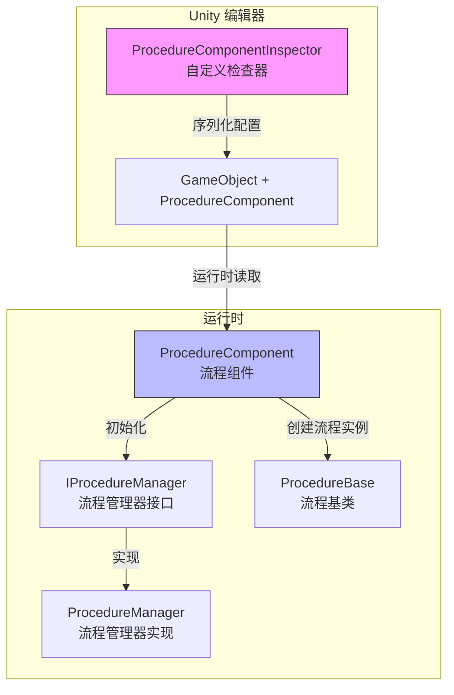
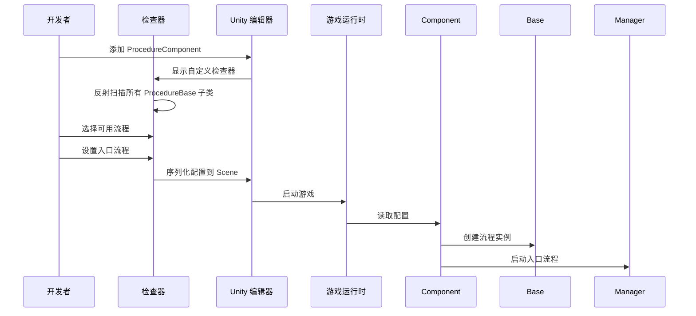

# 编辑器使用

本文档介绍如何在 Unity 编辑器中配置和使用 Procedure 流程管理组件。

## 概述

`ProcedureComponentInspector` 是 GameFrameX Procedure 流程管理系统的编辑器扩展，提供了可视化的流程配置界面。通过该检查器，开发者可以：

- 自动发现项目中所有继承自 `ProcedureBase` 的流程类
- 可视化选择游戏可用的流程
- 配置游戏启动时的入口流程
- 在运行时查看当前执行的流程

## 架构



### 工作流程



## 在场景中添加流程组件

### 步骤 1：添加组件

在 Unity 场景中创建一个空物体或选择现有物体，然后添加 `Procedure` 组件：

1. 在 Hierarchy 面板中选择目标 GameObject
2. 在 Inspector 面板中点击 **Add Component** 按钮
3. 搜索 **Game Framework / Procedure** 并添加

> Source: [ProcedureComponent.cs](https://github.com/GameFrameX/com.gameframex.unity.procedure/blob/main/Runtime/Procedure/ProcedureComponent.cs#L20-L21)

```csharp
[DisallowMultipleComponent]
[AddComponentMenu("Game Framework/Procedure")]
public sealed class ProcedureComponent : GameFrameworkComponent
```

**注意：** 该组件使用了 `[DisallowMultipleComponent]` 属性，意味着每个 GameObject 只能添加一个 `ProcedureComponent`。

### 步骤 2：配置组件

添加组件后，检查器界面会自动显示以下内容：

| 区域 | 说明 |
|------|------|
| **Available Procedures** | 列出所有可用的流程类型（自动发现） |
| **Entrance Procedure** | 设置游戏启动时的第一个流程 |

## 检查器界面详解

### 运行时信息显示

在游戏运行时（Play 模式下），检查器会额外显示：

- **Current Procedure**: 当前正在执行的流程类型名称

```csharp
if (EditorApplication.isPlaying)
{
    EditorGUILayout.LabelField("Current Procedure", t.CurrentProcedure == null ? "None" : t.CurrentProcedure.GetType().ToString());
}
```
> Source: [ProcedureComponentInspector.cs](https://github.com/GameFrameX/com.gameframex.unity.procedure/blob/main/Editor/Inspector/ProcedureComponentInspector.cs#L39-L42)

### 可用流程列表

检查器会自动扫描所有继承自 `ProcedureBase` 的类型：

```csharp
m_ProcedureTypeNames = Type.GetRuntimeTypeNames(typeof(ProcedureBase));
```
> Source: [ProcedureComponentInspector.cs](https://github.com/GameFrameX/com.gameframex.unity.procedure/blob/main/Editor/Inspector/ProcedureComponentInspector.cs#L121)

开发者可以通过复选框选择需要包含在游戏中的流程。

### 入口流程配置

入口流程是游戏启动时首先执行的流程，必须从已选择的可用流程中选择：

```csharp
int selectedIndex = EditorGUILayout.Popup("Entrance Procedure", m_EntranceProcedureIndex, m_CurrentAvailableProcedureTypeNames.ToArray());
```
> Source: [ProcedureComponentInspector.cs](https://github.com/GameFrameX/com.gameframex.unity.procedure/blob/main/Editor/Inspector/ProcedureComponentInspector.cs#L80)

## 配置示例

### 基本配置流程

1. **创建自定义流程类**

   首先，创建继承自 `ProcedureBase` 的流程类：

   ```csharp
   public class ProcedureLaunch : ProcedureBase
   {
       protected override void OnEnter(IFsm<IProcedureManager> procedureOwner)
       {
           base.OnEnter(procedureOwner);
           // 初始化操作
       }

       protected override void OnUpdate(IFsm<IProcedureManager> procedureOwner, float elapseSeconds, float realElapseSeconds)
       {
           base.OnUpdate(procedureOwner, elapseSeconds, realElapseSeconds);
           // 切换到下一个流程
       }
   }
   ```

   > Source: [ProcedureBase.cs](https://github.com/GameFrameX/com.gameframex.unity.procedure/blob/main/Runtime/Procedure/ProcedureBase.cs#L16)

2. **在场景中配置 ProcedureComponent**

   - 添加 ProcedureComponent 到场景
   - 在检查器中勾选 `ProcedureLaunch` 作为可用流程
   - 将 `ProcedureLaunch` 设置为入口流程

3. **运行游戏**

   游戏启动后会自动执行 `ProcedureLaunch` 流程。

### 流程切换

在自定义流程中，可以使用 `IProcedureManager` 切换到其他流程：

```csharp
// 获取流程管理器
var procedureManager = Owner.GetComponent<ProcedureComponent>().Procedure;

// 切换到下一个流程
procedureManager.StartProcedure<ProcedureMenu>();
```

## 组件属性说明

| 属性 | 类型 | 说明 |
|------|------|------|
| m_AvailableProcedureTypeNames | string[] | 可用的流程类型名称数组 |
| m_EntranceProcedureTypeName | string | 入口流程的类型名称 |

> Source: [ProcedureComponent.cs](https://github.com/GameFrameX/com.gameframex.unity.procedure/blob/main/Runtime/Procedure/ProcedureComponent.cs#L27-L29)

## 常见问题

### 检查器显示"没有可用流程"

**原因**：项目中没有继承自 `ProcedureBase` 的类

**解决方法**：确保已创建至少一个继承自 `ProcedureBase` 的流程类，并且该类编译无误。

### 入口流程显示无效

**原因**：入口流程未设置或设置的流程不在可用流程列表中

**解决方法**：在检查器中先选择可用流程，然后从下拉菜单中选择入口流程。

### 运行时不显示当前流程

**原因**：游戏未正确启动或 ProcedureComponent 未正确初始化

**解决方法**：确保 ProcedureComponent 已添加到场景中，且在 Start() 方法中已正确初始化。

## 相关链接

- [插件简介](./1-overview.introduction)
- [功能特性](./1-overview.features)
- [安装指南](./2-installation)
- [ProcedureComponent 核心概念](./3-core-concepts.procedure-component)
- [ProcedureBase 核心概念](./3-core-concepts.procedure-base)
- [IProcedureManager 核心概念](./3-core-concepts.iprocedure-manager)
- [ProcedureManager 核心概念](./3-core-concepts.procedure-manager)
- [自定义流程](./4-custom-procedures)
- [常见问题](./6-troubleshooting)
