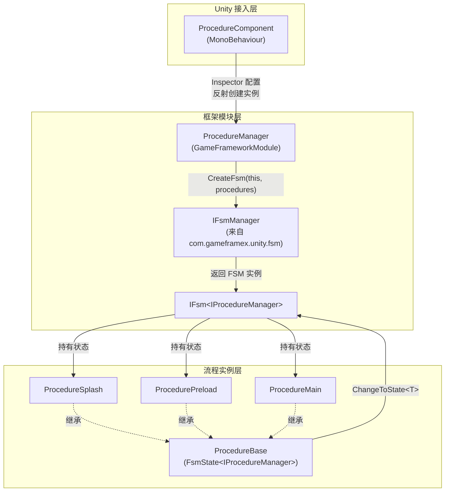

# 工作原理速览

GameFrameX Procedure 是基于有限状态机（FSM）的 Unity 游戏流程管理包。它通过可切换的"流程状态"驱动游戏生命周期阶段（闪屏、预加载、登录、主菜单等），并在每个阶段提供完整生命周期回调。底层依赖 [com.gameframex.unity.fsm](https://github.com/GameFrameX/com.gameframex.unity.fsm)，本包只负责把 FSM 封装成"流程"语义并接入 GameFrameX 框架。

## 快速开始

最小可用流程包含三步：

1. **继承 `ProcedureBase` 编写流程类**，在生命周期回调中放置业务逻辑。

   ```csharp
   using GameFrameX.Fsm.Runtime;
   using GameFrameX.Procedure.Runtime;

   public class ProcedurePreload : ProcedureBase
   {
       protected internal override void OnEnter(IFsm<IProcedureManager> procedureOwner)
       {
           // 加载资源、配置等
       }

       protected internal override void OnUpdate(IFsm<IProcedureManager> procedureOwner, float elapseSeconds, float realElapseSeconds)
       {
           // 检查加载进度，完成后切换到下一个流程
           ChangeToState<ProcedureMain>(procedureOwner);
       }
   }

   public class ProcedureMain : ProcedureBase
   {
       protected internal override void OnEnter(IFsm<IProcedureManager> procedureOwner)
       {
           // 显示主菜单
       }
   }
   ```

   Source: [README.zh-CN.md](https://github.com/GameFrameX/com.gameframex.unity.procedure/blob/main/README.zh-CN.md#L88-L110)

2. **挂上 `ProcedureComponent`**：在游戏对象上添加 `GameFrameX/Procedure` 组件（通过菜单 `GameFrameX > Procedure`）。Source: [ProcedureComponent.cs](https://github.com/GameFrameX/com.gameframex.unity.procedure/blob/main/Runtime/Procedure/ProcedureComponent.cs#L43-L46)

3. **在 Inspector 中配置** `Available Procedures`（可用流程类型名数组）与 `Entrance Procedure`（入口流程），运行游戏即可从入口流程开始自动推进。Source: [ProcedureComponent.cs](https://github.com/GameFrameX/com.gameframex.unity.procedure/blob/main/Runtime/Procedure/ProcedureComponent.cs#L51-L53)

## 工作原理速览

整套机制由三个层级组成：`ProcedureComponent`（Unity 接入层）→ `ProcedureManager`（框架模块层）→ `ProcedureBase`（流程实例层）。组件从 Inspector 读取流程类型列表后，反射创建实例并交给管理器初始化；管理器内部通过 FSM 管理器创建状态机，每个流程对应一个 FSM 状态，状态之间由 `ChangeToState<T>` 触发切换。



关键事实：

- **接入入口**：`ProcedureComponent` 标注了 `[GameFrameXAutoComponent(-1000)]`，由框架按优先级自动挂载。Source: [ProcedureComponent.cs](https://github.com/GameFrameX/com.gameframex.unity.procedure/blob/main/Runtime/Procedure/ProcedureComponent.cs#L43-L46)
- **管理器实例**：`ProcedureManager` 是一个 `GameFrameworkModule`，`Priority` 为 `-2`，会在所有普通业务模块之前轮询、最后关闭。Source: [ProcedureManager.cs](https://github.com/GameFrameX/com.gameframex.unity.procedure/blob/main/Runtime/Procedure/ProcedureManager.cs#L59-L62)
- **状态机创建**：`Initialize` 把所有流程作为状态传给 `IFsmManager.CreateFsm`，得到一个以 `IProcedureManager` 为拥有者的 FSM。Source: [ProcedureManager.cs](https://github.com/GameFrameX/com.gameframex.unity.procedure/blob/main/Runtime/Procedure/ProcedureManager.cs#L130-L141)
- **流程基类**：`ProcedureBase : FsmState<IProcedureManager>`，直接复用 FSM 的六个生命周期回调：`OnInit` / `OnEnter` / `OnUpdate` / `OnFixedUpdate` / `OnLeave` / `OnDestroy`。Source: [ProcedureBase.cs](https://github.com/GameFrameX/com.gameframex.unity.procedure/blob/main/Runtime/Procedure/ProcedureBase.cs#L38-L79)
- **状态切换入口**：`ProcedureBase` 暴露 `ChangeToState<T>(procedureOwner)` 触发同 FSM 内的状态迁移；FSM 自动调用旧状态的 `OnLeave` 与新状态的 `OnEnter`。Source: [ProcedureManager.cs](https://github.com/GameFrameX/com.gameframex.unity.procedure/blob/main/Runtime/Procedure/ProcedureManager.cs#L130-L156)

## 启动与运行流程

1. 组件 `Awake`/`Start` 阶段读取 `m_AvailableProcedureTypeNames` 与 `m_EntranceProcedureTypeName`，反射得到 `ProcedureBase` 数组。Source: [ProcedureComponent.cs](https://github.com/GameFrameX/com.gameframex.unity.procedure/blob/main/Runtime/Procedure/ProcedureComponent.cs#L51-L53)
2. 框架内部从 `GameEntry` 取得 `IFsmManager`，调用 `ProcedureManager.Initialize(fsmManager, procedures)`。Source: [ProcedureManager.cs](https://github.com/GameFrameX/com.gameframex.unity.procedure/blob/main/Runtime/Procedure/ProcedureManager.cs#L130-L141)
3. 调用 `StartProcedure<T>()`，FSM 把当前状态切换到入口流程，触发首个 `OnEnter`。Source: [ProcedureManager.cs](https://github.com/GameFrameX/com.gameframex.unity.procedure/blob/main/Runtime/Procedure/ProcedureManager.cs#L148-L156)
4. 运行期间 FSM 每帧轮询当前流程的 `OnUpdate` / `OnFixedUpdate`，由各流程在条件满足时调用 `ChangeToState<T>` 推动状态迁移。
5. 关闭时 `ProcedureManager.Shutdown` 销毁 FSM 并释放引用。Source: [ProcedureManager.cs](https://github.com/GameFrameX/com.gameframex.unity.procedure/blob/main/Runtime/Procedure/ProcedureManager.cs#L110-L122)

### `UseStartupRunner` 模式

默认（`m_UseStartupRunner = false`）下由 `ProcedureComponent.Start` 自行读取 Inspector 配置并启动流程。勾选后：

- 组件只在 `Awake` 中注册 `IProcedureManager`，**不再自动初始化或启动**流程。
- 启动由 `ApplicationStartupEntry` 通过 `StartupRunner.Run` 接管，适合多模块统一启动序列、或需要在流程启动前先完成其他初始化的场景。Source: [ProcedureComponent.cs](https://github.com/GameFrameX/com.gameframex.unity.procedure/blob/main/Runtime/Procedure/ProcedureComponent.cs#L56-L66)

## 接下来

- 想自己写一个流程并接入：从定义 `ProcedureBase` 子类开始，参考 README 的"使用示例"。
- 想了解各生命周期回调的细节：参考 `ProcedureBase` 六个回调的语义（`OnInit` → `OnEnter` → `OnUpdate` / `OnFixedUpdate` → `OnLeave` → `OnDestroy`）。
- 想排查"已经存在 FSM / 重复启动"等问题：检查是否同时使用了 `UseStartupRunner` 模式和默认模式。
- 想了解底层 FSM 行为：参考依赖包 [com.gameframex.unity.fsm](https://github.com/GameFrameX/com.gameframex.unity.fsm)。
