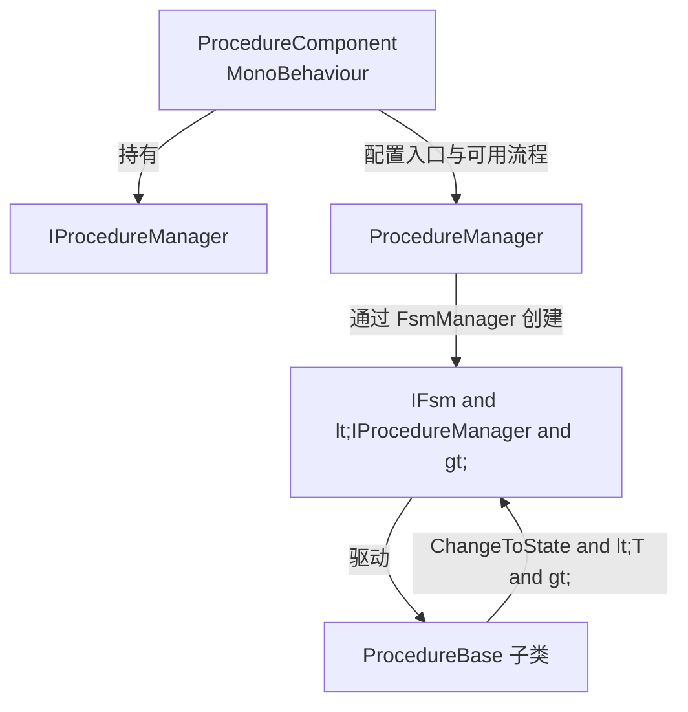

# Procedure 是什么

Procedure 是 GameFrameX 为 Unity 提供的一套基于有限状态机（FSM）的游戏流程管理方案。它把游戏生命周期拆成一组可切换的「流程状态」（闪屏、预加载、登录、主菜单等），由 `ProcedureComponent` 驱动 `ProcedureManager` 内部的 FSM 自动在状态间切换，让启动顺序、资源加载与场景跳转由代码而非散落的 `MonoBehaviour` 控制。

## 快速开始

1. 在 Unity 项目的 `Packages/manifest.json` 中添加依赖（任选其一）：
   - 通过 scoped registry：`https://gameframex.upm.alianblank.uk`，作用域 `com.gameframex`，依赖 `com.gameframex.unity.procedure`。
   - 直接 Git URL：`https://github.com/gameframex/com.gameframex.unity.procedure.git`。
2. 创建自己的流程类，继承 [ProcedureBase.cs](https://github.com/GameFrameX/com.gameframex.unity.procedure/blob/main/Runtime/Procedure/ProcedureBase.cs#L38-L99) 并重写生命周期回调。
3. 在场景中通过菜单 `GameFrameX/Procedure` 添加 `ProcedureComponent`，把流程类名填进 Inspector 的 *Available Procedures*，并指定 *Entrance Procedure*。
4. 运行游戏，框架会按入口流程启动，在 `OnUpdate` 中通过 `ChangeToState<T>` 切换下一阶段。

下面是一个最小的「闪屏 → 预加载 → 主菜单」三段流程示例：

```csharp
using GameFrameX.Procedure.Runtime;
using GameFrameX.Fsm.Runtime;

public class ProcedureSplash : ProcedureBase
{
    protected internal override void OnEnter(IFsm<IProcedureManager> procedureOwner)
    {
        // 显示闪屏
    }

    protected internal override void OnUpdate(IFsm<IProcedureManager> procedureOwner, float elapseSeconds, float realElapseSeconds)
    {
        ChangeToState<ProcedurePreload>(procedureOwner);
    }
}

public class ProcedurePreload : ProcedureBase
{
    protected internal override void OnEnter(IFsm<IProcedureManager> procedureOwner)
    {
        // 加载游戏资源
    }

    protected internal override void OnUpdate(IFsm<IProcedureManager> procedureOwner, float elapseSeconds, float realElapseSeconds)
    {
        ChangeToState<ProcedureMain>(procedureOwner);
    }
}

public class ProcedureMain : ProcedureBase
{
    protected internal override void OnEnter(IFsm<IProcedureManager> procedureOwner)
    {
        // 显示主菜单
    }
}
```

Source: [README.zh-CN.md](https://github.com/GameFrameX/com.gameframex.unity.procedure/blob/main/README.zh-CN.md#L86-L110)

## 工作原理速览

Procedure 包围绕三个核心类型协作：



- **ProcedureComponent** — 挂在游戏对象上的入口，负责注册 `IProcedureManager`、读取 Inspector 配置并触发启动；见 [ProcedureComponent.cs](https://github.com/GameFrameX/com.gameframex.unity.procedure/blob/main/Runtime/Procedure/ProcedureComponent.cs#L46-L99)。
- **ProcedureManager** — FSM 的真正持有者，管理所有流程实例与状态切换。
- **ProcedureBase** — 继承自 `FsmState<IProcedureManager>`，提供 `OnInit / OnEnter / OnUpdate / OnFixedUpdate / OnLeave / OnDestroy` 六个生命周期回调。

每个流程类通过 `ChangeToState<T>(procedureOwner)` 主动声明「条件满足后应该跳到哪里」，把跳转逻辑收敛到流程自身，避免散落在各个 UI / 资源脚本里。

## 接下来

- 想了解生命周期回调的完整列表与典型用法，见《流程生命周期》。
- 需要在初始化阶段插入自定义逻辑或避免 `Already exist FSM` 冲突，见《UseStartupRunner 模式》。
- 想查阅全部公开 API（属性、方法签名），见《API 参考》。
- 遇到 `Procedure not found` 或流程不切换等问题，见《常见错误与排查》。
