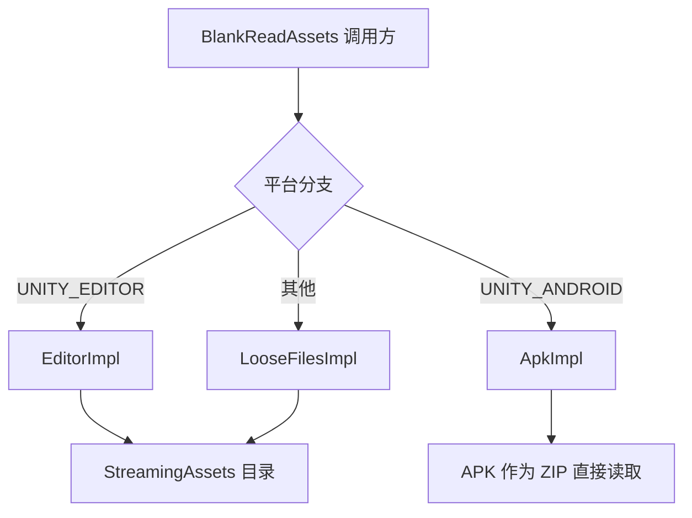

# 工作原理速览:StreamingAssets 与 APK 统一访问

GameFrameX.ReadAssets 用一套统一的 `System.IO` 风格 API 同时支持「普通平台读取 StreamingAssets 目录」与「Android 上直接读取 APK 内的 `assets/`」两种场景,运行时按平台自动切换实现,首次调用 API 时自动初始化。

## 快速开始

1. 通过 UPM 安装包:
   ```json
   {
     "scopedRegistries": [
       {
         "name": "GameFrameX",
         "url": "https://gameframex.upm.alianblank.uk",
         "scopes": ["com.gameframex"]
       }
     ],
     "dependencies": {
       "com.gameframex.unity.readassets": "1.2.0"
     }
   }
   ```
2. 在代码中直接调用静态 API,无需手动 `Initialize`(首次访问时自动初始化):
   ```csharp
   using GameFrameX.ReadAssets.Runtime;
   using System.IO;

   // 读取文本
   string text = BlankReadAssets.ReadAllText("config/game.json");

   // 按流读取
   using (Stream s = BlankReadAssets.OpenRead("data/level1.bin"))
   {
       // ...
   }

   // 直接加载 AssetBundle(无需先解压 APK)
   var ab = BlankReadAssets.LoadAssetBundle("bundles/ui.ab");
   ```

> 所有公开 API 都标注了 `[Preserve]`,可安全用于 IL2CPP / AOT 构建。

## 工作原理速览

入口 `BlankReadAssets` 是一个 `partial class`,通过 `using` 别名按平台选择内部实现类,从而在编译期决定调用哪一套逻辑:

```csharp
#if UNITY_EDITOR
using BlankReadAssetsImpl = GameFrameX.ReadAssets.Runtime.BlankReadAssets.EditorImpl;
#elif UNITY_ANDROID
using BlankReadAssetsImpl = GameFrameX.ReadAssets.Runtime.BlankReadAssets.ApkImpl;
#else
using BlankReadAssetsImpl = GameFrameX.ReadAssets.Runtime.BlankReadAssets.LooseFilesImpl;
#endif
```

Source: [BlankReadAssets.cs](https://github.com/GameFrameX/com.gameframex.unity.readassets/blob/main/Runtime/BlankReadAssets.cs#L11-L17)

三个实现分别承担:

| 实现类 | 平台 | 读取方式 |
|--------|------|----------|
| `EditorImpl` | Unity Editor | 走 `StreamingAssets` 真实目录 |
| `ApkImpl` | Android(以及 Editor 调试 APK) | 直接打开 APK 文件,按 ZIP 局部文件头定位并读取 `assets/` 内的条目 |
| `LooseFilesImpl` | 其他平台(PC、iOS、WebGL 等) | 走文件系统 |



### Android APK 读取的关键思路

Android 上 `StreamingAssets` 实际上位于 APK 内部的 `assets/` 路径。`ApkImpl` 在初始化时解析 APK 的 ZIP 中央目录,把所有 `assets/` 下的条目按路径排序后缓存到 `s_paths` / `s_streamingAssets` 两个数组中:

```csharp
public static void Initialize(string dataPath, string streamingAssetsPath)
{
    s_root = dataPath;
    // ...
    GetStreamingAssetsInfoFromJar(s_root, paths, parts);
    s_paths = paths.ToArray();
    s_streamingAssets = parts.ToArray();
}
```

Source: [BlankReadAssets.ApkImpl.cs](https://github.com/GameFrameX/com.gameframex.unity.readassets/blob/main/Runtime/BlankReadAssets.ApkImpl.cs#L27-L56)

读取时,`TryGetInfo` 用二分查找定位条目,得到该文件的 `offset` / `size` / `crc32`,然后通过 `File.OpenRead` 打开 APK 本体文件,再用 `SubReadOnlyStream` 把 `offset` / `size` 范围作为只读子流暴露出来:

```csharp
public static Stream OpenRead(string path)
{
    ReadInfo info;
    if (!TryGetInfo(path, out info))
    {
        ThrowFileNotFound(path);
    }

    Stream fileStream = File.OpenRead(info.readPath);
    try
    {
        return new SubReadOnlyStream(fileStream, info.offset, info.size, leaveOpen: false);
    }
    catch (System.Exception)
    {
        fileStream.Dispose();
        throw;
    }
}
```

Source: [BlankReadAssets.ApkImpl.cs](https://github.com/GameFrameX/com.gameframex.unity.readassets/blob/main/Runtime/BlankReadAssets.ApkImpl.cs#L208-L226)

> 这就是为什么 `AssetBundle.LoadFromFileAsync` 在 Android 上也能工作:它只需要「可读 + 知道偏移」,而 `ApkImpl` 通过 ZIP 中央目录提前拿到了偏移,从而无需解压整个 APK。

### 延迟初始化与线程安全

`BlankReadAssets` 用 `s_initialized` 标记保证 `Initialize` 只跑一次:

```csharp
private static void EnsureInitialized()
{
    if (!s_initialized)
    {
        Initialize();
        s_initialized = true;
    }
}
```

Source: [BlankReadAssets.cs](https://github.com/GameFrameX/com.gameframex.unity.readassets/blob/main/Runtime/BlankReadAssets.cs#L37-L44)

所有读取类 API(`FileExists` / `OpenRead` / `ReadAllBytes` / `GetFiles` 等)都会先调用 `EnsureInitialized()` 再委托给 `BlankReadAssetsImpl`,因此调用方在大多数场景下不必关心初始化时机。

## 接下来

- 想直接读取文件或文本,见《如何读取 StreamingAssets 文本与二进制》
- 想直接加载 AssetBundle,见《如何加载 StreamingAssets 中的 AssetBundle》
- 遇到 "文件不存在" 或 "压缩资源无法读取" 等问题,见《常见问题与排查》