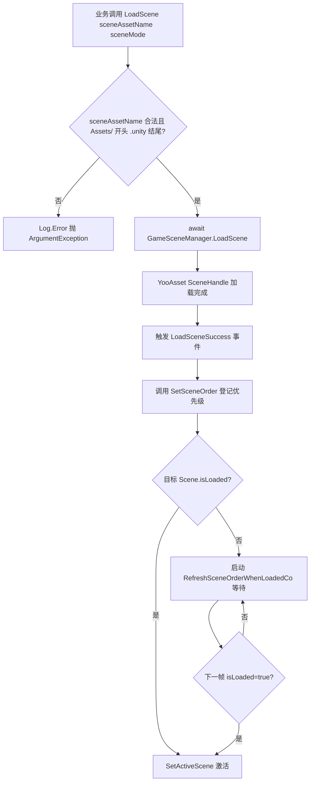

# 工作原理：异步加载与活跃场景排序

`SceneComponent` 基于 YooAsset 的 `SceneHandle` 实现 **异步加载**，并在多个场景叠加（Additive）时,通过 `m_SceneOrder` 有序字典与 `RefreshSceneOrder()` 选出当前活跃场景。本文解释从调用 `LoadScene` 到 Unity `SetActiveScene` 之间的关键流转。

## 关键字段一览

| 字段 | 类型 | 作用 |
|------|------|------|
| `m_SceneOrder` | `SortedDictionary<string,int>` | 记录每个 `sceneAssetName` 的活跃优先级（越大越优先） |
| `m_GameFrameworkScene` | `UnityEngine.SceneManagement.Scene` | 框架自带场景,当所有业务场景都未加载时回退到此场景 |
| `m_RefreshSceneOrderCo` | `Coroutine` | 等待 YooAsset 完成但 Unity `isLoaded` 尚未为 true 时的重试协程 |
| `DefaultPriority` | `const int = 0` | 默认优先级常量 |
| `m_EnableLoadSceneUpdateEvent` | `bool` | 是否启用 `LoadSceneUpdate` 进度事件(默认 `true`) |

字段定义见 [SceneComponent.cs](https://github.com/GameFrameX/com.gameframex.unity.scene/blob/main/Runtime/Scene/SceneComponent.cs#L51-L65)。

## 异步加载流程

`SceneComponent.LoadScene` 返回 `Task<YooAsset.SceneHandle>`,内部把请求转交给 `GameSceneManager`。后者维护三张字典区分加载状态:

| 字典 | 含义 |
|------|------|
| `m_LoadedSceneAssetNames` | 已加载完成的场景资源 |
| `m_LoadingSceneAssetNames` | 正在加载中的场景(持有 `SceneHandleData`) |
| `m_UnloadingSceneAssetNames` | 正在卸载中的场景 |

字典与初始化逻辑见 [GameSceneManager.cs](https://github.com/GameFrameX/com.gameframex.unity.scene/blob/main/Runtime/Scene/Scene/GameSceneManager.cs#L59-L84)。

`SceneComponent.Awake()` 会订阅 `GameSceneManager` 的五个事件:`LoadSceneSuccess`、`LoadSceneFailure`、`LoadSceneUpdate`(默认开启)、`UnloadSceneSuccess`、`UnloadSceneFailure`。订阅代码:

```csharp
_gameSceneManager.LoadSceneSuccess += OnLoadGameSceneSuccess;
_gameSceneManager.LoadSceneFailure += OnLoadGameSceneFailure;
if (m_EnableLoadSceneUpdateEvent)
{
    _gameSceneManager.LoadSceneUpdate += OnLoadGameSceneUpdate;
}
_gameSceneManager.UnloadSceneSuccess += OnUnloadGameSceneSuccess;
_gameSceneManager.UnloadSceneFailure += OnUnloadGameSceneFailure;
```

Source: [SceneComponent.cs](https://github.com/GameFrameX/com.gameframex.unity.scene/blob/main/Runtime/Scene/SceneComponent.cs#L91-L105)

`LoadScene` 的对外签名形如:

```csharp
public async Task<YooAsset.SceneHandle> LoadScene(
    string sceneAssetName,
    UnityEngine.SceneManagement.LoadSceneMode sceneMode,
    object userData = null);
```

它会校验 `sceneAssetName` 必须以 `Assets/` 开头、以 `.unity` 结尾,然后 `await` 底层 `GameSceneManager.LoadScene`。

Source: [SceneComponent.cs](https://github.com/GameFrameX/com.gameframex.unity.scene/blob/main/Runtime/Scene/SceneComponent.cs#L306-L322)

## 活跃场景排序机制

排序与激活的核心入口是 `SetSceneOrder` 与 `RefreshSceneOrder`。

```csharp
public void SetSceneOrder(string sceneAssetName, int sceneOrder)
{
    // ... 校验 sceneAssetName 合法 ...
    if (SceneIsLoading(sceneAssetName))
    {
        m_SceneOrder[sceneAssetName] = sceneOrder;
        return;
    }
    if (SceneIsLoaded(sceneAssetName))
    {
        m_SceneOrder[sceneAssetName] = sceneOrder;
        RefreshSceneOrder();
        return;
    }
    Log.Error("Scene '{0}' is not loaded or loading.", sceneAssetName);
}
```

Source: [SceneComponent.cs](https://github.com/GameFrameX/com.gameframex.unity.scene/blob/main/Runtime/Scene/SceneComponent.cs#L352-L381)

`RefreshSceneOrder` 的工作方式:

1. 遍历 `m_SceneOrder`,跳过仍在加载的场景(`SceneIsLoading`),取 `sceneOrder.Value` 最大的作为候选活跃场景。
2. 若全部场景都在加载中或字典为空,`SetActiveScene(m_GameFrameworkScene)` 回退到框架场景。
3. 通过 `SceneManager.GetSceneByName(GetSceneName(maxSceneName))` 拿到 Unity 场景对象,若 `scene.isLoaded == false` —— YooAsset 的 `await` 完成时机通常**早于** Unity 层面 `isLoaded=true`,直接 `SetActiveScene` 会抛 `ArgumentException`。

此时 `RefreshSceneOrder` 会启动协程 `RefreshSceneOrderWhenLoadedCo`,等下一帧 `isLoaded` 变 `true` 再激活;期间还会 `StopCoroutine` 旧的同名协程,避免与新协程争抢激活顺序。

Source: [SceneComponent.cs](https://github.com/GameFrameX/com.gameframex.unity.scene/blob/main/Runtime/Scene/SceneComponent.cs#L392-L437)



## 事件载荷(EventArgs)

异步加载过程通过 `GameFrameX.Runtime` 的对象池分发事件,载荷均为 `GameEventArgs` 子类,在 [GameFrameXSceneCroppingHelper.cs](https://github.com/GameFrameX/com.gameframex.unity.scene/blob/main/Runtime/GameFrameXSceneCroppingHelper.cs#L10-L21) 中被 AOT 裁剪助手显式引用以防止被错误裁剪。

| 事件 | 载荷类 | 用途 |
|------|--------|------|
| `LoadSceneSuccess` | `LoadSceneSuccessEventArgs` | 加载成功 |
| `LoadSceneFailure` | `LoadSceneFailureEventArgs` | 加载失败(含 `Status`、`ErrorMessage`) |
| `LoadSceneUpdate` | `LoadSceneUpdateEventArgs` | 进度更新 |
| `UnloadSceneSuccess` | `UnloadSceneSuccessEventArgs` | 卸载成功 |
| `UnloadSceneFailure` | `UnloadSceneFailureEventArgs` | 卸载失败 |
| `ActiveSceneChanged` | `ActiveSceneChangedEventArgs` | Unity 活跃场景变更 |

## 相关链接

- [SceneComponent.cs](https://github.com/GameFrameX/com.gameframex.unity.scene/blob/main/Runtime/Scene/SceneComponent.cs#L294-L343) — `LoadScene`/`UnloadScene`/`SetSceneOrder` 入口
- [GameSceneManager.cs](https://github.com/GameFrameX/com.gameframex.unity.scene/blob/main/Runtime/Scene/Scene/GameSceneManager.cs#L145-L164) — 异步加载实现、Update、Shutdown 回收全部已加载场景
- [IGameSceneManager.cs](https://github.com/GameFrameX/com.gameframex.unity.scene/blob/main/Runtime/Scene/Scene/IGameSceneManager.cs) — 管理器接口契约
- [GameFrameXSceneCroppingHelper.cs](https://github.com/GameFrameX/com.gameframex.unity.scene/blob/main/Runtime/GameFrameXSceneCroppingHelper.cs) — AOT 裁剪辅助类
- 相关 EventArgs:`LoadSceneSuccessEventArgs`、`LoadSceneFailureEventArgs`、`LoadSceneUpdateEventArgs`、`UnloadSceneSuccessEventArgs`、`UnloadSceneFailureEventArgs`、`ActiveSceneChangedEventArgs`(均位于 `Runtime/EventArgs/`)
