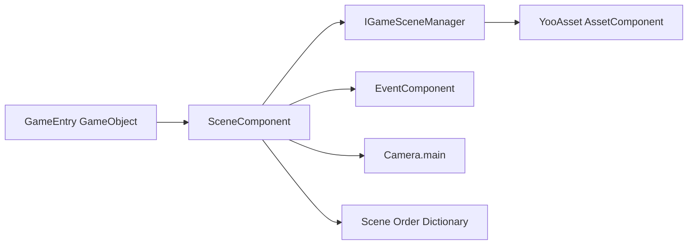

# 简介与功能特性

GameFrameX Scene 是基于 [YooAsset](https://github.com/tuyoogame/YooAsset) 的 Unity 场景管理包,提供异步场景加载/卸载、事件驱动的状态通知、进度追踪与活跃场景优先级排序能力,在 Game Frame X 体系中作为场景子系统的统一入口。

## 快速开始

### 依赖

| 包 | 最低版本 |
|---|---------|
| `com.gameframex.unity.asset` | >= 2.5.0 |
| `com.gameframex.unity.event` | >= 1.1.0 |

### 安装(UPM Scoped Registry)

编辑 Unity 项目 `Packages/manifest.json`,在 `scopedRegistries` 中加入 GameFrameX 仓库,并把 Scene 包加入 `dependencies`:

```json
{
  "scopedRegistries": [
    {
      "name": "GameFrameX",
      "url": "https://gameframex.upm.alianblank.uk",
      "scopes": ["com.gameframex"]
    }
  ],
  "dependencies": {
    "com.gameframex.unity.scene": "2.2.1"
  }
}
```

Source: [README.zh-CN.md](https://github.com/GameFrameX/com.gameframex.unity.scene/blob/main/README.zh-CN.md#L57-L73)

其它安装方式(Git URL / 手动放置 `Packages` 目录)与详细步骤,见《安装》。

### 添加 SceneComponent

在 GameEntry GameObject 上通过 `Add Component > GameFrameX > Scene` 添加 `SceneComponent`,框架会在启动时自动初始化,无需额外调用。

```csharp
[DisallowMultipleComponent]
[AddComponentMenu("GameFrameX/Scene")]
[GameFrameXAutoComponent(-4000)]
public sealed class SceneComponent : GameFrameworkComponent
```

Source: [SceneComponent.cs](https://github.com/GameFrameX/com.gameframex.unity.scene/blob/main/Runtime/Scene/SceneComponent.cs#L46-L49)

### 跑通第一个场景

1. 通过 `SceneComponent.LoadScene` 异步加载场景,得到 `SceneHandle`。
2. 通过 `SceneComponent.SetSceneOrder` 设置优先级,使其成为活跃场景。
3. 通过 `EventComponent` 订阅 `LoadSceneSuccessEventArgs` 回调通知。

```csharp
var handle = await SceneComponent.LoadScene("Assets/Scenes/GameScene.unity");
SceneComponent.SetSceneOrder("Assets/Scenes/GameScene.unity", 10);

EventComponent.Subscribe<LoadSceneSuccessEventArgs>(e =>
{
    Debug.Log($"场景 {e.SceneAssetName} 加载完成,耗时 {e.Duration:F2}s");
});
```

Source: [README.zh-CN.md](https://github.com/GameFrameX/com.gameframex.unity.scene/blob/main/README.zh-CN.md#L107-L154)

## 功能特性

| 能力 | 说明 |
|------|------|
| 异步场景加载/卸载 | 基于 `Task` 的 `LoadScene` 与 `UnloadScene` API |
| `LoadSceneMode` 支持 | `Single`(替换全部)与 `Additive`(叠加)两种模式 |
| 进度追踪 | `LoadSceneUpdateEventArgs` 实时进度,可驱动加载界面 |
| 活跃场景排序 | 通过 `SetSceneOrder` 设置优先级,数值越高越优先成为活跃场景 |
| 自动相机刷新 | 活跃场景切换时自动刷新 `Camera.main` 引用 |
| 事件通知 | 通过 `EventComponent` 订阅加载/卸载的成功、失败、更新事件 |
| 状态查询 | `SceneIsLoaded` / `SceneIsLoading` / `SceneIsUnloading` 任意时刻查询 |
| 编辑器扩展 | `SceneComponent` 自定义 Inspector 面板 |

Source: [README.zh-CN.md](https://github.com/GameFrameX/com.gameframex.unity.scene/blob/main/README.zh-CN.md#L28-L37)

## 工作原理速览

Scene 子系统以 `SceneComponent` 为统一入口,在内部委托给 `IGameSceneManager` 与 `GameSceneManager` 异步加载场景,并把生命周期事件转发到 `EventComponent` 总线,调用方通过订阅事件或调用 `SceneIsLoaded` 等查询接口获知状态。



Source: [SceneComponent.cs](https://github.com/GameFrameX/com.gameframex.unity.scene/blob/main/Runtime/Scene/SceneComponent.cs#L49-L61)

## 接下来

- 关于场景加载/卸载的完整步骤与示例,见《加载与卸载场景》
- 关于事件订阅的完整清单,见《事件参考》
- 关于 API 速查与版本变更,见《API 参考》与《更新日志》
