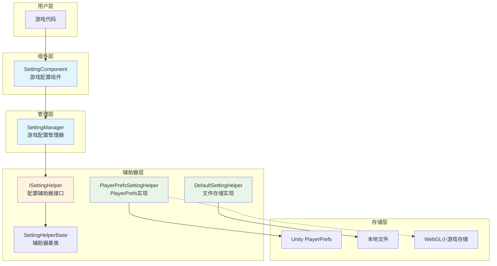
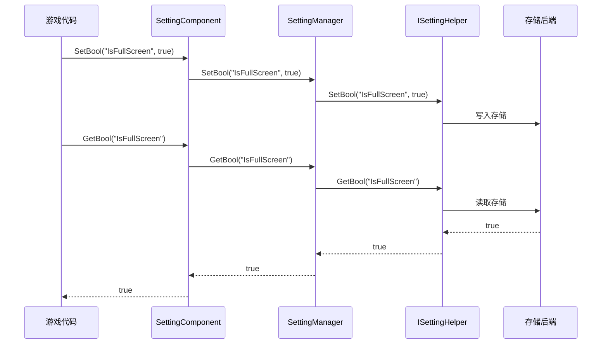

# 概述

GameFrameX Setting 配置组件是 GameFrameX 游戏框架的核心组件之一，负责管理游戏的配置信息，提供保存和获取各种类型配置数据的功能。该组件采用分层架构设计，支持多种存储后端，使游戏设置的管理变得简单高效。

## 概述

Setting 配置组件旨在解决游戏开发中普遍存在的配置管理需求。在游戏开发过程中，开发者需要保存各种类型的设置数据，如画面质量、音量大小、按键绑定、游戏进度等。传统做法是自行实现一套配置系统，不仅代码复用性低，而且难以维护。

GameFrameX Setting 组件提供了统一的配置管理解决方案：

- **类型安全**: 支持布尔值、整数、浮点数、字符串以及任意可序列化对象
- **多存储后端**: 内置 PlayerPrefs 和文件存储两种实现，支持自定义扩展
- **跨平台支持**: 全面支持 Unity 各平台，包括 WebGL 小游戏（抖音、微信、快手）
- **编辑器集成**: 提供 Unity 编辑器Inspector面板，可视化配置组件

## 架构设计



### 核心组件说明

| 组件 | 说明 | 设计意图 |
|------|------|----------|
| SettingComponent | Unity MonoBehaviour 组件 | 作为框架与游戏代码的桥梁，提供编辑器集成和生命周期管理 |
| SettingManager | 核心业务逻辑模块 | 负责设置数据的管理，验证输入，转发请求到辅助器 |
| ISettingHelper | 存储抽象接口 | 解耦存储实现，便于扩展新的存储后端 |
| SettingHelperBase | 辅助器基类 | 提供抽象方法定义，简化辅助器实现 |

### 数据流向



## 功能特性

### 支持的数据类型

Setting 组件支持以下数据类型，满足游戏开发中的各种配置需求：

- **布尔值 (bool)**: 用于开关类设置，如是否全屏、是否开启音效等
- **整数 (int)**: 用于数值类设置，如分辨率、画质等级等
- **浮点数 (float)**: 用于精确数值设置，如音量大小、灵敏度等
- **字符串 (string)**: 用于文本类设置，如玩家名称、服务器地址等
- **对象 (Object)**: 用于复杂配置，使用 JSON 序列化存储，如游戏进度、角色数据等

### 存储后端

#### PlayerPrefsSettingHelper（默认）

基于 Unity 内置的 PlayerPrefs 实现，是最简单直接的存储方式：

- **优点**: 无需额外配置，即插即用
- **缺点**: 不支持获取所有键名，无法批量删除
- **适用场景**: 简单的配置存储

```csharp
// 默认使用 PlayerPrefsSettingHelper
settingComponent.SetBool("IsFullScreen", true);
settingComponent.SetFloat("Volume", 0.8f);
settingComponent.Save();
```

#### DefaultSettingHelper

基于本地文件存储的实现，提供更完善的功能：

- **优点**: 支持获取所有设置项名称，支持完整的数据管理
- **缺点**: 需要手动调用 Save() 保存
- **适用场景**: 需要完整设置管理功能的游戏

```csharp
// 使用文件存储
settingComponent.SetInt("HighScore", 10000);
settingComponent.Save();
```

### 跨平台支持

PlayerPrefsSettingHelper 针对不同平台有特殊处理：

| 平台 | 存储实现 | 特殊说明 |
|------|----------|----------|
| Unity Editor | Unity PlayerPrefs | 完整的读写支持 |
| Standalone | Unity PlayerPrefs | 完整的读写支持 |
| WebGL | 各平台 Storage API | 抖音、微信、快手小游戏各自适配 |
| Mobile | Unity PlayerPrefs | 完整的读写支持 |
| Console | Unity PlayerPrefs | 完整的读写支持 |

### 对象序列化

组件使用 JSON 序列化来存储复杂对象，支持泛型和非泛型两种接口：

```csharp
// 定义一个设置类
[Serializable]
public class GameSettings
{
    public bool IsFullScreen = true;
    public int ResolutionWidth = 1920;
    public int ResolutionHeight = 1080;
    public float Volume = 0.8f;
}

// 存储对象
GameSettings settings = new GameSettings { IsFullScreen = true, Volume = 0.5f };
settingComponent.SetObject("GameSettings", settings);

// 读取对象
GameSettings loadedSettings = settingComponent.GetObject<GameSettings>("GameSettings");
```

## 使用方式

### 基本配置

在 Unity 场景中创建 SettingComponent：

1. 在 Hierarchy 面板中创建空物体
2. 添加 `SettingComponent` 组件（菜单：GameFrameX → Setting）
3. 系统会自动添加必要的依赖组件

### 配置辅助器选择

在 Inspector 面板中，可以选择不同的配置辅助器：

- **PlayerPrefsSettingHelper**: 默认使用，简便易用
- **DefaultSettingHelper**: 文件存储，功能更全

也可以通过 `m_CustomSettingHelper` 字段拖入自定义辅助器。

### 数据操作流程

```csharp
public class GameExample : MonoBehaviour
{
    private SettingComponent settingComponent;

    private void Start()
    {
        // 获取设置组件（通过框架获取或直接获取）
        settingComponent = GameEntry.GetComponent<SettingComponent>();
    }

    private void SaveSettings()
    {
        // 保存设置
        settingComponent.SetBool("IsFullScreen", true);
        settingComponent.SetFloat("Volume", 0.8f);
        settingComponent.SetString("PlayerName", "PlayerOne");
        
        // 重要：调用Save()持久化存储
        settingComponent.Save();
    }

    private void LoadSettings()
    {
        // 读取设置，支持默认值
        bool isFullScreen = settingComponent.GetBool("IsFullScreen", true);
        float volume = settingComponent.GetFloat("Volume", 0.5f);
        string playerName = settingComponent.GetString("PlayerName", "Default");
    }
}
```

## 相关链接

- [安装指南](./02.installation)
- [快速开始](./03.getting-started)
- [功能特性](./04.features)
- [设置辅助器实现](./05.helper-implementation)
- [平台配置](./06.platforms)
- [API 参考](./07.api-reference)
- [常见问题](./08.troubleshooting)
- [官方文档](https://gameframex.doc.alianblank.com/)
- [GitHub 仓库](https://github.com/GameFrameX/com.gameframex.unity.setting)
