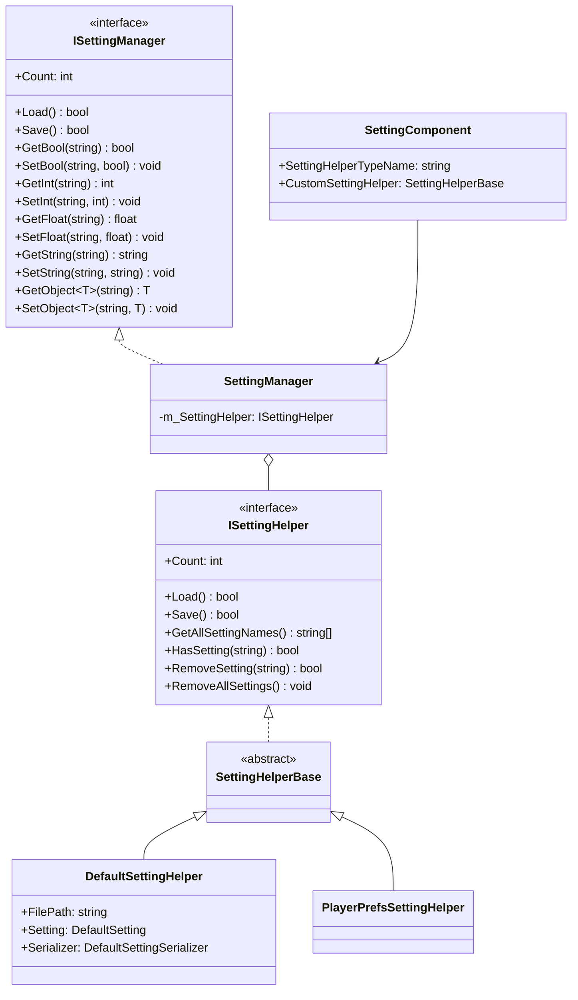
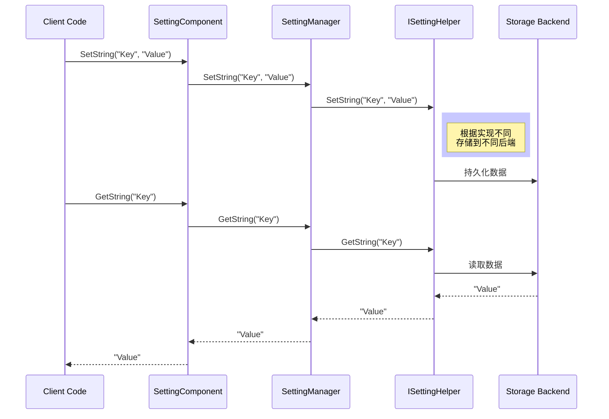

# API 参考

本文档详细介绍 GameFrameX Setting 模块的所有公共 API，包括接口定义、类说明和使用方式。

## 概述

GameFrameX Setting 模块提供了一套完整的游戏配置管理解决方案，支持多种存储后端（文件存储、PlayerPrefs、小游戏平台存储）。该模块采用分层架构设计，通过接口抽象实现存储无关的设置管理功能。

## 架构概览



## ISettingManager 接口

`ISettingManager` 是设置管理的核心接口，定义了游戏设置的基本操作。

> Source: [ISettingManager.cs](https://github.com/GameFrameX/com.gameframex.unity.setting/blob/main/Runtime/Setting/Setting/ISettingManager.cs#L30-L342)

### 属性

#### `Count: int`

获取当前游戏配置项的数量。

```csharp
int count = settingManager.Count;
```

> Source: [ISettingManager.cs](https://github.com/GameFrameX/com.gameframex.unity.setting/blob/main/Runtime/Setting/Setting/ISettingManager.cs#L50-L51)

### 方法

#### `Load(): bool`

加载游戏配置。

**返回：** 是否加载成功。

```csharp
bool success = settingManager.Load();
```

> Source: [ISettingManager.cs](https://github.com/GameFrameX/com.gameframex.unity.setting/blob/main/Runtime/Setting/Setting/ISettingManager.cs#L70-L71)

---

#### `Save(): bool`

保存游戏配置。

**返回：** 是否保存成功。

```csharp
bool success = settingManager.Save();
```

> Source: [ISettingManager.cs](https://github.com/GameFrameX/com.gameframex.unity.setting/blob/main/Runtime/Setting/Setting/ISettingManager.cs#L80-L81)

---

#### `GetAllSettingNames(): string[]`

获取所有游戏配置项的名称数组。

**返回：** 所有配置项名称的数组。

```csharp
string[] names = settingManager.GetAllSettingNames();
```

> Source: [ISettingManager.cs](https://github.com/GameFrameX/com.gameframex.unity.setting/blob/main/Runtime/Setting/Setting/ISettingManager.cs#L90-L91)

---

#### `GetAllSettingNames(results: List<string>): void`

获取所有游戏配置项的名称列表。

**参数：**
- `results` (List<string>): 用于存储配置项名称的列表。

```csharp
var names = new List<string>();
settingManager.GetAllSettingNames(names);
```

> Source: [ISettingManager.cs](https://github.com/GameFrameX/com.gameframex.unity.setting/blob/main/Runtime/Setting/Setting/ISettingManager.cs#L100-L101)

---

#### `HasSetting(settingName: string): bool`

检查指定配置项是否存在。

**参数：**
- `settingName` (string): 要检查的配置项名称。

**返回：** 配置项是否存在。

```csharp
bool exists = settingManager.HasSetting("PlayerName");
```

> Source: [ISettingManager.cs](https://github.com/GameFrameX/com.gameframex.unity.setting/blob/main/Runtime/Setting/Setting/ISettingManager.cs#L112-L113)

---

#### `RemoveSetting(settingName: string): bool`

移除指定配置项。

**参数：**
- `settingName` (string): 要移除的配置项名称。

**返回：** 是否移除成功。

```csharp
bool success = settingManager.RemoveSetting("OldSetting");
```

> Source: [ISettingManager.cs](https://github.com/GameFrameX/com.gameframex.unity.setting/blob/main/Runtime/Setting/Setting/ISettingManager.cs#L122-L123)

---

#### `RemoveAllSettings(): void`

清空所有游戏配置项。

```csharp
settingManager.RemoveAllSettings();
```

> Source: [ISettingManager.cs](https://github.com/GameFrameX/com.gameframex.unity.setting/blob/main/Runtime/Setting/Setting/ISettingManager.cs#L131-L132)

---

### 布尔值操作

#### `GetBool(settingName: string): bool`

从指定配置项读取布尔值。

**参数：**
- `settingName` (string): 配置项名称。

**返回：** 读取的布尔值。如果配置项不存在则抛出异常。

```csharp
bool value = settingManager.GetBool("SoundEnabled");
```

> Source: [ISettingManager.cs](https://github.com/GameFrameX/com.gameframex.unity.setting/blob/main/Runtime/Setting/Setting/ISettingManager.cs#L142-L143)

---

#### `GetBool(settingName: string, defaultValue: bool): bool`

从指定配置项读取布尔值，支持默认值。

**参数：**
- `settingName` (string): 配置项名称。
- `defaultValue` (bool): 配置项不存在时返回的默认值。

**返回：** 读取的布尔值或默认值。

```csharp
bool value = settingManager.GetBool("MusicEnabled", true);
```

> Source: [ISettingManager.cs](https://github.com/GameFrameX/com.gameframex.unity.setting/blob/main/Runtime/Setting/Setting/ISettingManager.cs#L154-L155)

---

#### `SetBool(settingName: string, value: bool): void`

向指定配置项写入布尔值。

**参数：**
- `settingName` (string): 配置项名称。
- `value` (bool): 要写入的布尔值。

```csharp
settingManager.SetBool("SoundEnabled", true);
```

> Source: [ISettingManager.cs](https://github.com/GameFrameX/com.gameframex.unity.setting/blob/main/Runtime/Setting/Setting/ISettingManager.cs#L165-L166)

---

### 整数值操作

#### `GetInt(settingName: string): int`

从指定配置项读取整数值。

**参数：**
- `settingName` (string): 配置项名称。

**返回：** 读取的整数值。如果配置项不存在则抛出异常。

```csharp
int level = settingManager.GetInt("CurrentLevel");
```

> Source: [ISettingManager.cs](https://github.com/GameFrameX/com.gameframex.unity.setting/blob/main/Runtime/Setting/Setting/ISettingManager.cs#L176-L177)

---

#### `GetInt(settingName: string, defaultValue: int): int`

从指定配置项读取整数值，支持默认值。

**参数：**
- `settingName` (string): 配置项名称。
- `defaultValue` (int): 配置项不存在时返回的默认值。

**返回：** 读取的整数值或默认值。

```csharp
int score = settingManager.GetInt("HighScore", 0);
```

> Source: [ISettingManager.cs](https://github.com/GameFrameX/com.gameframex.unity.setting/blob/main/Runtime/Setting/Setting/ISettingManager.cs#L188-L189)

---

#### `SetInt(settingName: string, value: int): void`

向指定配置项写入整数值。

**参数：**
- `settingName` (string): 配置项名称。
- `value` (int): 要写入的整数值。

```csharp
settingManager.SetInt("CurrentLevel", 5);
```

> Source: [ISettingManager.cs](https://github.com/GameFrameX/com.gameframex.unity.setting/blob/main/Runtime/Setting/Setting/ISettingManager.cs#L199-L200)

---

### 浮点数值操作

#### `GetFloat(settingName: string): float`

从指定配置项读取浮点数值。

**参数：**
- `settingName` (string): 配置项名称。

**返回：** 读取的浮点数值。如果配置项不存在则抛出异常。

```csharp
float volume = settingManager.GetFloat("MusicVolume");
```

> Source: [ISettingManager.cs](https://github.com/GameFrameX/com.gameframex.unity.setting/blob/main/Runtime/Setting/Setting/ISettingManager.cs#L210-L211)

---

#### `GetFloat(settingName: string, defaultValue: float): float`

从指定配置项读取浮点数值，支持默认值。

**参数：**
- `settingName` (string): 配置项名称。
- `defaultValue` (float): 配置项不存在时返回的默认值。

**返回：** 读取的浮点数值或默认值。

```csharp
float volume = settingManager.GetFloat("MusicVolume", 0.5f);
```

> Source: [ISettingManager.cs](https://github.com/GameFrameX/com.gameframex.unity.setting/blob/main/Runtime/Setting/Setting/ISettingManager.cs#L222-L223)

---

#### `SetFloat(settingName: string, value: float): void`

向指定配置项写入浮点数值。

**参数：**
- `settingName` (string): 配置项名称。
- `value` (float): 要写入的浮点数值。

```csharp
settingManager.SetFloat("MusicVolume", 0.8f);
```

> Source: [ISettingManager.cs](https://github.com/GameFrameX/com.gameframex.unity.setting/blob/main/Runtime/Setting/Setting/ISettingManager.cs#L233-L234)

---

### 字符串值操作

#### `GetString(settingName: string): string`

从指定配置项读取字符串值。

**参数：**
- `settingName` (string): 配置项名称。

**返回：** 读取的字符串值。如果配置项不存在则抛出异常。

```csharp
string playerName = settingManager.GetString("PlayerName");
```

> Source: [ISettingManager.cs](https://github.com/GameFrameX/com.gameframex.unity.setting/blob/main/Runtime/Setting/Setting/ISettingManager.cs#L244-L245)

---

#### `GetString(settingName: string, defaultValue: string): string`

从指定配置项读取字符串值，支持默认值。

**参数：**
- `settingName` (string): 配置项名称。
- `defaultValue` (string): 配置项不存在时返回的默认值。

**返回：** 读取的字符串值或默认值。

```csharp
string playerName = settingManager.GetString("PlayerName", "Guest");
```

> Source: [ISettingManager.cs](https://github.com/GameFrameX/com.gameframex.unity.setting/blob/main/Runtime/Setting/Setting/ISettingManager.cs#L256-L257)

---

#### `SetString(settingName: string, value: string): void`

向指定配置项写入字符串值。

**参数：**
- `settingName` (string): 配置项名称。
- `value` (string): 要写入的字符串值。

```csharp
settingManager.SetString("PlayerName", "Hero");
```

> Source: [ISettingManager.cs](https://github.com/GameFrameX/com.gameframex.unity.setting/blob/main/Runtime/Setting/Setting/ISettingManager.cs#L267-L268)

---

### 对象操作

#### `GetObject<T>(settingName: string): T`

从指定配置项读取对象。

**类型参数：**
- `T`: 要读取的对象类型，必须包含无参构造函数。

**参数：**
- `settingName` (string): 配置项名称。

**返回：** 读取的对象实例。如果配置项不存在则抛出异常。

```csharp
var playerData = settingManager.GetObject<PlayerData>("PlayerData");
```

> Source: [ISettingManager.cs](https://github.com/GameFrameX/com.gameframex.unity.setting/blob/main/Runtime/Setting/Setting/ISettingManager.cs#L279-L280)

---

#### `GetObject(objectType: Type, settingName: string): object`

从指定配置项读取对象（非泛型版本）。

**参数：**
- `objectType` (Type): 要读取的对象类型。
- `settingName` (string): 配置项名称。

**返回：** 读取的对象实例。

```csharp
object playerData = settingManager.GetObject(typeof(PlayerData), "PlayerData");
```

> Source: [ISettingManager.cs](https://github.com/GameFrameX/com.gameframex.unity.setting/blob/main/Runtime/Setting/Setting/ISettingManager.cs#L291-L292)

---

#### `GetObject<T>(settingName: string, defaultObj: T): T`

从指定配置项读取对象，支持默认值。

**类型参数：**
- `T`: 要读取的对象类型。

**参数：**
- `settingName` (string): 配置项名称。
- `defaultObj` (T): 配置项不存在时返回的默认对象。

**返回：** 读取的对象或默认对象。

```csharp
var defaultData = new PlayerData();
var playerData = settingManager.GetObject("PlayerData", defaultData);
```

> Source: [ISettingManager.cs](https://github.com/GameFrameX/com.gameframex.unity.setting/blob/main/Runtime/Setting/Setting/ISettingManager.cs#L304-L305)

---

#### `GetObject(objectType: Type, settingName: string, defaultObj: object): object`

从指定配置项读取对象（非泛型版本），支持默认值。

**参数：**
- `objectType` (Type): 要读取的对象类型。
- `settingName` (string): 配置项名称。
- `defaultObj` (object): 配置项不存在时返回的默认对象。

**返回：** 读取的对象或默认对象。

```csharp
var defaultData = new PlayerData();
var playerData = settingManager.GetObject(typeof(PlayerData), "PlayerData", defaultData);
```

> Source: [ISettingManager.cs](https://github.com/GameFrameX/com.gameframex.unity.setting/blob/main/Runtime/Setting/Setting/ISettingManager.cs#L317-L318)

---

#### `SetObject<T>(settingName: string, obj: T): void`

向指定配置项写入对象。

**类型参数：**
- `T`: 要写入的对象类型。

**参数：**
- `settingName` (string): 配置项名称。
- `obj` (T): 要写入的对象。

```csharp
var playerData = new PlayerData { Name = "Hero", Level = 10 };
settingManager.SetObject("PlayerData", playerData);
```

> Source: [ISettingManager.cs](https://github.com/GameFrameX/com.gameframex.unity.setting/blob/main/Runtime/Setting/Setting/ISettingManager.cs#L329-L330)

---

#### `SetObject(settingName: string, obj: object): void`

向指定配置项写入对象（非泛型版本）。

**参数：**
- `settingName` (string): 配置项名称。
- `obj` (object): 要写入的对象。

```csharp
var playerData = new PlayerData { Name = "Hero", Level = 10 };
settingManager.SetObject("PlayerData", (object)playerData);
```

> Source: [ISettingManager.cs](https://github.com/GameFrameX/com.gameframex.unity.setting/blob/main/Runtime/Setting/Setting/ISettingManager.cs#L340-L341)

---

## ISettingHelper 接口

`ISettingHelper` 是设置存储的抽象接口，允许实现不同的存储后端。

> Source: [ISettingHelper.cs](https://github.com/GameFrameX/com.gameframex.unity.setting/blob/main/Runtime/Setting/Setting/ISettingHelper.cs#L30-L332)

**接口方法与 ISettingManager 大致相同，但增加了以下内容：**
- 文件序列化/反序列化操作
- 所有方法都是抽象的，由具体实现类提供

**设计意图：** 该接口采用策略模式设计，允许在运行时切换不同的存储实现，如文件存储、PlayerPrefs、或小游戏平台存储。

---

## SettingManager 类

`SettingManager` 是 `ISettingManager` 的核心实现类，继承自 `GameFrameworkModule`。

> Source: [SettingManager.cs](https://github.com/GameFrameX/com.gameframex.unity.setting/blob/main/Runtime/Setting/Setting/SettingManager.cs#L30-L737)

### 构造方法

#### `SettingManager()`

初始化 SettingManager 的新实例。

```csharp
var settingManager = new SettingManager();
```

> Source: [SettingManager.cs](https://github.com/GameFrameX/com.gameframex.unity.setting/blob/main/Runtime/Setting/Setting/SettingManager.cs#L53-L57)

### 方法

#### `SetSettingHelper(settingHelper: ISettingHelper): void`

设置游戏配置辅助器。

**参数：**
- `settingHelper` (ISettingHelper): 游戏配置辅助器实例。

**抛出：** 当 settingHelper 为 null 时抛出 GameFrameworkException。

```csharp
settingManager.SetSettingHelper(new PlayerPrefsSettingHelper());
```

> Source: [SettingManager.cs](https://github.com/GameFrameX/com.gameframex.unity.setting/blob/main/Runtime/Setting/Setting/SettingManager.cs#L111-L120)

---

#### `Update(elapseSeconds: float, realElapseSeconds: float): void`

每帧轮询更新方法。此方法为空实现，因为设置管理器不需要每帧更新。

> Source: [SettingManager.cs](https://github.com/GameFrameX/com.gameframex.unity.setting/blob/main/Runtime/Setting/Setting/SettingManager.cs#L88-L90)

---

#### `Shutdown(): void`

关闭并清理设置管理器。在关闭时自动保存所有未保存的设置。

> Source: [SettingManager.cs](https://github.com/GameFrameX/com.gameframex.unity.setting/blob/main/Runtime/Setting/Setting/SettingManager.cs#L98-L101)

---

## SettingHelperBase 抽象类

`SettingHelperBase` 是所有设置辅助器的抽象基类，继承自 `MonoBehaviour` 并实现 `ISettingHelper` 接口。

> Source: [SettingHelperBase.cs](https://github.com/GameFrameX/com.gameframex.unity.setting/blob/main/Runtime/Setting/SettingHelperBase.cs#L30-L333)

**设计意图：** 提供 Unity 组件形式的辅助器基类，所有具体实现都可以作为组件挂载到场景中。

---

## DefaultSettingHelper 类

`DefaultSettingHelper` 是默认的设置辅助器实现，使用本地文件存储设置数据。

> Source: [DefaultSettingHelper.cs](https://github.com/GameFrameX/com.gameframex.unity.setting/blob/main/Runtime/Setting/DefaultSettingHelper.cs#L30-L529)

### 属性

#### `FilePath: string` (只读)

获取游戏配置存储文件的路径。

```csharp
string path = defaultSettingHelper.FilePath;
```

> Source: [DefaultSettingHelper.cs](https://github.com/GameFrameX/com.gameframex.unity.setting/blob/main/Runtime/Setting/DefaultSettingHelper.cs#L76-L82)

---

#### `Setting: DefaultSetting` (只读)

获取游戏配置数据实例。

```csharp
var settings = defaultSettingHelper.Setting;
```

> Source: [DefaultSettingHelper.cs](https://github.com/GameFrameX/com.gameframex.unity.setting/blob/main/Runtime/Setting/DefaultSettingHelper.cs#L91-L97)

---

#### `Serializer: DefaultSettingSerializer` (只读)

获取游戏配置序列化器。

```csharp
var serializer = defaultSettingHelper.Serializer;
```

> Source: [DefaultSettingHelper.cs](https://github.com/GameFrameX/com.gameframex.unity.setting/blob/main/Runtime/Setting/DefaultSettingHelper.cs#L106-L112)

---

### 存储文件

默认存储路径：`Application.persistentDataPath/GameFrameworkSetting.dat`

> Source: [DefaultSettingHelper.cs](https://github.com/GameFrameX/com.gameframex.unity.setting/blob/main/Runtime/Setting/DefaultSettingHelper.cs#L48)

---

## PlayerPrefsSettingHelper 类

`PlayerPrefsSettingHelper` 基于 Unity PlayerPrefs 实现设置存储，并支持多种小游戏平台。

> Source: [PlayerPrefsSettingHelper.cs](https://github.com/GameFrameX/com.gameframex.unity.setting/blob/main/Runtime/Setting/PlayerPrefsSettingHelper.cs#L30-L638)

### 平台支持

- Unity Editor
- Unity WebGL (标准)
- 抖音小游戏 (ENABLE_DOUYIN_MINI_GAME)
- 微信小游戏 (ENABLE_WECHAT_MINI_GAME)
- 快手小游戏 (ENABLE_KUAISHOU_MINI_GAME)

### 特性说明

| 特性 | 支持情况 |
|------|----------|
| Count | 不支持，始终返回 -1 |
| GetAllSettingNames | 不支持，返回 null |
| Load | 不需要，始终返回 true |
| Save | WebGL 小游戏平台为无操作 |

> Source: [PlayerPrefsSettingHelper.cs](https://github.com/GameFrameX/com.gameframex.unity.setting/blob/main/Runtime/Setting/PlayerPrefsSettingHelper.cs#L52-L100)

---

## SettingComponent 类

`SettingComponent` 是 Unity 组件，用于在 GameFrameX 框架中集成设置管理功能。

> Source: [SettingComponent.cs](https://github.com/GameFrameX/com.gameframex.unity.setting/blob/main/Runtime/Setting/SettingComponent.cs#L30-L447)

### 组件特性

- 继承自 `GameFrameworkComponent`
- 挂载在场景中自动初始化
- 支持自定义设置辅助器类型

### 序列化字段

#### `SettingHelperTypeName: string`

设置辅助器的类型名称。默认为 `PlayerPrefsSettingHelper`。

```csharp
[SerializeField]
private string m_SettingHelperTypeName = "GameFrameX.Setting.Runtime.PlayerPrefsSettingHelper";
```

> Source: [SettingComponent.cs](https://github.com/GameFrameX/com.gameframex.unity.setting/blob/main/Runtime/Setting/SettingComponent.cs#L51)

---

#### `CustomSettingHelper: SettingHelperBase`

自定义设置辅助器实例。

```csharp
[SerializeField]
private SettingHelperBase m_CustomSettingHelper = null;
```

> Source: [SettingComponent.cs](https://github.com/GameFrameX/com.gameframex.unity.setting/blob/main/Runtime/Setting/SettingComponent.cs#L53)

---

### 方法

`SettingComponent` 提供了与 `ISettingManager` 相同的方法集，可直接在 Unity 脚本中使用。

---

## 数据流



---

## 异常处理

| 异常类型 | 触发条件 |
|----------|----------|
| GameFrameworkException | 设置辅助器未设置时调用方法 |
| GameFrameworkException | 设置名称为空或 null |
| GameFrameworkException | 对象类型为 null |

```csharp
// 典型异常处理
try {
    var value = settingManager.GetString("Key");
} catch (GameFrameworkException ex) {
    Debug.LogError($"设置操作失败: {ex.Message}");
}
```

---

## 相关链接

- [概述](./1-overview)
- [安装](./2-installation)
- [快速开始](./3-quick-start)
- [核心概念](./4-core-concepts)
- [设置辅助器](./6-helper-implementation)
- [平台配置](./7-platforms)
- [常见问题](./8-troubleshooting)
