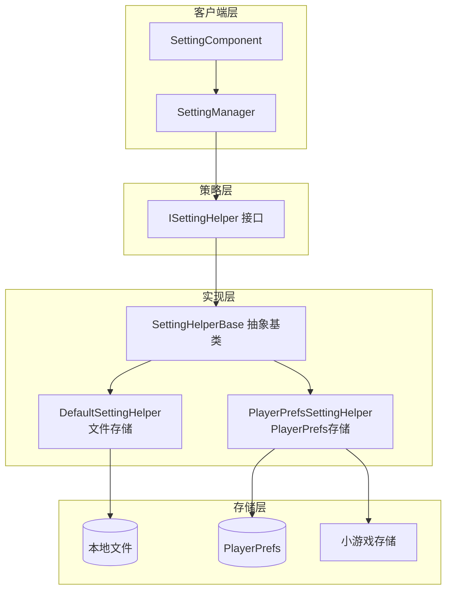

# 设置辅助器

设置辅助器（Setting Helper）是 GameFrameX 设置模块的核心组件，负责游戏配置的底层存储和读取操作。通过策略模式设计，系统支持多种存储后端，开发者可以根据项目需求选择合适的存储实现。

## 概述

设置辅助器是 `ISettingHelper` 接口的各种实现，负责将游戏设置数据持久化到不同的存储介质。该系统采用策略模式，使得存储实现可以灵活切换而无需修改上层业务逻辑。

**设计意图**：将设置存储的底层实现与业务层分离，允许在不修改业务代码的情况下切换存储方式（如从文件存储切换到 PlayerPrefs），同时支持针对不同平台（Unity 原生、WebGL、小游戏）的定制化存储实现。



### 核心组件说明

| 组件 | 职责 | 适用场景 |
|------|------|----------|
| `ISettingHelper` | 定义设置存储的统一接口 | 统一 API 规范 |
| `SettingHelperBase` | 提供抽象基类，实现 MonoBehaviour 生命周期 | 扩展新存储方式 |
| `DefaultSettingHelper` | 基于本地文件的二进制序列化存储 | 需要完整数据控制权 |
| `PlayerPrefsSettingHelper` | 基于 Unity PlayerPrefs 的键值存储 | 简单配置、快速原型 |

## 内置辅助器实现

### DefaultSettingHelper（文件存储辅助器）

`DefaultSettingHelper` 将游戏设置存储为本地二进制文件，使用自定义序列化格式。该实现提供了完整的数据控制权，支持获取所有配置项名称、统计数量等高级功能。

**存储位置**：`<persistentDataPath>/GameFrameworkSetting.dat`

> Source: [DefaultSettingHelper.cs](https://github.com/GameFrameX/com.gameframex.unity.setting/blob/main/Runtime/Setting/DefaultSettingHelper.cs#L46-L529)

```csharp
public class DefaultSettingHelper : SettingHelperBase
{
    private const string SettingFileName = "GameFrameworkSetting.dat";
    private string m_FilePath = null;
    private DefaultSetting m_Settings = null;
    private DefaultSettingSerializer m_Serializer = null;

    private void Awake()
    {
        m_FilePath = Utility.Path.GetRegularPath(Path.Combine(Application.persistentDataPath, SettingFileName));
        m_Settings = new DefaultSetting();
        m_Serializer = new DefaultSettingSerializer();
        m_Serializer.RegisterSerializeCallback(0, SerializeDefaultSettingCallback);
        m_Serializer.RegisterDeserializeCallback(0, DeserializeDefaultSettingCallback);
    }
}
```

**特点**：
- 存储路径可预测，便于文件管理和备份
- 支持完整的设置枚举和计数功能
- 二进制序列化，文件体积紧凑
- 支持自定义序列化器扩展

### PlayerPrefsSettingHelper（PlayerPrefs 存储辅助器）

`PlayerPrefsSettingHelper` 基于 Unity 的 PlayerPrefs 实现，同时针对 WebGL 小游戏平台（抖音、微信、快手）提供了平台特定的存储适配。

> Source: [PlayerPrefsSettingHelper.cs](https://github.com/GameFrameX/com.gameframex.unity.setting/blob/main/Runtime/Setting/PlayerPrefsSettingHelper.cs#L43-L638)

```csharp
public class PlayerPrefsSettingHelper : SettingHelperBase
{
    // 平台判断示例：检查是否存在指定配置项
    public override bool HasSetting(string settingName)
    {
#if UNITY_EDITOR
        return UnityEngine.PlayerPrefs.HasKey(settingName);
#endif
#if UNITY_WEBGL && ENABLE_DOUYIN_MINI_GAME
        return TTSDK.TTStorage.HasKeySync(settingName);
#elif UNITY_WEBGL && ENABLE_WECHAT_MINI_GAME
        return WeChatWASM.WXSDKManagerHandler.Instance.StorageHasKeySync(settingName);
#elif UNITY_WEBGL && ENABLE_KUAISHOU_MINI_GAME
        return KSWASM.KSBase.StorageHasKeySync(settingName);
#else
        return UnityEngine.PlayerPrefs.HasKey(settingName);
#endif
    }
}
```

**支持的平台存储**：

| 平台 | 存储实现 | 特殊处理 |
|------|----------|----------|
| Unity Editor | PlayerPrefs | 标准实现 |
| Unity Standalone | PlayerPrefs | 标准实现 |
| Unity WebGL (原生) | PlayerPrefs | 标准实现 |
| 抖音小游戏 | TTStorage | 同步 API |
| 微信小游戏 | WXStorage | 同步 API |
| 快手小游戏 | KSStorage | 同步 API |

**注意事项**：
- `Count` 属性始终返回 `-1`（PlayerPrefs 不支持计数）
- `GetAllSettingNames()` 不支持，返回 `null` 并输出警告
- WebGL 小游戏平台 Save() 方法为空操作（小游戏自动保存）

## 辅助器基类

`SettingHelperBase` 是所有设置辅助器的抽象基类，继承自 `MonoBehaviour`，提供统一的生命周期管理和接口定义。

> Source: [SettingHelperBase.cs](https://github.com/GameFrameX/com.gameframex.unity.setting/blob/main/Runtime/Setting/SettingHelperBase.cs#L43-L333)

### 抽象方法清单

| 方法 | 说明 |
|------|------|
| `Count` | 获取配置项数量 |
| `Load()` | 加载配置 |
| `Save()` | 保存配置 |
| `GetAllSettingNames()` | 获取所有配置项名称 |
| `HasSetting(name)` | 检查配置项是否存在 |
| `RemoveSetting(name)` | 移除指定配置项 |
| `RemoveAllSettings()` | 清空所有配置 |
| `GetBool/SetBool` | 布尔值读写 |
| `GetInt/SetInt` | 整数值读写 |
| `GetFloat/SetFloat` | 浮点数值读写 |
| `GetString/SetString` | 字符串读写 |
| `GetObject/SetObject` | 对象序列化读写 |

## 创建自定义辅助器

要创建自定义设置辅助器，需要继承 `SettingHelperBase` 并实现所有抽象方法。

```csharp
using GameFrameX.Setting.Runtime;
using UnityEngine;

public class CustomSettingHelper : SettingHelperBase
{
    // 自定义存储实现
    private Dictionary<string, string> _storage = new Dictionary<string, string>();

    public override int Count => _storage.Count;

    public override bool Load()
    {
        // 从自定义存储加载数据
        return true;
    }

    public override bool Save()
    {
        // 保存数据到自定义存储
        return true;
    }

    public override string[] GetAllSettingNames()
    {
        return _storage.Keys.ToArray();
    }

    public override bool HasSetting(string settingName)
    {
        return _storage.ContainsKey(settingName);
    }

    public override bool RemoveSetting(string settingName)
    {
        return _storage.Remove(settingName);
    }

    public override void RemoveAllSettings()
    {
        _storage.Clear();
    }

    // 实现所有 Get/Set 方法...
    // Bool, Int, Float, String, Object 的读写实现
}
```

> Source: [SettingHelperBase.cs](https://github.com/GameFrameX/com.gameframex.unity.setting/blob/main/Runtime/Setting/SettingHelperBase.cs)

## 辅助器选择配置

在 Unity 编辑器中，可以通过 SettingComponent 选择使用哪个辅助器：

1. 在场景中添加 `SettingComponent`（GameFrameX/Setting 菜单）
2. 在 Inspector 中修改 `Setting Helper Type Name`
3. 或拖入自定义辅助器到 `Custom Setting Helper` 字段

```csharp
// SettingComponent 中的辅助器创建逻辑
private void Awake()
{
    // ... 初始化代码 ...
    
    SettingHelperBase settingHelper = Helper.CreateHelper(m_SettingHelperTypeName, m_CustomSettingHelper);
    m_SettingManager.SetSettingHelper(settingHelper);
}
```

> Source: [SettingComponent.cs](https://github.com/GameFrameX/com.gameframex.unity.setting/blob/main/Runtime/Setting/SettingComponent.cs#L85-L97)

## 序列化机制

### DefaultSetting 内部数据结构

`DefaultSetting` 使用 `SortedDictionary<string, string>` 存储所有配置项，将所有值统一转换为字符串进行存储。

> Source: [DefaultSetting.cs](https://github.com/GameFrameX/com.gameframex.unity.setting/blob/main/Runtime/Setting/DefaultSetting.cs#L47-L400)

```csharp
public sealed class DefaultSetting
{
    private readonly SortedDictionary<string, string> m_Settings = new SortedDictionary<string, string>(StringComparer.Ordinal);

    public void Serialize(Stream stream)
    {
        using (BinaryWriter binaryWriter = new BinaryWriter(stream, Encoding.UTF8))
        {
            binaryWriter.Write7BitEncodedInt32(m_Settings.Count);
            foreach (KeyValuePair<string, string> setting in m_Settings)
            {
                binaryWriter.Write(setting.Key);
                binaryWriter.Write(setting.Value);
            }
        }
    }
}
```

### DefaultSettingSerializer 文件格式

存储文件使用二进制格式，包含以下部分：
- **文件头**：`GFS` 三个字节（用于格式识别）
- **版本号**：7 位压缩整型
- **数据**：键值对列表

> Source: [DefaultSettingSerializer.cs](https://github.com/GameFrameX/com.gameframex.unity.setting/blob/main/Runtime/Setting/DefaultSettingSerializer.cs#L43-L66)

```csharp
public sealed class DefaultSettingSerializer : GameFrameworkSerializer<DefaultSetting>
{
    private static readonly byte[] Header = new byte[] { (byte)'G', (byte)'F', (byte)'S' };

    protected override byte[] GetHeader()
    {
        return Header;
    }
}
```

## 平台差异对比

| 功能 | DefaultSettingHelper | PlayerPrefsSettingHelper |
|------|---------------------|------------------------|
| 存储位置 | persistentDataPath/dat 文件 | PlayerPrefs 注册表 |
| Count 属性 | ✅ 实际数量 | ❌ 始终返回 -1 |
| GetAllSettingNames | ✅ 支持 | ❌ 返回 null |
| 跨平台一致性 | 需自行处理 | 自动适配 |
| 文件可移植性 | ✅ 可复制移动 | ❌ 与设备绑定 |
| 数据容量 | 无明显限制 | 约 1MB 建议上限 |

## 相关链接

- [功能特性](./04.features) - 设置模块核心概念详解
- [平台配置](./06.platforms) - 各平台配置说明
- [API 参考](./07.api-reference) - 设置管理器完整 API 文档
