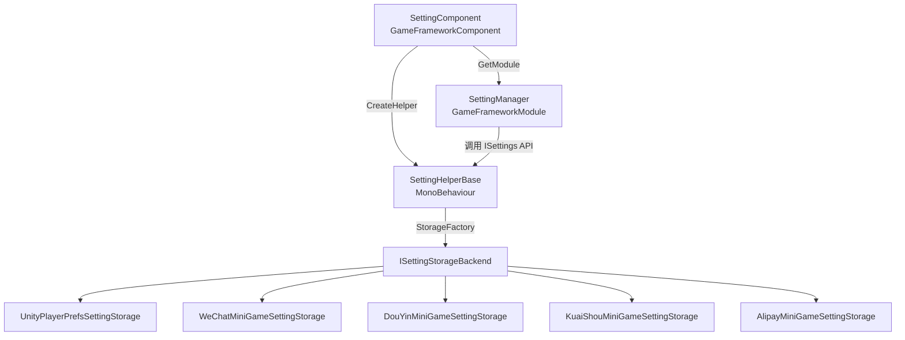

# 工作原理：SettingComponent 架构

`SettingComponent` 是 GameFrameX 配置模块的入口组件,负责在游戏启动时拉起 `SettingManager` 与 `SettingHelper`,完成配置的加载和后续存取。本页解释它如何被实例化、如何委托给辅助器、以及数据最终落到哪个存储后端。

## 快速开始

挂载 `SettingComponent` 后,框架会自动完成配置读取与初始化,无需在业务代码里手动 new。

1. 在启动场景的 `GameFrameX` 对象上确认已添加 `SettingComponent`(默认随框架一起注册)。
2. 默认使用 [PlayerPrefsSettingHelper.cs](https://github.com/GameFrameX/com.gameframex.unity.setting/blob/main/Runtime/Setting/PlayerPrefsSettingHelper.cs) 作为辅助器;若要换成微信小游戏存储,改 `m_SettingHelperTypeName` 字段为对应的小游戏 helper 类型名即可。
3. 业务代码中通过 `GameFrameX.Setting.Runtime.SettingComponent` 的 `GetBool` / `GetInt` / `GetString` 等方法读写配置。

## 工作原理速览

Setting 模块按"组件 → 管理器 → 辅助器 → 存储后端"四层委托,每一层都只依赖它下一层的接口。



各层职责:

| 层 | 类型 | 职责 |
|----|------|------|
| 组件层 | [SettingComponent.cs](https://github.com/GameFrameX/com.gameframex.unity.setting/blob/main/Runtime/Setting/SettingComponent.cs#L48-L100) | 在 `Awake` 中获取 `ISettingManager`,创建 `SettingHelperBase` 实例并注入管理器;在 `Start` 中触发首次 `Load()` |
| 管理器层 | [SettingManager.cs](https://github.com/GameFrameX/com.gameframex.unity.setting/blob/main/Runtime/Setting/Setting/SettingManager.cs#L43-L134) | 实现 [ISettingManager.cs](https://github.com/GameFrameX/com.gameframex.unity.setting/blob/main/Runtime/Setting/Setting/ISettingManager.cs),对上层暴露 `Get/Set*` 系列 API,内部把调用转发给 `ISettingHelper` |
| 辅助器层 | [SettingHelperBase.cs](https://github.com/GameFrameX/com.gameframex.unity.setting/blob/main/Runtime/Setting/SettingHelperBase.cs#L43-L335) | 抽象 `MonoBehaviour`,提供配置读写、加卸载、序列化等通用能力 |
| 存储后端 | [SettingStorageBackendFactory.cs](https://github.com/GameFrameX/com.gameframex.unity.setting/blob/main/Runtime/Setting/Storage/SettingStorageBackendFactory.cs) 与各 `ISettingStorageBackend` 实现 | 真正落盘的适配层:Unity 走 `UnityPlayerPrefsSettingStorage`,小游戏平台走对应平台的 storage 实现 |

## 启动流程

启动期间的关键步骤如下,顺序与 `SettingComponent` 的 `Awake` / `Start` 一一对应:

1. **解析组件类型** —— `ImplementationComponentType = Utility.Assembly.GetType(componentType)`,告知框架该接口对应的实现是 `SettingManager`。
2. **获取管理器** —— 通过 `GameFrameworkEntry.GetModule<ISettingManager>()` 拿到全局唯一的管理器实例。
3. **创建辅助器** —— `Helper.CreateHelper(m_SettingHelperTypeName, m_CustomSettingHelper)`,默认类型名是 `"GameFrameX.Setting.Runtime.PlayerPrefsSettingHelper"`;若在 Inspector 指定了 `m_CustomSettingHelper`,则优先使用自定义实现。
4. **挂载辅助器** —— 把创建出的 helper 重命名为 `"SettingHelper"` 并挂到 `SettingComponent` 自身下面(见 [SettingComponent.cs](https://github.com/GameFrameX/com.gameframex.unity.setting/blob/main/Runtime/Setting/SettingComponent.cs#L94-L99))。
5. **注入管理器** —— 调用 `m_SettingManager.SetSettingHelper(settingHelper)`,这一步会校验 helper 非空。
6. **首次加载** —— `Start` 中执行 `m_SettingManager.Load()`,读取玩家本地持久化的配置;失败仅记日志,不中断游戏。
7. **Shutdown 保存** —— `SettingManager.Shutdown()` 在框架关闭时自动调用 `Save()`,确保内存中的最新值落盘。

## API 委托关系

`SettingComponent` 的每个公开方法都只是 `ISettingManager` 对应方法的薄包装,业务调用方拿到的 `Count` / `GetBool` / `SetInt` 等接口签名与 [ISettingManager.cs](https://github.com/GameFrameX/com.gameframex.unity.setting/blob/main/Runtime/Setting/Setting/ISettingManager.cs) 完全一致。

| SettingComponent 方法 | 委托给 | ISettingManager 签名 |
|----------------------|--------|----------------------|
| `Count` | → | `int Count { get; }` |
| `Save()` / `Load()` | → | `bool Load()` / `bool Save()` |
| `GetBool/SetBool(name[,defaultValue], value)` | → | 同名方法 |
| `GetInt/SetInt` | → | 同名方法 |
| `GetFloat/SetFloat` | → | 同名方法 |
| `GetString/SetString` | → | 同名方法 |
| `GetBool/Int/Float/String(..., object)` | → | 泛型版本,支持对象序列化 |
| `HasSetting/RemoveSetting/RemoveAllSettings` | → | 同名方法 |
| `GetAllSettingNames()` | → | 返回 `string[]` |
| `GetAllSettingNames(List<string>)` | → | 填充到列表 |

`SettingManager` 会在每次调用前 `EnsureSettingHelper()` 与 `EnsureSettingName()`(见 [SettingManager.cs L47-L61](https://github.com/GameFrameX/com.gameframex.unity.setting/blob/main/Runtime/Setting/Setting/SettingManager.cs#L47-L61)),helper 未注入会抛 `GameFrameworkException("Setting helper is invalid.")`,settingName 为空会抛 `"Setting name is invalid."`。

## 辅助器与存储后端

`SettingHelperBase` 本身只定义抽象接口,真正的存取由它的子类实现。仓库里提供的默认实现:

- [PlayerPrefsSettingHelper.cs](https://github.com/GameFrameX/com.gameframex.unity.setting/blob/main/Runtime/Setting/PlayerPrefsSettingHelper.cs):基于 Unity `PlayerPrefs`,适合所有普通平台。
- 小游戏平台 helper:[WeChatMiniGameSettingStorage.cs](https://github.com/GameFrameX/com.gameframex.unity.setting/blob/main/Runtime/MiniGame/WeChat/WeChatMiniGameSettingStorage.cs)、[DouYinMiniGameSettingStorage.cs](https://github.com/GameFrameX/com.gameframex.unity.setting/blob/main/Runtime/MiniGame/DouYin/DouYinMiniGameSettingStorage.cs)、[KuaiShouMiniGameSettingStorage.cs](https://github.com/GameFrameX/com.gameframex.unity.setting/blob/main/Runtime/MiniGame/KuaiShou/KuaiShouMiniGameSettingStorage.cs)、[AlipayMiniGameSettingStorage.cs](https://github.com/GameFrameX/com.gameframex.unity.setting/blob/main/Runtime/MiniGame/Alipay/AlipayMiniGameSettingStorage.cs)。

辅助器通过 `SettingStorageBackendFactory` 选择当前平台对应的 `ISettingStorageBackend` 实现,业务代码无需关心。

## 自定义辅助器

```csharp
public class MySettingHelper : SettingHelperBase
{
    public override int Count => 0;
    public override bool Load() { /* 读取逻辑 */ return true; }
    public override bool Save() { /* 写入逻辑 */ return true; }
    // ... 其余抽象成员按需实现
}
```

把脚本所在预制体拖到 `SettingComponent.m_CustomSettingHelper` 字段即可,框架会在 `Awake` 中优先使用它;若该字段为空,则按 `m_SettingHelperTypeName` 反射创建。

## 接下来

- 在 Inspector 切换存储平台:见《如何选择配置存储后端》
- 业务代码读写配置示例:见《如何读写游戏配置》
- 平台存储后端错误排查:见《Setting 加载失败怎么办》
