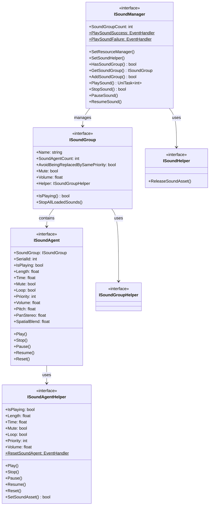

# 接口定义

本文档详细介绍 GameFrameX 声音系统中定义的所有核心接口。接口采用分层设计，提供了对声音管理器、声音组、声音代理及辅助器的完整抽象。

## 概述

GameFrameX 声音系统采用了经典的分层架构，通过接口定义实现了高度的可扩展性和可测试性。系统包含以下核心接口：

- **ISoundManager** - 声音管理器接口，负责全局声音资源管理和播放控制
- **ISoundGroup** - 声音组接口，管理一组相关声音的播放行为
- **ISoundAgent** - 声音代理接口，控制单个声音实例的播放
- **ISoundHelper** - 声音辅助器接口，用于资源释放
- **ISoundGroupHelper** - 声音组辅助器接口
- **ISoundAgentHelper** - 声音代理辅助器接口

这种分层设计使得开发者可以针对不同平台（如 FMOD、CRIWARE）实现特定的辅助器，同时保持上层代码的一致性。

## 接口架构



## ISoundManager 接口

ISoundManager 是声音系统的核心接口，继承自 GameFrameworkModule，提供全局声音管理功能。

### 核心属性

| 属性 | 类型 | 描述 |
|------|------|------|
| SoundGroupCount | `int` | 获取当前已添加的声音组数量 |
| PlaySoundSuccess | `EventHandler<PlaySoundSuccessEventArgs>`` | 播放声音成功事件 |
| PlaySoundFailure | `EventHandler<PlaySoundFailureEventArgs>` | 播放声音失败事件 |

### 核心方法

#### 设置资源管理器

```csharp
void SetResourceManager(IAssetManager assetManager)
```

设置资源管理器，用于异步加载声音资源。

> Source: [ISoundManager.cs](https://github.com/GameFrameX/com.gameframex.unity.sound/blob/main/Runtime/Interface/ISoundManager.cs#L62-L64)

#### 设置声音辅助器

```csharp
void SetSoundHelper(ISoundHelper soundHelper)
```

设置声音辅助器，用于释放声音资源。

> Source: [ISoundManager.cs](https://github.com/GameFrameX/com.gameframex.unity.sound/blob/main/Runtime/Interface/ISoundManager.cs#L67-L70)

#### 添加声音组

```csharp
bool AddSoundGroup(string soundGroupName, ISoundGroupHelper soundGroupHelper)
bool AddSoundGroup(string soundGroupName, bool soundGroupAvoidBeingReplacedBySamePriority, bool soundGroupMute, float soundGroupVolume, ISoundGroupHelper soundGroupHelper)
```

添加新的声音组。第一个重载使用默认参数，第二个重载允许指定完整配置。

**参数：**
- `soundGroupName` - 声音组名称，用于标识和获取声音组
- `soundGroupAvoidBeingReplacedBySamePriority` - 同优先级声音是否避免被替换
- `soundGroupMute` - 声音组是否静音
- `soundGroupVolume` - 声音组音量（0.0-1.0）
- `soundGroupHelper` - 声音组辅助器实例

> Source: [ISoundManager.cs](https://github.com/GameFrameX/com.gameframex.unity.sound/blob/main/Runtime/Interface/ISoundManager.cs#L98-L115)

#### 获取声音组

```csharp
bool HasSoundGroup(string soundGroupName)
ISoundGroup GetSoundGroup(string soundGroupName)
ISoundGroup[] GetAllSoundGroups()
void GetAllSoundGroups(List<ISoundGroup> results)
```

获取已添加的声音组。支持按名称查询和获取全部声音组。

> Source: [ISoundManager.cs](https://github.com/GameFrameX/com.gameframex.unity.sound/blob/main/Runtime/Interface/ISoundManager.cs#L72-L96)

#### 播放声音

```csharp
UniTask<int> PlaySound(string soundAssetName, string soundGroupName)
UniTask<int> PlaySound(string soundAssetName, string soundGroupName, int priority)
UniTask<int> PlaySound(string soundAssetName, string soundGroupName, PlaySoundParams playSoundParams)
UniTask<int> PlaySound(string soundAssetName, string soundGroupName, object userData)
UniTask<int> PlaySound(string soundAssetName, string soundGroupName, int priority, PlaySoundParams playSoundParams)
UniTask<int> PlaySound(string soundAssetName, string soundGroupName, int priority, object userData)
UniTask<int> PlaySound(string soundAssetName, string soundGroupName, PlaySoundParams playSoundParams, object userData)
UniTask<int> PlaySound(string soundAssetName, string soundGroupName, int priority, PlaySoundParams playSoundParams, object userData, int serialId)
```

播放声音资源的核心方法，提供多个重载以满足不同场景需求。返回声音的序列编号（SerialId），用于后续播放控制。

**参数：**
- `soundAssetName` - 声音资源名称
- `soundGroupName` - 声音组名称
- `priority` - 加载优先级
- `playSoundParams` - 播放参数（音调、音量、循环等）
- `userData` - 用户自定义数据，会在事件中回传
- `serialId` - 指定序列编号

> Source: [ISoundManager.cs](https://github.com/GameFrameX/com.gameframex.unity.sound/blob/main/Runtime/Interface/ISoundManager.cs#L143-L218)

#### 停止声音

```csharp
bool StopSound(int serialId)
bool StopSound(int serialId, float fadeOutSeconds)
```

停止指定序列编号的声音播放。第二个重载支持淡出效果。

> Source: [ISoundManager.cs](https://github.com/GameFrameX/com.gameframex.unity.sound/blob/main/Runtime/Interface/ISoundManager.cs#L220-L233)

#### 停止所有声音

```csharp
void StopAllLoadedSounds()
void StopAllLoadedSounds(float fadeOutSeconds)
void StopAllLoadingSounds()
```

停止所有已加载或正在加载的声音。

> Source: [ISoundManager.cs](https://github.com/GameFrameX/com.gameframex.unity.sound/blob/main/Runtime/Interface/ISoundManager.cs#L235-L249)

#### 暂停/恢复声音

```csharp
void PauseSound(int serialId)
void PauseSound(int serialId, float fadeOutSeconds)
void ResumeSound(int serialId)
void ResumeSound(int serialId, float fadeInSeconds)
```

暂停和恢复指定声音的播放。支持淡入淡出效果。

> Source: [ISoundManager.cs](https://github.com/GameFrameX/com.gameframex.unity.sound/blob/main/Runtime/Interface/ISoundManager.cs#L251-L275)

#### 查询加载状态

```csharp
int[] GetAllLoadingSoundSerialIds()
void GetAllLoadingSoundSerialIds(List<int> results)
bool IsLoadingSound(int serialId)
```

查询当前正在加载的声音序列编号。

> Source: [ISoundManager.cs](https://github.com/GameFrameX/com.gameframex.unity.sound/blob/main/Runtime/Interface/ISoundManager.cs#L124-L141)

---

## ISoundGroup 接口

ISoundGroup 表示声音组，用于管理一组相关的声音。每个声音组有自己的音量控制、静音设置和替换策略。

### 属性

| 属性 | 类型 | 读写 | 描述 |
|------|------|------|------|
| Name | `string` | 只读 | 声音组名称 |
| SoundAgentCount | `int` | 只读 | 声音代理数量 |
| AvoidBeingReplacedBySamePriority | `bool` | 读写 | 同优先级声音是否避免被替换 |
| Mute | `bool` | 读写 | 声音组静音状态 |
| Volume | `float` | 读写 | 声音组音量（0.0-1.0） |
| Helper | `ISoundGroupHelper` | 只读 | 声音组辅助器 |

> Source: [ISoundGroup.cs](https://github.com/GameFrameX/com.gameframex.unity.sound/blob/main/Runtime/Interface/ISoundGroup.cs#L38-L68)

### 方法

#### 检查播放状态

```csharp
bool IsPlaying(int serialId)
```

检查指定序列编号的声音是否正在播放。如果找不到指定的序列编号也会返回 false。

> Source: [ISoundGroup.cs](https://github.com/GameFrameX/com.gameframex.unity.sound/blob/main/Runtime/Interface/ISoundGroup.cs#L70-L75)

#### 停止所有声音

```csharp
void StopAllLoadedSounds()
void StopAllLoadedSounds(float fadeOutSeconds)
```

停止该声音组中所有已加载的声音。

> Source: [ISoundGroup.cs](https://github.com/GameFrameX/com.gameframex.unity.sound/blob/main/Runtime/Interface/ISoundGroup.cs#L77-L86)

---

## ISoundAgent 接口

ISoundAgent 表示声音代理，是实际控制音频播放的最小单元。每个声音代理对应一个正在播放或已暂停的声音实例。

### 属性

| 属性 | 类型 | 读写 | 描述 |
|------|------|------|------|
| SoundGroup | `ISoundGroup` | 只读 | 所属声音组 |
| SerialId | `int` | 只读 | 序列编号 |
| IsPlaying | `bool` | 只读 | 是否正在播放 |
| Length | `float` | 只读 | 声音长度（秒） |
| Time | `float` | 读写 | 当前播放位置（秒） |
| Mute | `bool` | 只读 | 静音状态 |
| MuteInSoundGroup | `bool` | 读写 | 在组内是否静音 |
| Loop | `bool` | 读写 | 是否循环播放 |
| Priority | `int` | 读写 | 播放优先级 |
| Volume | `float` | 只读 | 当前音量 |
| VolumeInSoundGroup | `float` | 读写 | 在组内音量 |
| Pitch | `float` | 读写 | 音调 |
| PanStereo | `float` | 读写 | 立体声声相（-1.0到1.0） |
| SpatialBlend | `float` | 读写 | 空间混合量（0.0到1.0） |
| MaxDistance | `float` | 读写 | 最大距离 |
| DopplerLevel | `float` | 读写 | 多普勒等级 |
| Helper | `ISoundAgentHelper` | 只读 | 代理辅助器 |

> Source: [ISoundAgent.cs](https://github.com/GameFrameX/com.gameframex.unity.sound/blob/main/Runtime/Interface/ISoundAgent.cs#L38-L123)

### 方法

#### 播放

```csharp
void Play()
void Play(float fadeInSeconds)
```

开始或恢复声音播放。第二个重载支持淡入效果。

> Source: [ISoundAgent.cs](https://github.com/GameFrameX/com.gameframex.unity.sound/blob/main/Runtime/Interface/ISoundAgent.cs#L125-L134)

#### 停止

```csharp
void Stop()
void Stop(float fadeOutSeconds)
```

停止声音播放。第二个重载支持淡出效果。

> Source: [ISoundAgent.cs](https://github.com/GameFrameX/com.gameframex.unity.sound/blob/main/Runtime/Interface/ISoundAgent.cs#L136-L145)

#### 暂停

```csharp
void Pause()
void Pause(float fadeOutSeconds)
```

暂停声音播放。第二个重载支持淡出效果。

> Source: [ISoundAgent.cs](https://github.com/GameFrameX/com.gameframex.unity.sound/blob/main/Runtime/Interface/ISoundAgent.cs#L147-L156)

#### 恢复

```csharp
void Resume()
void Resume(float fadeInSeconds)
```

恢复暂停的声音播放。第二个重载支持淡入效果。

> Source: [ISoundAgent.cs](https://github.com/GameFrameX/com.gameframex.unity.sound/blob/main/Runtime/Interface/ISoundAgent.cs#L158-L167)

#### 重置

```csharp
void Reset()
```

重置声音代理到初始状态。

> Source: [ISoundAgent.cs](https://github.com/GameFrameX/com.gameframex.unity.sound/blob/main/Runtime/Interface/ISoundAgent.cs#L169-L172)

---

## ISoundHelper 接口

ISoundHelper 是最简单的接口，用于释放声音资源。

### 方法

```csharp
void ReleaseSoundAsset(object soundAsset)
```

释放指定的声音资源。

> Source: [ISoundHelper.cs](https://github.com/GameFrameX/com.gameframex.unity.sound/blob/main/Runtime/Interface/ISoundHelper.cs#L38-L45)

---

## ISoundGroupHelper 接口

ISoundGroupHelper 是声音组辅助器的标记接口。目前没有定义任何方法，仅作为基类标识使用。

> Source: [ISoundGroupHelper.cs](https://github.com/GameFrameX/com.gameframex.unity.sound/blob/main/Runtime/Interface/ISoundGroupHelper.cs#L38-L40)

---

## ISoundAgentHelper 接口

ISoundAgentHelper 是声音代理辅助器接口，提供底层音频播放控制。该接口与 ISoundAgent 类似，但面向底层实现。

### 属性

| 属性 | 类型 | 读写 | 描述 |
|------|------|------|------|
| IsPlaying | `bool` | 只读 | 是否正在播放 |
| Length | `float` | 只读 | 声音长度（秒） |
| Time | `float` | 读写 | 当前播放位置（秒） |
| Mute | `bool` | 读写 | 静音状态 |
| Loop | `bool` | 读写 | 是否循环播放 |
| Priority | `int` | 读写 | 播放优先级 |
| Volume | `float` | 读写 | 音量大小 |
| Pitch | `float` | 读写 | 音调 |
| PanStereo | `float` | 读写 | 立体声声相 |
| SpatialBlend | `float` | 读写 | 空间混合量 |
| MaxDistance | `float` | 读写 | 最大距离 |
| DopplerLevel | `float` | 读写 | 多普勒等级 |

### 事件

```csharp
event EventHandler<ResetSoundAgentEventArgs> ResetSoundAgent
```

当声音代理被重置时触发的事件。

### 方法

#### 播放

```csharp
void Play(float fadeInSeconds)
```

以指定淡入时间播放声音。

> Source: [ISoundAgentHelper.cs](https://github.com/GameFrameX/com.gameframex.unity.sound/blob/main/Runtime/Interface/ISoundAgentHelper.cs#L107-L111)

#### 停止

```csharp
void Stop(float fadeOutSeconds)
```

以指定淡出时间停止声音。

> Source: [ISoundAgentHelper.cs](https://github.com/GameFrameX/com.gameframex.unity.sound/blob/main/Runtime/Interface/ISoundAgentHelper.cs#L113-L117)

#### 暂停

```csharp
void Pause(float fadeOutSeconds)
```

以指定淡出时间暂停声音。

> Source: [ISoundAgentHelper.cs](https://github.com/GameFrameX/com.gameframex.unity.sound/blob/main/Runtime/Interface/ISoundAgentHelper.cs#L119-L123)

#### 恢复

```csharp
void Resume(float fadeInSeconds)
```

以指定淡入时间恢复声音。

> Source: [ISoundAgentHelper.cs](https://github.com/GameFrameX/com.gameframex.unity.sound/blob/main/Runtime/Interface/ISoundAgentHelper.cs#L125-L129)

#### 重置

```csharp
void Reset()
```

重置辅助器到初始状态。

> Source: [ISoundAgentHelper.cs](https://github.com/GameFrameX/com.gameframex.unity.sound/blob/main/Runtime/Interface/ISoundAgentHelper.cs#L131-L134)

#### 设置声音资源

```csharp
bool SetSoundAsset(object soundAsset)
```

设置要播放的声音资源。返回是否设置成功。

> Source: [ISoundAgentHelper.cs](https://github.com/GameFrameX/com.gameframex.unity.sound/blob/main/Runtime/Interface/ISoundAgentHelper.cs#L136-L141)

---

## 事件参数

系统定义了以下事件参数类型用于回调：

### PlaySoundSuccessEventArgs

播放声音成功时触发的事件参数。

| 属性 | 类型 | 描述 |
|------|------|------|
| SerialId | `int` | 声音的序列编号 |
| SoundAssetName | `string` | 声音资源名称 |
| SoundAgent | `ISoundAgent` | 用于播放的声音代理 |
| Duration | `float` | 加载持续时间 |
| UserData | `object` | 用户自定义数据 |

> Source: [PlaySoundSuccessEventArgs.cs](https://github.com/GameFrameX/com.gameframex.unity.sound/blob/main/Runtime/EventArgs/PlaySoundSuccessEventArgs.cs)

### PlaySoundFailureEventArgs

播放声音失败时触发的事件参数。

| 属性 | 类型 | 描述 |
|------|------|------|
| SerialId | `int` | 声音的序列编号 |
| SoundAssetName | `string` | 声音资源名称 |
| SoundGroupName | `string` | 声音组名称 |
| PlaySoundParams | `PlaySoundParams` | 播放参数 |
| ErrorCode | `PlaySoundErrorCode` | 错误码 |
| ErrorMessage | `string` | 错误信息 |
| UserData | `object` | 用户自定义数据 |

> Source: [PlaySoundFailureEventArgs.cs](https://github.com/GameFrameX/com.gameframex.unity.sound/blob/main/Runtime/EventArgs/PlaySoundFailureEventArgs.cs)

---

## 使用示例

### 监听播放事件

```csharp
var soundManager = GameFrameworkEntry.GetModule<ISoundManager>();
soundManager.PlaySoundSuccess += OnPlaySoundSuccess;
soundManager.PlaySoundFailure += OnPlaySoundFailure;

private void OnPlaySoundSuccess(object sender, PlaySoundSuccessEventArgs e)
{
    Debug.Log($"声音播放成功: {e.SoundAssetName}, 序列编号: {e.SerialId}");
}

private void OnPlaySoundFailure(object sender, PlaySoundFailureEventArgs e)
{
    Debug.LogError($"声音播放失败: {e.SoundAssetName}, 错误: {e.ErrorMessage}");
}
```

### 播放带参数的声音

```csharp
var playParams = PlaySoundParams.Create(loop: false);
playParams.Pitch = 1.0f;
playParams.VolumeInSoundGroup = 0.8f;
playParams.Priority = 100;

int serialId = await soundManager.PlaySound("bgm_music", "BGM", playParams);
```

### 控制声音组音量

```csharp
ISoundGroup bgmGroup = soundManager.GetSoundGroup("BGM");
if (bgmGroup != null)
{
    bgmGroup.Volume = 0.5f;
    bgmGroup.Mute = false;
}
```

---

## 相关链接

- [播放参数](./5-api-reference.2-play-sound-params) - PlaySoundParams 详细配置
- [事件参数](./5-api-reference.3-event-args) - 事件参数详细说明
- [声音管理器](./4-core-concepts.1-sound-manager) - 声音管理器核心概念
- [声音组](./4-core-concepts.2-sound-group) - 声音组核心概念
- [声音代理](./4-core-concepts.3-sound-agent) - 声音代理核心概念
