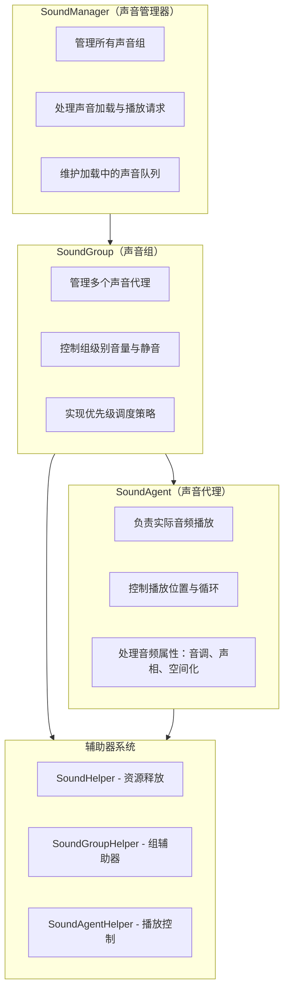
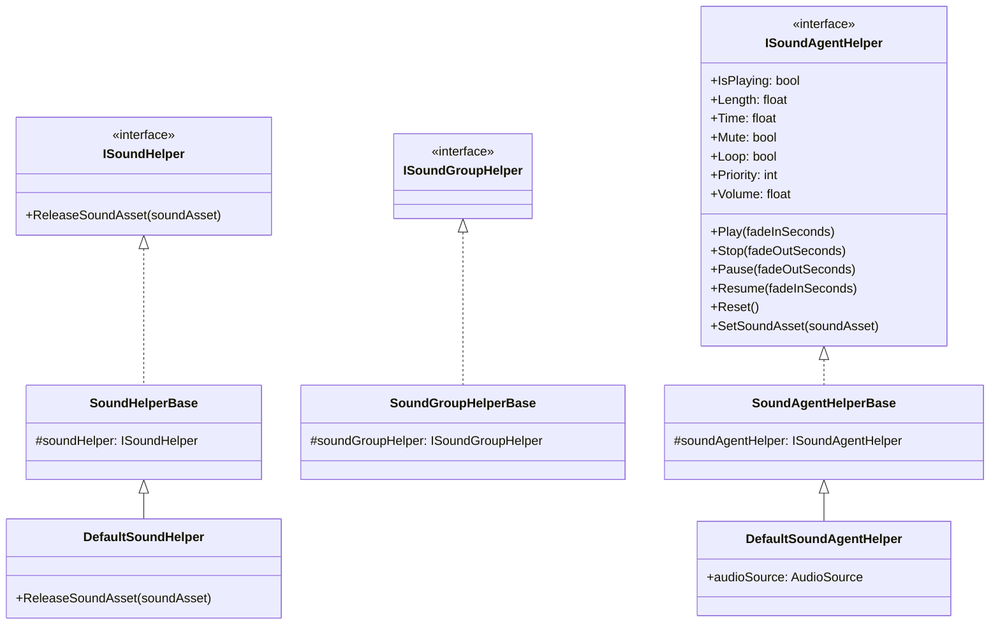
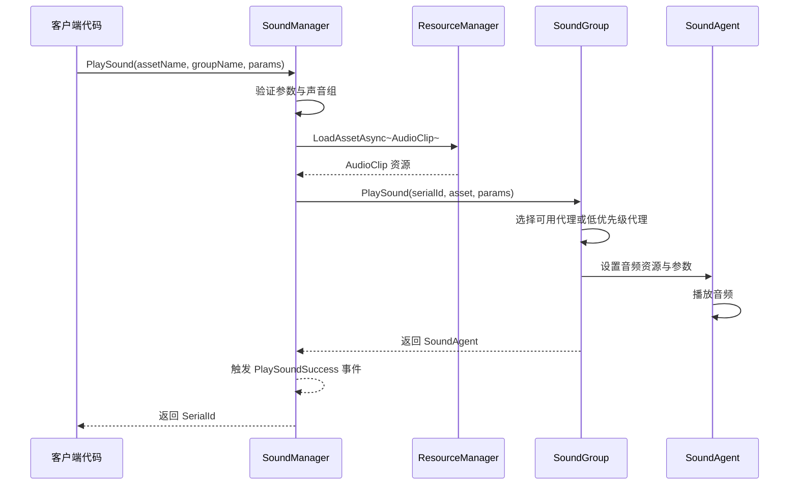
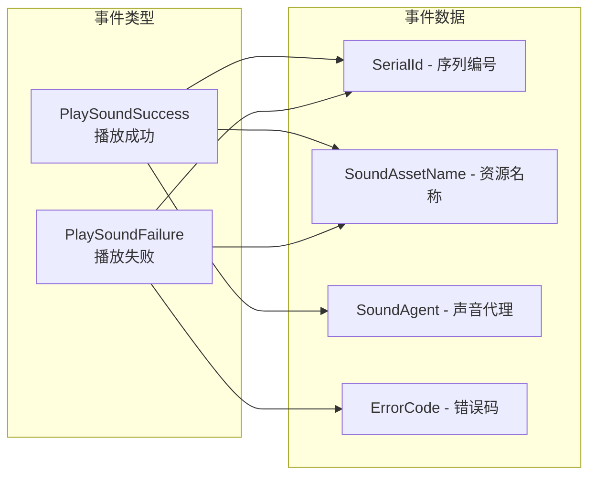

# 概述

GameFrameX Sound 是 GameFrameX 游戏框架的音频管理系统，专门为 Unity 游戏引擎设计。它提供了一套完整的声音播放、管理和控制解决方案，支持多声音组、优先级调度、淡入淡出等高级音频功能。

## 系统架构

GameFrameX Sound 采用三层架构设计：管理器（SoundManager）→ 声音组（SoundGroup）→ 声音代理（SoundAgent）。这种分层设计使得音频系统具有良好的可扩展性和灵活性，能够满足各种复杂的游戏音频需求。



## 核心概念

### 声音管理器（SoundManager）

声音管理器是整个音频系统的核心组件，负责管理所有的声音组和处理声音播放请求。它继承自 `GameFrameworkModule`，提供以下核心功能：

- **声音组管理**：创建、查询和销毁声音组
- **声音播放**：异步加载和播放声音资源
- **播放控制**：暂停、恢复、停止单个或所有声音
- **状态查询**：查询正在加载或播放的声音

> 详细 API 说明请参阅 [声音管理器](./4-core-concepts.1-sound-manager)

### 声音组（SoundGroup）

声音组用于组织和控制具有相似特性的声音。例如，你可以为背景音乐创建一个 "Music" 组，为音效创建 "SFX" 组，每个组可以独立控制音量和静音状态。

声音组的核心特性：
- **独立音量控制**：每个组有独立的音量设置
- **静音管理**：可以单独静音某个组而不影响其他组
- **优先级策略**：可配置同优先级声音是否互相替换
- **代理池管理**：维护一组声音代理用于并发播放

> 详细 API 说明请参阅 [声音组](./4-core-concepts.2-sound-group)

### 声音代理（SoundAgent）

声音代理是实际执行音频播放的组件。每个声音代理对应一个 `AudioSource`（或自定义音频实现），负责：
- 播放/暂停/停止音频
- 设置播放位置
- 控制循环播放
- 调整音调（Pitch）
- 设置立体声声相（PanStereo）
- 空间音频混合（ SpatialBlend）
- 多普勒效果（DopplerLevel）

> 详细 API 说明请参阅 [声音代理](./4-core-concepts.3-sound-agent)

### 辅助器系统

GameFrameX Sound 采用辅助器（Helper）模式实现高度可扩展性：



通过继承这些辅助器基类，开发者可以完全自定义音频系统的底层实现，例如：
- 使用第三方音频中间件（如 FMOD、Wwise）
- 实现特殊的音频效果
- 自定义资源加载策略

## 声音播放流程

当调用 `PlaySound` 方法时，系统按照以下流程处理：



1. **参数验证**：检查声音组是否存在、是否有可用的声音代理
2. **资源加载**：通过资源管理器异步加载音频资源
3. **代理分配**：从声音组中选择合适的代理（空闲或低优先级）
4. **播放控制**：设置音频参数并开始播放
5. **事件通知**：触发成功或失败事件

## 播放参数

`PlaySoundParams` 类包含所有可配置的播放参数：

| 参数 | 类型 | 默认值 | 说明 |
|------|------|--------|------|
| Time | float | 0f | 播放起始位置（秒） |
| MuteInSoundGroup | bool | false | 在组内是否静音 |
| Loop | bool | false | 是否循环播放 |
| Priority | int | 0 | 播放优先级（数值越高越优先） |
| VolumeInSoundGroup | float | 1.0f | 组内音量系数 |
| FadeInSeconds | float | 0f | 淡入时间（秒） |
| Pitch | float | 1.0f | 音调（0.5-3.0） |
| PanStereo | float | 0f | 立体声位置（-1~1） |
| SpatialBlend | float | 0f | 空间混合量（2D/3D） |
| MaxDistance | float | 100f | 最大3D距离 |
| DopplerLevel | float | 1f | 多普勒效果等级 |

> 详细说明请参阅 [播放参数](./5-api-reference.2-play-sound-params)

## 事件系统

GameFrameX Sound 提供完善的事件机制：



- **PlaySoundSuccess**：播放成功时触发，包含序列编号、资源名称、声音代理等信息
- **PlaySoundFailure**：播放失败时触发，包含错误码和错误信息

> 详细说明请参阅 [事件参数](./5-api-reference.3-event-args)

## 使用示例

### 基本用法

```csharp
// 通过 SoundComponent 播放声音
var soundComponent = GameEntry.GetComponent<SoundComponent>();
int serialId = await soundComponent.PlaySound("Assets/Audio/BGM_Main.mp3", "Music");
```

### 带参数播放

```csharp
var playParams = PlaySoundParams.Create();
playParams.Loop = true;
playParams.VolumeInSoundGroup = 0.8f;
playParams.FadeInSeconds = 1.0f;

int serialId = await soundComponent.PlaySound("Assets/Audio/BGM_Battle.mp3", "Music", playParams);
```

### 控制播放

```csharp
// 暂停播放
soundComponent.PauseSound(serialId);

// 恢复播放
soundComponent.ResumeSound(serialId);

// 停止播放
soundComponent.StopSound(serialId);
```

## 设计理念

GameFrameX Sound 的设计遵循以下原则：

1. **分层管理**：通过 Manager → Group → Agent 的分层结构，实现细粒度的音频控制
2. **优先级调度**：基于优先级的代理分配策略，确保重要声音能够及时播放
3. **辅助器扩展**：通过 Helper 模式支持自定义音频实现，便于集成第三方音频库
4. **异步加载**：使用 UniTask 实现非阻塞的音频资源加载
5. **淡入淡出**：内置的音量渐变支持，提升音频体验

## 相关链接

- [安装指南](./2-installation)
- [快速开始](./3-getting-started)
- [API 参考 - 接口定义](./5-api-reference.1-interfaces)
- [API 参考 - 播放参数](./5-api-reference.2-play-sound-params)
- [配置说明](./6-configuration)
- [扩展指南](./7-extending)
- [常见问题](./8-faq)
