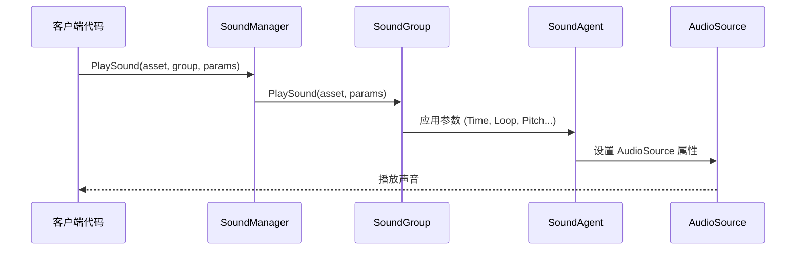

# 播放参数

PlaySoundParams 类用于配置声音播放的各种属性，包括音量、音调、循环、淡入淡出等参数。这些参数在播放声音时传递给 SoundManager，以控制声音的具体播放方式。

## 概述

PlaySoundParams 是声音系统的核心参数类，它封装了播放声音时所需的所有配置选项。该类实现了 IReference 接口，支持对象池化管理，可以重复使用以减少内存分配。

在调用 ISoundManager.PlaySound 方法时，可以传入 PlaySoundParams 实例来定制化声音的播放行为。如果传入 null 或不传入参数，系统将使用默认参数值。

### 设计意图

PlaySoundParams 采用参数对象模式（Parameter Object Pattern），将多个相关的播放参数封装为一个对象。这种设计：

- **简化 API**：避免在 PlaySound 方法中传递大量独立参数
- **提高可读性**：通过命名属性使参数含义清晰明了
- **支持默认值**：所有参数都有合理的默认值，无需全部设置
- **对象池化**：实现 IReference 接口，支持 ReferencePool 回收复用

### 参数应用流程



## 参数说明

### 播放控制参数

| 参数 | 类型 | 默认值 | 说明 |
|------|------|--------|------|
| Time | float | 0f | 播放位置（秒），从指定时间开始播放 |
| Loop | bool | false | 是否循环播放 |
| FadeInSeconds | float | 0f | 淡入时间（秒），播放开始时的音量渐变 |

### 声音组参数

| 参数 | 类型 | 默认值 | 说明 |
|------|------|--------|------|
| MuteInSoundGroup | bool | false | 在所属声音组内是否静音 |
| VolumeInSoundGroup | float | 1f | 在所属声音组内的音量（0.0-1.0） |
| Priority | int | 0 | 声音优先级，数值越高优先级越高 |

### 音效参数

| 参数 | 类型 | 默认值 | 说明 |
|------|------|--------|------|
| Pitch | float | 1f | 音调，1.0 为正常速度 |
| PanStereo | float | 0f | 立体声位置，-1 为左声道，1 为右声道 |

### 空间音频参数

| 参数 | 类型 | 默认值 | 说明 |
|------|------|--------|------|
| SpatialBlend | float | 0f | 空间混合量，0 为 2D 声音，1 为 3D 声音 |
| MaxDistance | float | 100f | 最大衰减距离（仅 3D 声音有效） |
| DopplerLevel | float | 1f | 多普勒效应等级，0 为禁用 |

## 详细参数解释

### Time - 播放位置

设置声音开始播放的位置（以秒为单位）。这对于实现断点续播、预览功能或跳过片头非常有用。

```csharp
var playSoundParams = PlaySoundParams.Create();
playSoundParams.Time = 5.5f; // 从第5.5秒开始播放
await soundManager.PlaySound("bgm_music", "MusicGroup", playSoundParams);
```
> Source: [PlaySoundParams.cs](https://github.com/GameFrameX/com.gameframex.unity.sound/blob/main/Runtime/Sound/Sound/PlaySoundParams.cs#L124-L128)

### Loop - 循环播放

控制声音是否循环播放。对于背景音乐或环境音效通常设置为 true，对于一次性音效设置为 false。

```csharp
// 播放循环背景音乐
var musicParams = PlaySoundParams.Create(isLoop: true);
// 或者
var musicParams = PlaySoundParams.Create();
musicParams.Loop = true;
await soundManager.PlaySound("bgm_forest", "MusicGroup", musicParams);
```
> Source: [PlaySoundParams.cs](https://github.com/GameFrameX/com.gameframex.unity.sound/blob/main/Runtime/Sound/Sound/PlaySoundParams.cs#L142-L146)

### FadeInSeconds - 淡入时间

设置声音开始播放时的淡入时间，使音量从 0 逐渐过渡到目标音量。这对于避免突然的声音爆发非常有用。

```csharp
var playSoundParams = PlaySoundParams.Create();
playSoundParams.FadeInSeconds = 2.0f; // 2秒淡入
await soundManager.PlaySound("ui_click", "UIGroup", playSoundParams);
```
> Source: [PlaySoundParams.cs](https://github.com/GameFrameX/com.gameframex.unity.sound/blob/main/Runtime/Sound/Sound/PlaySoundParams.cs#L169-L173)

### MuteInSoundGroup - 组内静音

控制该声音在其所属声音组内是否静音。注意：即使设置为静音，该声音仍然会占用声音组的播放通道。

```csharp
var playSoundParams = PlaySoundParams.Create();
playSoundParams.MuteInSoundGroup = true; // 暂时静音
await soundManager.PlaySound("voice_intro", "VoiceGroup", playSoundParams);
```
> Source: [PlaySoundParams.cs](https://github.com/GameFrameX/com.gameframex.unity.sound/blob/main/Runtime/Sound/Sound/PlaySoundParams.cs#L133-L137)

### VolumeInSoundGroup - 组内音量

设置该声音在其所属声音组内的音量系数。最终音量 = 声音组音量 × 个体音量。

```csharp
var playSoundParams = PlaySoundParams.Create();
playSoundParams.VolumeInSoundGroup = 0.5f; // 50% 音量
await soundManager.PlaySound("effect_explosion", "EffectGroup", playSoundParams);
```
> Source: [PlaySoundParams.cs](https://github.com/GameFrameX/com.gameframex.unity.sound/blob/main/Runtime/Sound/Sound/PlaySoundParams.cs#L160-L164)

### Priority - 优先级

设置声音的优先级。当声音组中没有可用的播放通道时，低优先级的声音会被高优先级的替换。优先级范围建议：0-255，数值越高优先级越高。

```csharp
var playSoundParams = PlaySoundParams.Create();
playSoundParams.Priority = 100; // 高优先级
await soundManager.PlaySound("ui_important", "UIGroup", playSoundParams);
```
> Source: [PlaySoundParams.cs](https://github.com/GameFrameX/com.gameframex.unity.sound/blob/main/Runtime/Sound/Sound/PlaySoundParams.cs#L151-L155)

### Pitch - 音调

调整声音的播放速度/音调。1.0 为正常速度，小于 1.0 为慢速/低音调，大于 1.0 为快速/高音调。

```csharp
var playSoundParams = PlaySoundParams.Create();
playSoundParams.Pitch = 0.8f; // 稍微降低音调
await soundManager.PlaySound("npc_voice", "VoiceGroup", playSoundParams);
```
> Source: [PlaySoundParams.cs](https://github.com/GameFrameX/com.gameframex.unity.sound/blob/main/Runtime/Sound/Sound/PlaySoundParams.cs#L178-L182)

### PanStereo - 立体声位置

控制声音在左右声道之间的位置。-1.0 为完全左声道，0.0 为居中，1.0 为完全右声道。

```csharp
var playSoundParams = PlaySoundParams.Create();
playSoundParams.PanStereo = -0.5f; // 偏左
await soundManager.PlaySound("footstep_left", "EffectGroup", playSoundParams);
```
> Source: [PlaySoundParams.cs](https://github.com/GameFrameX/com.gameframex.unity.sound/blob/main/Runtime/Sound/Sound/PlaySoundParams.cs#L187-L191)

### SpatialBlend - 空间混合

控制声音从 2D（立体声）到 3D（空间化）的过渡。0.0 为完全 2D 声音，1.0 为完全 3D 声音。

```csharp
var playSoundParams = PlaySoundParams.Create();
playSoundParams.SpatialBlend = 1.0f; // 完全 3D 声音
playSoundParams.MaxDistance = 50f;
await soundManager.PlaySound("ambient_bird", "WorldGroup", playSoundParams);
```
> Source: [PlaySoundParams.cs](https://github.com/GameFrameX/com.gameframex.unity.sound/blob/main/Runtime/Sound/Sound/PlaySoundParams.cs#L196-L200)

### MaxDistance - 最大距离

设置 3D 声音的最大衰减距离。超过此距离后，声音音量不再继续衰减。

```csharp
var playSoundParams = PlaySoundParams.Create();
playSoundParams.SpatialBlend = 1.0f;
playSoundParams.MaxDistance = 30f; // 30米外听不到
await soundManager.PlaySound("car_engine", "WorldGroup", playSoundParams);
```
> Source: [PlaySoundParams.cs](https://github.com/GameFrameX/com.gameframex.unity.sound/blob/main/Runtime/Sound/Sound/PlaySoundParams.cs#L205-L209)

### DopplerLevel - 多普勒等级

设置 3D 声音的多普勒效应强度。当声源和听者相对移动时，会产生多普勒频移效果。0.0 为禁用，1.0 为正常强度。

```csharp
var playSoundParams = PlaySoundParams.Create();
playSoundParams.SpatialBlend = 1.0f;
playSoundParams.DopplerLevel = 0.5f; // 减弱多普勒效果
await soundManager.PlaySound("car_passing", "WorldGroup", playSoundParams);
```
> Source: [PlaySoundParams.cs](https://github.com/GameFrameX/com.gameframex.unity.sound/blob/main/Runtime/Sound/Sound/PlaySoundParams.cs#L214-L218)

## 使用方法

### 创建播放参数

推荐使用静态工厂方法 `Create()` 创建 PlaySoundParams 实例，该方法从对象池中获取实例：

```csharp
// 基础用法：使用默认参数
var playSoundParams = PlaySoundParams.Create();

// 带循环参数
var loopParams = PlaySoundParams.Create(isLoop: true);
```
> Source: [PlaySoundParams.cs](https://github.com/GameFrameX/com.gameframex.unity.sound/blob/main/Runtime/Sound/Sound/PlaySoundParams.cs#L233-L239)

### 完整使用示例

```csharp
// 创建播放参数并配置
var playSoundParams = PlaySoundParams.Create();
playSoundParams.Loop = true;                      // 循环播放
playSoundParams.VolumeInSoundGroup = 0.8f;        // 80% 音量
playSoundParams.Priority = 100;                   // 高优先级
playSoundParams.FadeInSeconds = 1.0f;             // 1秒淡入
playSoundParams.Pitch = 1.0f;                      // 正常音调

// 播放声音
int serialId = await soundManager.PlaySound("bgm_battle", "MusicGroup", playSoundParams);
```
> Source: [ISoundManager.cs](https://github.com/GameFrameX/com.gameframex.unity.sound/blob/main/Runtime/Interface/ISoundManager.cs#L165-L167)

### 参数到 AudioSource 的映射

PlaySoundParams 中的参数最终会映射到 Unity 的 AudioSource 组件：

| PlaySoundParams | AudioSource | 说明 |
|-----------------|-------------|------|
| Time | time | 播放位置 |
| MuteInSoundGroup | mute × groupMute | 组内静音 |
| Loop | loop | 循环播放 |
| Priority | priority | 优先级 |
| VolumeInSoundGroup | volume × groupVolume | 组内音量 |
| FadeInSeconds | Play() 时渐变 | 淡入时间 |
| Pitch | pitch | 音调 |
| PanStereo | panStereo | 立体声位置 |
| SpatialBlend | spatialBlend | 空间混合 |
| MaxDistance | maxDistance | 最大距离 |
| DopplerLevel | dopplerLevel | 多普勒等级 |

> Source: [SoundManager.SoundGroup.cs](https://github.com/GameFrameX/com.gameframex.unity.sound/blob/main/Runtime/Sound/Sound/SoundManager.SoundGroup.cs#L216-L226)

## 注意事项

1. **对象池管理**：使用 `PlaySoundParams.Create()` 创建的参数在播放完成后会自动释放回对象池，无需手动释放。

2. **如果参数为 null**：调用 PlaySound 时传入 null 参数，系统会自动创建默认参数的 PlaySoundParams。

3. **优先级与通道**：当声音组的所有通道都被占用时，低优先级的正在播放的声音会被新来的高优先级声音替换。

4. **音量叠加**：最终音量 = 声音组音量（SoundGroup.Volume）× 个体音量（VolumeInSoundGroup）。

5. **空间音频**：空间相关参数（MaxDistance、DopplerLevel）需要将 SpatialBlend 设置为大于 0 的值才能生效。

## 相关链接

- [接口定义](./5-api-reference.1-interfaces) - ISoundManager 和相关接口
- [事件参数](./5-api-reference.3-event-args) - 播放事件相关参数
- [声音管理器](./4-core-concepts.1-sound-manager) - 声音管理器详解
- [声音组](./4-core-concepts.2-sound-group) - 声音组管理
- [声音代理](./4-core-concepts.3-sound-agent) - 声音代理详解
