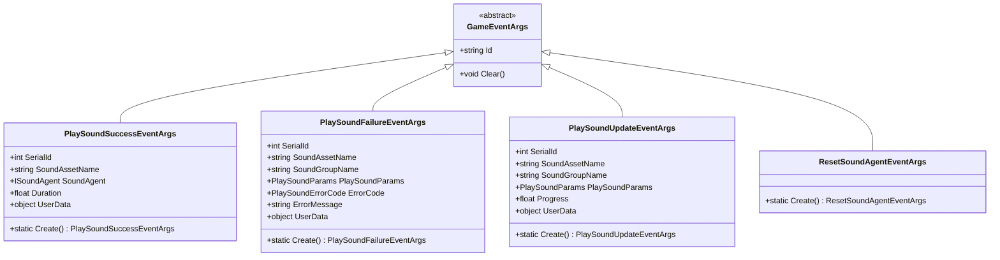
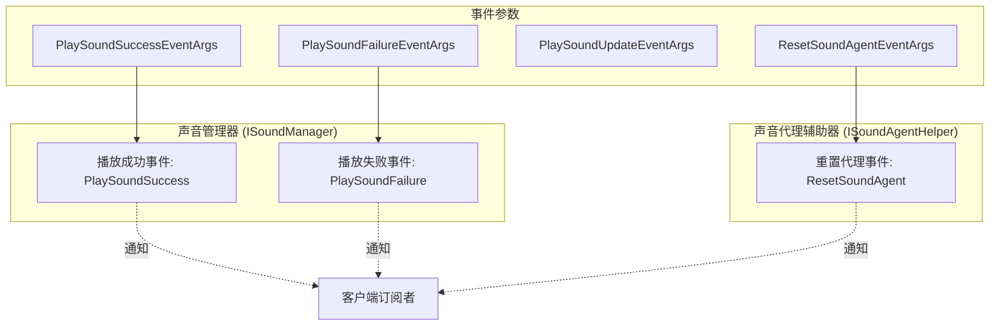
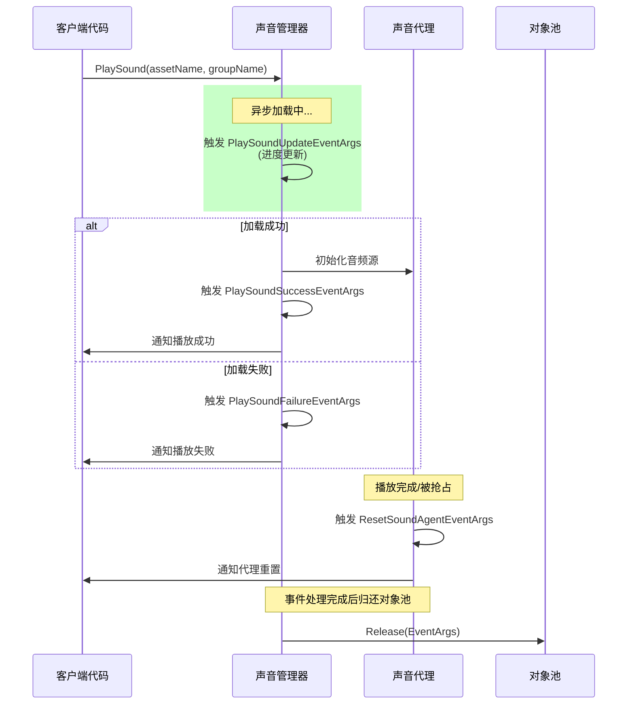

# 事件参数

本节详细介绍 GameFrameX 声音系统中使用的事件参数类，这些类用于在声音播放过程中传递事件数据，使外部组件能够响应声音播放的成功、失败、更新以及声音代理重置等状态变化。

## 概述

GameFrameX 声音系统采用事件驱动架构，当声音播放状态发生变化时，系统会抛出相应的事件并携带详细的事件参数。这些事件参数类均继承自 `GameFrameX.Event.Runtime.GameEventArgs` 基类，提供了统一的对象池管理机制以优化内存使用。

事件参数在系统中的主要作用包括：

- **状态通知**：将声音播放的结果（成功或失败）通知给订阅者
- **进度追踪**：提供异步加载进度信息用于 UI 展示
- **错误处理**：携带错误码和错误信息便于问题诊断
- **代理管理**：通知声音代理需要重置以复用资源

## 事件参数类体系

GameFrameX 声音系统定义了四个核心事件参数类，分别对应不同的声音系统状态变化。



### 事件流与组件关系



## 核心事件参数详解

### PlaySoundSuccessEventArgs

`PlaySoundSuccessEventArgs` 在声音成功开始播放时触发，包含了播放操作的完整结果信息。

```csharp
public sealed class PlaySoundSuccessEventArgs : GameEventArgs
{
    /// <summary>
    /// 获取声音的序列编号。
    /// </summary>
    public int SerialId { get; private set; }

    /// <summary>
    /// 获取声音资源名称。
    /// </summary>
    public string SoundAssetName { get; private set; }

    /// <summary>
    /// 获取用于播放的声音代理。
    /// </summary>
    public ISoundAgent SoundAgent { get; private set; }

    /// <summary>
    /// 获取加载持续时间。
    /// </summary>
    public float Duration { get; private set; }

    /// <summary>
    /// 获取用户自定义数据。
    /// </summary>
    public object UserData { get; private set; }

    public static PlaySoundSuccessEventArgs Create(int serialId, string soundAssetName, 
        ISoundAgent soundAgent, float duration, object userData)
    {
        // 从对象池获取实例并初始化
    }
}
```
> Source: [PlaySoundSuccessEventArgs.cs](https://github.com/GameFrameX/com.gameframex.unity.sound/blob/main/Runtime/EventArgs/PlaySoundSuccessEventArgs.cs#L41-L98)

**使用场景**：当需要知道声音是否成功播放、获取用于控制播放的 SoundAgent 代理实例，或记录加载耗时等场景时订阅此事件。

---

### PlaySoundFailureEventArgs

`PlaySoundFailureEventArgs` 在声音播放失败时触发，携带详细的错误信息以便诊断问题。

```csharp
public sealed class PlaySoundFailureEventArgs : GameEventArgs
{
    /// <summary>
    /// 获取声音的序列编号。
    /// </summary>
    public int SerialId { get; private set; }

    /// <summary>
    /// 获取声音资源名称。
    /// </summary>
    public string SoundAssetName { get; private set; }

    /// <summary>
    /// 获取声音组名称。
    /// </summary>
    public string SoundGroupName { get; private set; }

    /// <summary>
    /// 获取播放声音参数。
    /// </summary>
    public PlaySoundParams PlaySoundParams { get; private set; }

    /// <summary>
    /// 获取错误码。
    /// </summary>
    public PlaySoundErrorCode ErrorCode { get; private set; }

    /// <summary>
    /// 获取错误信息。
    /// </summary>
    public string ErrorMessage { get; private set; }

    /// <summary>
    /// 获取用户自定义数据。
    /// </summary>
    public object UserData { get; private set; }

    public static PlaySoundFailureEventArgs Create(int serialId, string soundAssetName, 
        string soundGroupName, PlaySoundParams playSoundParams, PlaySoundErrorCode errorCode, 
        string errorMessage, object userData)
    {
        // 从对象池获取实例并初始化
    }
}
```
> Source: [PlaySoundFailureEventArgs.cs](https://github.com/GameFrameX/com.gameframex.unity.sound/blob/main/Runtime/EventArgs/PlaySoundFailureEventArgs.cs#L41-L115)

**错误码枚举 (PlaySoundErrorCode)**：

| 错误码 | 说明 |
|--------|------|
| `Unknown` | 未知错误 |
| `SoundGroupNotExist` | 声音组不存在 |
| `SoundGroupHasNoAgent` | 声音组没有声音代理 |
| `LoadAssetFailure` | 加载资源失败 |
| `IgnoredDueToLowPriority` | 因优先级低被忽略 |
| `SetSoundAssetFailure` | 设置声音资源失败 |

> Source: [PlaySoundErrorCode.cs](https://github.com/GameFrameX/com.gameframex.unity.sound/blob/main/Runtime/Sound/Sound/PlaySoundErrorCode.cs#L38-L69)

---

### PlaySoundUpdateEventArgs

`PlaySoundUpdateEventArgs` 在异步加载声音资源的过程中定期触发，用于报告加载进度。

```csharp
public sealed class PlaySoundUpdateEventArgs : GameEventArgs
{
    /// <summary>
    /// 获取声音的序列编号。
    /// </summary>
    public int SerialId { get; private set; }

    /// <summary>
    /// 获取声音资源名称。
    /// </summary>
    public string SoundAssetName { get; private set; }

    /// <summary>
    /// 获取声音组名称。
    /// </summary>
    public string SoundGroupName { get; private set; }

    /// <summary>
    /// 获取播放声音参数。
    /// </summary>
    public PlaySoundParams PlaySoundParams { get; private set; }

    /// <summary>
    /// 获取加载声音进度。
    /// </summary>
    public float Progress { get; private set; }

    /// <summary>
    /// 获取用户自定义数据。
    /// </summary>
    public object UserData { get; private set; }

    public static PlaySoundUpdateEventArgs Create(int serialId, string soundAssetName, 
        string soundGroupName, PlaySoundParams playSoundParams, float progress, object userData)
    {
        // 从对象池获取实例并初始化
    }
}
```
> Source: [PlaySoundUpdateEventArgs.cs](https://github.com/GameFrameX/com.gameframex.unity.sound/blob/main/Runtime/EventArgs/PlaySoundUpdateEventArgs.cs#L41-L106)

**使用场景**：在 UI 上显示加载进度条，或进行其他需要知道加载进度的操作。

---

### ResetSoundAgentEventArgs

`ResetSoundAgentEventArgs` 是一个轻量级事件参数，当声音代理需要重置（例如播放完毕或被抢占）时触发。

```csharp
public sealed class ResetSoundAgentEventArgs : GameEventArgs
{
    /// <summary>
    /// 初始化重置声音代理事件的新实例。
    /// </summary>
    public ResetSoundAgentEventArgs()
    {
    }

    /// <summary>
    /// 创建重置声音代理事件。
    /// </summary>
    public static ResetSoundAgentEventArgs Create()
    {
        ResetSoundAgentEventArgs resetSoundAgentEventArgs = ReferencePool.Acquire<ResetSoundAgentEventArgs>();
        return resetSoundAgentEventArgs;
    }

    /// <summary>
    /// 清理重置声音代理事件。
    /// </summary>
    public override void Clear()
    {
    }

    public static readonly string EventId = typeof(ResetSoundAgentEventArgs).FullName;

    public override string Id => EventId;
}
```
> Source: [ResetSoundAgentEventArgs.cs](https://github.com/GameFrameX/com.gameframex.unity.sound/blob/main/Runtime/EventArgs/ResetSoundAgentEventArgs.cs#L41-L76)

**使用场景**：监听声音代理的重置状态，以便进行资源清理或状态同步。

---

## 事件订阅与使用示例

### 订阅播放成功事件

```csharp
// 获取声音管理器实例
var soundManager = GameEntry.GetManager<ISoundManager>();

// 订阅播放成功事件
soundManager.PlaySoundSuccess += OnPlaySoundSuccess;

private void OnPlaySoundSuccess(object sender, PlaySoundSuccessEventArgs e)
{
    UnityEngine.Debug.Log($"声音播放成功: {e.SoundAssetName}, 持续时间: {e.Duration}");
    // 可以通过 e.SoundAgent 控制播放，如暂停、停止等
    // e.UserData 包含播放时传入的自定义数据
}
```

> Source: [ISoundManager.cs](https://github.com/GameFrameX/com.gameframex.unity.sound/blob/main/Runtime/Interface/ISoundManager.cs#L50-L53)

### 订阅播放失败事件

```csharp
soundManager.PlaySoundFailure += OnPlaySoundFailure;

private void OnPlaySoundFailure(object sender, PlaySoundFailureEventArgs e)
{
    UnityEngine.Debug.LogError($"声音播放失败: {e.SoundAssetName}, 错误码: {e.ErrorCode}, 错误信息: {e.ErrorMessage}");
    // 可以根据错误码进行不同的处理
    if (e.ErrorCode == PlaySoundErrorCode.SoundGroupNotExist)
    {
        // 处理声音组不存在的情况
    }
}
```

> Source: [ISoundManager.cs](https://github.com/GameFrameX/com.gameframex.unity.sound/blob/main/Runtime/Interface/ISoundManager.cs#L55-L58)

### 订阅重置声音代理事件

```csharp
// 声音代理辅助器接口
public interface ISoundAgentHelper
{
    /// <summary>
    /// 重置声音代理事件。
    /// </summary>
    event EventHandler<ResetSoundAgentEventArgs> ResetSoundAgent;
}
```
> Source: [ISoundAgentHelper.cs](https://github.com/GameFrameX/com.gameframex.unity.sound/blob/main/Runtime/Interface/ISoundAgentHelper.cs#L102-L105)

---

## 对象池机制

所有事件参数类都采用对象池模式进行管理，这是 GameFrameX 框架的内存优化策略：

1. **创建**：使用静态 `Create()` 方法从对象池获取实例
2. **使用**：填充事件属性
3. **释放**：事件处理完成后，框架自动调用 `ReferencePool.Release()` 归还到对象池
4. **重置**：归还时调用 `Clear()` 方法将所有属性重置为默认值

这种设计避免了频繁的对象分配和垃圾回收，提高了性能，特别是在频繁触发事件的场景下效果显著。

```csharp
// 事件参数创建示例
PlaySoundSuccessEventArgs args = PlaySoundSuccessEventArgs.Create(
    serialId: 1,
    soundAssetName: "bgm_music",
    soundAgent: soundAgent,
    duration: 180.5f,
    userData: null
);

// 触发事件
soundManager.PlaySoundSuccess?.Invoke(this, args);

// 归还到对象池
ReferencePool.Release(args);
```

---

## 事件触发时序



---

## 相关链接

- [接口定义](./5-api-reference.1-interfaces) - ISoundManager 和 ISoundAgentHelper 接口详细定义
- [播放参数](./5-api-reference.2-play-sound-params) - PlaySoundParams 参数配置说明
- [声音管理器](./4-core-concepts.1-sound-manager) - 声音管理器核心概念与实现
- [声音代理](./4-core-concepts.3-sound-agent) - 声音代理组件详解
