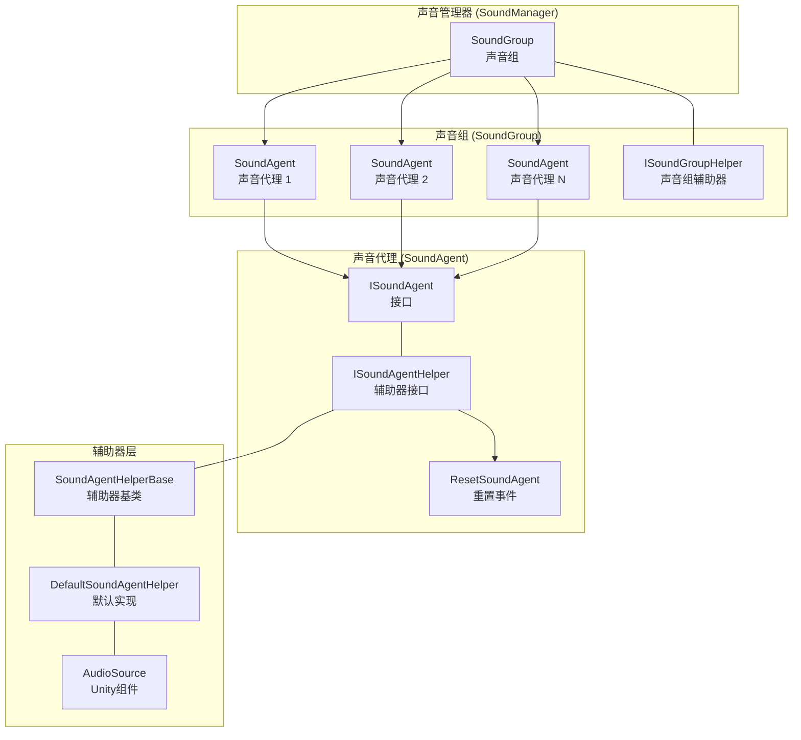
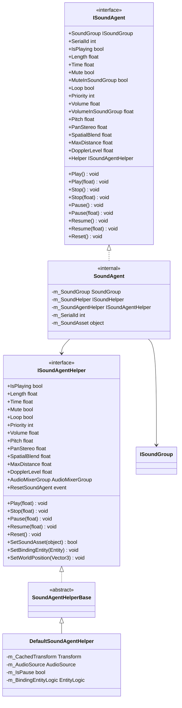
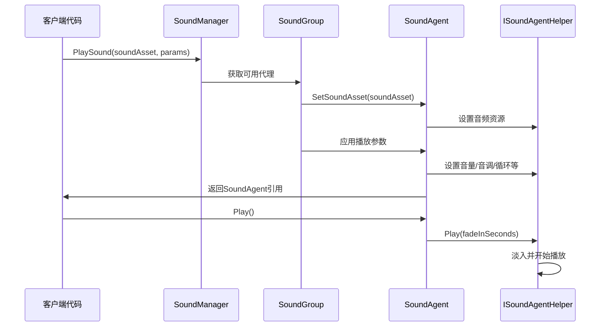
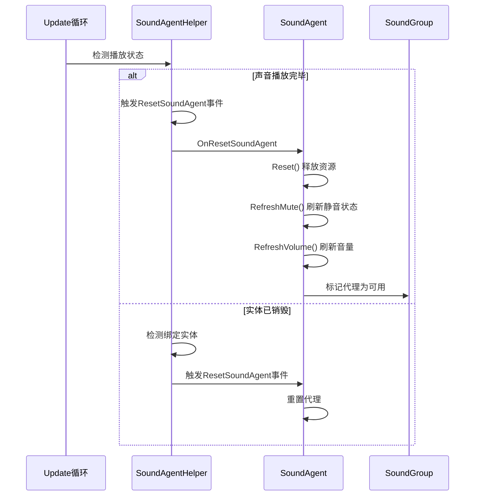

# 声音代理

声音代理（Sound Agent）是 GameFrameX 声音系统中的最小播放单元，负责管理单个音频实例的播放、控制和状态。每个声音代理代表一个具体的声音播放通道，可以独立控制音量、音调、循环、静音等属性。

## 概述

声音代理是声音系统架构中的核心组件，位于声音组（SoundGroup）的下一层级。在游戏中，当需要播放一个音效或背景音乐时，声音系统会从对应的声音组中获取一个可用的声音代理来执行播放任务。

### 设计意图

声音代理的设计采用了代理模式（Proxy Pattern）和对象池（Object Pool）思想的结合：

1. **代理模式**：声音代理作为上层业务逻辑与底层音频实现之间的中介，通过 ISoundAgent 接口封装了复杂的播放控制逻辑
2. **对象池思想**：声音组预先创建一定数量的声音代理，需要播放声音时从池中获取，播放完毕后归还，避免频繁创建销毁带来的性能开销
3. **分层设计**：通过 ISoundAgentHelper 接口隔离 Unity 特定的 AudioSource 实现，便于扩展和替换

### 核心职责

声音代理的主要职责包括：

- **播放控制**：开始、暂停、恢复、停止声音播放
- **参数调节**：实时调整音量、音调、立体声相、空间混合等参数
- **状态管理**：跟踪播放状态（是否正在播放、播放进度等）
- **资源管理**：加载和释放音频资源
- **事件通知**：在播放结束、实体销毁等事件发生时通知上层

## 架构

### 组件关系图



### 类图



## 核心功能

### 播放控制

声音代理提供了完整的播放控制方法，支持带淡入淡出效果的播放过渡：

```csharp
// 直接播放，使用默认淡入时间
agent.Play();

// 带淡入效果的播放，0.5秒内淡入到目标音量
agent.Play(0.5f);

// 直接停止，使用默认淡出时间
agent.Stop();

// 带淡出效果的停止，1秒内淡出
agent.Stop(1.0f);

// 暂停播放
agent.Pause();

// 带淡出效果的暂停
agent.Pause(0.3f);

// 恢复播放
agent.Resume();

// 带淡入效果的恢复
agent.Resume(0.3f);
```
> Source: [ISoundAgent.cs](https://github.com/GameFrameX/com.gameframex.unity.sound/blob/main/Runtime/Interface/ISoundAgent.cs#L125-L167)

### 音量控制

声音代理采用双层音量控制机制：代理自身音量 × 声音组音量，这种设计允许在不改变单个音效音量的前提下统一调节整个声音组的音量：

```csharp
// 设置代理自身音量（0.0 - 1.0）
agent.VolumeInSoundGroup = 0.8f;

// 获取实际生效音量（代理音量 × 组音量）
float actualVolume = agent.Volume;
```
> Source: [SoundManager.SoundAgent.cs](https://github.com/GameFrameX/com.gameframex.unity.sound/blob/main/Runtime/Sound/Sound/SoundManager.SoundAgent.cs#L209-L217)</parameter>

### 空间音频

声音代理支持 3D 空间音频效果，可以根据音源与听者的位置关系自动计算音量衰减：

```csharp
// 设置空间混合量（0 = 2D，1 = 3D）
agent.SpatialBlend = 1.0f;

// 设置最大衰减距离
agent.MaxDistance = 50.0f;

// 设置多普勒效应等级
agent.DopplerLevel = 0.5f;
```
> Source: [ISoundAgent.cs](https://github.com/GameFrameX/com.gameframex.unity.sound/blob/main/Runtime/Interface/ISoundAgent.cs#L105-L118)

### 实体绑定

声音代理可以绑定到游戏实体，使音源位置跟随实体移动：

```csharp
// 通过辅助器绑定实体
agent.Helper.SetBindingEntity(entity);

// 设置世界坐标位置
agent.Helper.SetWorldPosition(new Vector3(10, 0, 5));
```
> Source: [DefaultSoundAgentHelper.cs](https://github.com/GameFrameX/com.gameframex.unity.sound/blob/main/Runtime/Sound/DefaultSoundAgentHelper.cs#L295-L323)

### 播放进度控制

```csharp
// 获取声音总长度
float length = agent.Length;

// 获取或设置当前播放位置（秒）
agent.Time = 5.0f;  // 跳转到第5秒
float currentTime = agent.Time;

// 获取是否正在播放
if (agent.IsPlaying)
{
    Debug.Log($"播放进度: {agent.Time}/{agent.Length}");
}
```
> Source: [ISoundAgent.cs](https://github.com/GameFrameX/com.gameframex.unity.sound/blob/main/Runtime/Interface/ISoundAgent.cs#L50-L63)

## 核心流程

### 声音播放流程



### 声音结束重置流程

当声音播放完毕后，系统会自动触发重置流程，释放当前代理以供其他声音使用：


> Source: [DefaultSoundAgentHelper.cs](https://github.com/GameFrameX/com.gameframex.unity.sound/blob/main/Runtime/Sound/DefaultSoundAgentHelper.cs#L333-L367)

## 扩展自定义辅助器

可以通过继承 `SoundAgentHelperBase` 来实现自定义的声音代理辅助器，以支持不同的音频实现方案（如 FMOD、Wwise 等）：

```csharp
using UnityEngine;
using GameFrameX.Sound.Runtime;

public class CustomSoundAgentHelper : SoundAgentHelperBase
{
    private AudioSource m_AudioSource;
    private AudioClip m_CurrentClip;

    public override bool IsPlaying => m_AudioSource?.isPlaying ?? false;

    public override float Length => m_CurrentClip?.length ?? 0f;

    public override float Time
    {
        get => m_AudioSource?.time ?? 0f;
        set { if (m_AudioSource != null) m_AudioSource.time = value; }
    }

    // ... 其他属性实现

    public override void Play(float fadeInSeconds)
    {
        m_AudioSource.Play();
        // 实现自定义淡入逻辑
    }

    public override bool SetSoundAsset(object soundAsset)
    {
        m_CurrentClip = soundAsset as AudioClip;
        if (m_CurrentClip == null) return false;
        
        m_AudioSource.clip = m_CurrentClip;
        return true;
    }

    // ... 其他方法实现
}
```
> Source: [SoundAgentHelperBase.cs](https://github.com/GameFrameX/com.gameframex.unity.sound/blob/main/Runtime/Sound/SoundAgentHelperBase.cs#L38-L162)

## 属性说明

| 属性 | 类型 | 默认值 | 说明 |
|------|------|--------|------|
| SerialId | int | 0 | 声音的序列编号，用于标识本次播放请求 |
| IsPlaying | bool | - | 当前是否正在播放 |
| Length | float | 0 | 声音总时长（秒） |
| Time | float | 0 | 当前播放位置（秒） |
| Mute | bool | false | 是否静音（只读，由组控制） |
| MuteInSoundGroup | bool | false | 在声音组内是否静音 |
| Loop | bool | false | 是否循环播放 |
| Priority | int | 0 | 声音优先级（数值越大优先级越高） |
| Volume | float | 1.0 | 实际生效音量（代理×组） |
| VolumeInSoundGroup | float | 1.0 | 代理自身的音量 |
| Pitch | float | 1.0 | 音调（0.5-2.0） |
| PanStereo | float | 0 | 立体声相（-1左 → 1右） |
| SpatialBlend | float | 0 | 空间混合量（0=2D → 1=3D） |
| MaxDistance | float | 100 | 3D模式下最大衰减距离 |
| DopplerLevel | float | 1 | 多普勒效应等级 |

> Source: [Constant.cs](https://github.com/GameFrameX/com.gameframex.unity.sound/blob/main/Runtime/Sound/Sound/Constant.cs#L38-L99)

## 相关链接

- [声音管理器](./4-core-concepts.1-sound-manager) - 声音系统的核心管理器
- [声音组](./4-core-concepts.2-sound-group) - 管理多个声音代理的组
- [接口定义](./5-api-reference.1-interfaces) - ISoundAgent 和 ISoundAgentHelper 接口详情
- [事件参数](./5-api-reference.3-event-args) - 声音相关事件参数说明
