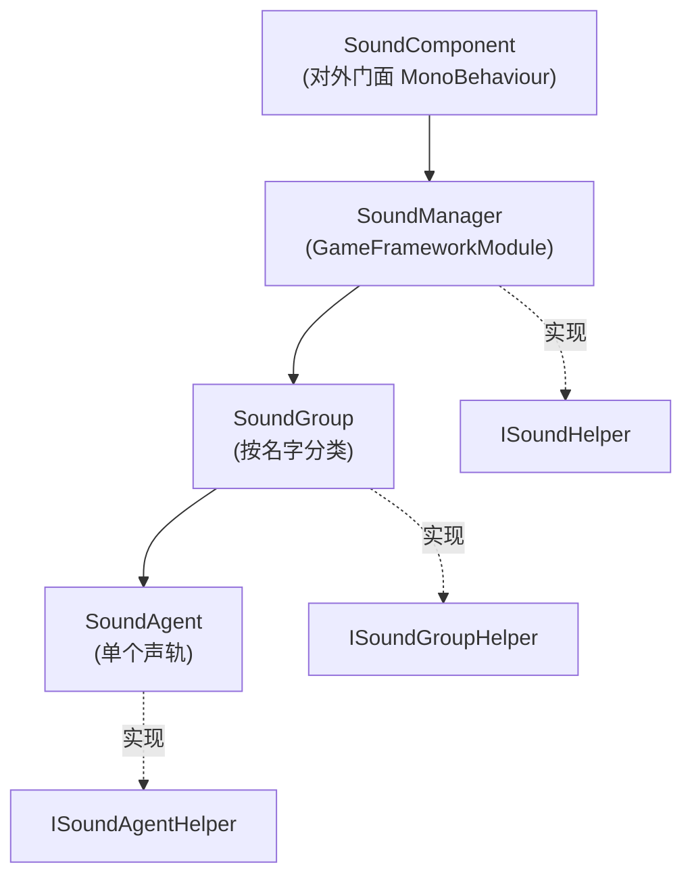

# 架构速览：Component / Manager / Group / Agent

GameFrameX 声音模块采用四层分层设计：`SoundComponent` 作为对外门面调用框架模块 `SoundManager`，管理器内部按 `SoundGroup`（声音组）分类资源，每个声音组下挂载若干 `SoundAgent`（声音代理）实际播放音效。每一层都配有 `*Helper` 接口用于替换底层实现（如接入不同音频引擎）。

## 工作原理速览

四个 `*Helper`（`ISoundHelper` / `ISoundGroupHelper` / `ISoundAgentHelper` / `ISoundHelperBase`）是注入点，默认实现见 [DefaultSoundHelper.cs](https://github.com/GameFrameX/com.gameframex.unity.sound/blob/main/Runtime/Sound/DefaultSoundHelper.cs#L1-L80)、[DefaultSoundGroupHelper.cs](https://github.com/GameFrameX/com.gameframex.unity.sound/blob/main/Runtime/Sound/DefaultSoundGroupHelper.cs)、[DefaultSoundAgentHelper.cs](https://github.com/GameFrameX/com.gameframex.unity.sound/blob/main/Runtime/Sound/DefaultSoundAgentHelper.cs)。

## 各层职责

| 层级 | 类型 / 文件 | 职责 |
|------|------------|------|
| Component | [SoundComponent](https://github.com/GameFrameX/com.gameframex.unity.sound/blob/main/Runtime/Sound/SoundComponent.cs) 继承 `MonoBehaviour` | 对外门面，接收上层（如 UI、战斗）调用并转发到 `SoundManager`；提供 `PlaySound` / `StopSound` / 增减音量、注册声音组等 API |
| Manager | [SoundManager](https://github.com/GameFrameX/com.gameframex.unity.sound/blob/main/Runtime/Sound/Sound/SoundManager.cs) 继承 `GameFrameworkModule` | 模块核心，管理所有 `SoundGroup` 字典，统一处理加载、释放、成功/失败事件 |
| Group | [SoundGroup](https://github.com/GameFrameX/com.gameframex.unity.sound/blob/main/Runtime/Sound/Sound/SoundManager.SoundGroup.cs) 实现 [ISoundGroup](https://github.com/GameFrameX/com.gameframex.unity.sound/blob/main/Runtime/Interface/ISoundGroup.cs) | 按名称划分的声音组（如 BGM、UI、战斗），决定该组能同时播放多少个声轨（`SoundAgentCount`）以及混音属性 |
| Agent | [SoundAgent](https://github.com/GameFrameX/com.gameframex.unity.sound/blob/main/Runtime/Sound/Sound/SoundManager.SoundAgent.cs) 实现 [ISoundAgent](https://github.com/GameFrameX/com.gameframex.unity.sound/blob/main/Runtime/Interface/ISoundAgent.cs) | 单个声音播放代理，维护播放状态、音量、静音、所属组等属性 |

## 关键调用链

调用一次 `PlaySound` 时，参数沿着这条链传递：

1. `SoundComponent.PlaySound(soundGroup, soundAssetName, ...)` 收集 `PlaySoundParams`，序列化为 `serialId`。
2. `SoundManager.PlaySound(serialId, soundGroupName, ...)` 在 `m_SoundGroups` 字典中查找或创建对应组。
3. 目标 `SoundGroup` 通过其 `Helper`（`ISoundGroupHelper`）申请/复用空闲 `SoundAgent`。
4. `SoundAgent` 实际加载资源（依赖注入的 `IAssetManager`），加载完成通过 `Helper` 真正播放音频。
5. 加载/播放成功与失败分别触发 `PlaySoundSuccess` / `PlaySoundFailure` 事件 [SoundManager.cs#90-L103](https://github.com/GameFrameX/com.gameframex.unity.sound/blob/main/Runtime/Sound/Sound/SoundManager.cs#L90-L103)。

## 接口与扩展点

| 接口 | 默认实现 | 替换场景 |
|------|---------|---------|
| [ISoundHelper](https://github.com/GameFrameX/com.gameframex.unity.sound/blob/main/Runtime/Interface/ISoundHelper.cs) | [DefaultSoundHelper.cs](https://github.com/GameFrameX/com.gameframex.unity.sound/blob/main/Runtime/Sound/DefaultSoundHelper.cs) | 替换音频后端（如 FMOD / Wwise） |
| [ISoundGroupHelper](https://github.com/GameFrameX/com.gameframex.unity.sound/blob/main/Runtime/Interface/ISoundGroupHelper.cs) | [DefaultSoundGroupHelper.cs](https://github.com/GameFrameX/com.gameframex.unity.sound/blob/main/Runtime/Sound/DefaultSoundGroupHelper.cs) | 自定义组的创建与回收策略 |
| [ISoundAgentHelper](https://github.com/GameFrameX/com.gameframex.unity.sound/blob/main/Runtime/Interface/ISoundAgentHelper.cs) | [DefaultSoundAgentHelper.cs](https://github.com/GameFrameX/com.gameframex.unity.sound/blob/main/Runtime/Sound/DefaultSoundAgentHelper.cs) | 自定义播放、音量、静音、低通滤波等行为 |
| `ISoundManager` | `SoundManager`（实现） | 一般无需替换 |

`SoundComponent` 在 `Awake` 中会按 `GameFrameXSound` 钩子的 `[Preserve]` 引用列表 [GameFrameXSoundCroppingHelper.cs](https://github.com/GameFrameX/com.gameframex.unity.sound/blob/main/Runtime/GameFrameXSoundCroppingHelper.cs#L1-L36) 保留默认 Helper 类型，防止被代码裁剪。

## 接下来

- 接入与初始化步骤：见《如何接入声音模块》
- 播放一组 BGM 并切换：见《如何播放并控制声音》
- 排查播放失败、声音被裁剪等问题：见《声音播放失败怎么办》
- API 与错误码速查：见《API 参考》
