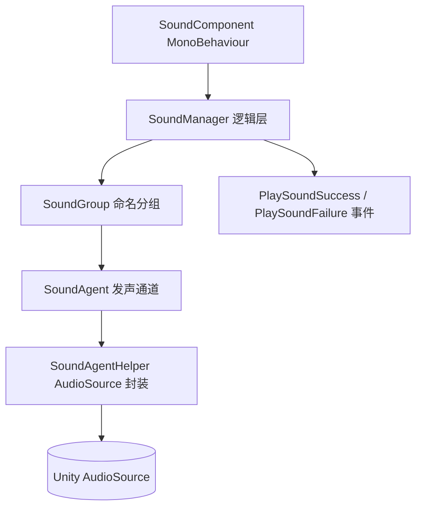

# 声音模块简介

GameFrameX Sound 是 GameFrameX 框架的声音子模块,提供基于 Unity AudioSource 的分组播放、空间音频、优先级抢占与事件驱动通知能力,让游戏可以高效管理 BGM、SFX、Voice 等多类音频资源。

## 快速开始

### 1. 安装

任选一种方式把 `com.gameframex.unity.sound` 加入 Unity 项目:

1. 在 `Packages/manifest.json` 中追加 scopedRegistries 与依赖:

```json
{
  "scopedRegistries": [
    {
      "name": "GameFrameX",
      "url": "https://gameframex.upm.alianblank.uk",
      "scopes": ["com.gameframex"]
    }
  ],
  "dependencies": {
    "com.gameframex.unity.sound": "1.2.0"
  }
}
```

Source: [README.zh-CN.md](https://github.com/GameFrameX/com.gameframex.unity.sound/blob/main/README.zh-CN.md#L38-L58)

2. 直接添加 Git 依赖:
```json
{
  "dependencies": {
    "com.gameframex.unity.sound": "https://github.com/gameframex/com.gameframex.unity.sound.git"
  }
}
```

Source: [README.zh-CN.md](https://github.com/GameFrameX/com.gameframex.unity.sound/blob/main/README.zh-CN.md#L60-L65)

3. 在 Unity `Package Manager` 中粘贴 `Git URL` 安装,或直接把仓库放进项目的 `Packages` 目录。

### 2. 最小播放示例

通过 `SoundManager` 获取分组并调用 `PlaySound` 即可播放一段音频:

```csharp
using GameFrameX.Sound.Runtime;

SoundManager soundManager = GameFrameworkEntry.GetModule<SoundManager>();
soundManager.PlaySound("SFX", "Assets/Audio/click.wav");
```

Source: [ISoundManager.cs](https://github.com/GameFrameX/com.gameframex.unity.sound/blob/main/Runtime/Interface/ISoundManager.cs#L43-L80)

主要播放参数都集中在 `PlaySoundParams` 上,可设置音量、音调、淡入淡出、循环、优先级、空间混合等属性:

```csharp
PlaySoundParams param = new PlaySoundParams
{
    Loop = false,
    Volume = 1f,
    Pitch = 1f,
    FadeInSeconds = 0.2f,
    Priority = 0,
};
```

Source: [PlaySoundParams.cs](https://github.com/GameFrameX/com.gameframex.unity.sound/blob/main/Runtime/Sound/Sound/PlaySoundParams.cs#L40-L80)

### 3. 监听播放结果

通过 `PlaySoundSuccess` 与 `PlaySoundFailure` 事件获取异步播放结果:

```csharp
soundManager.PlaySoundSuccess += (sender, e) => { /* 播放成功 */ };
soundManager.PlaySoundFailure += (sender, e) => { /* 播放失败 */ };
```

Source: [SoundManager.cs](https://github.com/GameFrameX/com.gameframex.unity.sound/blob/main/Runtime/Sound/Sound/SoundManager.cs#L90-L100)

## 工作原理速览

声音模块沿用 GameFrameX 经典的「Manager + Helper + Agent」分层结构,运行时从最外层的 MonoBehaviour 组件一直下钻到实际的 `AudioSource`:



- **SoundGroup**:命名分组(如 `BGM`、`SFX`、`Voice`),管理独立的音量、静音状态与并发代理数。
- **SoundAgent**:分组下的并发发声通道;代理全部忙碌时,低优先级请求会被自动驱逐。
- **SoundAgentHelper**:对 `AudioSource` 的封装,负责实际的播放、淡入淡出与生命周期管理。
- **PlaySoundParams**:池化的播放参数对象,所有属性均可按需覆盖。
- **事件系统**:播放成功/失败统一通过 GameFrameX 事件总线分发,事件参数同样来自引用池。

## 功能特性

| 特性 | 说明 |
|------|------|
| 声音分组 | 把声音组织为命名分组(BGM、SFX、Voice 等),每组独立音量、静音、代理数量 |
| 优先级播放 | 异步播放,代理忙时自动驱逐低优先级声音 |
| 完整生命周期 | 支持播放、暂停、停止与淡入/淡出 |
| 空间音频 | 声音可绑定到游戏实体,或放在指定世界坐标 |
| AudioMixer 集成 | 分组可路由到指定 AudioMixer Group,实现精细混音 |
| 事件驱动通知 | 通过 GameFrameX 事件系统分发播放成功、失败通知 |
| 引用池化 | 所有事件参数与播放参数均来自引用池,最小化 GC |

Source: [README.zh-CN.md](https://github.com/GameFrameX/com.gameframex.unity.sound/blob/main/README.zh-CN.md#L24-L32)

## 依赖

| 包 | 说明 |
|----|------|
| `com.gameframex.unity` | 核心框架(模块系统、引用池、工具类) |
| `com.gameframex.unity.asset` | 资源加载(YooAsset 集成) |
| `com.gameframex.unity.entity` | 实体系统,用于空间音频绑定 |
| `com.gameframex.unity.event` | 事件系统,用于播放通知 |

Source: [README.zh-CN.md](https://github.com/GameFrameX/com.gameframex.unity.sound/blob/main/README.zh-CN.md#L85-L93)

## 接下来

- 关于如何加载音频并触发播放,见《如何播放声音》(待补充)
- 关于事件订阅与失败原因码,见《播放事件与错误码参考》(待补充)
- 关于自定义 Helper 与分组配置,见《分组与 Helper 扩展》(待补充)