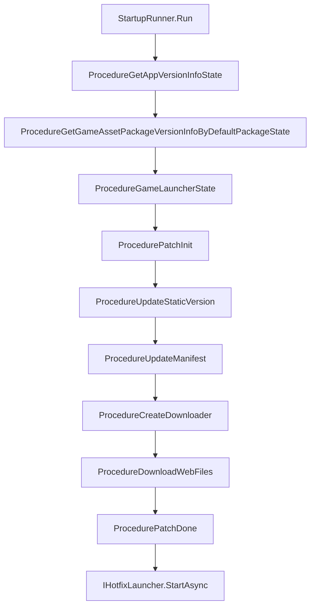

# 启动流程总览

`com.gameframex.unity.startup` 把"游戏从打开到可玩"拆成一条可配置、可插拔的启动管线：先以主备 URL 拉取全局信息 → 校验 App 与资源版本 → YooAsset 补丁流程（初始化 → 静态版本 → 清单 → 下载 → 完成）→ 启动热更入口。开发者只需实现 `IStartupUIHandler`（提示 UI）和 `IHotfixLauncher`（热更入口）即可替换默认实现。

## 快速开始

1. 在 `Packages/manifest.json` 添加依赖：

    ```json
    {
      "dependencies": {
        "com.gameframex.unity.startup": "1.1.0"
      },
      "scopedRegistries": [
        {
          "name": "GameFrameX",
          "url": "https://gameframex.upm.alianblank.uk",
          "scopes": ["com.gameframex"]
        }
      ]
    }
    ```

    `scopes` 控制哪些包通过此注册表解析，只有以 `com.gameframex` 开头的包才会从这里获取。

2. 在 Unity Editor 中通过 `Create > GameFrameX > Startup Options` 创建配置资产，填写主备 URL、PlayMode、热更入口、HTTP 公共参数等。

3. 实现 `IStartupUIHandler`（FairyGUI / UGUI / 自定义 UI 均可）和 `IHotfixLauncher`（HybridCLR 或其他热更方案）。

4. 在场景中调用一行入口：

    ```csharp
    var result = await StartupRunner.Run(_options, uiHandler, hotfixLauncher);
    if (result.Success) { /* 启动完成，游戏就绪 */ }
    ```

    Source: [README.zh-CN.md](https://github.com/GameFrameX/com.gameframex.unity.startup/blob/main/README.zh-CN.md#L1-L100)

## 工作原理速览

启动管线以有限状态机（FSM）形式组织 `Procedure` 节点，每个节点完成一段职责后通过 `ChangeState<T>` 切到下一个节点。



节点说明：

| 流程节点 | 职责 |
|----------|------|
| `ProcedureGetAppVersionInfoState` | 拉取全局信息（URL 主备 failover） |
| `ProcedureGetGameAssetPackageVersionInfoByDefaultPackageState` | 获取 App 与资源包版本 |
| `ProcedureGameLauncherState` | 切换到 YooAsset 资源模式 |
| `ProcedurePatchInit` | 根据 PlayMode 初始化 YooAsset 资源包 |
| `ProcedureUpdateStaticVersion` | 请求资源包静态版本号 |
| `ProcedureUpdateManifest` | 更新资源清单 |
| `ProcedureCreateDownloader` | 创建下载器 |
| `ProcedureDownloadWebFiles` | 下载补丁文件并更新进度 |
| `ProcedurePatchDone` | 完成补丁流程 |
| `IHotfixLauncher.StartAsync` | 加载热更程序集并执行入口 |

两条完成通知路径会同时触发：`UniTask<StartupResult>` 的 await 结果，以及 `StartupCompletedEventArgs` / `StartupFailedEventArgs` 事件，开发者任选其一监听即可。

## 关键配置项速查

`StartupOptions` ScriptableObject 主要字段：

| 字段 | 用途 |
|------|------|
| `GlobalInfoUrls` | 全局信息接口的主备 URL 列表，配合 `MaxAttemptsPerUrl` 重试策略 |
| `GamePlayMode` | 资源运行模式，启动流程在加载前同步到 Asset 组件 |
| `HotfixAssemblyName` / `HotfixEntryTypeName` / `HotfixEntryMethodName` | 热更入口（程序集 / 类型 / 方法） |
| `PackageName` / `Channel` / `SubChannel` | HTTP 公共参数（纯数据，无 SDK 依赖） |
| `LauncherUIResName` | 启动 UI 资源路径，默认 `UI/UILauncher` |
| `SkipRemoteStartupRequests` | 跳过全部远程启动请求，WebGL 单机或无后端部署时启用 |

PlayMode 自适应分支：`EditorSimulateMode` / `OfflinePlayMode` / `HostPlayMode` / `WebPlayMode`，`ProcedurePatchInit` 会根据当前模式选择空 URL 或真实 URL 初始化 YooAsset：

Source: [ProcedurePatchInit.cs](https://github.com/GameFrameX/com.gameframex.unity.startup/blob/main/Runtime/Procedures/Patch/ProcedurePatchInit.cs#L33-L48)

## 接下来

- 实现启动 UI：见《如何实现 IStartupUIHandler》
- 接入 HybridCLR：见《如何实现 IHotfixLauncher》
- 主备 URL 重试策略：见《URL Failover 参考》
- 单机/无后端部署：开启 `SkipRemoteStartupRequests`